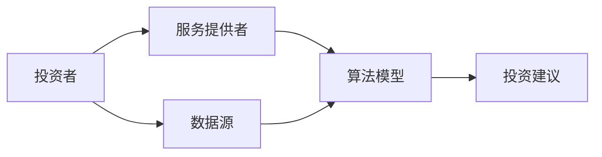
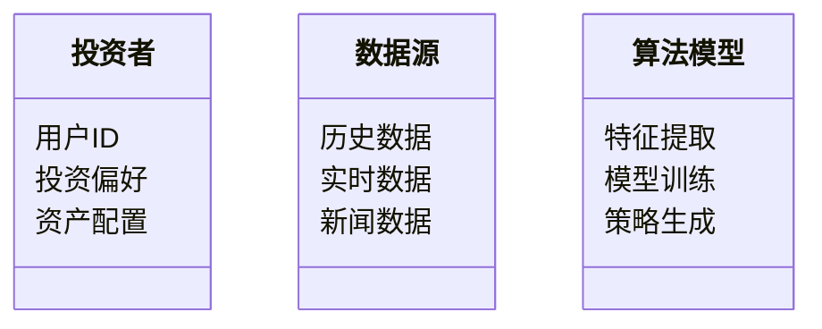
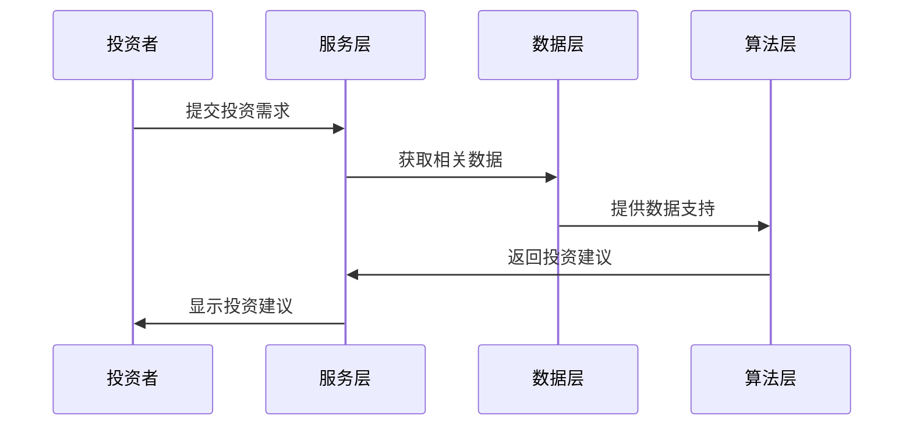

                 


# 人工智能驱动的个性化投资顾问服务

## 关键词
人工智能, 个性化投资, 金融, 机器学习, 自然语言处理, 系统架构

## 摘要
人工智能（AI）在金融领域的应用正迅速改变投资顾问服务的方式。传统的投资顾问依赖于经验和有限的数据分析，而AI驱动的个性化投资顾问服务通过机器学习、自然语言处理和数据挖掘等技术，能够实时分析大量数据，提供定制化的投资策略和建议。本文将探讨AI如何在投资顾问服务中实现个性化，分析其算法原理、系统架构，并通过实际案例展示其应用效果。

---

# 第1章: 人工智能与个性化投资顾问服务的背景

## 1.1 人工智能在金融领域的应用背景
### 1.1.1 传统投资顾问服务的局限性
传统的投资顾问服务主要依赖于人类的经验和有限的数据分析能力，难以满足投资者多样化的个性化需求。投资者的财务状况、风险承受能力和投资目标各不相同，传统的投资顾问往往无法提供高度个性化的建议。

### 1.1.2 人工智能技术的发展与金融行业的结合
随着机器学习、深度学习和自然语言处理等AI技术的快速发展，金融行业开始广泛采用AI技术来提升服务效率和准确性。AI能够快速处理海量数据，识别复杂模式，并实时生成投资建议。

### 1.1.3 个性化投资顾问服务的市场需求
投资者对个性化投资建议的需求日益增长，尤其是在市场波动加剧的情况下，投资者需要动态调整其投资组合。AI驱动的个性化投资顾问服务能够根据市场变化和投资者的实时需求，提供精准的投资建议。

---

## 1.2 个性化投资顾问服务的核心问题
### 1.2.1 投资者行为分析的复杂性
投资者的行为受到多种因素的影响，如市场情绪、个人风险偏好等。通过分析投资者的行为数据，可以更好地理解他们的需求，并提供个性化的投资建议。

### 1.2.2 个性化投资策略的动态调整
市场环境不断变化，投资策略需要实时调整。AI技术能够快速分析市场数据，识别潜在的投资机会，并动态优化投资策略。

### 1.2.3 数据驱动的投资决策
AI驱动的投资顾问服务依赖于大量的数据，包括历史市场数据、新闻数据、社交媒体数据等。通过分析这些数据，AI可以生成数据驱动的投资决策，帮助投资者做出更明智的选择。

---

## 1.3 人工智能驱动个性化投资的解决方案
### 1.3.1 机器学习在投资决策中的应用
机器学习算法，如支持向量机（SVM）和随机森林，可以用于预测股票价格和识别市场趋势。这些算法能够从历史数据中学习，生成可靠的预测结果。

### 1.3.2 自然语言处理在金融信息分析中的作用
自然语言处理（NLP）技术可以分析新闻文章、社交媒体帖子等非结构化数据，识别市场情绪和潜在的市场动态。例如，NLP可以检测负面新闻对股价的影响。

### 1.3.3 数据挖掘在个性化投资策略中的价值
数据挖掘技术可以发现数据中的隐藏模式，帮助投资者识别潜在的投资机会。例如，通过分析历史数据，数据挖掘可以发现某些股票在特定市场条件下的表现规律。

---

## 1.4 本章小结
本章介绍了人工智能在金融领域的应用背景，分析了个性化投资顾问服务的核心问题，并提出了AI驱动的解决方案。AI技术的应用使得投资顾问服务更加个性化和智能化，能够满足投资者多样化的投资需求。

---

# 第2章: 个性化投资顾问服务的核心概念与联系

## 2.1 核心概念原理
### 2.1.1 人工智能在投资顾问服务中的核心作用
AI技术通过机器学习、NLP和数据挖掘等方法，帮助投资者分析数据、识别趋势并制定投资策略。AI的投资顾问服务能够快速处理大量数据，提供实时的投资建议。

### 2.1.2 个性化投资的定义与特征
个性化投资是指根据投资者的财务状况、风险偏好和投资目标，量身定制的投资策略。其核心特征包括定制化、动态调整和数据驱动。

### 2.1.3 数据驱动的投资决策模型
数据驱动的投资决策模型基于大量数据，利用统计分析和机器学习算法生成投资建议。这些模型能够根据市场变化和投资者需求，实时调整投资策略。

---

## 2.2 核心概念属性对比表格
以下表格对比了传统投资顾问与AI驱动投资顾问的主要区别：

| **属性**         | **传统投资顾问**             | **AI驱动投资顾问**             |
|-------------------|------------------------------|-------------------------------|
| 数据处理能力     | 依赖少量数据，处理能力有限    | 处理海量数据，实时分析         |
| 定价模式          | 通常是按服务收费             | 可能采用订阅模式或按收益分成   |
| 服务效率         | 服务效率较低，依赖人工操作    | 服务效率高，自动化处理         |
| 知识更新频率     | 知识更新较慢，依赖经验       | 知识更新快速，依赖算法         |

---

## 2.3 实体关系图（ER图）
以下是一个简单的ER图，展示了个性化投资顾问服务的核心实体及其关系：



---

## 2.4 本章小结
本章详细介绍了个性化投资顾问服务的核心概念，分析了其与AI技术的结合方式，并通过对比表格和ER图展示了其核心要素和系统架构。这些内容为后续章节的深入分析奠定了基础。

---

# 第3章: 人工智能驱动个性化投资顾问的算法原理

## 3.1 算法原理概述
### 3.1.1 机器学习在投资预测中的应用
机器学习算法广泛应用于股票价格预测和市场趋势分析。例如，支持向量机（SVM）和随机森林等算法可以用于分类和回归任务。

### 3.1.2 自然语言处理在金融信息分析中的应用
NLP技术用于分析新闻、社交媒体等文本数据，提取情感倾向和市场信号。例如，可以使用词袋模型或词嵌入技术（如Word2Vec）处理文本数据。

### 3.1.3 强化学习在投资策略优化中的作用
强化学习（RL）通过模拟投资环境，训练智能体在不同市场条件下做出最优决策。例如，可以使用Q-learning算法优化投资组合。

---

## 3.2 算法流程图
以下是一个AI驱动投资顾问服务的算法流程图：


---

## 3.3 算法数学模型
### 3.3.1 线性回归模型
线性回归模型用于预测股票价格：

$$y = \beta_0 + \beta_1x + \epsilon$$

其中，$y$是预测的股票价格，$x$是自变量（如历史价格），$\beta_0$和$\beta_1$是模型参数，$\epsilon$是误差项。

### 3.3.2 支持向量机模型
SVM用于分类任务，例如判断股票是上涨还是下跌：

$$\text{最大化} \quad \frac{1}{\lambda}\|w\|^2$$
$$\text{约束} \quad y_i(w \cdot x_i + b) \geq 1$$

其中，$w$是权重向量，$b$是偏置项，$y_i$是标签（+1或-1），$x_i$是输入数据。

---

## 3.4 举例说明
### 3.4.1 使用线性回归预测股票价格
假设我们有历史股票价格数据，可以使用线性回归模型预测未来的价格。例如，使用过去30天的价格数据训练模型，并预测第31天的价格。

### 3.4.2 使用SVM进行投资类别划分
使用SVM算法将股票分为上涨、下跌或持平三类。通过训练数据，SVM可以学习股票价格的变化模式，并对新数据进行分类。

---

## 3.5 本章小结
本章详细介绍了AI驱动投资顾问服务的主要算法，包括机器学习、NLP和强化学习。通过数学模型和流程图，展示了这些算法在投资决策中的应用。

---

# 第4章: 系统分析与架构设计方案

## 4.1 项目介绍
### 4.1.1 项目目标
本项目旨在开发一个基于AI的个性化投资顾问服务，能够根据投资者的需求和市场数据，实时生成定制化的投资建议。

### 4.1.2 项目范围
项目范围包括数据收集、算法开发、系统集成和用户界面设计。

### 4.1.3 项目利益相关者
利益相关者包括投资者、数据供应商、算法开发人员和系统集成商。

---

## 4.2 系统功能设计
### 4.2.1 领域模型
以下是一个领域模型的类图：



### 4.2.2 系统架构设计
以下是一个系统的架构图：


---

## 4.3 接口设计与交互
### 4.3.1 接口设计
系统需要与数据源、算法模型和用户界面进行交互。例如，投资者通过用户界面提交投资需求，系统调用算法模型生成投资建议，并通过用户界面反馈给投资者。

### 4.3.2 交互流程
以下是一个交互流程的序列图：



---

## 4.4 本章小结
本章详细描述了AI驱动个性化投资顾问服务的系统架构和功能设计。通过类图和架构图，展示了系统的组成部分及其交互关系。

---

# 第5章: 项目实战

## 5.1 环境安装
### 5.1.1 安装Python
安装Python 3.8及以上版本。

### 5.1.2 安装依赖库
安装以下依赖库：
- `pandas`：用于数据处理
- `scikit-learn`：用于机器学习
- `nltk`：用于自然语言处理
- `keras`：用于深度学习

## 5.2 系统核心实现源代码
以下是一个简单的股票价格预测代码：

```python
import pandas as pd
from sklearn.linear_model import LinearRegression
from sklearn.model_selection import train_test_split

# 加载数据
data = pd.read_csv('stock_data.csv')

# 数据预处理
X = data[['close_price_prev', 'volume']]
y = data['close_price']

# 划分训练集和测试集
X_train, X_test, y_train, y_test = train_test_split(X, y, test_size=0.2, random_state=42)

# 训练模型
model = LinearRegression()
model.fit(X_train, y_train)

# 预测结果
y_pred = model.predict(X_test)
```

---

## 5.3 代码应用解读与分析
上述代码使用了线性回归模型进行股票价格预测。首先，加载数据并进行预处理，然后将数据划分为训练集和测试集，训练模型后生成预测结果。

---

## 5.4 实际案例分析
### 5.4.1 案例背景
假设我们有一个包含历史股票数据的CSV文件，包括开盘价、收盘价、成交量等字段。

### 5.4.2 数据处理与分析
使用Pandas对数据进行清洗和处理，识别缺失值和异常值。

### 5.4.3 模型训练与验证
使用训练好的模型对测试数据进行预测，并评估模型的准确性。

### 5.4.4 投资建议生成
根据模型的预测结果，生成个性化的投资建议，并通过用户界面反馈给投资者。

---

## 5.5 本章小结
本章通过实际案例展示了AI驱动个性化投资顾问服务的实现过程，包括环境安装、代码实现和案例分析。

---

# 第6章: 总结与展望

## 6.1 总结
本文详细探讨了AI驱动个性化投资顾问服务的核心概念、算法原理和系统架构。通过实际案例展示了AI技术在投资决策中的应用价值。

## 6.2 最佳实践 Tips
- 数据质量是关键，确保数据的准确性和完整性。
- 选择合适的算法，根据数据类型和任务需求进行调整。
- 实时监控模型性能，及时优化和更新模型。

## 6.3 注意事项
- 注意数据隐私和合规性问题。
- 定期更新模型，以适应市场变化。
- 提供清晰的解释，帮助投资者理解投资建议的依据。

## 6.4 拓展阅读
- 《机器学习实战》
- 《自然语言处理入门》
- 《金融数据分析与建模》

---

# 附录

## 附录A: 关键术语解释
- **人工智能（AI）**：模拟人类智能的计算机系统。
- **机器学习（ML）**：通过数据训练模型，使其能够做出预测或决策。
- **自然语言处理（NLP）**：处理和理解人类语言的技术。

## 附录B: 数据源列表
- 历史股票数据：来源于Yahoo Finance。
- 实时数据：来源于 Bloomberg。
- 新闻数据：来源于 Twitter 和 Reuters。

---

# 结语

人工智能技术正在改变投资顾问服务的方式，通过个性化投资顾问服务，投资者能够获得更精准、更及时的投资建议。随着技术的不断进步，AI在金融领域的应用前景将更加广阔。

