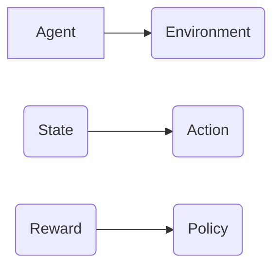
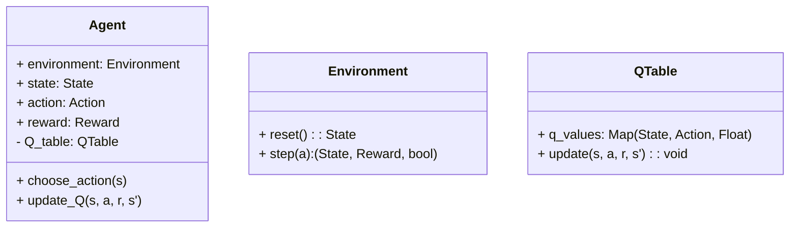
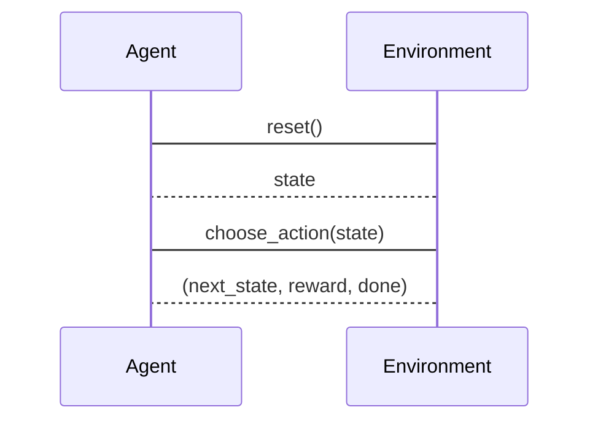

                 


# 从零构建AI Agent的情境推理能力

> 关键词：AI Agent，情境推理，算法原理，系统架构，项目实战

> 摘要：本文将详细介绍从零开始构建具备情境推理能力的AI Agent的过程。通过分析情境推理的核心概念、算法原理、系统架构设计以及实际项目实战，为读者提供一个全面的技术指南。

---

## 第一部分: AI Agent与情境推理概述

### 第1章: AI Agent基础

#### 1.1 AI Agent的定义与特点

**1.1.1 什么是AI Agent**

人工智能代理（AI Agent）是一种能够感知环境、自主决策并执行任务的智能实体。AI Agent可以是软件程序、机器人或其他智能系统，其核心目标是通过与环境的交互来实现特定任务。

**1.1.2 AI Agent的核心特点**

- **自主性**：AI Agent能够自主决策，无需外部干预。
- **反应性**：能够实时感知环境并做出反应。
- **目标导向**：基于目标进行决策和行动。
- **学习能力**：能够通过经验改进性能。

**1.1.3 AI Agent的分类与应用场景**

AI Agent可以分为以下几类：

1. **简单反射型**：基于预定义规则进行反应。
2. **基于模型的反射型**：使用内部模型进行推理和决策。
3. **目标驱动型**：以目标为导向进行决策。
4. **实用驱动型**：以效用最大化为目标进行决策。

应用场景包括自动驾驶、智能助手、游戏AI、机器人控制等。

#### 1.2 情境推理的定义与重要性

**1.2.1 情境推理的定义**

情境推理（Situation Reasoning）是指AI Agent在特定环境下，通过感知和理解环境信息，推断出当前状态、可能的动作及其结果的过程。

**1.2.2 情境推理在AI Agent中的作用**

情境推理是AI Agent实现自主决策的核心能力。它帮助AI Agent理解当前环境的状态，预测可能的未来状态，并选择最优的动作。

**1.2.3 情境推理的挑战与研究现状**

情境推理的挑战包括：

1. **不确定性**：环境信息可能不完整或模糊。
2. **动态性**：环境状态可能随时变化。
3. **复杂性**：涉及多个实体和关系的推理。

当前研究主要集中在基于强化学习、图结构和知识表示的情境推理方法。

---

### 第2章: 情境推理的核心概念

#### 2.1 情境推理的基本原理

**2.1.1 情境推理的输入与输出**

- **输入**：环境状态、感知信息。
- **输出**：可能的动作及其结果预测。

**2.1.2 情境推理的关键步骤**

1. **感知环境**：获取当前环境信息。
2. **状态表示**：将环境信息转化为状态表示。
3. **推理与决策**：基于状态推理可能的动作及其结果，选择最优动作。

**2.1.3 情境推理的数学模型**

情境推理可以表示为一个函数：
$$ f: S \rightarrow A $$
其中，$S$ 是状态空间，$A$ 是动作空间。

#### 2.2 情境推理与相关概念的对比

**2.2.1 情境推理与知识表示的对比**

- **知识表示**：侧重于知识的存储和表达。
- **情境推理**：侧重于基于知识的推理和决策。

**2.2.2 情境推理与逻辑推理的对比**

- **逻辑推理**：基于逻辑规则进行推理。
- **情境推理**：结合环境信息进行推理。

**2.2.3 情境推理与自然语言处理的对比**

- **自然语言处理**：侧重于语言的理解和生成。
- **情境推理**：侧重于基于语言信息的推理。

#### 2.3 情境推理的实体关系图



---

## 第二部分: 情境推理算法原理

### 第3章: 基于马尔可夫决策过程的算法

#### 3.1 马尔可夫决策过程(MDP)概述

**3.1.1 MDP的定义**

马尔可夫决策过程（Markov Decision Process, MDP）是一个用于建模决策过程的数学框架，由状态空间、动作空间、转移概率和奖励函数组成。

**3.1.2 MDP的核心要素**

1. **状态空间**：$S$，表示所有可能的状态。
2. **动作空间**：$A$，表示所有可能的动作。
3. **转移概率**：$P(a, s')$，表示从状态$s$执行动作$a$后转移到状态$s'$的概率。
4. **奖励函数**：$R(s, a)$，表示在状态$s$执行动作$a$后获得的奖励。

**3.1.3 MDP的数学模型**

状态转移可以用马尔可夫性质表示：
$$ P(s' | s, a) $$

#### 3.2 Q-learning算法原理

**3.2.1 Q-learning的基本原理**

Q-learning是一种基于强化学习的算法，通过学习价值函数$Q(s, a)$来选择最优动作。

**3.2.2 Q-learning的数学公式**

Q-learning的更新公式为：
$$ Q(s, a) = Q(s, a) + \alpha [r + \gamma \max Q(s', a') - Q(s, a)] $$
其中：
- $\alpha$ 是学习率。
- $\gamma$ 是折扣因子。

**3.2.3 Q-learning的实现步骤**

1. 初始化$Q$表。
2. 环境初始化，获取初始状态。
3. 重复以下步骤直到结束：
   - 选择动作$a$。
   - 执行动作$a$，获取奖励$r$和新状态$s'$。
   - 更新$Q(s, a)$。

#### 3.3 算法实现的伪代码

```python
def Q_learning(agent, environment):
    while True:
        state = environment.reset()
        done = False
        while not done:
            action = agent.choose_action(state)
            next_state, reward, done = environment.step(action)
            agent.update_Q(state, action, reward, next_state)
```

---

### 第4章: 基于图结构的情境推理

#### 4.1 图结构在情境推理中的应用

**4.1.1 图结构的基本概念**

图结构由节点和边组成，可以表示实体及其关系。

**4.1.2 图结构在情境推理中的优势**

- **表示复杂关系**：通过边表示实体之间的关系。
- **推理路径**：通过遍历图结构进行推理。

**4.1.3 基于图的推理算法**

基于图的推理算法包括深度优先搜索（DFS）和广度优先搜索（BFS）。

---

## 第三部分: 系统分析与架构设计

### 第5章: 项目背景与系统功能设计

#### 5.1 项目背景介绍

本项目旨在构建一个具备情境推理能力的AI Agent，用于实现特定任务。

#### 5.2 系统功能设计

- **感知模块**：获取环境信息。
- **推理模块**：进行情境推理。
- **决策模块**：选择最优动作。
- **执行模块**：执行动作并反馈结果。

#### 5.3 领域模型类图



---

### 第6章: 系统架构设计

#### 6.1 系统架构图


#### 6.2 系统接口设计

- **环境接口**：提供`reset`和`step`方法。
- **代理接口**：提供`choose_action`和`update_Q`方法。

#### 6.3 系统交互序列图



---

## 第四部分: 项目实战

### 第7章: 环境安装与核心代码实现

#### 7.1 环境安装

安装所需的库，例如Python的强化学习库和绘图库。

#### 7.2 核心代码实现

实现Q-learning算法的核心代码。

```python
class QAgent:
    def __init__(self, state_space, action_space):
        self.state_space = state_space
        self.action_space = action_space
        self.Q = defaultdict(lambda: defaultdict(lambda: 0))

    def choose_action(self, state):
        q_values = self.Q[state]
        max_q = max(q_values.values())
        actions = [a for a, q in q_values.items() if q == max_q]
        return random.choice(actions)

    def update_Q(self, state, action, reward, next_state):
        self.Q[state][action] += self.alpha * (reward + self.gamma * max(self.Q[next_state].values()) - self.Q[state][action])
```

#### 7.3 案例分析与结果展示

通过具体案例展示AI Agent的情境推理能力。

---

## 第五部分: 总结与展望

### 第8章: 总结

本文详细介绍了从零构建具备情境推理能力的AI Agent的过程，涵盖了核心概念、算法原理、系统架构设计和项目实战。

### 第9章: 展望

未来的研究方向包括更复杂的情境推理算法、多智能体协作、强化学习与知识图谱的结合等。

---

## 第六部分: 最佳实践

### 第10章: 小结

构建具备情境推理能力的AI Agent需要结合理论与实践，逐步优化算法和系统架构。

### 第11章: 注意事项

- 确保环境信息的准确性。
- 合理设计奖励函数。
- 定期优化算法参数。

### 第12章: 拓展阅读

推荐阅读相关领域的论文和书籍，深入理解强化学习和情境推理的最新进展。

---

通过以上步骤，我们从零开始构建了一个具备情境推理能力的AI Agent，涵盖了理论与实践的各个方面。希望这篇文章能为读者提供有价值的参考和启发。

