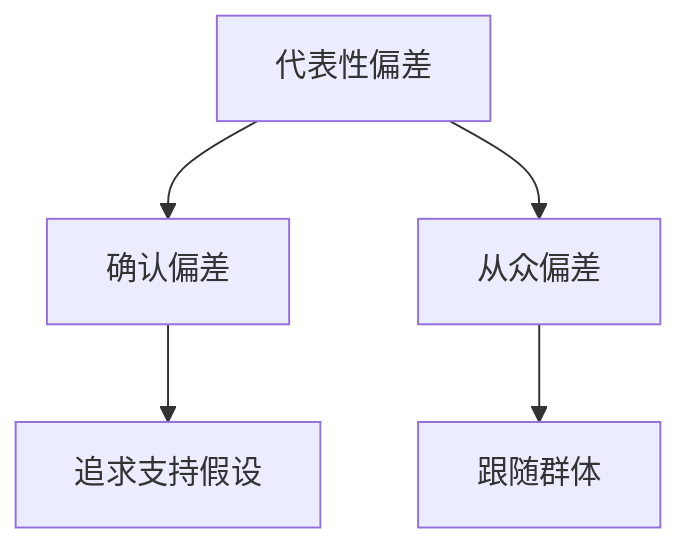
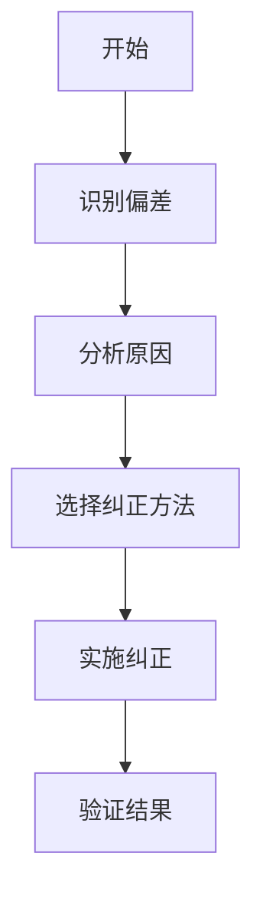
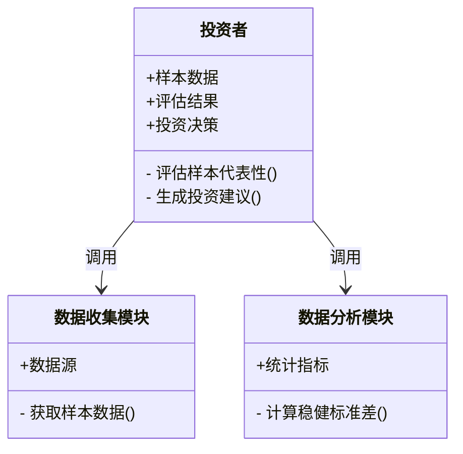
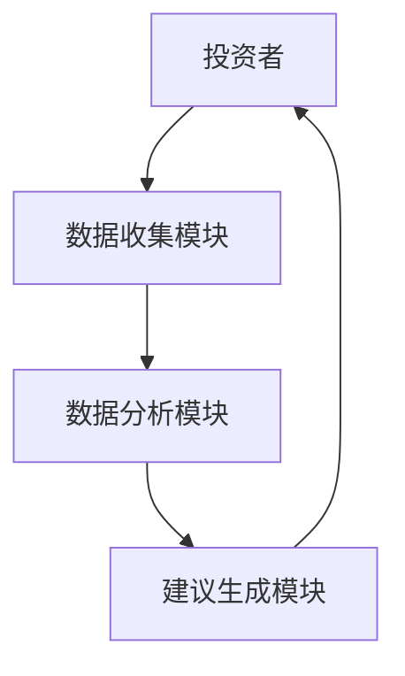

                 


# 代表性偏差：如何避免以偏概全的投资错误

> 关键词：代表性偏差，投资决策，统计学，行为经济学，系统设计

> 摘要：本文深入探讨了代表性偏差在投资中的表现及其危害，结合统计学和行为经济学的原理，提出了识别和纠正偏差的方法，通过系统设计和实战案例，展示了如何避免以偏概全的投资错误。

---

## 第一章 背景介绍

### 1.1 核心概念术语说明

- **代表性偏差（Representativeness Bias）**：投资者基于样本的代表性不足而做出错误决策的现象。

### 1.2 问题背景

- 投资决策中，投资者常依赖有限的样本做判断，导致偏差。

### 1.3 问题描述

- 样本不具代表性，导致错误判断。

### 1.4 问题解决

- 通过统计方法和系统设计，识别和纠正偏差。

### 1.5 边界与外延

- 限定于统计学和行为经济学领域。

### 1.6 概念结构与核心要素

- 样本、总体、偏差来源、纠正方法。

---

## 第二章 核心概念与联系

### 2.1 偏差原理

- 代表性偏差源于对样本的过度概括。

### 2.2 对比其他偏差

- 确认偏差：寻求支持现有假设的信息。
- 从众偏差：因群体影响改变判断。

### 2.3 概念对比表

| 偏差类型      | 描述                             | 表现形式                        |
|---------------|----------------------------------|---------------------------------|
| 代表性偏差    | 样本不具代表性导致错误判断       | 以小样本推断整体                |
| 确认偏差      | 追求支持现有假设的信息           | 忽略反面证据                    |
| 从众偏差      | 因群体压力改变判断               | 跟随多数意见                    |

### 2.4 Mermaid 图



---

## 第三章 算法原理讲解

### 3.1 识别偏差算法

- 检查样本是否具有代表性，使用统计指标如均值、标准差等。

### 3.2 纠正偏差算法

- 增加样本量，重新采样，调整分析方法。

### 3.3 Mermaid 流程图



### 3.4 Python 实现

```python
import numpy as np
from statsmodels import robust

# 示例数据
data = np.random.normal(loc=0, scale=1, size=100)

# 计算稳健标准差
std_robust = robust.standardize(data).std()

print("稳健标准差:", std_robust)
```

### 3.5 数学模型

- **条件概率公式**：
  $$P(A|B) = \frac{P(B|A)P(A)}{P(B)}$$
- **置信区间**：
  $$\text{置信区间} = \text{均值} \pm z \times \text{标准误}$$
- **假设检验**：
  $$H_0: \mu = \mu_0$$
  $$H_1: \mu \neq \mu_0$$

---

## 第四章 数学模型与公式

### 4.1 贝叶斯定理

- 应用于评估样本条件概率：
  $$P(A|B) = \frac{P(B|A)P(A)}{P(B)}$$

### 4.2 例子

- 评估某投资策略的有效性，计算后验概率。

---

## 第五章 系统分析与架构设计方案

### 5.1 问题场景

- 投资者因样本偏差导致决策失误。

### 5.2 系统功能设计

- 数据收集模块：获取样本数据。
- 数据分析模块：评估样本代表性。
- 建议生成模块：提供纠正策略。

### 5.3 Mermaid 类图



### 5.4 Mermaid 架构图



---

## 第六章 项目实战

### 6.1 环境安装

- 安装Python、NumPy、StatsModels等库。

### 6.2 核心代码实现

```python
import numpy as np
from statsmodels import robust

# 示例数据
data = np.random.normal(0, 1, 100)

# 计算稳健标准差
std_robust = robust.standardize(data).std()

print(f"稳健标准差: {std_robust}")
```

### 6.3 代码解读

- 数据生成：随机生成100个正态分布数。
- 计算稳健标准差：使用稳健方法减少异常值影响。

### 6.4 实际案例分析

- 分析某投资组合的历史回报，评估样本的稳健标准差，判断其代表性。

---

## 第七章 最佳实践

### 7.1 小结

- 代表性偏差会导致错误投资决策，需通过统计方法和系统设计避免。

### 7.2 注意事项

- 确保样本足够大且随机。
- 结合多因素分析，避免单一维度偏差。

### 7.3 拓展阅读

- 推荐书籍：《统计学习认证指南》、《行为经济学基础》。

---

通过以上章节的详细讲解，投资者可以系统地理解和避免代表性偏差，提升决策质量。

