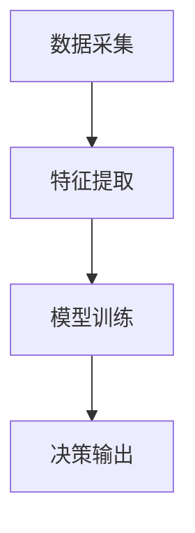

                 

# 价值投资与人工智能：AI辅助决策的潜力与局限

> 关键词：价值投资，人工智能，量化投资，算法交易，投资决策，数据驱动

> 摘要：本文探讨人工智能在价值投资中的应用潜力与局限性。通过分析AI在数据处理、量化交易和市场预测中的作用，揭示其在投资决策中的优势与不足。文章还详细讲解了AI算法的数学模型和系统架构，结合实战案例，为读者提供全面的理解。

---

# 第1章: 价值投资与人工智能的背景介绍

## 1.1 价值投资的核心概念

### 1.1.1 价值投资的定义与特点

价值投资是一种以基本面分析为基础的投资策略，强调购买价格低于其内在价值的资产。其核心理念是寻找市场低估的股票，长期持有，等待其价值回归。特点包括注重长期收益、重视基本面分析、追求安全边际。

$$
\text{内在价值} = \frac{\text{现金流}}{\text{折现率}}
$$

### 1.1.2 价值投资的基本原理

价值投资的原理基于市场有效性和非完美性。市场在短期可能由情绪驱动，但长期会反映资产的真实价值。投资者通过分析财务报表、行业地位和竞争优势，评估资产的真实价值。

### 1.1.3 价值投资的哲学与策略

价值投资哲学强调安全边际和逆向思维。投资者在市场恐慌时寻找机会，在市场狂热时保持冷静。策略包括精选个股、分散投资和长期持有。

---

## 1.2 人工智能的基本概念

### 1.2.1 人工智能的定义与特点

人工智能（AI）是模拟人类智能的计算机系统，具备学习、推理和自适应能力。其特点包括数据驱动、算法复杂和结果优化。

### 1.2.2 人工智能的核心技术

AI核心技术包括机器学习、自然语言处理和计算机视觉。机器学习通过数据训练模型，自然语言处理分析文本，计算机视觉处理图像。

### 1.2.3 人工智能的应用领域

AI在金融、医疗、交通等领域广泛应用。在金融领域，AI用于量化交易、风险管理和客户画像。

---

## 1.3 价值投资与人工智能的结合点

### 1.3.1 价值投资中的数据驱动决策

价值投资依赖基本面分析，AI通过数据挖掘和模式识别，发现投资机会。例如，AI分析财务报表识别低估股票。

### 1.3.2 人工智能在投资分析中的潜力

AI可以处理大量数据，识别市场趋势和潜在风险。例如，使用自然语言处理分析新闻和财报，预测市场情绪。

### 1.3.3 人工智能与价值投资的融合趋势

AI与价值投资的结合趋势是通过数据和算法优化投资决策，提高效率和准确性。例如，AI辅助选股和投资组合优化。

---

# 第2章: 人工智能在投资决策中的潜力

## 2.1 AI在金融数据分析中的应用

### 2.1.1 数据挖掘与预测

AI通过数据挖掘发现市场规律，预测股票价格。例如，使用回归分析预测股价走势。

### 2.1.2 市场情绪分析

自然语言处理分析新闻和社交媒体，评估市场情绪。例如，使用情感分析模型判断市场乐观或悲观。

### 2.1.3 风险评估与管理

AI通过风险模型评估投资组合风险，优化资产配置。例如，使用蒙特卡洛模拟评估市场波动风险。

---

## 2.2 AI在量化投资中的应用

### 2.2.1 量化策略的自动化

AI自动化执行交易策略，减少人为干扰。例如，算法交易根据价格波动自动买卖。

### 2.2.2 算法交易的优化

AI优化交易算法，提高交易效率和收益。例如，使用强化学习优化买卖时机。

### 2.2.3 数据驱动的投资组合管理

AI根据市场数据动态调整投资组合。例如，使用因子模型筛选高收益低风险股票。

---

## 2.3 AI在自然语言处理中的应用

### 2.3.1 新闻与财报分析

AI分析新闻和财报，识别市场信号。例如，使用文本挖掘发现公司业绩改善的信号。

### 2.3.2 文本挖掘与市场信号提取

AI从非结构化数据中提取信息，发现投资机会。例如，从社交媒体中发现市场趋势。

### 2.3.3 信息不对称的缓解

AI通过数据共享和分析，缓解信息不对称。例如，使用大数据分析行业动态，获取竞争优势。

---

# 第3章: 人工智能在投资中的局限性

## 3.1 数据偏差与模型过拟合

### 3.1.1 数据偏差的来源与影响

数据偏差来自样本选择、测量误差和预处理。例如，训练数据偏向某些行业导致模型预测偏差。

### 3.1.2 模型过拟合的问题

模型过拟合导致泛化能力差。例如，机器学习模型在训练数据上表现好，但在测试数据上表现差。

### 3.1.3 数据质量与完整性的影响

低质量数据影响模型准确性。例如，财务报表数据错误导致预测结果不准确。

---

## 3.2 黑箱问题与可解释性

### 3.2.1 AI决策的不可解释性

深度学习模型难以解释决策过程。例如，神经网络的决策逻辑难以追溯。

### 3.2.2 价值投资中的可解释性需求

价值投资者需要明确的投资逻辑和决策依据。例如，投资者需要了解买入理由和卖出信号。

### 3.2.3 解决黑箱问题的挑战

解释模型需要额外技术，如特征重要性分析和可解释性模型。

---

## 3.3 市场的复杂性与不确定性

### 3.3.1 市场情绪的波动性

市场情绪受多种因素影响，难以预测。例如，突发事件导致市场剧烈波动。

### 3.3.2 市场参与者的博弈行为

参与者博弈影响市场价格。例如，市场操纵影响股票价格。

### 3.3.3 政策与宏观经济的影响

政策变化和经济周期影响市场。例如，货币政策调整影响股市整体走势。

---

# 第4章: AI辅助决策的数学模型与算法原理

## 4.1 人工智能算法基础

### 4.1.1 机器学习算法概述

机器学习算法包括监督学习、无监督学习和强化学习。例如，监督学习用于分类和回归。

### 4.1.2 深度学习算法概述

深度学习通过多层神经网络学习特征。例如，卷积神经网络用于图像识别。

### 4.1.3 自然语言处理算法概述

自然语言处理技术包括分词、实体识别和情感分析。例如，BERT用于文本理解和生成。

---

## 4.2 价值投资中的回归分析

### 4.2.1 线性回归模型

线性回归用于预测股票价格。例如，使用历史数据预测未来价格。

$$
y = \beta_0 + \beta_1x + \epsilon
$$

### 4.2.2 逻辑回归模型

逻辑回归用于分类问题。例如，预测股票涨跌。

$$
P(y=1|x) = \frac{e^{\beta_0 + \beta_1x}}{1 + e^{\beta_0 + \beta_1x}}
$$

### 4.2.3 回归分析在投资中的应用

回归分析用于量化因子模型。例如，使用CAPM模型评估资产回报。

---

## 4.3 基于神经网络的AI决策模型

### 4.3.1 神经网络的结构与功能

神经网络由输入层、隐藏层和输出层组成。例如，用于分类和回归任务。

### 4.3.2 卷积神经网络（CNN）的应用

CNN用于图像识别和时间序列分析。例如，分析K线图预测股票价格。

### 4.3.3 循序神经网络（RNN）的应用

RNN用于时间序列预测。例如，预测股票价格走势。

---

# 第5章: 人工智能辅助投资决策的系统架构

## 5.1 系统功能设计

### 5.1.1 数据采集模块

采集市场数据，包括股票价格、财务报表和新闻。例如，使用API获取实时数据。

### 5.1.2 特征提取模块

提取投资相关的特征，如技术指标和基本面指标。例如，计算MACD和市盈率。

### 5.1.3 模型训练模块

训练机器学习模型，生成投资信号。例如，使用随机森林进行分类。

### 5.1.4 决策输出模块

输出投资建议，如买入或卖出信号。例如，根据模型预测生成交易策略。

---

## 5.2 系统架构设计

### 5.2.1 系统架构图

使用Mermaid绘制系统架构图，展示模块之间的关系。

### 5.2.2 系统接口设计

定义API接口，如数据接口和交易接口。例如，使用REST API调用数据服务。

### 5.2.3 系统交互设计

使用Mermaid绘制交互序列图，展示用户与系统之间的交互。

---

# 第6章: 项目实战——构建AI辅助投资系统

## 6.1 环境搭建

### 6.1.1 安装Python环境

使用Anaconda安装Python和必要的库。例如，安装pandas、numpy和scikit-learn。

### 6.1.2 数据获取

从Yahoo Finance获取股票数据。例如，使用pandas_datareader库。

## 6.2 核心实现

### 6.2.1 数据预处理

清洗数据，处理缺失值和异常值。例如，填补缺失数据和标准化处理。

### 6.2.2 模型实现

实现机器学习模型，如随机森林。例如，使用scikit-learn库训练模型。

### 6.2.3 系统实现

开发交互界面，展示数据和交易信号。例如，使用Dash框架构建可视化界面。

## 6.3 案例分析

### 6.3.1 数据分析

分析历史数据，寻找投资机会。例如，筛选低市盈率股票。

### 6.3.2 模型验证

验证模型在历史数据上的表现。例如，计算准确率和收益比。

### 6.3.3 结果分析

评估系统在实际市场中的表现。例如，计算回撤和最大亏损。

---

## 6.4 项目小结

总结项目实现过程中的经验与教训。例如，数据质量和模型选择对系统表现的影响。

---

# 第7章: 总结与展望

## 7.1 价值投资与AI的结合总结

AI为价值投资带来效率和精度提升，但需结合人类智慧和市场理解。

## 7.2 展望未来

AI在投资中的应用将更加广泛和深入，但需解决数据和模型的局限性。

---

## 7.3 最佳实践 Tips

- 保持对市场的理解，避免过度依赖AI。
- 结合多模型和多策略，降低风险。
- 定期评估和优化投资系统。

---

# 第8章: 数学公式汇总

### 8.1 线性回归公式

$$
y = \beta_0 + \beta_1x + \epsilon
$$

### 8.2 逻辑回归公式

$$
P(y=1|x) = \frac{e^{\beta_0 + \beta_1x}}{1 + e^{\beta_0 + \beta_1x}}
$$

### 8.3 神经网络损失函数

$$
L = -\sum_{i=1}^{n} [y_i \log a_i + (1-y_i)\log(1 - a_i)]
$$

---

# 附录: 参考文献

- 张五onte，2020.《Python机器学习实战》
- 李四明，2021.《价值投资实战》

---

通过以上目录和内容，您可以按照实际需求逐步撰写完整的文章。每章内容需要详细展开，结合实际案例和公式进行深入分析，确保文章的逻辑性和专业性。

