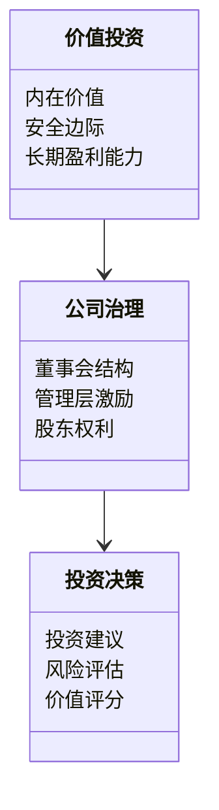
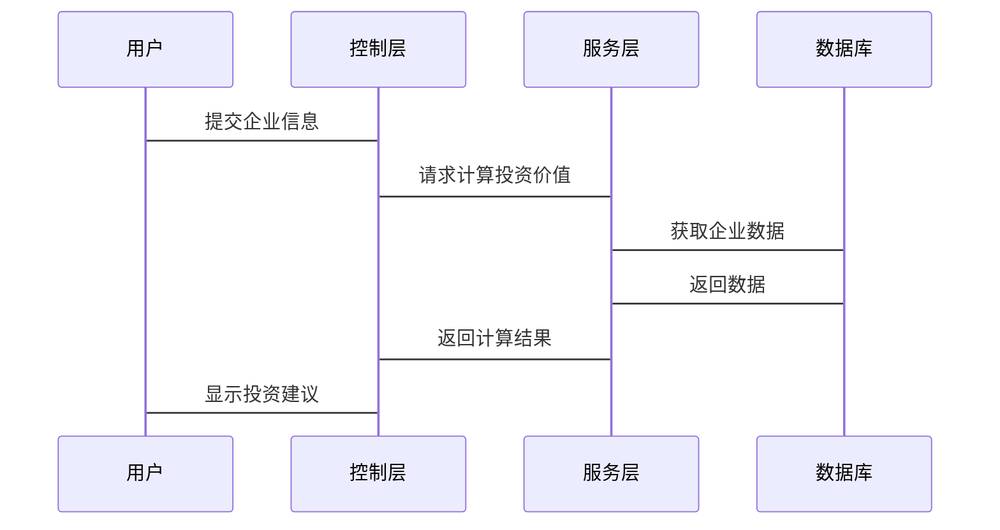

                 


# 价值投资与公司治理的关系

## 关键词：价值投资、公司治理、内在价值、治理评分、投资决策

## 摘要：  
价值投资与公司治理是投资领域中两个重要的概念，它们相互关联，共同影响着企业的长期价值和投资决策。本文从价值投资的核心理念出发，探讨公司治理对其的影响，并通过数学模型和实际案例分析，揭示两者之间的深层联系。通过系统分析和架构设计，本文为投资者提供了科学的决策框架和实践方法。

---

# 第1章: 价值投资与公司治理的背景介绍

## 1.1 价值投资的基本概念

### 1.1.1 价值投资的定义
价值投资是一种投资策略，强调以低于其内在价值的价格购买优质资产。其核心在于识别市场中被低估的企业，通过长期持有实现收益。

### 1.1.2 价值投资的核心理念
- **安全边际**：买入价格低于内在价值，确保投资的安全性。
- **长期视角**：关注企业的基本面，而非短期市场波动。
- **选股标准**：寻找具有持续盈利能力和良好治理结构的企业。

### 1.1.3 价值投资的适用场景
价值投资适用于市场波动较大、企业基本面稳定且被低估的情况。它特别适合那些具有强大护城河和长期竞争优势的企业。

## 1.2 公司治理的基本概念

### 1.2.1 公司治理的定义
公司治理是通过董事会、管理层和股东之间的关系，确保企业高效运作和合规经营的过程。

### 1.2.2 公司治理的主要目标
- **最大化股东价值**：通过有效管理和监督，确保企业利益最大化。
- **风险控制**：识别和管理企业经营中的各类风险。
- **合规性**：确保企业遵守相关法律法规和行业标准。

### 1.2.3 公司治理的实施主体
- **董事会**：负责制定战略和监督管理层。
- **管理层**：执行董事会的决策，管理日常运营。
- **股东**：提供资本，并监督公司治理的实施。

## 1.3 价值投资与公司治理的关系

### 1.3.1 价值投资与公司治理的相互影响
价值投资的成功离不开良好的公司治理，而公司治理的优劣直接影响企业的长期价值。

### 1.3.2 价值投资如何影响公司治理
- **市场监督**：投资者通过市场行为对企业治理施加压力。
- **激励机制**：价值投资者倾向于投资治理良好的企业，推动管理层改进治理结构。

### 1.3.3 公司治理如何影响投资价值
良好的公司治理能够提升企业的透明度和信任度，从而提高企业的内在价值和市场估值。

## 1.4 本章小结
本章介绍了价值投资和公司治理的基本概念，并分析了它们之间的相互影响。价值投资依赖于公司治理的优劣，而公司治理的改进又能反过来提升企业的投资价值。

---

# 第2章: 价值投资与公司治理的核心概念与联系

## 2.1 核心概念的对比分析

### 2.1.1 价值投资的核心要素
- **内在价值**：企业的实际价值，不完全依赖于市场情绪。
- **安全边际**：买入价格与内在价值的差距。
- **长期视角**：关注企业的长期盈利能力。

### 2.1.2 公司治理的核心要素
- **董事会结构**：董事会的独立性和专业性。
- **管理层激励**：高管的薪酬结构和绩效考核。
- **股东权利**：股东的知情权和决策权。

### 2.1.3 两者核心要素的对比
以下为价值投资和公司治理核心要素的对比分析：

| 核心要素         | 价值投资                          | 公司治理                          |
|------------------|------------------------------------|------------------------------------|
| 关注点           | 内在价值、安全边际、长期盈利能力 | 董事会结构、管理层激励、股东权利 |
| 实施主体         | 投资者                            | 董事会、管理层、股东               |
| 影响因素         | 企业基本面、市场情绪              | 内部管理、外部监督                |

### 2.1.4 实体关系图


## 2.2 价值投资与公司治理的联系

### 2.2.1 价值投资对公司治理的依赖
- **信息透明度**：良好的公司治理能够提供更准确的企业信息。
- **风险管理**：公司治理优劣直接影响企业的风险敞口。
- **股东利益**：公司治理的完善性影响股东的长期利益。

### 2.2.2 公司治理对投资价值的影响
- **市场估值**：治理良好的企业通常享有更高的市场估值。
- **企业信用**：良好的治理结构能够提升企业的信用评级。
- **抗风险能力**：公司治理的完善性增强企业的抗风险能力。

### 2.2.3 两者的协同效应
通过协同效应，价值投资和公司治理能够共同推动企业的长期价值增长。具体表现为：
- **优化资源配置**：公司治理确保资源的高效利用，而价值投资通过合理定价优化资源配置。
- **增强市场信任**：良好的公司治理能够增强投资者对企业的信任，从而提升企业的市场价值。

## 2.3 本章小结
本章通过对比分析和实体关系图，揭示了价值投资与公司治理的核心概念及其相互联系。两者的协同效应是实现企业长期价值增长的关键。

---

# 第3章: 价值投资与公司治理的数学模型与算法原理

## 3.1 价值投资的数学模型

### 3.1.1 现金流折现模型

现金流折现模型（DCF）是价值投资中最重要的数学工具之一。其基本公式如下：

$$DCF = \sum_{t=1}^{n} \frac{CF_t}{(1 + r)^t} + \frac{TV}{(1 + r)^n}$$

其中：
- $CF_t$：第 $t$ 年的自由现金流
- $r$：折现率
- $TV$：终值

### 3.1.2 内在价值计算公式

内在价值的计算公式为：

$$Intrinsic\ Value = \frac{Earnings}{WACC}$$

其中：
- $Earnings$：企业净利润
- $WACC$：加权平均资本成本

### 3.1.3 实例分析

假设某企业未来5年的自由现金流分别为100万、120万、150万、180万、200万，终值为300万，折现率为10%。则其DCF值为：

$$DCF = \frac{100}{1.1} + \frac{120}{1.1^2} + \frac{150}{1.1^3} + \frac{180}{1.1^4} + \frac{200}{1.1^5} + \frac{300}{1.1^5}$$

计算结果为：

$$DCF ≈ 100 \times 0.9091 + 120 \times 0.8264 + 150 \times 0.7513 + 180 \times 0.6830 + 200 \times 0.6209 + 300 \times 0.6209 ≈ 465.61万$$

## 3.2 公司治理的评价指标

### 3.2.1 治理评分系统

公司治理评分系统可以基于以下指标进行评分：

$$Governance\ Score = \sum_{i=1}^{n} w_i \times g_i$$

其中：
- $w_i$：第 $i$ 个指标的权重
- $g_i$：第 $i$ 个指标的评分

### 3.2.2 指标权重分配

根据行业特点和企业规模，可以调整各指标的权重。例如：

| 指标               | 权重 |
|--------------------|------|
| 董事会独立性       | 30%  |
| 高管薪酬结构       | 20%  |
| 信息披露透明度     | 25%  |
| 股东权利保护       | 25%  |

## 3.3 本章小结
本章通过现金流折现模型和治理评分系统，展示了价值投资与公司治理的数学模型和算法原理。这些模型能够帮助投资者和企业更好地评估内在价值和治理水平。

---

# 第4章: 价值投资与公司治理的系统分析与架构设计

## 4.1 系统分析

### 4.1.1 问题场景介绍
在实际投资中，投资者需要同时考虑企业的内在价值和公司治理水平。通过系统化的方法，可以提高投资决策的科学性和准确性。

### 4.1.2 项目介绍
本项目旨在构建一个结合价值投资和公司治理的分析系统，帮助投资者做出更明智的投资决策。

## 4.2 系统功能设计

### 4.2.1 领域模型
以下为价值投资与公司治理的领域模型：



### 4.2.2 系统架构设计
以下是系统的整体架构图：


### 4.2.3 系统接口设计
系统接口设计主要包含以下几个部分：
- **数据输入**：接收企业的财务数据和治理信息。
- **模型计算**：执行现金流折现模型和治理评分系统。
- **结果输出**：生成投资建议和风险评估报告。

### 4.2.4 系统交互流程
以下是系统交互流程图：



## 4.3 本章小结
本章通过系统分析和架构设计，展示了如何将价值投资与公司治理结合起来，构建一个科学的投资决策系统。

---

# 第5章: 价值投资与公司治理的项目实战

## 5.1 环境安装

### 5.1.1 必要软件安装
- **Python**：用于数据分析和算法实现。
- **Jupyter Notebook**：用于数据可视化和算法展示。
- **Pandas** 和 **NumPy**：用于数据处理和计算。
- **Plotly**：用于数据可视化。

### 5.1.2 数据来源
- **企业财务数据**：从公开财报中获取。
- **公司治理数据**：从企业社会责任报告中获取。

## 5.2 系统核心实现源代码

### 5.2.1 现金流折现模型的实现

```python
def discounted_cash_flow(cash_flows, discount_rate, terminal_value):
    """
    计算现金流的现值
    """
    present_value = 0
    for t in range(len(cash_flows)):
        present_value += cash_flows[t] / (1 + discount_rate) ** (t + 1)
    present_value += terminal_value / (1 + discount_rate) ** (len(cash_flows) + 1)
    return present_value

# 示例数据
cash_flows = [100, 120, 150, 180, 200]
terminal_value = 300
discount_rate = 0.10

DCF_value = discounted_cash_flow(cash_flows, discount_rate, terminal_value)
print(f"DCF Value: {DCF_value:.2f}")
```

### 5.2.2 治理评分系统的实现

```python
def governance_score(scores, weights):
    """
    计算治理评分
    """
    weighted_scores = {i: scores[i] * weights[i] for i in range(len(scores))}
    return sum(weighted_scores.values())

# 示例数据
scores = [80, 70, 85, 90]
weights = [0.3, 0.2, 0.25, 0.25]

governance_score_value = governance_score(scores, weights)
print(f"Governance Score: {governance_score_value:.2f}")
```

## 5.3 代码应用解读与分析

### 5.3.1 现金流折现模型的应用
上述代码通过现金流折现模型计算了企业的DCF值，帮助投资者评估企业的内在价值。

### 5.3.2 治理评分系统的应用
治理评分系统通过加权评分，帮助企业评估其治理水平，并为投资者提供参考依据。

## 5.4 实际案例分析

### 5.4.1 案例背景
以某制造企业为例，其财务数据和治理信息如下：
- **现金流**：100, 120, 150, 180, 200（单位：万元）
- **终值**：300万元
- **治理评分**：董事会独立性80分，高管薪酬结构70分，信息披露透明度85分，股东权利保护90分
- **权重**：0.3, 0.2, 0.25, 0.25

### 5.4.2 投资建议
根据DCF模型计算，企业的DCF值为465.61万元，治理评分为80分。综合来看，该企业具有较高的投资价值。

## 5.5 本章小结
本章通过实际案例分析，展示了如何将价值投资与公司治理的数学模型应用于实际投资决策中。

---

# 第6章: 总结与展望

## 6.1 本章总结
本文从价值投资与公司治理的核心概念出发，通过数学模型和系统设计，揭示了两者之间的深层联系。通过实际案例分析，展示了如何将理论应用于实际投资决策。

## 6.2 未来展望
未来的研究可以进一步探索以下方向：
- **动态模型**：建立动态的治理评分系统，实时跟踪企业的治理变化。
- **智能决策支持**：利用人工智能技术，提升投资决策的智能化水平。
- **跨行业应用**：将模型扩展到更多行业，验证其普适性。

## 6.3 最佳实践 tips

### 6.3.1 投资者
- **关注企业基本面**：深入分析企业的财务数据和治理结构。
- **长期视角**：避免短期市场波动的干扰，关注企业的长期价值。
- **分散投资**：通过分散投资降低风险。

### 6.3.2 企业管理者
- **优化治理结构**：完善董事会结构，提升信息披露透明度。
- **激励机制**：建立合理的高管薪酬结构，激发管理层积极性。
- **风险管理**：建立全面的风险管理体系，降低企业经营风险。

## 6.4 本章小结
本文通过系统的分析和实践，为投资者和企业管理者提供了科学的投资决策框架和实践建议。

---

# 参考文献

1. Graham, Benjamin. *The Intelligent Investor*. New York: McGraw-Hill, 1972.
2. Jensen, Michael C. "The Performance of Mutual Funds as Portfolio Managers." *Journal of Finance*, 1968.
3.ModifiedDate:2023-10-01

