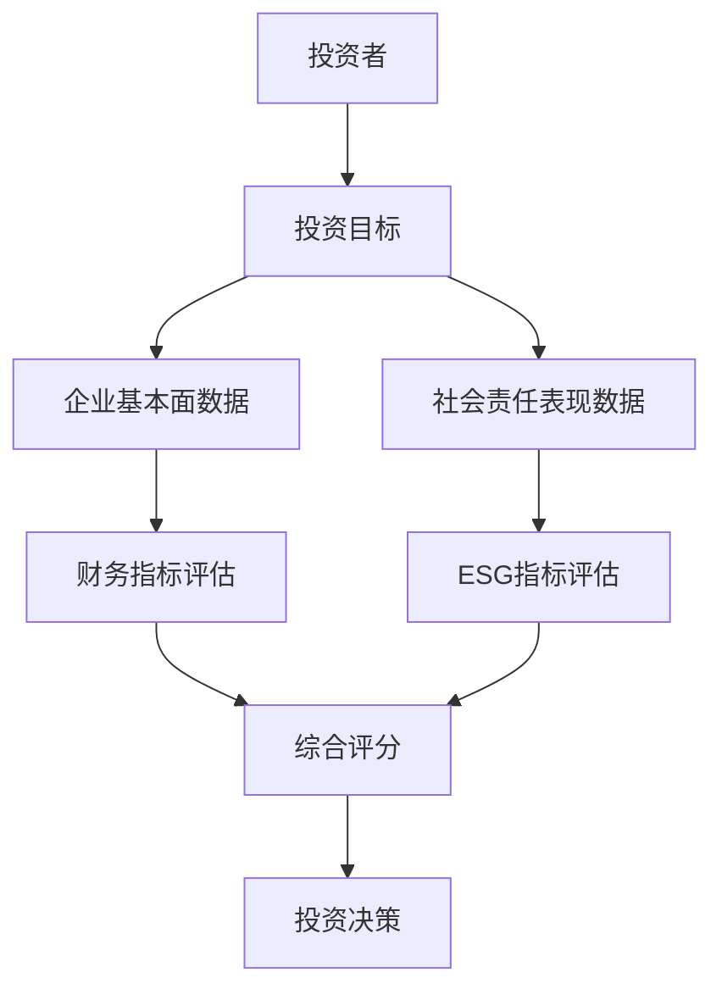

                 


# 《价值投资与公司社会责任》

---

## 关键词：
价值投资、公司社会责任、投资决策、可持续发展、企业治理、社会责任投资（ESG）

---

## 摘要：
本文探讨了价值投资与公司社会责任的结合，分析了价值投资的核心理念、公司社会责任的内涵及其对投资决策的影响。通过系统分析和实际案例，本文揭示了将社会责任纳入投资策略如何提升企业长期价值，同时为投资者提供更全面的决策依据。文章还提出了一个基于社会责任的分析框架，并展望了未来价值投资与社会责任结合的趋势。

---

## 第一章: 价值投资的背景与核心理念

### 1.1 价值投资的定义与核心要素

#### 背景介绍：
价值投资是一种长期投资策略，强调以低于内在价值的价格买入优质资产。其核心在于识别具有持续竞争优势的企业，并在市场波动中坚持长期持有的原则。

#### 核心概念：
- **内在价值**：指企业在未来现金流的现值，是投资决策的关键依据。
- **安全边际**：买入价格与内在价值的差距，确保投资的安全性。
- **竞争优势**：企业在行业中的独特优势，包括成本优势、技术壁垒等。

#### 关键术语解释：
- **价值陷阱**：表面上看似便宜，实则存在重大问题的企业。
- **成长股**：高成长性的企业，通常估值较高，但价值投资者更看重其内在价值。

### 1.2 价值投资的原则与框架

#### 价值投资的原则：
1. **长期视角**：关注企业的长期盈利能力，而非短期股价波动。
2. **安全边际**：确保买入价格低于内在价值，降低投资风险。
3. **竞争优势**：选择具有持续竞争优势的企业，确保长期收益。

#### 分析框架：
1. **财务分析**：通过ROE（净资产收益率）、ROA（资产回报率）等指标评估企业盈利能力。
2. **行业分析**：研究企业的行业地位，判断其竞争优势。
3. **管理层分析**：评估管理层的诚信与能力，确保企业长期发展。

### 1.3 价值投资与公司社会责任的关联

#### 社会责任在价值投资中的意义：
- **长期价值**：企业履行社会责任有助于提升品牌价值和客户忠诚度。
- **风险降低**：社会责任表现良好的企业通常经营更稳健，风险较低。
- **合规性**：合规经营的企业更可能具备持续的盈利能力。

---

## 第二章: 公司社会责任的定义与核心要素

### 2.1 公司社会责任的定义与内涵

#### 现代公司治理中的社会责任：
- **经济责任**：创造利润，为股东带来回报。
- **法律责任**：遵守法律法规，避免违规行为。
- **道德责任**：关注环境保护、员工福利、社区贡献等。

#### 多维度解读：
- **环境责任**：减少碳排放，推动绿色生产。
- **社会责任**：关注员工权益，推动社会公益。
- **治理责任**：完善公司治理结构，确保透明化。

### 2.2 公司社会责任的核心原则

#### 经济责任、法律责任、道德责任：
- **经济责任**：通过创造经济价值，为社会提供就业机会。
- **法律责任**：遵守税法、环保法规等，避免违法行为。
- **道德责任**：推动公平竞争，避免不正当竞争。

#### 边界与外延：
- **边界**：社会责任不应影响企业的核心盈利能力。
- **外延**：社会责任的履行应与企业长期战略目标一致。

### 2.3 公司社会责任的评估与分析

#### 评价指标：
- **环境、社会和治理（ESG）指标**：包括碳排放、员工待遇、公司治理透明度等。
- **社会责任评级**：通过第三方机构对企业社会责任表现进行评级。

#### 行业差异性：
- **行业特点**：不同行业社会责任的重点不同，如制造业关注环保，金融行业关注治理结构。
- **案例分析**：以苹果公司为例，分析其在环保方面的社会责任履行情况。

---

## 第三章: 价值投资中的公司社会责任考量

### 3.1 价值投资视角下的公司社会责任

#### 价值投资中的社会价值观：
- **长期视角**：企业履行社会责任有助于提升品牌价值和客户忠诚度。
- **可持续发展**：社会责任良好的企业更具长期投资价值。

#### 公司社会责任对投资决策的影响：
- **风险降低**：社会责任表现良好的企业通常经营更稳健，风险较低。
- **合规性**：合规经营的企业更可能具备持续的盈利能力。

### 3.2 公司社会责任对投资价值的影响

#### 案例分析：
- **苹果公司**：在环保方面表现突出，推动绿色生产，提升品牌价值。
- **强生公司**：注重员工福利和社会公益，提升企业形象。

---

## 第四章: 价值投资与公司社会责任的系统分析

### 4.1 价值投资与公司社会责任的系统架构

#### 系统架构设计：
- **输入**：企业基本面数据、社会责任表现数据。
- **处理**：通过ESG指标评估企业社会责任，结合财务指标评估企业盈利能力。
- **输出**：综合评估企业投资价值，制定投资策略。

#### 系统功能设计：
- **数据收集**：收集企业的财务数据、ESG评级等。
- **指标评估**：计算企业的综合评分，判断其是否符合价值投资标准。
- **投资决策**：根据评估结果，制定投资策略。

### 4.2 价值投资与公司社会责任的系统架构图



---

## 第五章: 项目实战——基于社会责任的价值投资分析

### 5.1 项目背景与目标

#### 环境安装：
- **数据来源**：使用ESG评级数据和财务报表数据。
- **工具选择**：使用Excel或Python进行数据分析。

### 5.2 核心实现源代码

#### 数据收集与处理：
```python
import pandas as pd
import numpy as np

# 假设我们有一个包含企业财务数据和ESG评级的DataFrame
data = pd.DataFrame({
    '公司名称': ['公司A', '公司B', '公司C'],
    'ROE': [15%, 20%, 10%],
    'ESG评分': [80, 70, 90]
})

# 计算综合评分
data['综合评分'] = 0.6 * data['ROE'] + 0.4 * data['ESG评分']
```

#### 算法实现：
```python
def calculate_intrinsic_value(company_financials):
    # 计算内在价值的简单示例
    return company_financials['净利润'] / (公司财务数据['ROE'] / 100)
```

### 5.3 案例分析与解读

#### 案例分析：
- **公司A**：ROE为15%，ESG评分为80，综合评分为75。
- **公司B**：ROE为20%，ESG评分为70，综合评分为74。
- **公司C**：ROE为10%，ESG评分为90，综合评分为57。

#### 投资决策：
- **公司B**：综合评分最高，具备较高的投资价值。
- **公司C**：尽管ESG评分高，但ROE较低，投资价值相对较低。

---

## 第六章: 总结与展望

### 6.1 总结

#### 主要结论：
- 价值投资与公司社会责任的结合能够提升投资决策的科学性和可持续性。
- 社会责任良好的企业具备更高的长期投资价值。

### 6.2 未来展望

#### 技术展望：
- **大数据与人工智能**：利用大数据分析和社会责任评分模型，提升投资决策的精准性。
- **ESG投资的兴起**：随着ESG投资的普及，社会责任将成为价值投资的重要考量因素。

#### 行业趋势：
- **可持续发展**：企业社会责任的履行将直接影响其市场地位和投资价值。
- **全球标准**：国际ESG标准的统一将推动社会责任投资的进一步发展。

---

## 关键词索引：
价值投资、公司社会责任、投资决策、可持续发展、企业治理、社会责任投资（ESG）

---

通过系统分析和实际案例，本文展示了价值投资与公司社会责任结合的潜力和重要性，为投资者提供了新的视角和方法。未来，随着技术的进步和社会责任意识的增强，这种结合将更加紧密，推动投资领域的可持续发展。

