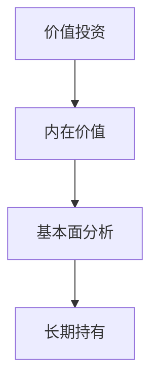

                 

# 价值投资与宏观经济的关系

---

## 关键词

- 价值投资
- 宏观经济
- 内在价值
- 宏观经济指标
- 安全边际
- 经济周期

---

## 摘要

价值投资是一种以寻找资产的内在价值为核心的投资策略，而宏观经济则研究整体经济运行的规律和趋势。本文通过分析价值投资与宏观经济的关系，揭示宏观经济环境如何影响资产的内在价值和投资决策。文章从价值投资的内在逻辑、宏观经济的核心指标、两者的关系模型、系统设计与实战案例等方面展开讨论，为投资者提供理论支持和实践指导。

---

# 第一部分: 价值投资与宏观经济的背景介绍

## 第1章: 价值投资的基本概念

### 1.1 价值投资的定义与核心理念

#### 1.1.1 价值投资的定义

价值投资是一种以基本面分析为核心的长期投资策略，其核心是寻找市场价格低于其内在价值的资产。这种方法强调长期持有的理念，注重对公司基本面的深入研究，而非短期市场波动的预测。

- **核心观点**：市场短期是投票器，长期是称重机。
- **核心假设**：市场的非有效性和短期波动性为长期投资者提供了套利机会。

#### 1.1.2 价值投资的核心理念：寻找市场的内在价值

价值投资者认为，资产的市场价值与其内在价值之间存在偏离，这种偏离为长期投资者提供了获利的机会。内在价值的计算通常基于公司的财务数据和行业地位。

- **内在价值公式**：
  $$V = \frac{CF}{r - g}$$
  其中，\( CF \) 是公司未来现金流，\( r \) 是折现率，\( g \) 是现金流增长率。

#### 1.1.3 价值投资与短期交易的区别

- **区别**：
  - 短期交易关注市场波动和价格变化。
  - 价值投资关注公司基本面和长期盈利能力。
  - 短期交易依赖技术分析，价值投资依赖基本面分析。

### 1.2 宏观经济的基本概念

#### 1.2.1 宏观经济的定义与研究对象

宏观经济研究的是整个经济系统的运行规律，包括GDP、通货膨胀、失业率、利率等宏观指标。这些指标反映了经济的整体状况，对企业的经营环境和资产价值有直接影响。

- **主要宏观经济指标**：
  - **GDP**：国内生产总值，衡量一个国家或地区的经济规模。
  - **通货膨胀率**：物价水平的上涨速度。
  - **利率**：中央银行的基准利率，影响借贷成本和投资行为。
  - **失业率**：劳动力市场的情况，反映经济活跃度。

#### 1.2.2 宏观经济与微观经济的关系

- **关系**：
  - 宏观经济环境影响微观经济主体（企业、家庭）的决策。
  - 微观经济活动的总和构成宏观经济的基本面。

#### 1.2.3 价值投资与宏观经济的关系

- **相互作用**：
  - 宏观经济环境影响企业的盈利能力，进而影响其内在价值。
  - 价值投资者通过分析宏观经济指标，优化投资组合，降低风险。

---

## 第2章: 宏观经济指标对价值投资的影响

### 2.1 经济周期与价值投资策略

#### 2.1.1 经济周期的定义

经济周期分为衰退、复苏、过热和滞胀四个阶段，每个阶段对应不同的投资策略。

- **经济周期阶段**：
  - **衰退阶段**：企业盈利下降，但估值可能较低，适合寻找被低估的资产。
  - **复苏阶段**：企业盈利逐步恢复，适合逐步增加仓位。
  - **过热阶段**：企业盈利高增长，但估值可能过高，需警惕泡沫。
  - **滞胀阶段**：经济增长停滞，通胀高企，适合防御性投资。

#### 2.1.2 利率对股票估值的影响

- **影响机制**：
  - 利率上升：债券收益率上升，资金从股市流向债市，股票估值可能下降。
  - 利率下降：债券收益率下降，资金从债市流向股市，股票估值可能上升。

#### 2.1.3 通货膨胀对价值投资的影响

- **影响机制**：
  - 高通胀环境：企业盈利可能被通胀侵蚀，内在价值可能下降。
  - 低通胀环境：企业盈利稳定，内在价值可能上升。

---

## 第3章: 价值投资中的宏观经济分析

### 3.1 宏观经济分析在价值投资中的应用

#### 3.1.1 宏观经济分析的核心作用

- **核心作用**：
  - 通过宏观经济指标预测企业盈利趋势。
  - 通过经济周期判断投资环境。

#### 3.1.2 宏观经济分析与投资决策

- **决策步骤**：
  1. 分析宏观经济指标，判断经济周期阶段。
  2. 评估宏观经济环境对行业和企业的潜在影响。
  3. 结合企业基本面分析，选择具有长期竞争优势的公司。

#### 3.1.3 宏观经济风险的控制

- **控制方法**：
  - 通过分散投资降低宏观经济风险。
  - 通过选择抗周期性行业降低宏观经济波动的影响。

---

## 第4章: 价值投资与宏观经济的系统设计

### 4.1 系统设计的背景与目标

#### 4.1.1 系统设计背景

- **背景**：
  - 价值投资需要结合宏观经济分析，优化投资组合。
  - 宏观经济指标的变化会影响资产的内在价值。

#### 4.1.2 系统设计目标

- **目标**：
  - 构建一个能够结合宏观经济分析的智能投资系统。
  - 提供宏观经济指标对投资组合的影响分析。

---

## 第5章: 价值投资与宏观经济的项目实战

### 5.1 项目背景与目标

#### 5.1.1 项目背景

- **背景**：
  - 通过实际案例分析，验证宏观经济分析在价值投资中的应用。
  - 通过系统设计，优化投资组合的宏观经济风险管理。

#### 5.1.2 项目目标

- **目标**：
  - 分析宏观经济指标对具体行业的影响。
  - 构建一个基于宏观经济分析的价值投资模型。

### 5.2 项目实施步骤

#### 5.2.1 数据收集

- **数据来源**：
  - 宏观经济指标：GDP、通货膨胀率、利率等。
  - 企业财务数据：收入、利润、现金流等。

#### 5.2.2 模型构建

- **模型设计**：
  - 使用宏观经济指标预测企业盈利趋势。
  - 结合DCF模型计算企业的内在价值。
  - 通过安全边际筛选被低估的资产。

#### 5.2.3 实施结果

- **结果展示**：
  - 通过具体案例分析，展示宏观经济分析对投资决策的影响。
  - 展示模型在实际投资中的应用效果。

---

## 第6章: 总结与展望

### 6.1 总结

- **总结**：
  - 价值投资需要结合宏观经济分析，优化投资策略。
  - 宏观经济指标对资产的内在价值和投资决策有重要影响。
  - 通过系统设计和项目实战，可以提高投资决策的科学性和准确性。

### 6.2 展望

- **展望**：
  - 进一步研究宏观经济指标对不同类型资产的影响。
  - 开发更复杂的模型，结合机器学习算法，优化投资决策。
  - 探索宏观经济与价值投资的更多结合方式，为投资者提供更全面的决策支持。

---

## 关键词回顾

- 价值投资
- 宏观经济
- 内在价值
- 宏观经济指标
- 安全边际
- 经济周期

---

## 结语

价值投资与宏观经济的关系是一个复杂而深刻的话题，通过本文的分析，我们可以看到，宏观经济环境对价值投资的影响无处不在。投资者需要不断学习和研究，才能在复杂的经济环境中找到真正的投资机会。希望本文能为价值投资者提供一些新的思路和方法，帮助他们在投资道路上走得更远。

---

