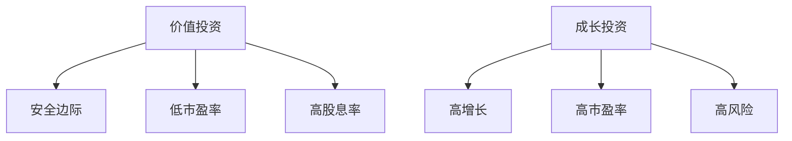
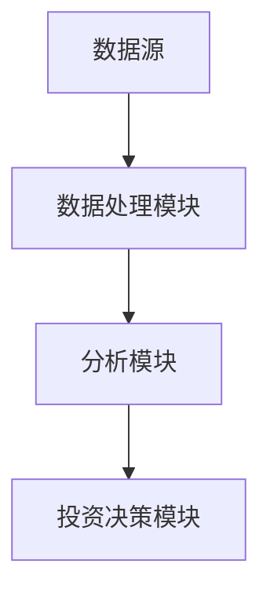

                 


# 目录大纲：《价值投资与成长投资的对比》

---

# 第一部分：引言

## 1.1 投资的基本概念
- 1.1.1 投资的定义与分类
- 1.1.2 股票市场的基本运作原理
- 1.1.3 投资者类型：机构投资者与个人投资者

## 1.2 价值投资与成长投资的起源
- 1.2.1 价值投资的起源与发展
- 1.2.2 成长投资的起源与发展
- 1.2.3 两种投资理念的对比与联系

---

# 第二部分：价值投资的核心概念与特点

## 2.1 价值投资的定义与目标
- 2.1.1 价值投资的核心理念
- 2.1.2 价值投资的目标：寻找被低估的股票
- 2.1.3 价值投资的关键要素：安全边际

## 2.2 价值投资的主要方法
- 2.2.1 基本面分析法
- 2.2.2 财务指标分析法（如市盈率、市净率等）
- 2.2.3 股票内在价值的计算公式

---

# 第三部分：成长投资的核心概念与特点

## 3.1 成长投资的定义与目标
- 3.1.1 成长投资的核心理念
- 3.1.2 成长投资的目标：寻找高成长性的股票
- 3.1.3 成长投资的关键要素：高增长与高风险

## 3.2 成长投资的主要方法
- 3.2.1 市盈率与市销率分析
- 3.2.2 营收与利润增长率分析
- 3.2.3 行业趋势与竞争优势分析

---

# 第四部分：价值投资与成长投资的核心概念对比

## 4.1 核心概念对比表格
- 4.1.1 价值投资与成长投资的主要区别对比表
- 4.1.2 两者的优缺点对比分析

## 4.2 实体关系图（ER图）


---

# 第五部分：价值投资与成长投资的数学模型与算法原理

## 5.1 价值投资的数学模型
- 5.1.1 股票内在价值的计算公式
$$ V = \frac{D}{k} $$
其中：
- \( V \) 表示股票的内在价值
- \( D \) 表示股息
- \( k \) 表示折现率

## 5.2 成长投资的数学模型
- 5.2.1 股票增长率的预测公式
$$ g = \frac{\text{净利润增长率}}{\text{行业平均增长率}} $$
其中：
- \( g \) 表示股票增长率
- 净利润增长率：公司过去几年的净利润增长率
- 行业平均增长率：行业内的平均净利润增长率

---

# 第六部分：价值投资与成长投资的系统架构设计

## 6.1 系统功能设计
- 6.1.1 数据收集模块：收集股票的基本面数据
- 6.1.2 分析模块：使用数学模型进行分析
- 6.1.3 投资决策模块：根据分析结果做出投资决策

## 6.2 系统架构图


---

# 第七部分：价值投资与成长投资的项目实战

## 7.1 环境配置
- 7.1.1 数据来源：股票数据库
- 7.1.2 工具：数据分析工具（如Python、Pandas）

## 7.2 核心实现源代码
```python
import pandas as pd

# 示例：计算股票的内在价值
def calculate_intrinsic_value(stock_price, pe_ratio):
    return stock_price / pe_ratio

# 示例：计算股票的增长率
def calculate_growth_rate(revenue_growth, net_profit_growth):
    return (revenue_growth + net_profit_growth) / 2
```

## 7.3 案例分析
- 7.3.1 价值投资案例：寻找低市盈率股票
- 7.3.2 成长投资案例：寻找高增长率股票

---

# 第八部分：结论与最佳实践

## 8.1 投资策略的选择
- 8.1.1 价值投资与成长投资的优缺点对比
- 8.1.2 根据自身情况选择合适的投资策略

## 8.2 投资建议
- 8.2.1 分散投资：不要将所有资金投入到单一策略
- 8.2.2 长期持有：避免频繁交易
- 8.2.3 持续学习：关注市场动态和公司基本面

---

# 参考文献与拓展阅读
- 价值投资经典书籍推荐
- 成长投资经典书籍推荐
- 进一步学习的资源和工具

