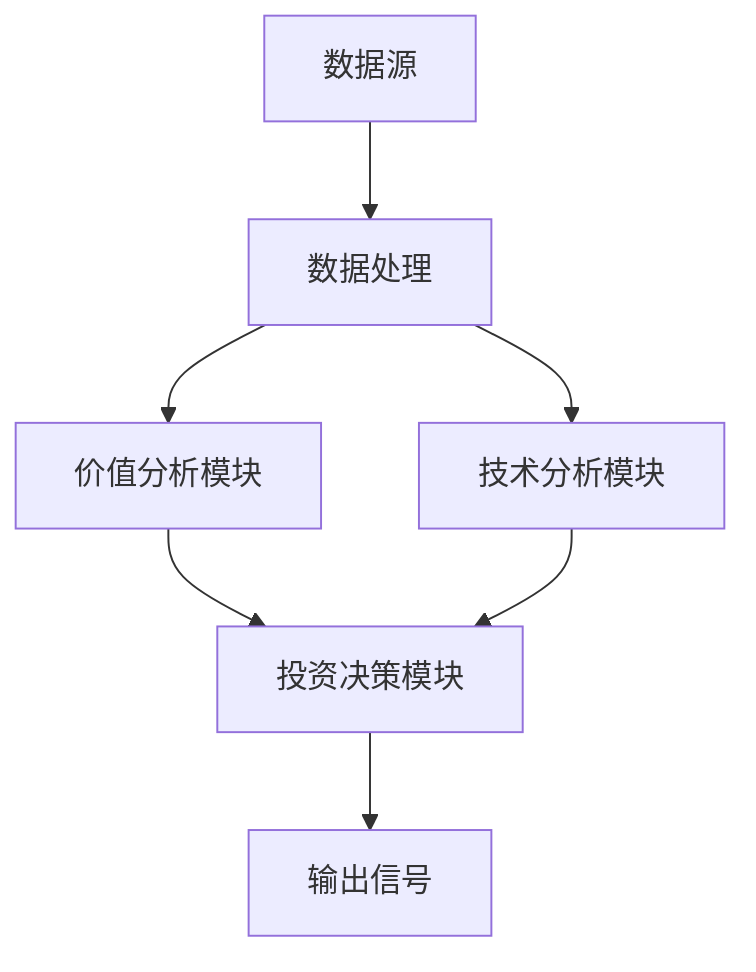
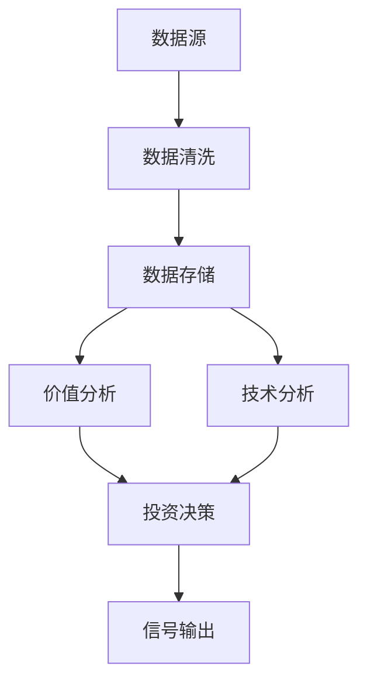

                 


# 价值投资与技术分析的结合

## 关键词：价值投资，技术分析，投资策略，系统架构，算法原理

## 摘要：本文探讨了如何将价值投资的长期基本面分析与技术分析的短期市场信号相结合，构建一个更加稳健的投资策略。通过分析内在价值、技术指标和市场趋势，本文提出了一种系统化的投资方法，并通过实际案例和系统架构设计，展示了如何在实践中应用这一策略。

---

## 第一部分：价值投资与技术分析的核心概念

### 第1章：价值投资的定义与背景

#### 1.1 价值投资的基本概念
- 价值投资是一种长期投资策略，强调购买被市场低估的资产，等待其价值回归。
- 核心在于分析公司的基本面，包括盈利能力、财务状况和行业地位。

#### 1.2 价值投资的起源与发展
- 起源于本杰明·格雷厄姆的“烟丝理论”，强调安全边际。
- 后由巴菲特发扬光大，成为价值投资的重要代表。

#### 1.3 价值投资的核心要素
| 要素 | 描述 |
|------|------|
| 内在价值 | 公司未来现金流的现值，计算公式：$$ V = \frac{CF}{r - g} $$
| 安全边际 | 投资价格低于内在价值的程度，确保投资的安全性。

### 第2章：技术分析的定义与背景

#### 2.1 技术分析的基本概念
- 技术分析通过分析价格和成交量来预测未来走势。
- 强调市场行为反映所有信息，价格走势具有可预测性。

#### 2.2 技术分析的起源与发展
- 起源于道琼斯工业指数，后发展出多种技术指标和图表形态。

#### 2.3 技术分析的核心要素
| 指标 | 描述 |
|------|------|
| 移动平均线（MA） | 平滑价格走势，识别趋势方向，计算公式：$$ MA_n = \frac{1}{n} \sum_{i=1}^{n} P_i $$
| 相对强度指数（RSI） | 衡量超买或超卖状态，计算公式：$$ RSI = \frac{100 - \frac{S}{K}}{1 + \frac{S}{K}} $$

### 第3章：价值投资与技术分析的联系与区别

#### 3.1 联系
- 价值投资提供长期投资目标，技术分析帮助捕捉最佳入场时机。
- 结合两者可以优化投资决策，减少单一方法的风险。

#### 3.2 区别
- 价值投资侧重基本面，技术分析侧重价格走势。
- 价值投资注重长期，技术分析注重短期。

#### 3.3 综合应用的可能性
- 通过筛选基本面优秀且技术形态良好的股票，结合两者的优点。

---

## 第二部分：价值投资与技术分析的结合策略

### 第4章：结合价值投资与技术分析的策略框架

#### 4.1 筛选价值投资标的
- 计算内在价值，筛选价格低于内在价值的公司。
- 通过财务指标（如ROE、负债率）评估公司基本面。

#### 4.2 技术分析信号确认
- 使用RSI、MA等指标确认买入信号。
- 分析K线图识别趋势和支撑阻力位。

#### 4.3 结合策略的具体步骤
1. 计算公司内在价值，确定潜在投资标的。
2. 分析技术指标，确认买入信号。
3. 结合两者，制定买卖决策。

### 第5章：系统化的投资策略设计

#### 5.1 系统设计目标
- 实现自动化的数据收集、分析和信号生成。
- 结合价值和技术创新，优化投资决策。

#### 5.2 系统架构设计


#### 5.3 核心算法实现
- 价值分析算法：计算内在价值和安全边际。
- 技术分析算法：生成买入/卖出信号。

### 第6章：项目实战与案例分析

#### 6.1 项目环境安装
- 安装Python、Pandas、Matplotlib等工具。

#### 6.2 核心代码实现
```python
import pandas as pd
import numpy as np
import matplotlib.pyplot as plt

def calculate_intrinsic_value(earnings, growth_rate, discount_rate):
    return earnings / (discount_rate - growth_rate)

def calculate_rsi(data, period=14):
    diff = data['close'].diff()
    up = diff.where(diff > 0, 0)
    down = abs(diff.where(diff < 0, 0))
    rs = up.rolling(period).mean() / down.rolling(period).mean()
    return 100 - (100 - rs.rolling(period).mean())

# 示例数据
data = pd.DataFrame({
    'close': [100, 105, 110, 108, 115]
})

# 计算内在价值
iv = calculate_intrinsic_value(10, 0.05, 0.1)
print(f"内 在 价 值: {iv}")

# 计算RSI
rsi = calculate_rsi(data)
print(f"RSI: {rsi.iloc[-1]}")
```

#### 6.3 案例分析
- 选择一家公司，计算其内在价值，分析技术指标，确定投资信号。

#### 6.4 项目小结
- 成功结合价值和技术创新，优化投资决策。

---

## 第三部分：系统架构与技术实现

### 第7章：系统分析与架构设计

#### 7.1 数据流设计
- 数据源：股票数据、财务数据。
- 数据处理：清洗、转换、存储。

#### 7.2 系统架构图


#### 7.3 接口设计
- 数据接口：获取实时数据。
- 分析接口：计算内在价值、生成技术指标。

### 第8章：系统实现与优化

#### 8.1 核心算法优化
- 提高计算效率，优化模型参数。

#### 8.2 系统性能调优
- 使用分布式计算，优化数据处理流程。

#### 8.3 系统测试与验证
- 测试系统稳定性，验证算法准确性。

---

## 第四部分：结论与展望

### 第9章：结论

#### 9.1 综合应用的优势
- 结合价值和技术创新，提高投资决策的科学性。
- 减少单一方法的局限性，优化投资组合。

### 第10章：未来展望

#### 10.1 持续优化方向
- 引入更多技术指标，丰富策略组合。
- 结合机器学习，提高预测准确性。

#### 10.2 拓展研究领域
- 探索不同市场环境下的策略适应性。
- 研究不同类型资产的结合策略。

---

## 结语

通过本文的探讨，我们可以看到，价值投资与技术分析的结合为投资者提供了更加全面的投资策略。这种结合不仅考虑了公司的基本面，还考虑了市场的短期波动，能够帮助投资者做出更加科学的投资决策。未来，随着技术的进步和市场的变化，这一策略将不断完善，为投资者创造更大的价值。

