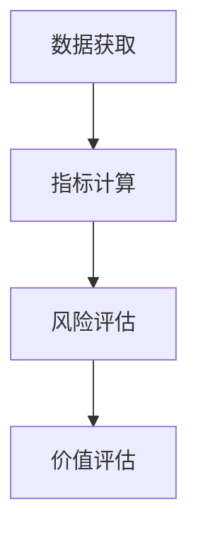

                 

# 价值投资与财务报表分析

> 关键词：价值投资、财务报表分析、投资策略、财务指标、投资决策

> 摘要：价值投资是一种以长期视角为基础的投资策略，其核心在于通过分析企业的财务报表，评估其内在价值，从而做出明智的投资决策。本文将深入探讨价值投资的核心理念，分析财务报表的主要内容与方法，并结合实际案例，为投资者提供一套系统化的分析框架，帮助其在复杂多变的市场环境中发现价值、创造价值。

---

# 第一部分: 价值投资与财务报表分析基础

## 第1章: 价值投资的核心概念与背景

### 1.1 价值投资的定义与背景

价值投资是一种以企业内在价值为核心的投资策略，由本杰明·格雷厄姆和戴维·多德在20世纪初提出。其核心思想是：市场波动反映短期情绪，而企业的真实价值可以通过对其财务状况和经营能力的深入分析来确定。价值投资者追求以低于内在价值的价格买入优质企业，长期持有，等待市场重新发现其价值。

#### 1.1.1 价值投资的哲学基础

价值投资的哲学基础可以概括为“反向投资”和“ Margin of Safety”（安全边际）。

- **反向投资**：在市场恐慌时买入，在市场狂热时卖出。
- **安全边际**：买入价格低于企业的内在价值，以降低投资风险。

### 1.2 财务报表分析的重要性

财务报表是企业经营状况的“晴雨表”，包括资产负债表、利润表和现金流量表。通过分析财务报表，投资者可以评估企业的盈利能力、财务健康状况和成长潜力。

#### 1.2.1 财务报表的构成与作用

- **资产负债表**：反映企业在某一特定时点的资产、负债和所有者权益的状况。
- **利润表**：展示企业在一定会计期间内的收入、成本和利润情况。
- **现金流量表**：记录企业在一定会计期间内的现金流来源和用途。

### 1.3 价值投资与财务报表分析的结合

价值投资的核心是通过财务报表分析发现被市场低估的企业。投资者需要从财务报表中挖掘企业的基本面信息，评估其竞争优势、盈利能力、财务风险和成长潜力。

---

## 第2章: 财务报表分析的核心方法

### 2.1 财务指标的分类与计算

财务指标是财务报表分析的重要工具，主要包括以下几类：

- **盈利能力指标**：如净利润率、ROE（净资产收益率）。
- **偿债能力指标**：如资产负债率、流动比率。
- **运营能力指标**：如存货周转率、应收账款周转率。
- **成长能力指标**：如收入增长率、净利润增长率。

#### 2.1.1 股东权益比率

股东权益比率是衡量企业财务杠杆的重要指标，计算公式如下：

$$
股东权益比率 = \frac{股东权益}{资产} \times 100\%
$$

#### 2.1.2 资产负债率

资产负债率是衡量企业负债水平的重要指标，计算公式如下：

$$
资产负债率 = \frac{负债}{资产} \times 100\%
$$

---

## 第3章: 价值投资的核心要素与分析框架

### 3.1 企业的基本面分析

基本面分析是价值投资的核心，主要从以下几个方面进行：

- **行业地位**：企业所在行业的竞争地位、市场占有率。
- **财务健康状况**：企业的盈利能力、偿债能力、运营效率。
- **管理团队**：管理团队的经验、能力和诚信。

### 3.2 投资价值的评估与决策

投资价值评估是价值投资的关键步骤，主要包括以下几个步骤：

1. **确定企业的内在价值**：通过DCF（Discounted Cash Flow）模型估算企业价值。
2. **比较市场价格与内在价值**：如果市场价格低于内在价值，企业具有投资价值。
3. **制定投资策略**：根据企业的基本面和市场环境，制定买入、持有或卖出的决策。

---

## 第4章: 系统化的财务报表分析方法

### 4.1 财务报表分析的系统架构

为了系统化地进行财务报表分析，可以构建一个分析框架，包括以下几个模块：

- **数据获取**：获取企业的财务报表数据。
- **指标计算**：计算各项财务指标。
- **风险评估**：评估企业的财务风险。
- **价值评估**：估算企业的内在价值。

#### 4.1.1 财务报表分析的系统架构图

---

## 第5章: 价值投资的实战案例分析

### 5.1 案例背景

假设我们分析一家制造企业的财务报表，评估其投资价值。

#### 5.1.1 财务数据

- 资产：1000万元
- 负债：600万元
- 净利润：200万元
- 收入：800万元

#### 5.1.2 财务指标计算

- 股东权益 = 资产 - 负债 = 400万元
- 净利率 = 净利润 / 收入 = 25%
- 负债率 = 负债 / 资产 = 60%

#### 5.1.3 投资价值评估

根据DCF模型，估算企业的内在价值，比较市场价格，做出投资决策。

---

## 第6章: 价值投资的策略与风险管理

### 6.1 价值投资的策略制定

价值投资者需要根据市场环境和个人风险承受能力，制定投资策略。

- **长期持有**：避免频繁交易，降低交易成本。
- **分散投资**：通过投资多个企业分散风险。
- **逆向投资**：在市场恐慌时寻找低估企业。

### 6.2 风险管理

风险管理是价值投资的重要组成部分，主要包括：

- **市场风险**：通过分散投资降低市场波动带来的风险。
- **企业风险**：通过基本面分析选择优质企业降低企业违约风险。
- **流动性风险**：确保投资组合的流动性，应对紧急资金需求。

---

## 第7章: 价值投资的未来发展趋势

### 7.1 数字化与智能化

随着技术的进步，价值投资也在向数字化和智能化方向发展。

- **大数据分析**：利用大数据技术挖掘企业的潜在价值。
- **人工智能**：通过AI技术预测市场走势和企业价值。

### 7.2 ESG投资

ESG（Environmental, Social, Governance）投资是价值投资的新趋势，强调企业在环境、社会和治理方面的表现。

---

## 第8章: 总结与展望

### 8.1 本文总结

本文系统地介绍了价值投资的核心理念和财务报表分析的方法，结合实际案例，为投资者提供了一套系统化的分析框架。

### 8.2 未来展望

随着市场的不断发展，价值投资将更加依赖于技术的进步和数据的驱动，投资者需要不断学习和适应新的挑战。

---

# 结语

价值投资与财务报表分析是一门实践性很强的学科，需要投资者不断学习和实践。通过系统的财务报表分析，投资者可以更好地发现价值、创造价值，实现长期稳健的投资回报。希望本文能为价值投资者提供有益的指导和启发。

