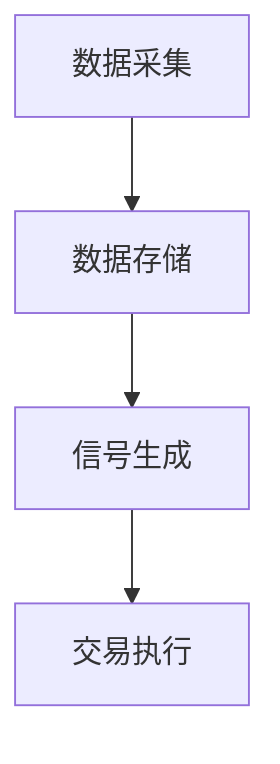

                 


# 价值投资与量化投资的对比

> 关键词：价值投资，量化投资，投资策略，基本面分析，算法交易，量化模型

> 摘要：本文从价值投资和量化投资的定义、核心理念、策略方法、优缺点等方面进行对比分析。通过详细阐述两种投资方法的背景、原理、实现方式和实际案例，帮助读者理解它们的异同点，并结合技术语言和专业分析，为投资决策提供参考。

---

## 第1章: 投资的基本概念与方法

### 1.1 投资的基本概念

#### 1.1.1 投资的定义与分类
- **定义**：投资是通过购买资产（如股票、债券、房地产等）以期获得未来收益的行为。
- **分类**：
  - **短期投资**：以赚取差价为目的，通常持有时间较短。
  - **长期投资**：以资产增值为目的，通常持有时间较长。
  - **主动投资**：积极管理投资组合，寻求超额收益。
  - **被动投资**：通过指数基金等工具，追求市场平均收益。

#### 1.1.2 投资的基本原则与目标
- **基本原则**：
  - 分散投资：降低风险。
  - 长期视角：避免短期波动的干扰。
  - 知识储备：深入了解投资标的。
- **目标**：
  - 资产保值与增值。
  - 超额收益。

#### 1.1.3 投资市场的基本构成
- **市场参与者**：投资者、上市公司、中介机构、监管机构。
- **市场类型**：股票市场、债券市场、期货市场等。
- **市场机制**：价格发现、供求关系、交易规则。

### 1.2 价值投资与量化投资的起源

#### 1.2.1 价值投资的起源与发展
- **起源**：20世纪初，本杰明·格雷厄姆和戴维·多德提出。
- **发展**：巴菲特、彼得·林奇等投资者将其发扬光大。
- **核心理念**：寻找被市场低估的股票，长期持有。

#### 1.2.2 量化投资的起源与发展
- **起源**：20世纪60年代，计算机技术的应用推动量化交易。
- **发展**：算法交易、高频交易、因子投资模型。
- **核心理念**：利用数学模型和算法寻找市场机会。

#### 1.2.3 两种投资方法的对比意义
- **意义**：理解两者的特点和适用场景，帮助投资者选择合适的投资策略。

### 1.3 本书的核心内容与结构
- **核心内容**：
  - 价值投资与量化投资的定义与核心理念。
  - 两种方法的策略、优缺点对比。
  - 数学模型与算法的详细讲解。
- **结构**：
  - 第1章：背景介绍。
  - 第2章：价值投资的核心理念与实践。
  - 第3章：量化投资的原理与方法。
  - 第4章：价值投资与量化投资的对比分析。
  - 第5章：数学模型与算法实现。
  - 第6章：系统架构与项目实战。
  - 第7章：最佳实践与小结。

---

## 第2章: 价值投资的核心理念与实践

### 2.1 价值投资的定义与核心理念

#### 2.1.1 价值投资的定义
- 价值投资是一种以基本面分析为基础，寻找被市场低估的股票的投资方法。

#### 2.1.2 价值投资的核心理念
- **安全边际**：购买价格低于内在价值，以降低风险。
- **长期持有**：通过时间的推移获得资产增值。
- **逆向投资**：在市场恐慌时买入，在市场疯狂时卖出。

### 2.2 价值投资的主要策略与方法

#### 2.2.1 基本面分析法
- **基本面分析**：研究公司的财务报表、行业地位、竞争优势等。
- **估值方法**：
  - 市盈率（P/E）：股价/每股收益。
  - 市净率（P/B）：股价/每股净资产。
  - 内在价值估算：使用DCF模型（Discounted Cash Flow）。

#### 2.2.2 股票估值方法
- **DCF模型**：
  $$
  V = \frac{CF}{(1 + r)^t}
  $$
  其中，\( V \) 是内在价值，\( CF \) 是未来现金流，\( r \) 是贴现率，\( t \) 是时间。

#### 2.2.3 安全边际的概念与应用
- **安全边际**：购买价格与内在价值的差距。
- **应用**：选择安全边际高的股票，降低投资风险。

### 2.3 价值投资的代表人物与经典案例

#### 2.3.1 巴菲特与价值投资
- **巴菲特的投资理念**：价值投资的倡导者，强调安全边际和长期持有。
- **经典案例**：购买喜马拉雅盐场，长期持有可口可乐。

#### 2.3.2 格雷厄姆的投资理念
- **格雷厄姆的投资策略**：寻找低估的股票，注重安全边际。
- **经典案例**：购买价格低于清算价值的股票。

### 2.4 价值投资的优缺点与适用场景

#### 2.4.1 价值投资的优点
- **优点**：
  - 风险低：注重安全边际。
  - 收益稳定：长期持有优质资产。
  - 抗跌性强：在市场下跌时表现较好。

#### 2.4.2 价值投资的缺点
- **缺点**：
  - 需要长期资金：不适合短期投资者。
  - 对市场敏感：市场波动可能影响内在价值。
  - 需要深入研究：对投资者的知识和能力要求高。

#### 2.4.3 价值投资的适用场景
- **适用场景**：
  - 长期投资者。
  - 风险厌恶型投资者。
  - 对特定行业有深入了解的投资者。

---

## 第3章: 量化投资的原理

### 3.1 量化投资的定义

#### 3.1.1 量化投资的定义
- 量化投资是利用数学模型和算法进行交易决策的投资方法。

### 3.2 量化投资的主要策略与方法

#### 3.2.1 算法交易
- **算法交易**：利用计算机程序自动执行交易指令。
- **高频交易**：在极短时间内完成大量交易。

#### 3.2.2 因子模型
- **因子模型**：
  - **Fama-French三因子模型**：
    $$
    R_i = \alpha + \beta_1 R_{m} + \beta_2 (Size) + \beta_3 (Value) + \epsilon
    $$
  - **多因子模型**：结合多个因子（如动量、流动性等）进行选股。

#### 3.2.3 数据挖掘与机器学习
- **数据挖掘**：从海量数据中提取规律。
- **机器学习**：利用算法预测市场走势。

### 3.3 量化投资的优缺点与适用场景

#### 3.3.1 量化投资的优点
- **优点**：
  - 高效性：利用计算机程序快速决策。
  - 客观性：避免人为情绪干扰。
  - 可扩展性：适合大规模交易。

#### 3.3.2 量化投资的缺点
- **缺点**：
  - 市场风险：算法交易可能加剧市场波动。
  - 计算复杂性：需要高性能计算和大数据处理。
  - 模型风险：依赖模型的有效性。

#### 3.3.3 量化投资的适用场景
- **适用场景**：
  - 短期投资者。
  - 风险承受能力强的投资者。
  - 具备技术背景的投资者。

---

## 第4章: 价值投资与量化投资的对比分析

### 4.1 对比维度

#### 4.1.1 核心理念对比
| 对比维度 | 价值投资 | 量化投资 |
|----------|----------|----------|
| 核心理念 | 低买高卖，寻找低估资产 | 利用模型和算法寻找市场机会 |
| 研究方法 | 基础面分析，长期持有 | 数学模型，短期交易 |
| 适用场景 | 长期投资，低风险 | 短期交易，高风险 |

#### 4.1.2 优缺点对比
| 对比维度 | 价值投资 | 量化投资 |
|----------|----------|----------|
| 优点     | 风险低，收益稳定 | 高效性，客观性 |
| 缺点     | 需要长期资金，对研究要求高 | 市场风险，模型风险 |

#### 4.1.3 风险收益对比
- **风险收益对比**：
  - 价值投资：低风险，收益稳定。
  - 量化投资：高风险，收益波动大。

---

## 第5章: 数学模型与算法实现

### 5.1 价值投资中的数学模型

#### 5.1.1 市盈率模型
- **公式**：
  $$
  P/E = \frac{Price}{Earnings Per Share}
  $$

#### 5.1.2 DCF模型
- **公式**：
  $$
  V = \frac{CF}{(1 + r)^t}
  $$

### 5.2 量化投资中的算法实现

#### 5.2.1 Fama-French三因子模型
- **公式**：
  $$
  R_i = \alpha + \beta_1 R_{m} + \beta_2 (Size) + \beta_3 (Value) + \epsilon
  $$

#### 5.2.2 动量策略
- **算法**：
  - 选择过去一段时间内收益率较高的股票。
  - 买入并持有一定时间后卖出。

### 5.3 算法实现示例

#### 5.3.1 价值投资算法实现
```python
def value_investment_strategy(prices, earnings):
    pe_ratio = prices / earnings
    value_stocks = pe_ratio[pe_ratio < 15]
    return value_stocks.index
```

#### 5.3.2 量化投资算法实现
```python
def quant_strategy(prices, returns):
    momentum = returns.rolling(20).mean()
    quant_stocks = momentum[momentum > 0.05]
    return quant_stocks.index
```

---

## 第6章: 系统架构与项目实战

### 6.1 系统架构设计

#### 6.1.1 系统功能设计
- **数据采集**：获取股票价格、财务数据等。
- **信号生成**：根据模型生成买卖信号。
- **交易执行**：根据信号执行交易指令。

#### 6.1.2 系统架构图


### 6.2 项目实战

#### 6.2.1 环境安装
- **工具**：Python、Pandas、NumPy、Matplotlib。
- **数据源**：Yahoo Finance API。

#### 6.2.2 核心实现代码
```python
import pandas as pd
import numpy as np

# 价值投资策略
def value_investment_strategy(data):
    pe = data['price'] / data['earnings']
    value_stocks = pe[pe < 15].index
    return value_stocks

# 量化投资策略
def quant_strategy(data):
    momentum = data['return'].rolling(20).mean()
    quant_stocks = momentum[momentum > 0.05].index
    return quant_stocks
```

#### 6.2.3 案例分析
- **价值投资案例**：选择PE < 15的股票。
- **量化投资案例**：选择动量策略的股票。

---

## 第7章: 最佳实践与小结

### 7.1 小结
- **小结**：
  - 价值投资适合长期投资者，注重安全边际。
  - 量化投资适合技术背景投资者，注重模型和算法。
  - 两种方法各有优缺点，投资者可以根据自身需求选择合适的方法。

### 7.2 投资建议
- **建议**：
  - 初期投资者可以选择价值投资，学习基本面分析。
  - 技术背景投资者可以选择量化投资，利用算法交易。
  - 组合投资：结合价值和量化策略，分散风险。

### 7.3 注意事项
- **注意事项**：
  - 投资需谨慎，避免盲目跟风。
  - 定期复盘，调整投资策略。
  - 保持学习，更新知识。

### 7.4 拓展阅读
- **拓展阅读**：
  - 《The Intelligent Investor》（巴菲特著）。
  - 《Quantitative Equity Portfolio Management》（约翰·瑞德著）。

---

通过本文的详细对比分析，读者可以更好地理解价值投资与量化投资的区别与联系，并根据自身的实际情况选择合适的投资策略。希望本文能为投资者提供有价值的参考和启发。

