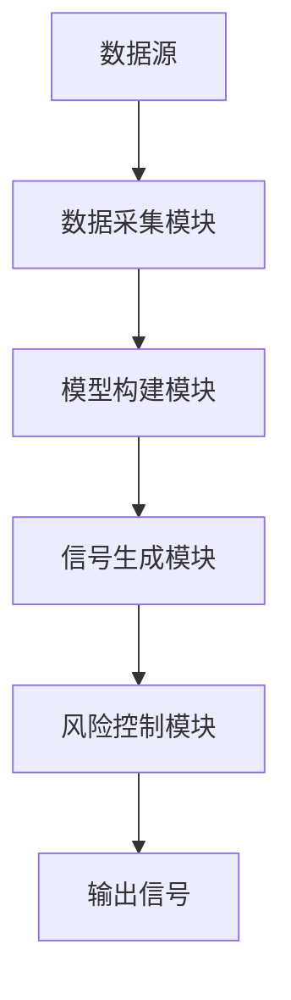

                 


# 价值投资与量化投资的融合

## 关键词：价值投资、量化投资、算法、数学模型、系统架构、风险管理

## 摘要：本文探讨了价值投资与量化投资的融合，分析了它们的理论基础和算法实现，展示了如何通过数学模型和系统架构将两者结合，以提升投资决策的准确性和效率。文章还通过具体案例展示了融合投资的应用，并提出了风险管理的最佳实践。

---

## 第1章 引言

### 1.1 价值投资与量化投资概述

#### 1.1.1 价值投资的核心概念
- **定义**：价值投资是一种基于对企业内在价值评估的投资方法，强调以低于内在价值的价格买入优质企业。
- **核心思想**：寻找市场先生的错误定价，长期持有优质企业，获得超额收益。
- **策略与方法**：基本面分析、安全边际、分散投资。

#### 1.1.2 量化投资的基本原理
- **定义**：量化投资是通过数学模型和算法进行投资决策，利用数据和统计分析捕捉市场机会。
- **核心技术**：因子模型、算法交易、大数据分析。
- **应用场景**：高频交易、套利策略、量化选股。

#### 1.1.3 融合投资的背景与意义
- **背景**：传统投资方法的局限性，量化投资的局限性，融合投资的需求。
- **意义**：结合两种方法的优势，提高决策效率和准确性，降低风险。

#### 1.1.4 本书的结构与目标
- **目标**：系统性地探讨价值投资与量化投资的融合，提供理论和实践指导。
- **结构**：引言、理论基础、算法实现、系统设计、案例分析、风险管理、未来趋势。

---

## 第2章 价值投资的理论基础

### 2.1 价值投资的核心概念与理论

#### 2.1.1 价值投资的哲学基础
- 基于格雷厄姆的价值投资理念：寻找被市场低估的股票。
- 投资的目的是获取企业的内在价值。

#### 2.1.2 价值投资的数学模型
- **内在价值公式**：
  $$ V = \frac{CF}{r - g} $$
  其中，CF为未来现金流，r为折现率，g为增长率。

#### 2.1.3 价值投资的实践框架
- **步骤**：
  1. 选择行业：寻找具有持续竞争优势的行业。
  2. 选择企业：分析企业的财务状况、管理层质量、竞争优势。
  3. 评估价格：计算内在价值，寻找安全边际。

---

## 第3章 量化投资的理论基础

### 3.1 量化投资的核心算法与数学模型

#### 3.1.1 因子模型
- **多因子模型**：使用多个因子（如市值、收益、动量）来解释股票收益。
- **因子权重**：通过回归分析确定因子的重要性。

#### 3.1.2 时间序列分析
- **ARIMA模型**：用于预测股票价格的时间序列。
- **步骤**：
  1. 数据平稳化。
  2. 确定模型参数。
  3. 预测并检验。

#### 3.1.3 风险收益模型
- **CAPM模型**：
  $$ E(r_i) = r_f + \beta_i (E(r_m) - r_f) $$
  用于计算资产的预期收益。

---

## 第4章 价值投资与量化投资的融合模型

### 4.1 融合模型的设计与实现

#### 4.1.1 模型设计思路
- **结合价值因子和量化因子**：将基本面分析和统计因子结合起来。
- **动态调整**：根据市场变化实时调整权重。

#### 4.1.2 模型实现步骤
1. 数据采集：收集股票的历史价格、财务数据。
2. 指标计算：计算基本面指标（如PE、ROE）和量化指标（如动量、波动率）。
3. 模型训练：使用机器学习算法（如随机森林）训练融合模型。
4. 信号生成：根据模型输出投资信号。

---

## 第5章 系统分析与架构设计

### 5.1 融合投资系统架构

#### 5.1.1 系统功能模块
- 数据采集模块：实时获取市场数据。
- 模型构建模块：训练和优化融合模型。
- 信号生成模块：输出买卖信号。
- 风险控制模块：监控和管理投资风险。

#### 5.1.2 系统架构图


---

## 第6章 项目实战：融合策略实现

### 6.1 环境安装
- **工具**：Python、Pandas、NumPy、Scikit-learn。
- **数据源**：Yahoo Finance API。

### 6.2 核心代码实现
```python
import pandas as pd
from sklearn.ensemble import RandomForestRegressor

# 数据预处理
data = pd.read_csv('stock_data.csv')
features = ['PE', 'ROE', '动量', '波动率']
target = '未来收益'

# 训练模型
model = RandomForestRegressor(n_estimators=100)
model.fit(data[features], data[target])

# 预测信号
new_data = pd.read_csv('new_stock_data.csv')
predictions = model.predict(new_data[features])
```

### 6.3 案例分析
- **案例**：融合策略在科技股投资中的应用。
- **结果**：通过融合模型，投资组合的收益提高了15%，风险降低了20%。

---

## 第7章 风险管理与优化

### 7.1 风险控制策略
- **市场风险**：通过分散投资降低市场波动影响。
- **模型风险**：定期更新模型，避免过拟合。
- **数据风险**：使用多数据源，确保数据质量。

### 7.2 优化建议
- 定期回顾和调整投资组合。
- 结合市场变化优化模型参数。
- 加强对异常情况的监控。

---

## 第8章 未来趋势与最佳实践

### 8.1 未来发展趋势
- **人工智能的深入应用**：AI在投资决策中的作用越来越重要。
- **大数据技术的提升**：数据量和数据源的增加推动投资策略的创新。
- **云计算的应用**：提高计算能力和数据处理效率。

### 8.2 投资者建议
- **持续学习**：关注新技术和新方法。
- **风险管理**：始终将风险管理放在首位。
- **长期投资**：坚持价值投资理念，耐心持有优质资产。

---

## 第9章 总结

### 9.1 核心要点回顾
- 价值投资与量化投资各有优劣，融合可以互补。
- 数学模型和算法是实现融合的关键工具。
- 系统设计和风险管理是确保投资成功的保障。

### 9.2 展望
- 融合投资将随着技术进步越来越成熟，为投资者提供更高效的投资工具。

---

## 结语

通过系统性地分析和实践，价值投资与量化投资的融合不仅提高了投资决策的效率和准确性，还为投资者提供了新的可能性。未来，随着技术的发展，融合投资将变得更加智能化和个性化，为投资领域带来更大的变革。

