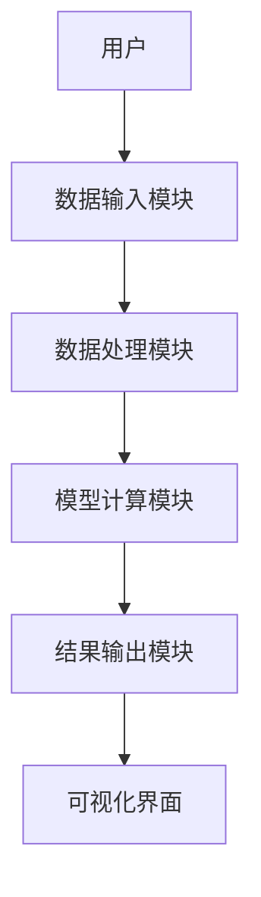
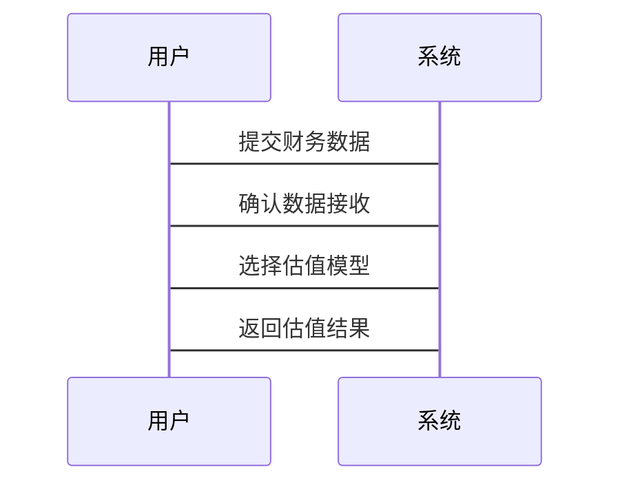

                 

# 价值投资中企业估值的核心算法模型

## 关键词：价值投资、企业估值、DCF模型、P/E模型、P/B模型、投资算法、金融技术

## 摘要：  
本文深入探讨了价值投资中企业估值的核心算法模型，重点分析了现金流贴现模型（DCF模型）、市盈率（P/E）模型和市净率（P/B）模型的原理、实现和应用场景。通过系统化的技术分析和实际案例，本文为读者提供了从理论到实践的企业估值方法，帮助投资者做出更明智的投资决策。

---

# 第1章: 价值投资与企业估值概述

## 1.1 价值投资的核心概念  
### 1.1.1 价值投资的起源与发展  
价值投资由本杰明·格雷厄姆和戴维·多德提出，是一种以内在价值为导向的投资方法。它强调购买低于其内在价值的股票，长期持有，等待市场重新评估其价值。  
**核心思想**：价格波动是投资机会的来源，而非风险的来源。  

### 1.1.2 价值投资的核心思想  
- **安全边际**：买入价格低于内在价值，确保投资的安全性。  
- **长期视角**：关注企业的长期盈利能力，而非短期价格波动。  
- **基本面分析**：通过财务报表和行业分析，评估企业的内在价值。  

### 1.1.3 企业估值的定义与意义  
企业估值是通过分析企业的财务状况、行业地位和未来盈利能力，确定其在市场上的合理价格。它是价值投资的核心步骤，帮助投资者识别被低估的企业。  

---

## 1.2 价值投资与企业估值的关系  
### 1.2.1 价值投资中的估值方法  
- **绝对估值**：基于企业的内在价值，如DCF模型。  
- **相对估值**：基于市场的相对指标，如P/E、P/B模型。  

### 1.2.2 估值在投资决策中的作用  
估值帮助投资者确定企业的合理价格区间，从而判断是否值得投资。  

### 1.2.3 企业估值的核心目标与边界  
- **目标**：找到企业的内在价值，确定其市场价格是否被低估。  
- **边界**：避免过度简化或复杂化模型，确保估值的合理性和可操作性。  

---

## 1.3 价值投资中的核心要素  
### 1.3.1 企业基本面分析  
- **收入与利润**：评估企业的盈利能力。  
- **财务状况**：分析企业的资产、负债和现金流。  
- **行业地位**：确定企业在行业中的竞争优势。  

### 1.3.2 财务报表分析  
- **利润表**：分析收入和利润的变化。  
- **资产负债表**：评估资产和负债的结构。  
- **现金流量表**：关注现金流的来源和用途。  

### 1.3.3 行业分析与竞争优势  
- **行业趋势**：分析行业的发展前景。  
- **竞争优势**：确定企业的核心竞争力。  

---

## 1.4 价值投资中的估值误区  
### 1.4.1 常见的估值错误  
- **忽略通货膨胀**：DCF模型中的折现率需要考虑通货膨胀因素。  
- **过度简化模型**：忽略企业的复杂性，可能导致估值偏差。  

### 1.4.2 估值与市场情绪的关系  
市场情绪会影响短期价格波动，但不应影响长期估值决策。  

### 1.4.3 估值的动态调整与优化  
定期更新财务数据和市场环境，优化估值模型，确保其准确性。  

---

## 1.5 本章小结  
本章介绍了价值投资的核心概念、估值方法和核心要素，强调了企业基本面分析和财务报表分析的重要性。同时，提醒读者注意估值中的常见误区，确保估值的科学性和合理性。

---

# 第2章: 企业估值的核心算法模型

## 2.1 现金流贴现模型（DCF模型）  
### 2.1.1 DCF模型的基本原理  
DCF模型基于自由现金流的现值计算企业内在价值。公式如下：  
$$ TV = \sum_{t=1}^{n} \frac{CF_t}{(1 + r)^t} + \frac{TV_{永续}}{(1 + r)^n} $$  
其中，$CF_t$ 是第 $t$ 年的自由现金流，$r$ 是折现率，$TV_{永续}$ 是永续期的终值。  

### 2.1.2 自由现金流的计算  
自由现金流（FCFF）的计算公式为：  
$$ FCFF = NI + NDT + D - DTA $$  
其中，$NI$ 是净利润，$NDT$ 是非现金折旧和摊销，$D$ 是债务，$DTA$ 是债务税盾。  

### 2.1.3 折现率的确定与应用  
折现率通常采用加权平均资本成本（WACC）计算：  
$$ WACC = \frac{D}{V} \times k_d \times (1 - T) + \frac{E}{V} \times k_e $$  
其中，$D$ 和 $E$ 是债务和股权，$V = D + E$，$k_d$ 和 $k_e$ 是债务和股权的资本成本，$T$ 是税率。  

---

## 2.2 市盈率（P/E）模型  
### 2.2.1 P/E模型的定义与计算  
市盈率（P/E）= 市场价/每股收益（EPS）。  
优点：简单易用，适用于盈利稳定的企业。  
缺点：忽略企业的资产质量和负债情况。  

---

## 2.3 市净率（P/B）模型  
### 2.3.1 P/B模型的定义与计算  
市净率（P/B）= 市场价/每股净资产（BPS）。  
优点：适用于净资产驱动的企业。  
缺点：忽略企业的盈利能力和成长性。  

---

## 2.4 企业价值评估的综合模型  
### 2.4.1 综合模型的构建  
结合DCF、P/E和P/B模型，构建多维度估值模型。  

### 2.4.2 不同模型的结合与优化  
通过权重分配，将不同模型的估值结果综合，得到最终估值。  

---

## 2.5 本章小结  
本章介绍了DCF、P/E和P/B模型的原理和应用，强调了综合模型在实际估值中的重要性。通过合理结合不同模型，可以提高估值的准确性和可靠性。

---

# 第3章: 现金流贴现模型（DCF模型）的数学模型与公式

## 3.1 现金流贴现模型的基本公式  
### 3.1.1 自由现金流公式  
$$ FCFF = NI + NDT + D - DTA $$  

### 3.1.2 折现率公式  
$$ WACC = \frac{D}{V} \times k_d \times (1 - T) + \frac{E}{V} \times k_e $$  

---

## 3.2 永续增长模型  
### 3.2.1 永续增长假设  
假设企业在未来某一年进入永续增长阶段，增长率 $g$ 保持不变。  

### 3.2.2 永续增长现值公式  
$$ TV = \frac{CF_n}{(r - g)} $$  

---

## 3.3 DCF模型的应用流程  
1. **确定企业的自由现金流**  
2. **估计永续增长阶段的现金流**  
3. **计算折现率**  
4. **计算企业价值**  

---

## 3.4 本章小结  
本章详细推导了DCF模型的数学公式，并通过实际案例说明了其应用流程。读者可以通过这些公式和流程，逐步掌握DCF模型的实现方法。

---

# 第4章: 企业估值系统的架构与实现

## 4.1 企业估值系统的需求分析  
### 4.1.1 问题场景  
投资者需要一个高效、准确的企业估值系统，支持多种估值模型的计算和对比。  

### 4.1.2 系统功能设计  
- **数据输入**：支持财务数据和市场数据的输入。  
- **模型计算**：实现DCF、P/E、P/B模型的计算。  
- **结果输出**：显示估值结果和对比分析。  

---

## 4.2 系统架构设计  
### 4.2.1 系统架构图  

### 4.2.2 模块功能  
- **数据输入模块**：接收企业的财务数据和市场数据。  
- **数据处理模块**：清洗和转换数据，确保计算的准确性。  
- **模型计算模块**：实现DCF、P/E、P/B模型的计算。  
- **结果输出模块**：生成估值报告和对比分析。  

---

## 4.3 系统实现  
### 4.3.1 数据接口设计  
- **输入接口**：提供API，支持CSV或Excel文件的导入。  
- **输出接口**：生成JSON格式的估值结果。  

### 4.3.2 系统交互设计  

---

## 4.4 本章小结  
本章通过系统架构设计，展示了如何构建一个高效的企业估值系统。通过模块化设计和系统交互流程，确保了系统的可扩展性和易用性。

---

# 第5章: 项目实战与案例分析

## 5.1 案例选择与数据准备  
### 5.1.1 案例选择  
以苹果公司为例，分析其2023年的财务数据。  

### 5.1.2 数据准备  
收集苹果公司的收入、利润、现金流等数据。  

---

## 5.2 基本面分析  
### 5.2.1 财务状况  
- **收入**：2023年收入为$3943.80$亿美元。  
- **利润**：净利润为$1034.38$亿美元。  

### 5.2.2 行业地位  
苹果是全球最大的科技公司之一，具有强大的品牌竞争力。  

---

## 5.3 模型计算  
### 5.3.1 DCF模型计算  
1. **自由现金流计算**：$FCFF = 1034.38 + 0 + 0 - 0 = 1034.38$亿美元。  
2. **折现率计算**：假设WACC为8%。  
3. **企业价值计算**：$TV = \frac{1034.38}{0.08} = 12929.75$亿美元。  

### 5.3.2 P/E模型计算  
1. **市盈率**：假设苹果的EPS为$3.16$，则P/E = $150/3.16 \approx 47.5$。  
2. **合理股价**：假设行业平均P/E为15，则合理股价为$3.16 \times 15 = 47.4$美元。  

---

## 5.4 估值结果与分析  
### 5.4.1 DCF模型结果  
企业价值为12929.75亿美元，高于当前市值，说明苹果可能被低估。  

### 5.4.2 P/E模型结果  
市盈率为47.5，高于行业平均，说明苹果可能高估。  

### 5.4.3 综合分析  
结合两种模型，苹果的估值结果存在分歧，需进一步分析。  

---

## 5.5 本章小结  
通过苹果公司的案例，展示了DCF和P/E模型的实际应用。读者可以通过类似的方法，对其他企业进行估值分析。

---

# 第6章: 总结与展望

## 6.1 本章总结  
本文系统地介绍了价值投资中企业估值的核心算法模型，包括DCF、P/E和P/B模型的原理和应用。通过实际案例分析，展示了如何利用这些模型进行企业估值。  

## 6.2 未来展望  
随着人工智能和大数据技术的发展，企业估值模型将更加智能化和精准化。未来的研究方向包括：  
1. **多模型融合**：结合机器学习算法，优化估值模型。  
2. **实时估值**：利用大数据技术，实现企业估值的实时更新。  
3. **个性化估值**：根据投资者的风险偏好，定制个性化的估值模型。  

## 6.3 投资者注意事项  
1. **模型的局限性**：避免过度依赖单一模型，结合多种模型进行分析。  
2. **数据的准确性**：确保输入数据的准确性和完整性。  
3. **市场的不确定性**：考虑宏观经济和行业趋势的影响。  

## 6.4 拓展阅读  
推荐阅读以下书籍和文章：  
- 《The Intelligent Investor》——本杰明·格雷厄姆  
- 《投资之道》——彼得·林奇  
- 《企业价值评估》——杰里·W·格雷厄姆  

---

## 6.5 本章小结  
本文总结了企业估值的核心算法模型，并展望了未来的发展趋势。投资者应结合实际情况，合理应用这些模型，做出更明智的投资决策。

---

# 附录

## 附录A: 常用估值公式汇总  
1. DCF模型：  
$$ TV = \sum_{t=1}^{n} \frac{CF_t}{(1 + r)^t} + \frac{TV_{永续}}{(1 + r)^n} $$  
2. P/E模型：  
$$ P/E = \frac{P}{EPS} $$  
3. P/B模型：  
$$ P/B = \frac{P}{BPS} $$  

## 附录B: 估值工具推荐  
1. **Excel**：常用函数包括`NPV`、`IRR`等。  
2. **Python**：使用`numpy`和`pandas`进行数据处理，使用`scipy`进行优化计算。  
3. **估值软件**：如Excel插件或专业的估值工具。  

---

# 参考文献  
1. 格雷厄姆，本杰明. 《The Intelligent Investor》. 哈佛大学出版社，1972.  
2. 舒尔曼，约翰. 《Financial Statement Analysis and Security Valuation》. McGraw-Hill Education, 2018.  
3. 帕克，斯蒂芬. 《投资学》. 清华大学出版社，2020.  

---

# 结束语  
通过本文的学习，读者可以系统地掌握价值投资中企业估值的核心算法模型，并能够将其应用于实际投资中。希望本文能为投资者提供有价值的参考和启发。

