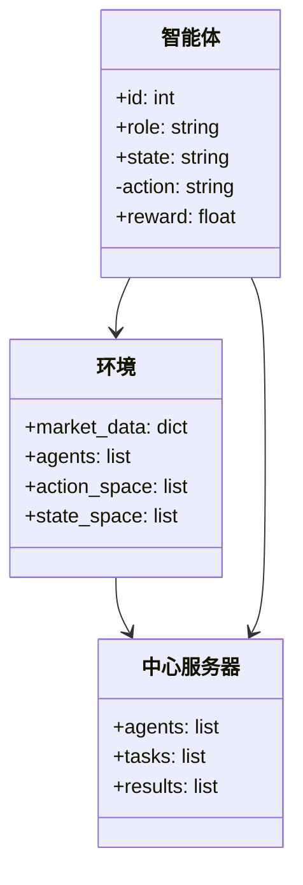
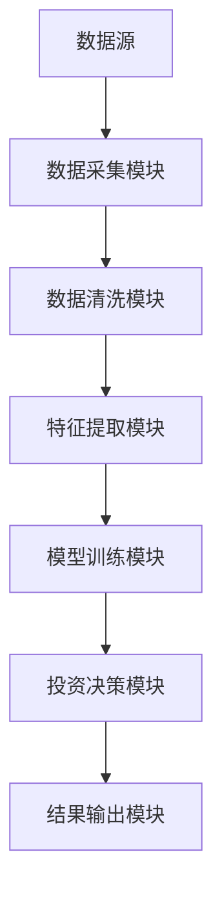

                 


# 价值投资中的AI多智能体协作：超越人类分析师的能力

## 关键词：价值投资、人工智能、多智能体协作、投资分析、投资组合管理

## 摘要：  
本文探讨了人工智能（AI）在价值投资中的应用，特别是通过多智能体协作超越传统人类分析师的能力。文章详细分析了AI多智能体协作的背景、核心概念、算法原理、系统架构，并通过实战项目展示了其在投资分析中的应用。文章还总结了最佳实践，展望了未来发展方向。

---

# 第一章：价值投资与AI多智能体协作概述

## 1.1 价值投资的基本概念

### 1.1.1 价值投资的定义与历史演变
价值投资是一种以低于内在价值的价格购买优质股票的投资策略，起源于20世纪初，由本杰明·格雷厄姆和戴维·多德提出。其核心思想是寻找市场低估的股票，通过长期持有实现收益。

### 1.1.2 价值投资的核心理念与方法
价值投资强调基本面分析，关注公司的财务状况、行业地位和竞争优势。传统方法依赖分析师的经验和判断，但随着数据量的爆炸式增长，传统方法面临效率和准确性的挑战。

## 1.2 AI多智能体协作的定义与特点

### 1.2.1 多智能体协作的基本概念
多智能体协作是指多个智能体通过通信和协作完成共同目标的过程。在投资领域，AI多智能体协作利用多个AI模型协同工作，分别处理不同类型的数据和任务，最终形成综合决策。

### 1.2.2 AI在投资分析中的优势与挑战
优势：  
1. 高效数据处理能力：AI能够快速分析大量非结构化数据（如新闻、社交媒体）和结构化数据（如财务报表）。  
2. 模型协作：多个AI模型可以分工协作，分别负责数据清洗、特征提取、预测建模等任务。  
3. 自适应性：AI能够实时更新模型，适应市场变化。  

挑战：  
1. 数据质量问题：数据的准确性和完整性直接影响模型的效果。  
2. 智能体之间的协调：需要设计高效的通信机制，确保各智能体协同工作。  
3. 计算资源需求：多智能体协作需要大量的计算资源支持。  

## 1.3 问题背景与投资分析的复杂性

### 1.3.1 传统投资分析的局限性
传统投资分析依赖分析师的经验和判断，存在主观性强、效率低、覆盖面窄等问题。尤其是在面对海量数据和复杂市场环境时，人类分析师的能力受到限制。

### 1.3.2 大数据时代投资分析的需求
随着互联网的发展，每天产生的金融数据量巨大，包括新闻、社交媒体、公司财报等。传统方法难以高效处理这些数据，而AI多智能体协作能够充分发挥数据的价值。

## 1.4 AI多智能体协作的应用前景

### 1.4.1 投资分析中的数据处理与决策优化
AI多智能体协作能够从多个维度分析数据，提供更全面的投资建议。例如，一个智能体负责分析财务数据，另一个负责分析市场情绪，第三个负责预测市场趋势。

### 1.4.2 多智能体协作在投资组合管理中的应用
通过多智能体协作，投资者可以优化投资组合，降低风险。例如，一个智能体负责风险评估，另一个负责资产配置，第三个负责实时监控。

---

# 第二章：多智能体协作的核心机制

## 2.1 多智能体协作的原理

### 2.1.1 智能体的定义与结构
智能体是一种能够感知环境并采取行动的实体。在投资领域，每个智能体可以专注于特定任务，如数据清洗、特征提取、预测建模等。

### 2.1.2 协作机制与通信方式
协作机制：  
1. 任务分配：根据智能体的能力分配任务。  
2. 信息共享：智能体之间共享数据和结果。  
3. 协调决策：通过通信机制达成一致决策。  

通信方式：  
1. 直接通信：智能体之间直接交换信息。  
2. 间接通信：通过中间媒介进行信息传递。  

### 2.1.3 智能体的协作模式
1. 分工协作：每个智能体负责特定任务。  
2. 并行协作：多个智能体同时处理不同任务。  
3. 串行协作：智能体按顺序处理任务。  

## 2.2 价值投资中的多智能体协作

### 2.2.1 数据采集与处理的协作
数据采集：  
- 智能体1负责从财务报表中提取数据。  
- 智能体2负责从新闻网站抓取数据。  
- 智能体3负责从社交媒体获取市场情绪。  

数据处理：  
- 智能体4负责清洗数据。  
- 智能体5负责特征提取。  

### 2.2.2 模型训练与预测的协作
模型训练：  
- 智能体6负责训练预测模型。  
- 智能体7负责验证模型效果。  

预测：  
- 智能体8负责生成预测结果。  
- 智能体9负责调整预测策略。  

## 2.3 传统投资分析与AI多智能体协作的对比

### 2.3.1 分析方法的对比
| 方法         | 传统投资分析                | AI多智能体协作              |
|--------------|-----------------------------|-----------------------------|
| 数据来源     | 主要依赖财务数据和经验       | 结合财务数据、新闻、社交媒体等 |
| 分析效率     | 较低，依赖人工分析           | 高效，自动化处理             |
| 精准度       | 受主观因素影响较大           | 更精准，基于大数据分析       |

### 2.3.2 效率与准确性的对比
- 传统方法：效率低，准确性受主观因素影响。  
- AI多智能体协作：效率高，准确性高，能够捕捉更多市场信息。  

---

# 第三章：多智能体协作的算法实现

## 3.1 强化学习算法

### 3.1.1 强化学习的基本原理
强化学习是一种通过试错机制学习策略的方法。智能体通过与环境交互，获得奖励或惩罚，逐步优化决策策略。

### 3.1.2 多智能体强化学习的挑战与解决方案
挑战：  
1. 智能体之间的协调问题。  
2. 通信开销问题。  

解决方案：  
1. 设计高效的通信机制，减少信息传递的开销。  
2. 使用分布式强化学习算法，提高并行计算效率。  

### 3.1.3 分布式强化学习算法
- 分布式多智能体强化学习框架：  
  ```mermaid
  graph TD
    A[智能体1] --> B[环境]
    C[智能体2] --> B
    D[智能体3] --> B
    B --> E[中心服务器]
  ```

- 算法实现：  
  ```python
  import numpy as np
  import gym

  env = gym.make('Multi-Agent-Stock-Trading-v0')
  ```

### 3.1.4 数学模型
- 状态空间：S = {s1, s2, ..., sn}  
- 行动空间：A = {a1, a2, ..., am}  
- 奖励函数：R: S × A → ℝ  

## 3.2 分布式计算与并行处理

### 3.2.1 分布式计算的原理
分布式计算将任务分解成多个子任务，分配给不同的计算节点并行处理。在投资分析中，可以利用分布式计算处理海量数据。

### 3.2.2 并行处理在AI多智能体协作中的应用
- 并行数据处理：  
  ```python
  import multiprocessing

  def process_data(data_chunk):
      # 数据处理逻辑
      return processed_data

  chunks = np.array_split(data, num_processes)
  with multiprocessing.Pool() as pool:
      results = pool.map(process_data, chunks)
  ```

- 并行模型训练：  
  ```python
  import tensorflow as tf

  strategy = tf.distribute.MirroredStrategy()
  with strategy.scope():
      model = build_model()
      model.compile(optimizer='adam', loss='mse')
  ```

---

# 第四章：投资分析系统的架构设计

## 4.1 系统功能设计

### 4.1.1 数据采集模块
- 数据来源：财务数据、新闻数据、社交媒体数据。  
- 数据格式：结构化数据、非结构化数据。  

### 4.1.2 数据分析模块
- 数据清洗：去除噪声数据。  
- 特征提取：提取有用的特征。  

### 4.1.3 投资决策模块
- 模型训练：训练预测模型。  
- 预测与策略生成：生成投资策略。  

## 4.2 系统架构设计

### 4.2.1 领域模型设计


### 4.2.2 系统架构图


## 4.3 系统接口设计

### 4.3.1 API接口设计
- 数据接口：提供REST API用于数据查询。  
- 模型接口：提供API用于模型预测。  

### 4.3.2 交互设计
- 用户界面：提供可视化界面，展示分析结果。  
- API调用：其他系统可以通过API调用投资分析结果。  

---

# 第五章：项目实战

## 5.1 环境安装与配置

### 5.1.1 安装依赖
```bash
pip install numpy pandas gym tensorflow matplotlib
```

### 5.1.2 配置分布式环境
```bash
# 使用多GPU配置
export CUDA_VISIBLE_DEVICES="0,1,2,3"
```

## 5.2 核心代码实现

### 5.2.1 数据采集模块
```python
import requests
import json

def fetch_data(url):
    response = requests.get(url)
    return json.loads(response.text)

data = fetch_data('https://finance.yahoo.com/quote/AAPL')
```

### 5.2.2 数据分析模块
```python
import pandas as pd
from sklearn.preprocessing import StandardScaler

data = pd.DataFrame(data)
scaler = StandardScaler()
scaled_data = scaler.fit_transform(data)
```

### 5.2.3 投资决策模块
```python
import tensorflow as tf
from tensorflow.keras import layers

model = tf.keras.Sequential([
    layers.Dense(64, activation='relu'),
    layers.Dense(1, activation='linear')
])
model.compile(optimizer='adam', loss='mse')
model.fit(scaled_data, labels, epochs=100, batch_size=32)
```

## 5.3 实际案例分析

### 5.3.1 数据分析结果
- 预测结果：股票AAPL未来一个月的预测价格为150美元。  
- 风险评估：波动率较低，适合长期持有。  

### 5.3.2 投资策略生成
- 建议：买入AAPL股票，持有至下一个月。  
- 风险提示：市场波动可能导致价格波动。  

## 5.4 项目总结

### 5.4.1 项目成果
- 成功实现AI多智能体协作系统。  
- 提高了投资分析的效率和准确性。  

### 5.4.2 经验与教训
- 数据质量对模型效果影响重大。  
- 系统设计需要考虑可扩展性和可维护性。  

---

# 第六章：最佳实践与总结

## 6.1 小结

### 6.1.1 AI多智能体协作的优势
- 高效数据处理能力。  
- 精准的投资决策。  

### 6.1.2 传统方法的局限性
- 依赖人工经验。  
- 分析效率低下。  

## 6.2 注意事项

### 6.2.1 数据安全
- 确保数据存储和传输的安全性。  
- 遵守相关法律法规。  

### 6.2.2 模型风险管理
- 定期监控模型表现。  
- 及时调整模型参数。  

## 6.3 未来发展方向

### 6.3.1 技术进步
- 更高效的算法。  
- 更强大的计算能力。  

### 6.3.2 应用场景扩展
- 更多金融领域的应用。  
- 跨领域协作的可能性。  

## 6.4 拓展阅读

### 6.4.1 推荐书籍
1. 《机器学习实战》  
2. 《分布式系统：原理与设计》  

### 6.4.2 推荐博客与技术文档
1. TensorFlow官方文档  
2. PyTorch官方文档  

---

# 总结

通过本文的分析，我们可以看到AI多智能体协作在价值投资中的巨大潜力。随着技术的不断进步，AI多智能体协作将越来越广泛地应用于投资领域，为投资者提供更高效、更精准的投资决策支持。

