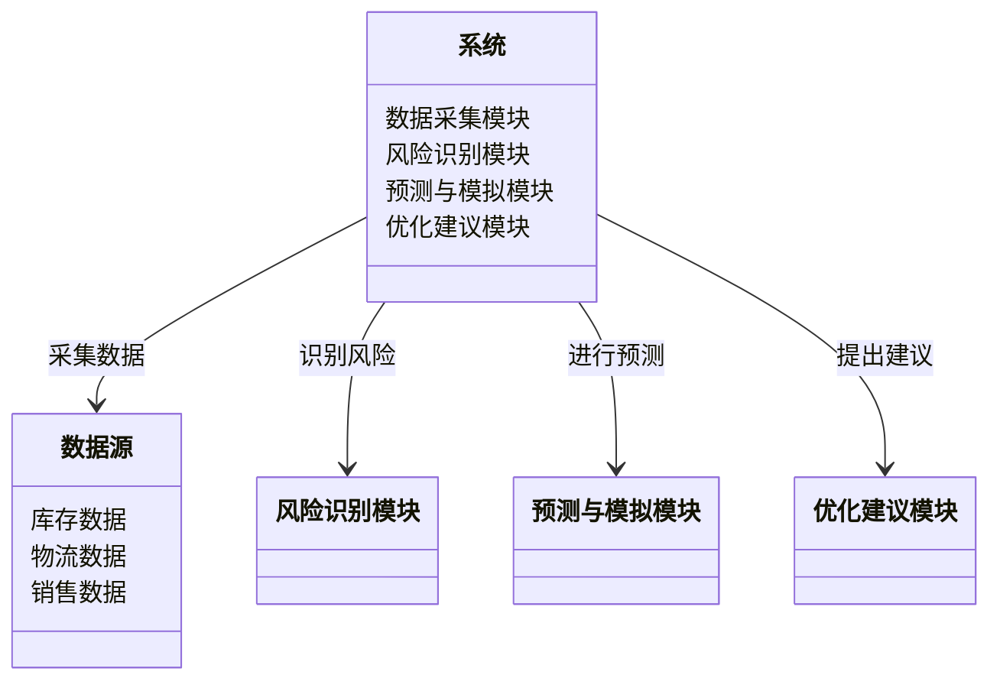

                 


# 价值投资中的AI驱动供应链韧性评估：多智能体协作

> 关键词：价值投资，供应链韧性，AI驱动，多智能体协作，供应链优化，强化学习

> 摘要：本文探讨了如何利用人工智能技术，特别是多智能体协作方法，来评估和增强供应链的韧性，从而优化价值投资决策。文章从供应链韧性评估的基本概念入手，分析了AI驱动的方法，详细讲解了基于强化学习的多智能体协作算法，并通过系统设计和项目实战展示了如何在实际场景中应用这些技术。

---

## 第一部分: 价值投资中的供应链韧性评估背景与概念

### 第1章: 供应链韧性评估的基本概念

#### 1.1 供应链韧性评估的定义与重要性

供应链韧性是衡量供应链在面对突发事件（如疫情、自然灾害、原材料短缺等）时的应对和恢复能力。一个具有韧性的供应链能够快速调整策略，减少中断对业务的影响。在价值投资中，供应链韧性是评估企业长期竞争力和投资价值的重要指标。

**问题背景与挑战**  
传统的供应链管理依赖人工经验，难以应对复杂多变的市场环境。现代供应链面临着全球化分工、物流复杂性和需求波动加剧等问题。突发事件可能导致供应链中断，对企业财务和声誉造成重大损失。因此，如何利用新技术（如AI）提高供应链的预测能力、应对能力和恢复能力，成为投资决策中的关键问题。

**问题解决与边界**  
AI技术可以通过数据分析和预测建模，帮助企业在供应链中断前识别风险，并制定应对策略。然而，AI模型需要依赖高质量的数据和合理的假设条件，且模型的可解释性和实时性也是需要解决的问题。

**核心要素与概念图**  
供应链韧性评估的核心要素包括：  
1. **供应链结构**：包括供应商、制造商、分销商、零售商等节点。  
2. **风险因素**：如自然灾害、疫情、原材料短缺等。  
3. **响应机制**：包括库存调整、供应商替换、物流优化等。  
4. **评估指标**：如响应时间、成本增加、订单完成率等。

以下是一个供应链韧性评估的概念图（使用mermaid）：

```mermaid
graph TD
    A[供应链结构] --> B[供应商]
    A --> C[制造商]
    A --> D[分销商]
    A --> E[零售商]
    B --> F[原材料]
    C --> G[生产]
    D --> H[物流]
    E --> I[客户]
    F -->>|风险因素| G
    G -->>|响应机制| H
    H -->>|评估指标| I
```

---

### 第2章: 多智能体协作在供应链管理中的应用

#### 2.1 多智能体协作的基本概念

多智能体协作是指多个智能体（Agent）在共同目标下协同工作的过程。在供应链管理中，智能体可以是软件系统的一部分，负责监控库存、优化物流或协调供应商。

**多智能体协作的优势**  
1. **分布式决策**：每个智能体独立决策，减少集中控制的复杂性。  
2. **任务分配**：智能体可以根据当前状态动态分配任务，提高效率。  
3. **实时响应**：智能体能够快速响应突发事件，减少中断时间。

**多智能体协作的挑战**  
1. **通信延迟**：智能体之间的通信可能带来延迟，影响实时性。  
2. **冲突与协调**：多个智能体可能有不同的目标，需要协调以避免冲突。  
3. **模型复杂性**：多智能体系统的建模和优化较为复杂。

---

## 第二部分: AI驱动的供应链韧性评估方法

### 第3章: 供应链网络分析与建模

#### 3.1 供应链网络的结构分析

供应链网络由多个节点和边组成，节点代表企业或组织，边代表供应链关系。通过网络分析，可以识别关键节点和潜在风险点。

**供应链网络的层次结构**  
供应链通常分为三层：  
1. **供应商层**：提供原材料和服务的供应商。  
2. **生产层**：负责生产产品的制造商。  
3. **分销层**：包括分销商和零售商，负责将产品交付给最终客户。

**供应链网络的动态特性**  
供应链网络是动态变化的，受到市场波动、政策变化和突发事件的影响。AI技术可以帮助实时更新网络模型，捕捉这些变化。

---

### 第4章: 基于强化学习的多智能体协作算法

#### 4.1 强化学习的基本原理

强化学习是一种机器学习方法，通过智能体与环境的交互，学习最优策略。在供应链管理中，强化学习可以用于库存管理、物流优化等任务。

**强化学习的数学模型**  
强化学习的核心是Q-learning算法，定义如下：  
$$ Q(s, a) = r + \gamma \max_{a'} Q(s', a') $$
其中，$s$是当前状态，$a$是动作，$r$是奖励，$\gamma$是折扣因子。

**多智能体协作的强化学习框架**  
在多智能体协作中，每个智能体都有自己的策略网络，通过共享状态和动作信息，实现协作。

---

### 第5章: 供应链韧性评估的系统设计与实现

#### 5.1 系统功能设计

供应链韧性评估系统需要具备以下功能：  
1. **数据采集**：收集供应链各环节的数据，如库存、物流、销售等。  
2. **风险识别**：识别潜在风险，如供应商延迟、物流中断等。  
3. **预测与模拟**：预测供应链中断的可能性，并模拟应对策略。  
4. **优化建议**：根据模拟结果，提出优化建议，如增加备件库存、更换供应商等。

**系统功能设计的领域模型（mermaid类图）**  



---

## 第三部分: 项目实战与优化建议

### 第6章: 项目实战

#### 6.1 环境搭建与数据采集

**环境搭建**  
需要安装Python、TensorFlow、Keras等库。  

**数据采集**  
从企业ERP系统或公开数据源获取供应链数据，如库存、物流、销售等。

#### 6.2 核心代码实现

**强化学习算法实现**  

```python
import numpy as np
import gym

# 定义环境
class SupplyChainEnv(gym.Env):
    def __init__(self):
        super().__init__()
        self.state = 0  # 状态空间：0表示正常，1表示中断
        self.action_space = gym.spaces.Discrete(2)  # 动作空间：0表示不采取行动，1表示采取行动
        self.observation_space = gym.spaces.Discrete(2)  # 观察空间：0表示正常，1表示中断

    def step(self, action):
        # 状态转移
        if self.state == 0:
            if action == 0:
                self.state = 0
                reward = 1  # 正确决策
            else:
                self.state = 1
                reward = -1  # 错误决策
        else:
            if action == 0:
                self.state = 1
                reward = -1  # 错误决策
            else:
                self.state = 0
                reward = 1  # 正确决策
        return self.state, reward, False, {}

    def reset(self):
        self.state = 0
        return self.state
```

**训练过程**  

```python
env = SupplyChainEnv()
model = DQN(env.observation_space.n, env.action_space.n)
for episode in range(1000):
    state = env.reset()
    total_reward = 0
    while True:
        action = model.act(state)
        next_state, reward, done, _ = env.step(action)
        model.remember(state, action, reward, next_state, done)
        model.replay()
        state = next_state
        total_reward += reward
        if done:
            break
```

---

### 第7章: 总结与展望

#### 7.1 总结

本文探讨了如何利用AI技术，特别是多智能体协作方法，来评估和优化供应链韧性，从而支持价值投资决策。通过强化学习算法和系统设计，展示了如何在实际场景中实现供应链的智能化管理。

#### 7.2 展望

未来，随着AI技术的不断发展，供应链韧性评估将更加智能化和自动化。可以通过引入更多数据源、优化算法模型和提升系统的可解释性，进一步提高供应链的应对能力和投资价值。

---

通过以上内容，您可以系统地理解AI驱动的供应链韧性评估方法，并将其应用于实际投资决策中。

