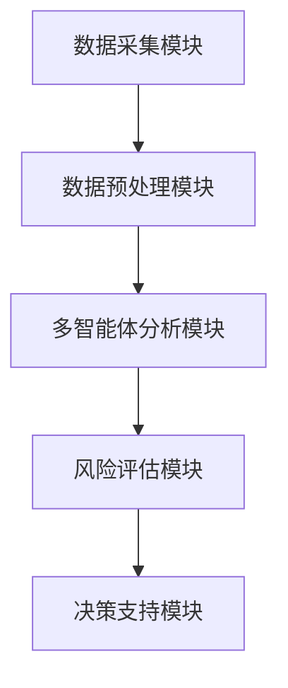
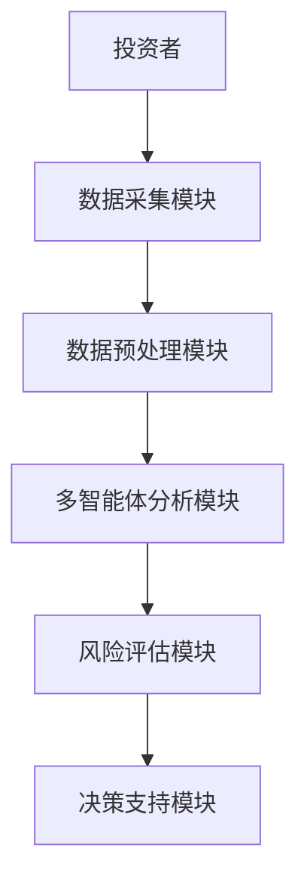

                 


# 价值投资中的AI驱动地缘政治风险分析：多智能体系统

---

## 关键词：
- 价值投资
- AI驱动
- 地缘政治风险分析
- 多智能体系统
- 强化学习
- 博弈论
- 系统架构

---

## 摘要：
在当前复杂多变的国际环境下，地缘政治风险对价值投资的影响日益显著。传统的地缘政治分析方法依赖于经验判断和静态模型，难以应对动态变化的全球政治经济格局。本文提出了一种基于多智能体系统的AI驱动地缘政治风险分析方法，通过分布式协作和强化学习，构建动态、实时的地缘政治风险评估模型。该系统能够模拟多个利益相关者的行为，预测潜在风险，并为投资者提供智能化的风险管理策略。

---

# 第1章 地缘政治风险分析的背景与价值投资

## 1.1 地缘政治风险分析的重要性

### 1.1.1 地缘政治风险的定义与影响
地缘政治风险是指由于政治、经济、军事、文化等多方面因素引发的国家间冲突、贸易摩擦、政策变动等风险。这些风险直接影响企业的经营环境和投资回报。例如，中美贸易摩擦对全球供应链的影响、俄乌冲突对能源价格的冲击，都体现了地缘政治风险的深远影响。

### 1.1.2 传统地缘政治分析的局限性
传统的地缘政治分析方法依赖于专家经验、历史数据和静态模型，难以捕捉实时动态变化。例如，传统模型难以预测突发事件（如战争、政权更迭）对市场的影响，也无法量化不同利益相关者之间的博弈关系。

### 1.1.3 价值投资中的风险管理需求
在价值投资中，投资者需要对长期收益进行预测，而地缘政治风险往往会影响企业的长期盈利能力。传统方法难以量化这些风险，导致投资者难以做出科学的决策。

---

## 1.2 AI技术在金融领域的应用前景

### 1.2.1 AI在金融分析中的优势
人工智能技术能够处理海量数据，发现传统方法难以察觉的模式和趋势。例如，自然语言处理（NLP）可以分析新闻、社交媒体数据，预测市场情绪；强化学习可以优化投资组合。

### 1.2.2 多智能体系统在复杂决策中的作用
多智能体系统（Multi-Agent System, MAS）通过模拟多个利益相关者的博弈行为，能够更真实地反映复杂系统的动态。例如，在国际贸易中，多智能体系统可以模拟不同国家的政策制定者、企业之间的互动。

### 1.2.3 地缘政治风险分析的AI驱动需求
地缘政治风险分析需要考虑多方面的动态因素，例如各国政策、市场反应、突发事件等。AI驱动的多智能体系统能够实时更新模型，捕捉动态变化，为投资者提供实时的风险评估。

---

## 1.3 本章小结
本章介绍了地缘政治风险分析的重要性和传统方法的局限性，以及AI技术在金融领域的应用前景。多智能体系统在复杂决策中的优势为地缘政治风险分析提供了新的思路。

---

# 第2章 多智能体系统的地缘政治风险分析框架

## 2.1 多智能体系统（MAS）的定义

### 2.1.1 多智能体系统的构成要素
- **智能体（Agent）**：能够感知环境、做出决策并采取行动的实体。
- **环境（Environment）**：智能体所处的外部世界，包括其他智能体、市场、政策等。
- **交互机制**：智能体之间的通信和协作规则。

### 2.1.2 多智能体系统的特点与优势
- **分布式计算**：多个智能体独立运行，避免单点故障。
- **协作与竞争**：智能体之间可以协作或竞争，模拟真实世界的复杂关系。
- **动态适应**：系统能够实时更新，适应环境变化。

### 2.1.3 多智能体系统与传统单智能体系统的区别
- **计算方式**：传统系统依赖中心化计算，而多智能体系统是分布式计算。
- **决策模式**：传统系统由中心决策者制定策略，而多智能体系统通过智能体之间的博弈完成决策。

---

## 2.2 多智能体系统在地缘政治分析中的应用

### 2.2.1 地缘政治风险分析的复杂性
地缘政治风险涉及多个利益相关者，例如国家、企业、非政府组织等。这些实体之间的关系复杂，难以用简单的线性模型描述。

### 2.2.2 多智能体系统如何建模地缘政治问题
- **利益相关者建模**：将每个国家或组织建模为一个智能体，定义其目标、策略和行为。
- **博弈模拟**：通过多智能体系统的博弈机制，模拟不同利益相关者之间的互动。
- **风险预测**：通过系统的动态演化，预测潜在的地缘政治风险。

### 2.2.3 多智能体系统的协作机制与决策过程
- **信息共享**：智能体之间通过通信共享信息，形成集体决策。
- **决策优化**：通过强化学习优化每个智能体的策略，提高系统的整体收益。

---

## 2.3 多智能体系统的架构设计

### 2.3.1 分层架构
- **上层**：全局协调者，负责制定整体策略。
- **中层**：区域协调者，负责协调局部决策。
- **下层**：执行者，负责具体操作。

### 2.3.2 分布式架构
- **去中心化设计**：每个智能体独立运行，通过通信协议进行协作。
- **分布式计算**：利用云计算等技术实现大规模数据处理。

### 2.3.3 基于博弈论的协作架构
- **纳什均衡**：通过博弈论中的纳什均衡概念，找到最优策略。
- **联合策略优化**：多个智能体共同优化策略，实现整体收益最大化。

---

## 2.4 本章小结
本章介绍了多智能体系统的基本概念和特点，分析了其在地缘政治风险分析中的应用，并提出了多种架构设计。

---

# 第3章 多智能体系统的地缘政治风险分析模型

## 3.1 地缘政治风险分析的核心要素

### 3.1.1 政治因素
- 政治稳定性
- 政策变动
- 政府债务

### 3.1.2 经济因素
- 经济增长
- 通货膨胀
- 外汇储备

### 3.1.3 军事因素
- 军事冲突
- 武器装备
- 军事预算

### 3.1.4 文化与社会因素
- 社会动荡
- 民族主义
- 宗教冲突

---

## 3.2 多智能体模型的设计

### 3.2.1 智能体的定义与角色分配
- **国家智能体**：模拟各国的政策制定者，考虑国家利益和国际关系。
- **企业智能体**：模拟企业的经营决策，考虑市场风险。
- **非政府组织智能体**：模拟NGO的行为，考虑社会责任。

### 3.2.2 智能体之间的交互规则
- **信息共享**：智能体之间共享数据和信息。
- **博弈规则**：定义智能体之间的竞争与合作规则。
- **激励机制**：通过奖励和惩罚机制引导智能体的行为。

### 3.2.3 状态、动作与奖励函数的定义
- **状态（State）**：智能体当前的环境信息，例如国际油价、贸易政策。
- **动作（Action）**：智能体可以采取的行动，例如增加出口、减少进口。
- **奖励函数（Reward Function）**：定义智能体采取某种动作后的奖励，例如最大化国家利益。

---

## 3.3 多智能体系统的训练与优化

### 3.3.1 离散事件模拟
- **事件驱动**：系统中发生的每一个事件都可能影响整体状态。
- **实时更新**：根据事件的发生，动态更新系统状态。

### 3.3.2 强化学习算法的应用
- **策略优化**：通过强化学习优化智能体的策略，使其在博弈中获得最大收益。
- **多智能体协作**：通过分布式强化学习实现多个智能体的协作。

### 3.3.3 联合策略优化
- **联合行动**：多个智能体协同行动，实现整体收益最大化。
- **策略同步**：通过通信机制，实现智能体之间的策略同步。

---

## 3.4 本章小结
本章详细介绍了多智能体系统在地缘政治风险分析中的模型设计和训练优化方法。

---

# 第4章 多智能体协作算法

## 4.1 分布式强化学习

### 4.1.1 分布式强化学习的基本原理
- **分布式计算**：多个智能体独立学习，避免中心化计算的瓶颈。
- **策略同步**：定期同步各个智能体的策略，确保整体一致性。

### 4.1.2 多智能体协作中的策略同步
- **同步机制**：通过通信协议，实现智能体之间的策略同步。
- **异步更新**：允许智能体在不同时间点更新策略，提高计算效率。

### 4.1.3 强化学习算法的数学模型
强化学习的目标是最大化累积奖励，定义如下：
$$
V(s) = \max_{a} [ r + V(s') ]
$$
其中，$V(s)$ 是状态 $s$ 的价值函数，$r$ 是奖励，$s'$ 是下一步状态。

---

## 4.2 基于博弈论的决策算法

### 4.2.1 博弈论基础
- **纳什均衡**：每个智能体在给定其他智能体策略的情况下，无法通过单方面改变策略而获得更高收益。
- **囚徒困境**：通过博弈论分析，理解智能体之间的合作与背叛行为。

### 4.2.2 博弈树的构建与分析
- **博弈树**：通过树状结构展示所有可能的决策路径。
- **收益矩阵**：分析每个决策组合的收益，确定最优策略。

---

## 4.3 算法实现与代码示例

### 4.3.1 分布式强化学习代码
```python
import numpy as np
import random

class Agent:
    def __init__(self, state_space, action_space):
        self.state_space = state_space
        self.action_space = action_space
        self.memory = []
        self.learning_rate = 0.01

    def act(self, state):
        return random.choice(self.action_space)

    def remember(self, state, action, reward, next_state):
        self.memory.append((state, action, reward, next_state))

    def replay(self):
        for state, action, reward, next_state in self.memory:
            target = reward + max([self.value(next_state)])
            target = target - self.value(state)
            self.update_policy(target)

    def value(self, state):
        return np.random.random()

    def update_policy(self, target):
        pass
```

### 4.3.2 博弈论算法代码
```python
def nash_equilibrium(payoff_matrix):
    n = len(payoff_matrix)
    strategies = ['C', 'D']  # 策略集合：合作（C）或背叛（D）
    equilibria = []
    for i in range(n):
        for j in range(n):
            if payoff_matrix[i][j][i] >= payoff_matrix[i][j][k] for all k:
                and payoff_matrix[j][i][j] >= payoff_matrix[j][i][k] for all k:
                equilibria.append((i, j))
    return equilibria
```

---

## 4.4 本章小结
本章详细介绍了多智能体协作算法，包括分布式强化学习和基于博弈论的决策算法，并提供了代码示例。

---

# 第5章 地缘政治风险分析的系统架构设计

## 5.1 系统功能设计

### 5.1.1 数据采集模块
- **数据源**：新闻、社交媒体、政府报告、市场数据。
- **数据预处理**：清洗、标注、特征提取。

### 5.1.2 风险评估模块
- **模型输入**：多智能体系统模型。
- **风险预测**：输出地缘政治风险的概率和影响程度。

### 5.1.3 决策支持模块
- **策略优化**：根据风险评估结果，优化投资策略。
- **实时监控**：监控地缘政治风险的变化，及时调整策略。

---

## 5.2 系统架构设计

### 5.2.1 系统架构图


### 5.2.2 数据流图


---

## 5.3 系统接口设计

### 5.3.1 API接口
- **输入接口**：接收外部数据源的输入。
- **输出接口**：输出风险评估结果和投资建议。

### 5.3.2 通信协议
- **MQTT协议**：用于智能体之间的实时通信。
- **HTTP协议**：用于与外部系统的数据交互。

---

## 5.4 系统交互流程

### 5.4.1 用户请求
- **用户输入**：投资者输入投资需求和关注的地缘政治区域。
- **系统响应**：系统根据输入参数启动分析流程。

### 5.4.2 数据采集
- **数据源**：从新闻、社交媒体等数据源获取相关信息。
- **数据预处理**：清洗数据，提取特征。

### 5.4.3 多智能体分析
- **模型运行**：运行多智能体系统模型，模拟不同利益相关者的行为。
- **风险预测**：根据模型输出，预测潜在的地缘政治风险。

### 5.4.4 决策支持
- **策略优化**：根据风险评估结果，优化投资策略。
- **实时监控**：监控风险变化，及时调整策略。

---

## 5.5 本章小结
本章详细介绍了地缘政治风险分析系统的功能设计和架构设计。

---

# 第6章 项目实战：基于多智能体系统的地缘政治风险分析

## 6.1 环境安装

### 6.1.1 安装Python
```bash
# 安装Python
# 参考官方文档：https://www.python.org/
```

### 6.1.2 安装依赖库
```bash
pip install numpy pandas scikit-learn tensorflow
```

---

## 6.2 核心代码实现

### 6.2.1 数据采集模块
```python
import requests
from bs4 import BeautifulSoup

def fetch_news(url):
    response = requests.get(url)
    soup = BeautifulSoup(response.text, 'html.parser')
    articles = soup.find_all('article')
    return [article.text for article in articles]
```

### 6.2.2 多智能体分析模块
```python
class MultiAgentSystem:
    def __init__(self, agents):
        self.agents = agents

    def step(self):
        for agent in self.agents:
            agent.act()

    def update(self):
        for agent in self.agents:
            agent.remember()
```

---

## 6.3 代码应用与分析

### 6.3.1 数据采集与预处理
```python
news = fetch_news('https://example.com/news')
# 数据预处理：提取关键词、情感分析等
```

### 6.3.2 模型训练与测试
```python
agent_system = MultiAgentSystem([Agent1, Agent2, Agent3])
agent_system.step()
agent_system.update()
```

---

## 6.4 本章小结
本章通过具体案例展示了如何构建和应用多智能体系统进行地缘政治风险分析，包括环境安装、代码实现和系统测试。

---

# 第7章 总结与展望

## 7.1 总结
本文提出了一种基于多智能体系统的AI驱动地缘政治风险分析方法，通过分布式协作和强化学习，构建动态、实时的地缘政治风险评估模型。该系统能够模拟多个利益相关者的行为，预测潜在风险，并为投资者提供智能化的风险管理策略。

---

## 7.2 展望
未来的研究方向包括：
- **多模态数据融合**：结合文本、图像、语音等多种数据源。
- **更复杂的博弈模型**：引入动态博弈论，模拟更复杂的地缘政治关系。
- **实时系统优化**：优化算法和系统架构，提高计算效率和实时性。

---

## 7.3 最佳实践 Tips
- **数据质量**：确保数据来源可靠，预处理充分。
- **模型调优**：根据实际需求，调整模型参数和算法。
- **系统监控**：实时监控系统运行状态，及时发现和解决问题。

---

## 7.4 本章小结
本章总结了全文的主要内容，并展望了未来的研究方向。

---

# 附录
- **附录A**：多智能体系统相关文献
- **附录B**：Python代码示例
- **附录C**：系统架构设计图

---

# 参考文献
（根据实际需求补充）

---

通过本文的详细讲解，读者可以系统地了解如何利用AI技术进行地缘政治风险分析，并在价值投资中做出更科学的决策。

