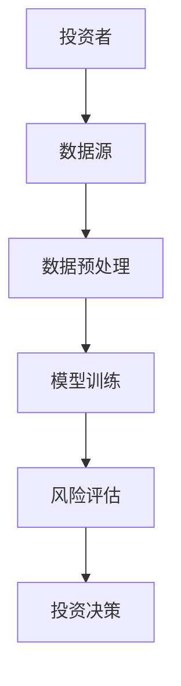

                 


# 价值投资中的AI驱动技术颠覆风险评估：多智能体协作

## 关键词：价值投资、AI驱动技术、风险评估、多智能体协作、金融分析、数学模型

## 摘要：  
在金融领域，价值投资与AI技术的结合正变得越来越紧密。AI驱动技术，尤其是多智能体协作，正在颠覆传统的风险评估方法。本文将详细探讨AI驱动技术在价值投资中的应用，分析多智能体协作在风险评估中的优势与挑战，并通过数学模型和实际案例，展示如何利用多智能体协作提升风险评估的准确性与效率。本文还将提供系统架构设计和项目实战指导，帮助读者更好地理解和应用这些技术。

---

# 第一部分：价值投资中的AI驱动技术颠覆风险评估背景

## 第1章：价值投资与AI驱动技术的结合

### 1.1 价值投资的定义与核心理念

#### 1.1.1 价值投资的基本概念  
价值投资是一种投资策略，强调以低于内在价值的价格买入优质资产。其核心在于识别市场低估的股票，并长期持有，等待其价值回归。

#### 1.1.2 价值投资的核心理念与方法  
价值投资的核心理念包括：  
1. 市场先生理论：市场情绪波动会导致价格偏离内在价值。  
2. 安全边际：买入价格与内在价值的差距提供安全边际，降低风险。  
3. 长期视角：关注企业的长期盈利能力，而非短期价格波动。  

#### 1.1.3 价值投资在现代金融中的地位与作用  
随着金融市场的复杂化，传统的价值投资方法面临数据量大、分析效率低的挑战。AI技术的引入，为价值投资提供了新的可能性。

### 1.2 AI驱动技术在金融领域的应用背景

#### 1.2.1 人工智能技术在金融领域的应用现状  
AI技术在金融领域的应用包括：  
1. 股票预测：利用机器学习模型分析历史数据，预测股票价格。  
2. 风险评估：通过AI模型识别和评估投资风险。  
3. 自动交易：利用算法进行高频交易，优化投资组合。  

#### 1.2.2 价值投资与AI技术结合的必然性  
价值投资需要大量数据支持和复杂分析，AI技术能够提高分析效率和准确性。AI技术可以辅助投资者发现市场低估的股票，并优化投资组合。

#### 1.2.3 多智能体协作在金融分析中的潜力  
多智能体协作能够同时处理多个数据源，结合不同模型的优势，提供更全面的分析结果。在价值投资中，多智能体协作可以用于风险评估、市场分析和投资决策。

### 1.3 多智能体协作在风险评估中的应用前景

#### 1.3.1 多智能体协作的基本概念  
多智能体协作是指多个智能体通过协同工作，共同完成复杂任务。在金融领域，多智能体可以分别负责数据收集、模型分析和结果优化。

#### 1.3.2 多智能体协作在风险评估中的优势  
1. 提高分析效率：多个智能体同时处理不同数据源，缩短分析时间。  
2. 优化结果准确性：结合多个模型的优势，提高风险评估的准确性。  
3. 增强适应性：智能体可以根据市场变化动态调整分析策略。  

#### 1.3.3 未来发展趋势与挑战  
1. 技术挑战：多智能体协作需要高效的通信机制和任务分配算法。  
2. 数据隐私：多智能体协作涉及大量数据，需要确保数据安全和隐私。  
3. 市场接受度：传统投资者可能对AI技术的可靠性持怀疑态度。  

---

## 第2章：AI驱动技术颠覆传统风险评估的核心概念

### 2.1 AI驱动技术的核心概念与原理

#### 2.1.1 AI驱动技术的基本原理  
AI驱动技术利用机器学习、深度学习等算法，从数据中提取特征，建立模型，进行预测和分析。

#### 2.1.2 AI在金融分析中的主要应用场景  
1. 股票预测：利用时间序列模型预测股票价格。  
2. 风险评估：通过分类模型识别高风险投资。  
3. 自动交易：利用算法进行高频交易。  

#### 2.1.3 多智能体协作的定义与特点  
多智能体协作是指多个智能体通过协同工作，共同完成复杂任务。其特点是：  
1. 分布式计算：多个智能体分别处理不同数据。  
2. 协作优化：通过智能体之间的协作，优化整体结果。  
3. 动态调整：根据环境变化动态调整协作策略。  

### 2.2 多智能体协作与传统单体AI系统的对比

#### 2.2.1 单体AI系统的优缺点  
优点：  
1. 简单高效：单个模型处理任务速度快。  
缺点：  
1. 依赖单个模型：可能遗漏重要信息。  
2. 鲍鱼性差：难以处理复杂任务。  

#### 2.2.2 多智能体协作系统的优缺点  
优点：  
1. 多维分析：多个智能体可以从不同角度分析问题。  
2. 结果优化：通过协作，结果更全面准确。  
缺点：  
1. 通信复杂：智能体之间的通信需要高效机制。  
2. 协调困难：需要解决任务分配和冲突问题。  

#### 2.2.3 两种系统在风险评估中的表现对比  
在风险评估中，多智能体协作系统能够同时分析多个数据源，结合不同模型的优势，提供更准确的结果。而单体系统可能因为数据有限而导致结果偏差。

### 2.3 风险评估的核心概念与模型

#### 2.3.1 风险评估的基本概念  
风险评估是指通过分析可能的风险来源，评估其对投资的影响，并制定相应的风险管理策略。

#### 2.3.2 传统风险评估模型的优缺点  
优点：  
1. 方法简单：易于理解和实施。  
缺点：  
1. 依赖历史数据：可能无法预测未来的变化。  
2. 忽略复杂性：难以处理多因素影响的情况。  

#### 2.3.3 基于AI的现代风险评估模型  
基于AI的现代风险评估模型利用机器学习算法，能够处理大量非结构化数据，提高预测准确性。例如，使用深度学习模型分析新闻数据，预测市场情绪变化。

---

## 第3章：多智能体协作在价值投资中的应用

### 3.1 多智能体协作的基本架构

#### 3.1.1 多智能体协作的基本架构组成  
多智能体协作系统包括以下组成部分：  
1. 智能体：负责具体任务的执行单元。  
2. 通信机制：智能体之间交换信息的渠道。  
3. 协作任务：系统需要完成的共同目标。  
4. 任务分配：智能体之间的任务分配机制。  

#### 3.1.2 各智能体之间的交互机制  
智能体之间的交互机制包括：  
1. 信息共享：智能体之间共享数据和分析结果。  
2. 协作决策：智能体共同制定决策策略。  
3. 动态调整：根据环境变化动态调整协作策略。  

#### 3.1.3 协作目标与任务分配  
协作目标是系统需要完成的任务，例如风险评估。任务分配是将任务分解为多个子任务，并分配给不同的智能体。

### 3.2 多智能体协作在价值投资中的具体应用

#### 3.2.1 数据收集与分析  
智能体1负责收集市场数据，智能体2负责分析财务数据，智能体3负责分析新闻数据。

#### 3.2.2 风险识别与评估  
通过多智能体协作，系统可以同时分析多个数据源，识别潜在风险，并评估其对投资的影响。

#### 3.2.3 投资决策支持  
多智能体协作系统可以提供全面的分析结果，帮助投资者制定最优的投资策略。

### 3.3 多智能体协作的优势与挑战

#### 3.3.1 多智能体协作的优势  
1. 多维分析：能够从多个角度分析问题。  
2. 高效协作：通过协作提高分析效率和准确性。  
3. 适应性强：能够根据环境变化动态调整策略。  

#### 3.3.2 多智能体协作的挑战  
1. 通信复杂：需要高效的通信机制。  
2. 协调困难：需要解决任务分配和冲突问题。  
3. 数据隐私：需要确保数据安全和隐私。  

#### 3.3.3 解决挑战的可能方向  
1. 优化通信机制：采用高效的通信协议。  
2. 分布式计算：利用分布式系统提高协作效率。  
3. 数据加密：采用加密技术保护数据隐私。  

---

## 第4章：AI驱动技术在风险评估中的数学模型与算法

### 4.1 传统风险评估模型的数学基础

#### 4.1.1 传统风险评估模型的数学公式  
传统的风险评估模型可以表示为：  
$$ R = f(X) $$  
其中，$R$ 表示风险，$X$ 是影响风险的变量。

#### 4.1.2 线性回归模型的应用  
线性回归模型可以用于预测股票价格：  
$$ y = \beta_0 + \beta_1 x_1 + \beta_2 x_2 + \ldots + \beta_n x_n $$  
其中，$y$ 是预测的股票价格，$x_i$ 是影响价格的因素，$\beta_i$ 是回归系数。

#### 4.1.3 贝叶斯网络的基本原理  
贝叶斯网络是一种概率模型，用于表示变量之间的概率关系。通过贝叶斯网络可以进行风险评估和预测。

### 4.2 基于AI的现代风险评估算法

#### 4.2.1 深度学习模型在风险评估中的应用  
深度学习模型，如卷积神经网络（CNN）和长短期记忆网络（LSTM），可以用于股票价格预测和风险评估。

#### 4.2.2 多智能体协作算法的基本原理  
多智能体协作算法通过智能体之间的协作，优化任务完成效果。例如，使用分布式计算技术，将任务分解为多个子任务，分别由不同的智能体完成。

#### 4.2.3 图神经网络在风险评估中的应用  
图神经网络可以用于分析复杂的金融网络，识别系统性风险。

### 4.3 多智能体协作算法的实现细节

#### 4.3.1 多智能体协作的数学模型  
多智能体协作的数学模型可以表示为：  
$$ f(x_i) = \sum_{i=1}^n f_i(x_i) $$  
其中，$f_i(x_i)$ 是智能体$i$的任务函数，$x_i$ 是输入数据。

#### 4.3.2 各智能体之间的通信机制  
智能体之间的通信机制包括：  
1. 信息共享：智能体之间共享数据和分析结果。  
2. 协作决策：智能体共同制定决策策略。  
3. 动态调整：根据环境变化动态调整协作策略。  

#### 4.3.3 协作任务的分配与优化  
任务分配是将任务分解为多个子任务，并分配给不同的智能体。优化任务分配可以通过遗传算法等方法实现。

---

## 第5章：系统分析与架构设计

### 5.1 问题场景介绍

#### 5.1.1 问题背景  
价值投资需要大量数据支持和复杂分析，传统方法效率低，准确性差。

#### 5.1.2 问题描述  
投资者需要一种高效、准确的工具来评估投资风险，优化投资决策。

#### 5.1.3 问题解决  
通过多智能体协作系统，实现高效、准确的风险评估。

#### 5.1.4 边界与外延  
系统的边界包括数据输入、模型训练和结果输出。外延包括系统的扩展和优化。

### 5.2 项目介绍

#### 5.2.1 项目目标  
开发一个多智能体协作系统，用于价值投资中的风险评估。

#### 5.2.2 项目范围  
系统的功能包括数据收集、模型训练和结果输出。

### 5.3 系统功能设计

#### 5.3.1 领域模型类图  
以下是系统的领域模型类图：



#### 5.3.2 系统架构设计  
以下是系统的架构设计：


### 5.4 系统接口设计

#### 5.4.1 系统接口设计  
系统的接口包括数据输入接口、模型训练接口和结果输出接口。

#### 5.4.2 系统交互流程图  
以下是系统的交互流程图：


---

## 第6章：项目实战

### 6.1 环境安装

#### 6.1.1 安装Python  
安装Python 3.8或更高版本。

#### 6.1.2 安装依赖库  
安装以下依赖库：  
1. TensorFlow  
2. Keras  
3. Scikit-learn  
4. Matplotlib  

### 6.2 系统核心实现源代码

#### 6.2.1 数据预处理代码  
```python
import pandas as pd
import numpy as np

# 读取数据
data = pd.read_csv('data.csv')

# 数据清洗
data = data.dropna()
data = pd.get_dummies(data)
```

#### 6.2.2 模型训练代码  
```python
from tensorflow.keras.models import Sequential
from tensorflow.keras.layers import Dense

# 构建模型
model = Sequential()
model.add(Dense(64, activation='relu', input_dim=len(data.columns)))
model.add(Dense(1, activation='sigmoid'))

# 编译模型
model.compile(optimizer='adam', loss='binary_crossentropy', metrics=['accuracy'])

# 训练模型
model.fit(data, labels, epochs=10, batch_size=32)
```

#### 6.2.3 风险评估代码  
```python
import pandas as pd
import numpy as np

# 读取数据
data = pd.read_csv('data.csv')

# 数据清洗
data = data.dropna()
data = pd.get_dummies(data)

# 模型预测
predictions = model.predict(data)

# 评估风险
for i in range(len(predictions)):
    if predictions[i] > 0.5:
        print("高风险")
    else:
        print("低风险")
```

### 6.3 实际案例分析与详细讲解

#### 6.3.1 案例背景  
某投资者希望评估一只股票的投资风险，利用多智能体协作系统进行分析。

#### 6.3.2 数据收集与分析  
智能体1负责收集市场数据，智能体2负责分析财务数据，智能体3负责分析新闻数据。

#### 6.3.3 模型训练与优化  
通过多智能体协作，系统对数据进行预处理，构建模型，训练并优化模型。

#### 6.3.4 投资决策支持  
系统提供全面的分析结果，帮助投资者制定最优的投资策略。

### 6.4 项目小结

#### 6.4.1 项目总结  
通过多智能体协作系统，投资者可以高效、准确地进行风险评估，优化投资决策。

#### 6.4.2 经验与教训  
在项目实施过程中，需要注意任务分配的优化和数据隐私的保护。

---

## 第7章：最佳实践、小结、注意事项与拓展阅读

### 7.1 最佳实践

#### 7.1.1 数据质量管理  
确保数据的准确性和完整性，避免数据偏差。

#### 7.1.2 模型优化  
定期优化模型，提高预测准确性和效率。

#### 7.1.3 数据隐私保护  
采用加密技术保护数据隐私，确保数据安全。

### 7.2 小结

通过本文的介绍，读者可以了解AI驱动技术在价值投资中的应用，特别是多智能体协作在风险评估中的优势与挑战。系统架构设计和项目实战部分，为读者提供了实际操作的指导。

### 7.3 注意事项

1. 数据隐私：在实际应用中，需要注意数据隐私保护，避免数据泄露。  
2. 模型优化：需要定期优化模型，提高预测准确性和效率。  
3. 任务分配：需要合理分配任务，提高协作效率。  

### 7.4 拓展阅读

1. 《机器学习实战》  
2. 《深度学习》  
3. 《分布式系统：原理与设计》  

---

# 结语

随着AI技术的不断发展，多智能体协作在价值投资中的应用前景广阔。通过本文的介绍，读者可以深入了解AI驱动技术在风险评估中的应用，掌握多智能体协作的核心概念和实现方法。希望本文能够为读者在价值投资中的AI驱动技术应用提供有价值的参考和指导。

