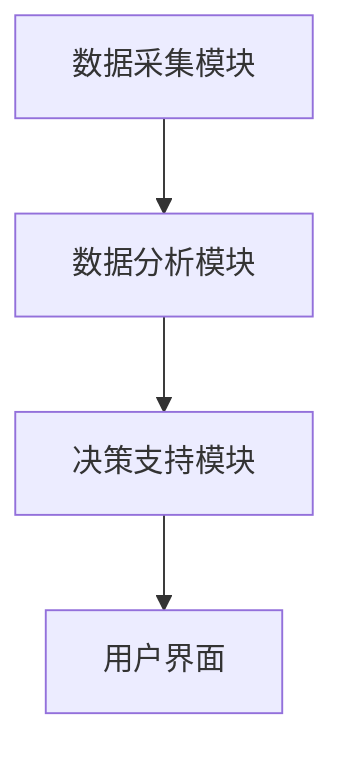
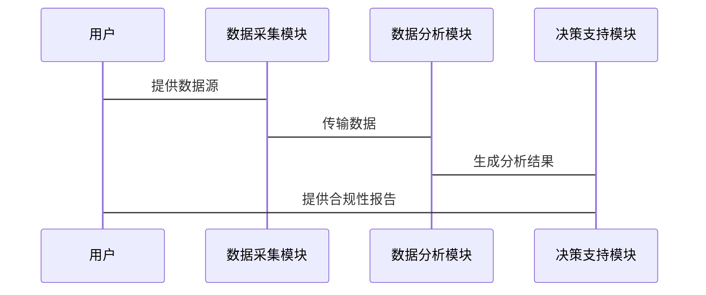

                 


# 价值投资中的AI驱动监管合规性分析：多智能体系统

## 关键词：价值投资、AI技术、监管合规性分析、多智能体系统、金融决策、风险控制

## 摘要：  
本文探讨了在价值投资中如何利用AI驱动的监管合规性分析，特别是在多智能体系统中的应用。通过分析多智能体系统的核心原理、算法实现和实际案例，本文展示了如何利用AI技术提高金融决策的准确性和合规性，同时降低风险。文章还详细介绍了系统的架构设计和项目实战，为读者提供了从理论到实践的全面指导。

---

# 第1章: 价值投资与AI技术的结合

## 1.1 价值投资的基本概念

### 1.1.1 价值投资的定义与核心理念  
价值投资是一种以基本面分析为基础的投资策略，旨在通过识别被市场低估的优质资产，长期持有以获得超额收益。其核心理念包括：  
1. **安全边际**：买入价格低于内在价值。  
2. **长期视角**：关注企业的长期盈利能力。  
3. **逆向思维**：在市场恐慌时寻找机会。  

### 1.1.2 价值投资在现代金融中的地位  
随着市场的复杂化和信息量的爆炸式增长，传统的价值投资方法逐渐暴露出效率低下、难以应对高频交易等问题。AI技术的引入为价值投资注入了新的活力，使其在现代金融市场中保持竞争力。

### 1.1.3 价值投资的策略与方法  
传统的价值投资策略包括：  
1. **基本面分析**：分析企业的财务报表、行业地位、竞争优势等。  
2. **估值指标**：如市盈率（P/E）、市净率（P/B）等。  
3. **分散投资**：通过分散投资降低风险。  

---

## 1.2 AI技术在金融领域的应用

### 1.2.1 AI技术的基本概念与特点  
人工智能（AI）通过模拟人类学习和推理能力，帮助计算机从数据中发现规律、做出决策。其特点包括：  
1. **数据驱动**：依赖大量数据进行学习。  
2. **自动化**：能够自动完成任务，减少人工干预。  
3. **适应性**：能够根据新数据进行调整和优化。  

### 1.2.2 AI在金融分析中的应用领域  
AI在金融领域的应用包括：  
1. **股票预测**：利用历史数据预测股票价格走势。  
2. **风险评估**：通过机器学习模型评估投资风险。  
3. **欺诈检测**：识别金融交易中的异常行为。  

### 1.2.3 AI驱动的金融决策优势  
AI的优势在于其处理复杂数据和快速决策的能力，能够帮助投资者在高频交易和大数据环境中捕捉机会。

---

## 1.3 监管合规性分析的重要性

### 1.3.1 监管合规性分析的定义  
监管合规性分析是指通过技术手段确保金融交易和投资行为符合相关法律法规的过程。  

### 1.3.2 监管合规性分析在金融中的作用  
1. **风险控制**：识别和规避违规行为。  
2. **合规性优化**：帮助机构提高合规效率。  
3. **透明化**：增强市场透明度，维护投资者信心。  

---

## 1.4 多智能体系统的基本概念

### 1.4.1 多智能体系统的定义与特点  
多智能体系统（Multi-Agent System, MAS）是由多个相互作用的智能体组成的系统，每个智能体都能独立决策并与其他智能体协作或竞争。  

### 1.4.2 多智能体系统的组成部分  
1. **智能体**：具有感知和决策能力的个体。  
2. **环境**：智能体所处的外部环境。  
3. **通信机制**：智能体之间的信息交互方式。  

### 1.4.3 多智能体系统在金融中的应用  
1. **高频交易**：多个智能体协同完成交易决策。  
2. **投资组合管理**：智能体协作优化投资组合。  
3. **风险控制**：通过多智能体实时监控和预警风险。  

---

## 1.5 本章小结  
本章介绍了价值投资的基本概念、AI技术在金融中的应用以及监管合规性分析的重要性。同时，详细阐述了多智能体系统的基本概念及其在金融领域的应用潜力，为后续章节的分析奠定了基础。

---

# 第2章: 多智能体系统的核心原理

## 2.1 多智能体系统的架构

### 2.1.1 分层架构  
分层架构将系统划分为多个层次，每个层次负责不同的功能。例如，感知层负责数据采集，决策层负责策略制定。

### 2.1.2 分布式架构  
分布式架构将任务分配给多个智能体，每个智能体负责部分任务，最终汇总结果。这种架构能够提高系统的并行处理能力。

### 2.1.3 集中式架构  
集中式架构由一个中央控制节点统一协调所有智能体的行动，适用于任务简单但需要统一决策的场景。

---

## 2.2 多智能体系统中的通信机制

### 2.2.1 智能体之间的通信方式  
1. **直接通信**：智能体之间直接交换信息。  
2. **间接通信**：通过中间媒介传递信息。  

### 2.2.2 通信协议的选择与设计  
选择合适的通信协议是确保智能体高效协作的关键。常见的通信协议包括HTTP、WebSocket等。

### 2.2.3 通信中的数据安全问题  
数据泄露和篡改是多智能体系统中的主要安全威胁，需要通过加密技术和访问控制来防范。

---

## 2.3 多智能体系统中的协作机制

### 2.3.1 协作任务分配  
通过任务分配算法将任务分配给最适合的智能体，例如基于智能体的能力和当前负载。

### 2.3.2 协作决策过程  
多个智能体共同参与决策过程，例如通过投票机制达成一致。

### 2.3.3 协作结果的评估与优化  
通过反馈机制评估协作效果，并不断优化协作策略。

---

## 2.4 多智能体系统的应用场景

### 2.4.1 金融交易中的多智能体系统  
例如，高频交易中多个智能体协同完成订单提交和执行。

### 2.4.2 投资组合管理中的多智能体系统  
多个智能体分别负责不同的资产类别，实时优化投资组合。

### 2.4.3 风险控制中的多智能体系统  
通过智能体实时监控市场动态，及时发现并预警风险。

---

## 2.5 本章小结  
本章详细介绍了多智能体系统的核心原理，包括其架构、通信机制、协作机制以及应用场景。这些内容为后续章节中AI驱动的监管合规性分析奠定了技术基础。

---

# 第3章: 监管合规性分析的AI驱动方法

## 3.1 监管合规性分析的基本流程

### 3.1.1 数据采集与预处理  
1. **数据来源**：包括历史交易数据、市场数据、财务报表等。  
2. **数据清洗**：去除噪声数据，确保数据质量。  

### 3.1.2 数据分析与特征提取  
1. **特征工程**：提取有助于模型预测的关键特征。  
2. **数据建模**：建立数学模型分析数据中的规律。  

### 3.1.3 数据建模与评估  
1. **模型选择**：选择适合的机器学习模型。  
2. **模型训练**：利用数据训练模型。  
3. **模型评估**：通过验证集评估模型性能。  

---

## 3.2 AI技术在监管合规性分析中的应用

### 3.2.1 机器学习在合规性分析中的应用  
1. **监督学习**：用于分类任务，例如识别违规交易。  
2. **无监督学习**：用于异常检测，发现潜在的违规行为。  

### 3.2.2 自然语言处理在合规性分析中的应用  
1. **文本挖掘**：分析财务报告和新闻，提取关键信息。  
2. **情感分析**：判断市场情绪，辅助决策。  

### 3.2.3 图神经网络在合规性分析中的应用  
1. **图结构数据**：例如企业之间的关联关系。  
2. **节点分类**：识别潜在的违规企业。  

---

## 3.3 多智能体系统在合规性分析中的优势

### 3.3.1 提高分析效率  
多智能体系统能够同时处理大量数据，显著提高分析效率。

### 3.3.2 增强分析精度  
通过多个智能体的协作，能够从多个角度分析问题，提高结果的准确性。

### 3.3.3 支持复杂场景下的决策  
多智能体系统能够在复杂场景下协调各方利益，做出最优决策。

---

## 3.4 本章小结  
本章探讨了AI技术在监管合规性分析中的应用，并重点分析了多智能体系统的优势。通过多智能体系统的协作，能够显著提高合规性分析的效率和准确性。

---

# 第4章: 多智能体系统的算法实现

## 4.1 算法原理

### 4.1.1 分层架构下的算法设计  
1. **感知层**：数据采集与预处理。  
2. **决策层**：基于数据的决策模型。  

### 4.1.2 分布式架构下的算法实现  
1. **任务分配**：利用分布式算法分配任务。  
2. **并行计算**：提高计算效率。  

### 4.1.3 集中式架构下的算法优化  
1. **集中决策**：统一协调各智能体的行动。  
2. **反馈优化**：根据结果调整决策策略。  

---

## 4.2 算法实现的代码示例

### 4.2.1 任务分配算法  
```python
def assign_tasks(agents, tasks):
    # 假设每个智能体的处理能力相同
    agents_per_task = len(agents) // len(tasks)
    assigned_tasks = []
    for i, task in enumerate(tasks):
        assigned_tasks.append((i % len(agents), task))
    return assigned_tasks
```

### 4.2.2 通信协议实现  
```python
import socket

def send_message(agent_id, message):
    # 假设使用TCP/IP协议
    host = 'localhost'
    port = 5000 + agent_id
    with socket.socket(socket.AF_INET, socket.SOCK_STREAM) as s:
        s.connect((host, port))
        s.sendall(message.encode())
```

---

## 4.3 算法的数学模型

### 4.3.1 任务分配模型  
$$ \text{任务分配问题} = \argmin_{x} \sum_{i=1}^{n} c_i x_i $$  

其中，$c_i$ 表示分配任务i的成本，$x_i$ 是0-1变量，表示是否分配任务i。

### 4.3.2 通信模型  
$$ \text{通信延迟} = \frac{d}{\text{带宽}} $$  

---

## 4.4 本章小结  
本章详细介绍了多智能体系统的算法实现，包括分层、分布式和集中式架构下的算法设计，并通过代码示例和数学模型展示了实现过程。

---

# 第5章: 监管合规性分析的系统架构设计

## 5.1 问题场景介绍

### 5.1.1 监管合规性分析的需求  
1. **实时监控**：需要实时分析交易数据，识别违规行为。  
2. **多维度分析**：需要结合市场数据、企业财务数据等多维度信息。  

### 5.1.2 系统目标  
1. 实现对金融交易的实时监管。  
2. 提供合规性分析的自动化解决方案。  

---

## 5.2 系统功能设计

### 5.2.1 数据采集模块  
1. **数据源**：包括交易数据、市场数据、财务报表等。  
2. **数据预处理**：清洗和转换数据。  

### 5.2.2 数据分析模块  
1. **特征提取**：提取有助于合规性分析的关键特征。  
2. **模型训练**：训练机器学习模型进行预测。  

### 5.2.3 决策支持模块  
1. **风险预警**：实时监控并预警风险。  
2. **合规性报告**：生成合规性分析报告。  

---

## 5.3 系统架构设计

### 5.3.1 系统架构图  


### 5.3.2 交互流程图  


---

## 5.4 本章小结  
本章详细介绍了监管合规性分析系统的架构设计，包括功能模块设计和系统架构图。通过系统化的架构设计，确保了系统的高效性和可扩展性。

---

# 第6章: 项目实战与案例分析

## 6.1 项目环境安装

### 6.1.1 安装Python环境  
1. 安装Python 3.8及以上版本。  
2. 安装必要的库，例如NumPy、Pandas、Scikit-learn等。  

### 6.1.2 安装机器学习框架  
1. 安装TensorFlow或PyTorch框架。  

---

## 6.2 系统核心实现

### 6.2.1 数据采集模块  
```python
import pandas as pd

def collect_data():
    # 假设数据存储在CSV文件中
    data = pd.read_csv('data.csv')
    return data
```

### 6.2.2 数据分析模块  
```python
from sklearn.model

