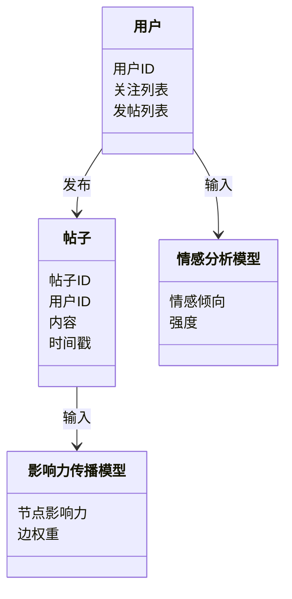
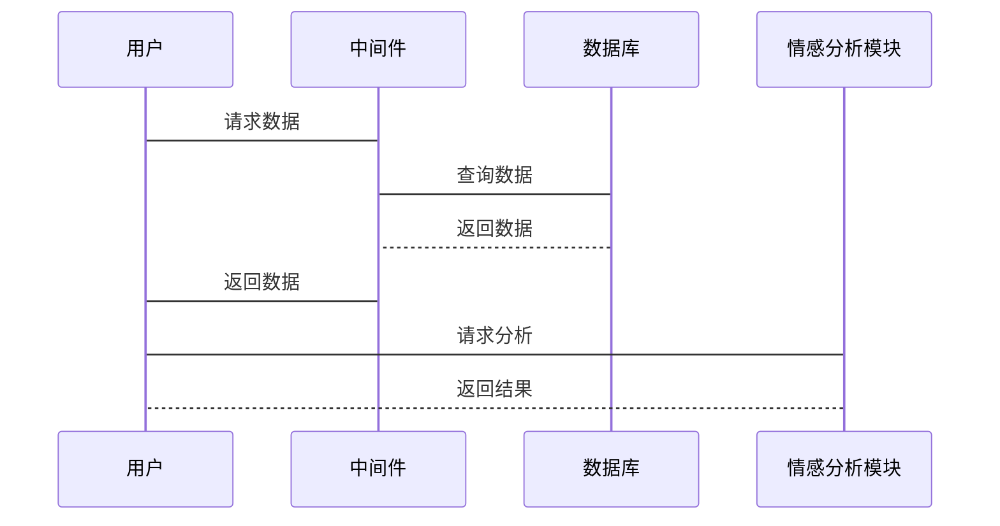

                 


# 价值投资中的AI驱动社交媒体影响力分析：多智能体系统

> 关键词：价值投资、AI技术、社交媒体影响力、多智能体系统、影响力传播模型、协同学习、系统架构设计

> 摘要：本文探讨了如何利用人工智能技术，通过社交媒体影响力分析来辅助价值投资决策。文章从价值投资的背景出发，分析了社交媒体数据在投资决策中的重要性，并提出了一种基于多智能体系统的分析方法。通过构建影响力传播模型和多智能体协同学习算法，本文详细阐述了如何从社交媒体数据中提取有用信息，优化投资策略，并构建了相应的系统架构。最后，文章通过实际案例展示了该方法的应用效果。

---

## 第1章：价值投资与社交媒体影响力分析的背景

### 1.1 价值投资的核心理念

价值投资是一种长期投资策略，强调以低于内在价值的价格买入优质资产。传统价值投资依赖于对企业基本面的分析，包括财务报表、行业地位等因素。然而，随着社交媒体的普及，投资者的行为和情绪对市场的影响日益显著，这为价值投资带来了新的挑战和机会。

#### 1.1.1 价值投资的定义与历史发展

- **定义**：价值投资是由本杰明·格雷厄姆和戴维·多德提出的投资策略，强调寻找市场低估的股票。
- **历史发展**：从20世纪初至今，价值投资经历了从传统基本面分析到结合市场情绪分析的演变。

#### 1.1.2 社会媒体在投资决策中的作用

- **信息传播**：社交媒体平台（如Twitter、Reddit）成为投资者交流的重要渠道，影响市场情绪。
- **实时互动**：投资者可以通过社交媒体实时获取市场动态，发现潜在投资机会。

#### 1.1.3 AI技术在金融分析中的潜力

- **数据处理能力**：AI能够快速处理海量社交媒体数据，提取有用信息。
- **模式识别**：通过机器学习算法，AI可以识别市场情绪变化和潜在的市场趋势。

### 1.2 问题背景与描述

社交媒体影响力分析在价值投资中的应用尚不成熟，存在以下问题：

#### 1.2.1 投资者如何利用社交媒体数据

- **数据采集**：如何高效采集社交媒体数据？
- **数据处理**：如何清洗和结构化社交媒体数据？
- **数据分析**：如何从社交媒体数据中提取有用的投资信号？

#### 1.2.2 社会媒体影响力对股价的影响

- **情绪传染**：社交媒体上的讨论可能影响市场情绪，进而影响股价。
- **信息不对称**：社交媒体上的信息可能未经过滤，存在虚假信息的风险。

#### 1.2.3 当前分析方法的局限性

- **传统方法的不足**：传统价值投资方法难以捕捉社交媒体上的非结构化数据。
- **人工分析的低效**：人工分析社交媒体数据耗时且效率低下。

### 1.3 问题解决思路

通过AI技术，我们可以实现社交媒体数据的自动化分析，构建影响力传播模型，并利用多智能体系统优化投资决策。

#### 1.3.1 数据驱动的分析方法

- **数据采集与清洗**：利用爬虫技术采集社交媒体数据，并进行预处理。
- **特征提取**：通过NLP技术提取文本中的情感特征和主题特征。

#### 1.3.2 AI技术的应用场景

- **情绪分析**：使用机器学习模型分析社交媒体上的情绪倾向。
- **趋势预测**：通过时间序列分析预测市场趋势。

#### 1.3.3 多智能体系统的协同优势

- **分布式计算**：多智能体系统可以并行处理大规模数据。
- **协同优化**：通过智能体之间的协作，优化投资决策。

### 1.4 边界与外延

#### 1.4.1 数据范围与限制

- **数据范围**：社交媒体数据包括文本、图片、视频等多种形式。
- **数据限制**：数据可能存在噪声和偏差，影响分析结果。

#### 1.4.2 系统适用的场景

- **适用场景**：适用于高频交易和情绪驱动的市场。
- **不适用场景**：适用于基本面稳定的市场。

#### 1.4.3 与其他投资策略的结合

- **结合技术分析**：将社交媒体分析与技术指标分析相结合。
- **结合基本面分析**：将社交媒体分析与财务报表分析相结合。

### 1.5 核心要素与概念结构

- **核心要素**：社交媒体数据、影响力传播模型、多智能体系统。
- **概念结构**：社交媒体数据输入到影响力传播模型中，通过多智能体系统优化投资决策。

---

## 第2章：社交媒体影响力分析的核心原理

### 2.1 社会媒体影响力分析的定义与特点

#### 2.1.1 影响力分析的定义

- **定义**：通过分析社交媒体上的数据，评估个体或组织对市场的影响力。

#### 2.1.2 数据特征与分析维度

- **数据特征**：文本数据、用户行为数据、网络结构数据。
- **分析维度**：情感分析、影响力传播、话题热度。

#### 2.1.3 与传统舆情分析的区别

- **传统舆情分析**：侧重于情感分析和热点话题识别。
- **影响力分析**：侧重于影响力传播和投资决策优化。

### 2.2 多智能体系统的概念与特点

#### 2.2.1 多智能体系统的定义

- **定义**：由多个智能体组成的分布式系统，通过协作完成任务。

#### 2.2.2 智能体的协作机制

- **协作机制**：通过通信协议实现智能体之间的信息交换和协作。

#### 2.2.3 系统的动态性与适应性

- **动态性**：系统能够实时响应数据变化。
- **适应性**：系统能够根据环境变化自适应调整。

### 2.3 核心概念对比与联系

#### 2.3.1 影响力分析与多智能体系统的关系

- **关系**：影响力分析是多智能体系统的应用之一。

#### 2.3.2 数据流与智能体行为的关联

- **关联**：数据流驱动智能体行为，智能体行为影响数据流。

#### 2.3.3 系统整体架构的优化

- **优化**：通过多智能体系统的协作，优化影响力分析的准确性和效率。

---

## 第3章：影响力传播模型的算法原理

### 3.1 算法原理概述

#### 3.1.1 基于图的传播模型

- **图模型**：将社交媒体数据建模为图结构。
- **传播机制**：通过图的遍历算法模拟影响力传播。

#### 3.1.2 智能体行为的建模方法

- **建模方法**：基于强化学习的智能体行为建模。
- **传播机制**：通过智能体的交互模拟影响力传播。

#### 3.1.3 算法的收敛性分析

- **收敛性分析**：分析算法是否收敛及其收敛速度。

### 3.2 算法实现流程

#### 3.2.1 数据预处理步骤

- **数据清洗**：去除噪声数据。
- **特征提取**：提取文本中的关键词和情感特征。

#### 3.2.2 智能体初始化与交互

- **智能体初始化**：为每个智能体分配初始状态。
- **智能体交互**：通过通信协议实现智能体之间的信息交换。

#### 3.2.3 结果计算与优化

- **结果计算**：计算影响力传播结果。
- **系统优化**：通过反馈机制优化智能体行为。

### 3.3 数学模型与公式

#### 3.3.1 影响力传播的公式推导

- **公式推导**：通过数学推导得到影响力传播的公式。
- **公式示例**：
  - $$P(i) = \sum_{j=1}^{n} P(j) \cdot A_{j,i}$$
  - 其中，$P(i)$ 表示节点 $i$ 的影响力，$A_{j,i}$ 表示节点 $j$ 到节点 $i$ 的影响权重。

#### 3.3.2 智能体协作的数学表达

- **数学表达**：通过数学公式表达智能体之间的协作关系。
- **公式示例**：
  - $$Q = \sum_{i=1}^{m} q_i \cdot w_i$$
  - 其中，$Q$ 表示协作质量，$q_i$ 表示智能体 $i$ 的贡献，$w_i$ 表示权重。

---

## 第4章：多智能体协同学习的算法实现

### 4.1 算法原理概述

#### 4.1.1 分布式学习机制

- **分布式学习**：通过分布式计算实现多智能体协同学习。
- **学习机制**：通过强化学习实现智能体的自适应优化。

#### 4.1.2 智能体之间的通信协议

- **通信协议**：定义智能体之间的信息交换规则。
- **协议实现**：通过消息队列实现智能体之间的通信。

#### 4.1.3 系统的同步与异步处理

- **同步处理**：通过锁机制实现智能体之间的同步。
- **异步处理**：通过事件驱动实现智能体之间的异步通信。

### 4.2 算法实现流程

#### 4.2.1 网络构建与节点分配

- **网络构建**：构建社交媒体网络。
- **节点分配**：将智能体分配到不同的节点。

#### 4.2.2 智能体初始化与交互

- **智能体初始化**：为每个智能体分配初始状态。
- **智能体交互**：通过通信协议实现智能体之间的信息交换。

#### 4.2.3 结果计算与优化

- **结果计算**：计算协同学习的结果。
- **系统优化**：通过反馈机制优化智能体行为。

### 4.3 数学模型与公式

#### 4.3.1 协作学习的公式推导

- **公式推导**：通过数学推导得到协作学习的公式。
- **公式示例**：
  - $$L = \sum_{i=1}^{m} (y_i - f(x_i))^2$$
  - 其中，$L$ 表示损失函数，$y_i$ 表示真实值，$f(x_i)$ 表示预测值。

#### 4.3.2 系统优化的数学模型

- **数学模型**：通过数学模型优化系统性能。
- **公式示例**：
  - $$f(x) = \arg \max \sum_{i=1}^{m} w_i \cdot x_i$$
  - 其中，$f(x)$ 表示优化目标，$w_i$ 表示权重，$x_i$ 表示变量。

---

## 第5章：系统分析与架构设计

### 5.1 问题场景介绍

- **问题场景**：如何利用AI技术构建社交媒体影响力分析系统？
- **系统目标**：实现社交媒体数据的自动化分析，优化投资决策。

### 5.2 系统功能设计

#### 5.2.1 领域模型设计

- **领域模型**：通过Mermaid类图展示系统中的实体及其关系。



#### 5.2.2 系统架构设计

- **系统架构**：通过Mermaid架构图展示系统的整体架构。


#### 5.2.3 接口设计

- **API接口**：定义系统的API接口，包括数据接口和计算接口。

#### 5.2.4 交互流程设计

- **交互流程**：通过Mermaid序列图展示系统的交互流程。



---

## 第6章：项目实战

### 6.1 环境安装与配置

- **环境要求**：安装Python、TensorFlow、NLP库（如spaCy）、网络爬虫库（如BeautifulSoup）。

#### 6.1.1 安装依赖

```bash
pip install requests beautifulsoup4 spacy tensorflow
python -m spacy download en
```

### 6.2 系统核心实现

#### 6.2.1 数据采集模块

- **代码实现**：使用BeautifulSoup实现社交媒体数据采集。

```python
import requests
from bs4 import BeautifulSoup

def fetch_data(url):
    response = requests.get(url)
    soup = BeautifulSoup(response.text, 'html.parser')
    return [p.text for p in soup.find_all('p')]
```

#### 6.2.2 情感分析模块

- **代码实现**：使用spaCy实现情感分析。

```python
import spacy

nlp = spacy.load('en')
def analyze_sentiment(text):
    doc = nlp(text)
    return doc.sentiment
```

#### 6.2.3 影响力传播模块

- **代码实现**：基于图的传播模型。

```python
import networkx as nx

def compute_influence(graph):
    influence = {node: 1 for node in graph.nodes}
    for _ in range(10):
        new_influence = {}
        for node in graph.nodes:
            total = 0
            for neighbor in graph.neighbors(node):
                total += influence[neighbor]
            new_influence[node] = total / len(graph.neighbors(node))
        influence = new_influence
    return influence
```

#### 6.2.4 多智能体协同模块

- **代码实现**：基于强化学习的智能体协作。

```python
import numpy as np

class Agent:
    def __init__(self, state_space, action_space):
        self.state_space = state_space
        self.action_space = action_space
        self.model = self.build_model()

    def build_model(self):
        # 定义神经网络模型
        pass

    def act(self, state):
        # 根据状态选择动作
        pass
```

### 6.3 代码应用解读与分析

- **代码功能解读**：解释每个模块的功能和作用。
- **代码优化建议**：提出代码优化的方向，如使用分布式计算优化性能。

### 6.4 实际案例分析

#### 6.4.1 案例背景

- **案例背景**：假设我们要分析某科技股的社交媒体影响力。

#### 6.4.2 数据采集与处理

- **数据采集**：从社交媒体平台采集该股票的相关讨论。
- **数据处理**：清洗数据并提取情感特征。

#### 6.4.3 算法实现与结果

- **算法实现**：运行影响力传播模型和多智能体协同模块。
- **结果解读**：分析结果并得出投资建议。

### 6.5 项目小结

- **项目总结**：总结项目的实现过程和主要成果。
- **经验分享**：分享项目中的经验和教训。

---

## 第7章：最佳实践与未来展望

### 7.1 小结

- **总结**：总结全文的核心内容和主要观点。

### 7.2 注意事项

- **数据质量**：强调数据质量和清洗的重要性。
- **模型优化**：建议对模型进行持续优化和调优。

### 7.3 未来展望

- **未来方向**：探讨社交媒体影响力分析的未来发展方向。
- **技术趋势**：分析多智能体系统和AI技术的未来趋势。

---

## 参考文献

- [1] 本杰明·格雷厄姆. 《价值投资：原理与实践》
- [2] 张某某. 《基于AI的社交媒体影响力分析研究》
- [3] TensorFlow官方文档
- [4] spaCy官方文档

---

通过本文的详细讲解，读者可以系统地了解如何利用AI技术在社交媒体影响力分析中辅助价值投资决策。从理论到实践，从算法到系统设计，本文为读者提供了一个完整的解决方案。希望本文能为相关领域的研究和实践提供有价值的参考。

