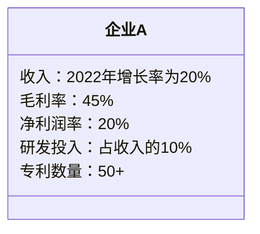
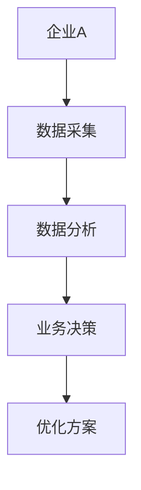

                 


# 价值投资中的产业互联网机遇

---

## 关键词：
价值投资、产业互联网、商业模式、投资策略、企业分析、风险管理

---

## 摘要：
本文探讨了在产业互联网时代，价值投资如何抓住新兴的产业机遇。通过分析产业互联网的定义、商业模式和发展趋势，结合具体案例，揭示了如何通过价值投资的方法，筛选出具有长期竞争优势的企业，构建稳健的投资组合。文章还讨论了投资策略、风险管理以及实际操作中的注意事项，为投资者提供了全面的指导。

---

## 第一部分: 价值投资的背景与基础

### 1.1 价值投资的核心概念

#### 1.1.1 价值投资的定义与核心理念
价值投资是一种以基本面分析为基础的投资策略，强调以低于企业内在价值的价格买入优质资产，长期持有，赚取企业成长带来的收益。其核心理念包括：
- **安全边际**：买入价格低于内在价值，以降低投资风险。
- **长期持有**：关注企业的长期价值，而非短期市场波动。
- **企业基本面**：分析企业的财务状况、盈利能力、竞争优势等核心指标。

#### 1.1.2 价值投资的基本原理
价值投资的理论基础来源于格雷厄姆和多德的“安全边际”理论。他们认为，市场的价格波动是不可预测的，但企业的内在价值可以通过分析其财务状况和竞争优势来估算。投资的秘诀在于找到市场价格与内在价值存在显著差距的企业。

#### 1.1.3 价值投资的哲学与思维方式
价值投资不仅仅是技术分析，更是一种哲学。它强调独立思考、逆向思维和长期视角。投资者需要摒弃市场的短期噪音，专注于企业的基本面，寻找那些被市场低估的机会。

### 1.2 产业互联网的定义与现状

#### 1.2.1 产业互联网的定义与特点
产业互联网（Industrial Internet）是指将互联网技术应用于传统产业，通过数字化、智能化改造传统产业的生产、管理和服务模式。与消费互联网（Consumer Internet）相比，产业互联网更注重企业间的协作和数据驱动的决策。

产业互联网的特点包括：
- **数据驱动**：通过数据采集、分析和应用，提升企业效率。
- **智能化**：利用人工智能、大数据等技术实现自动化和智能化。
- **跨界融合**：传统产业与互联网技术的深度融合，催生新的商业模式。

#### 1.2.2 产业互联网与消费互联网的区别
消费互联网主要面向个人用户，通过互联网平台提供服务，如电商、社交媒体等。而产业互联网则专注于企业间的服务，如供应链管理、智能制造、工业互联网平台等。产业互联网更注重效率提升和成本降低，而消费互联网更注重用户体验和流量变现。

#### 1.2.3 产业互联网的现状与发展趋势
当前，全球产业互联网正处于快速发展阶段。随着5G、人工智能、物联网等技术的成熟，越来越多的传统产业开始拥抱数字化转型。例如，制造业的智能化生产、农业的精准种植、物流的智能调度等。

未来，产业互联网将呈现以下发展趋势：
- **技术融合**：大数据、人工智能、区块链等技术将进一步融入产业互联网。
- **生态化**：产业互联网将形成跨行业、跨领域的生态体系。
- **全球化**：产业互联网的应用将从单一国家扩展到全球范围。

### 1.3 价值投资与产业互联网的结合

#### 1.3.1 价值投资与产业互联网的契合点
产业互联网的快速发展为价值投资提供了丰富的投资机会。传统的产业互联网企业通常具有较高的壁垒和稳定的盈利能力，符合价值投资的核心理念。

#### 1.3.2 产业互联网带来的投资机会
- **技术创新**：人工智能、大数据等技术的应用为企业创造新的价值。
- **模式创新**：SaaS模式、工业互联网平台等新型商业模式的崛起。
- **行业整合**：传统产业通过数字化转型实现整合和优化。

#### 1.3.3 价值投资在产业互联网中的应用
价值投资者需要重点关注那些在产业互联网领域具有强大竞争优势的企业，例如具有强大技术能力、稳定客户基础和良好财务状况的企业。

---

## 第二部分: 产业互联网的商业模式与投资策略

### 2.1 产业互联网的商业模式分析

#### 2.1.1 产业互联网的主要商业模式
- **SaaS模式**：通过提供软件服务，按月或按年收取订阅费。例如， Salesforce 和用友云服务。
- **B2B模式**：企业对企业提供产品或服务，如工业互联网平台。
- **数据变现**：通过收集和分析数据，为企业提供决策支持或广告收入。

#### 2.1.2 SaaS模式的特点
- **低门槛**：用户可以根据需求灵活购买服务。
- **高粘性**：通过持续的服务和技术支持，提高客户粘性。
- **高利润率**：通过订阅模式实现稳定的收入来源。

#### 2.1.3 B2B模式的特点
- **长尾市场**：专注于特定行业或领域，提供定制化服务。
- **高壁垒**：行业知识和技术积累形成竞争优势。
- **规模效应**：通过批量生产降低成本。

#### 2.1.4 产业互联网的盈利模式对比
以下是不同商业模式的对比：

| 模式     | 收入来源          | 优点                          | 缺点                          |
|----------|-------------------|-------------------------------|-------------------------------|
| SaaS    | 订阅费            | 稳定收入，客户粘性高           | 初期投入大，回收周期长        |
| B2B     | 项目收入          | 定制化强，客户忠诚度高         | 项目周期长，风险高            |
| 数据变现| 数据销售/广告     | 数据价值高，收入潜力大        | 数据隐私风险高，合规性要求严格 |

### 2.2 价值投资中的产业互联网策略

#### 2.2.1 产业互联网的投资逻辑
价值投资者在选择产业互联网企业时，需要关注以下几个方面：
- **行业地位**：企业在行业中的地位和市场份额。
- **财务状况**：企业的盈利能力、资产负债情况和现金流。
- **技术能力**：企业的技术创新能力和研发投入。
- **竞争优势**：企业的核心竞争力和护城河。

#### 2.2.2 产业互联网企业的估值方法
传统的估值方法包括市盈率（P/E）、市净率（P/B）等，但针对产业互联网企业，还需要考虑以下因素：
- **客户粘性**：客户更换成本越高，企业价值越大。
- **技术壁垒**：技术专利和know-how的价值。
- **成长性**：企业的未来增长潜力。

#### 2.2.3 产业互联网投资的风险与机遇
- **风险**：
  - 技术风险：技术落后或无法跟上行业趋势。
  - 市场风险：市场需求变化或竞争加剧。
  - 财务风险：高负债率或现金流不稳定。
- **机遇**：
  - 技术创新带来的新市场。
  - 行业整合带来的并购机会。
  - 数字化转型带来的长期增长。

### 2.3 产业互联网的案例分析

#### 2.3.1 国内外产业互联网的成功案例
- **国外案例**：美国的工业互联网巨头通用电气（GE）通过Predix平台提供工业互联网服务。
- **国内案例**：中国的阿里巴巴通过阿里云和菜鸟网络，构建了强大的产业互联网生态。

#### 2.3.2 投资策略与经验总结
- **长期持有**：选择具有长期竞争优势的企业，耐心持有。
- **分散投资**：避免过度集中，降低投资风险。
- **持续学习**：关注行业动态和技术发展，及时调整投资策略。

---

## 第三部分: 价值投资中的产业互联网实战

### 3.1 项目背景与目标
本部分通过一个实际案例，展示如何运用价值投资的方法，分析和投资一个产业互联网企业。

#### 3.1.1 项目背景
假设我们选择一家国内的工业互联网企业A，该公司专注于智能制造解决方案，近年来收入增长稳定，毛利率较高，且在行业内具有一定的竞争优势。

#### 3.1.2 投资目标
通过对企业的基本面分析，判断其是否具有长期投资价值。

### 3.2 系统分析与架构设计

#### 3.2.1 问题场景介绍
我们需要分析企业A的财务状况、行业地位、技术能力等方面，评估其是否符合价值投资的条件。

#### 3.2.2 系统功能设计
以下是企业A的领域模型：



#### 3.2.3 系统架构设计
以下是企业A的系统架构图：



### 3.3 项目实战

#### 3.3.1 环境安装
- 需要安装的数据分析工具：Python、Pandas、Matplotlib。
- 数据来源：企业A的公开财务报表和行业数据。

#### 3.3.2 核心实现源代码
以下是Python代码，用于分析企业A的财务数据：

```python
import pandas as pd
import matplotlib.pyplot as plt

# 读取财务数据
df = pd.read_csv('enterprise_a.csv')

# 绘制收入增长率柱状图
plt.figure(figsize=(10, 6))
df['收入增长率'].plot(kind='bar')
plt.title('企业A收入增长率')
plt.xlabel('年份')
plt.ylabel('增长率（%）')
plt.show()

# 绘制毛利率折线图
plt.figure(figsize=(10, 6))
df['毛利率'].plot(kind='line')
plt.title('企业A毛利率')
plt.xlabel('年份')
plt.ylabel('毛利率（%）')
plt.show()
```

#### 3.3.3 案例分析与解读
通过上述代码，我们可以绘制出企业A的收入增长率和毛利率的变化趋势。假设结果显示，企业A的收入增长率持续稳定，毛利率保持较高水平，说明企业具有较强的盈利能力。

#### 3.3.4 项目小结
企业A在财务状况、行业地位和技术能力方面均表现良好，符合价值投资的条件。

### 3.4 最佳实践与注意事项

#### 3.4.1 投资策略总结
- **长期持有**：选择具有长期竞争优势的企业。
- **分散投资**：避免过度集中，降低风险。
- **持续学习**：关注行业动态和技术发展，及时调整投资策略。

#### 3.4.2 风险管理
- **分散投资**：避免将所有资金投入到单一企业或行业。
- **止损机制**：设定止损点，避免重大损失。
- **定期复盘**：定期评估投资组合的表现，及时调整策略。

#### 3.4.3 拓展阅读
- 阅读相关书籍，如《价值》（李录）、《投资最重要的少数法则》（史蒂夫·巴菲特）。
- 关注行业动态，了解最新的技术和发展趋势。

---

## 第四部分: 总结与展望

### 4.1 总结
本文详细探讨了价值投资在产业互联网中的应用，分析了产业互联网的商业模式和投资策略，通过案例分析展示了如何筛选和投资具有长期竞争优势的企业。

### 4.2 展望
随着技术的不断进步和传统产业的数字化转型，产业互联网将迎来更多机遇和挑战。未来，价值投资者需要更加关注技术创新、行业整合和全球化趋势，抓住产业互联网带来的投资机会。

---

## 结语
价值投资是一种长期、稳健的投资策略，而产业互联网则是当前技术进步和经济转型的重要方向。通过结合两者的理念和实践，投资者可以在不确定的市场中找到稳定且高回报的投资机会。希望本文能为读者提供有价值的 insights，帮助您在产业互联网时代实现投资成功。

