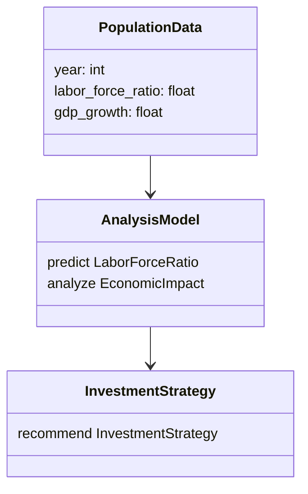
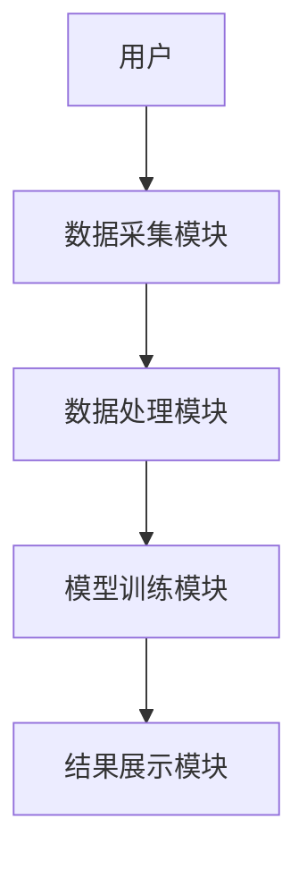
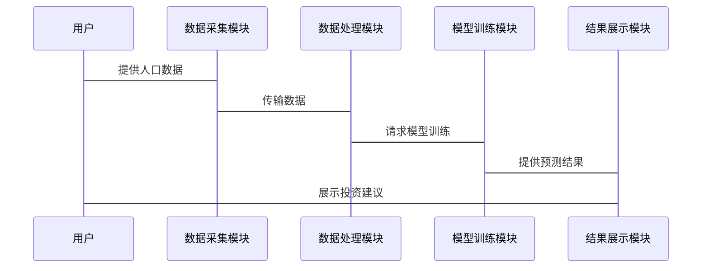

                 


# 价值投资中的人口红利分析

> 关键词：人口红利、价值投资、经济增长、投资策略、数据分析、数学建模

> 摘要：本文深入探讨了人口红利在价值投资中的重要性及其分析方法。通过详细分析人口结构、经济增长与投资策略之间的关系，结合数学模型和数据分析方法，为投资者提供科学的决策依据。文章从基础概念到实际应用，逐步展开，帮助读者理解如何利用人口红利进行有效的投资决策。

---

# 第1章: 人口红利的概念与价值投资的关联

## 1.1 人口红利的定义与内涵

### 1.1.1 人口红利的定义
人口红利是指在一个国家或地区的劳动年龄人口占总人口比例较高，且老年人口比例较低的阶段。这一阶段通常伴随着较高的经济增长潜力，因为劳动年龄人口的增加可以带来更高的劳动生产率和消费能力。

### 1.1.2 人口红利的形成机制
人口红利的形成主要依赖于人口结构的变化。当劳动年龄人口（通常指15-64岁）占总人口的比例较高时，社会的生产能力和消费能力都会显著提升。这种人口结构的优势为经济发展提供了强大的动力。

### 1.1.3 人口红利与经济增长的关系
人口红利通过增加劳动力供给、提高劳动生产率和扩大内需，对经济增长产生积极影响。具体来说，劳动年龄人口的增加可以降低企业用工成本，提升生产效率，同时为消费市场提供更多的潜在消费者。

### 1.1.4 人口红利的周期性
人口红利并非永恒存在，它受到出生率、死亡率、移民政策等多方面因素的影响。一般来说，人口红利会经历“上升-稳定-下降”的周期性变化。

### 1.1.5 人口红利的边界与外延
人口红利的边界主要体现在劳动年龄人口的占比和老年人口抚养比上。外延则包括与人口结构相关的社会、经济、文化等多个方面的影响。

---

## 1.2 人口红利与价值投资的关联

### 1.2.1 人口红利对投资决策的影响
人口红利直接影响一个国家或地区的经济增长潜力，进而影响企业的盈利能力和投资价值。投资者可以通过分析目标市场的劳动年龄人口占比，选择具有较高人口红利的地区进行投资。

### 1.2.2 人口红利在价值投资中的应用领域
- **消费行业**：人口红利带来更多的潜在消费者，推动消费行业的增长。
- **制造业**：充足的劳动力供给降低了生产成本，提升了制造业的竞争力。
- **科技行业**：年轻的人口结构为科技创新提供了更多的人才储备。

### 1.2.3 人口红利对行业选择的指导意义
在价值投资中，人口红利是选择投资标的的重要依据之一。具有较高人口红利的行业通常具有更大的增长空间和投资价值。

---

## 1.3 人口红利的周期性与波动性

### 1.3.1 人口红利的周期性特征
人口红利通常与国家的经济发展阶段密切相关。例如，在工业化阶段，人口红利对经济增长的推动作用最为明显；而在后工业化阶段，人口红利的影响逐渐减弱。

### 1.3.2 人口红利的波动性分析
人口红利的波动性主要由出生率、死亡率、移民政策等外部因素引起。例如，人口老龄化加速会导致人口红利逐渐消失。

### 1.3.3 人口红利周期对投资策略的影响
投资者需要根据人口红利的周期性变化调整投资策略。例如，在人口红利上升阶段，可以加大对消费和制造行业的投资；而在人口红利下降阶段，应更多关注科技和服务行业。

---

## 1.4 本章小结

通过本章的分析，我们可以得出以下结论：
1. 人口红利是影响经济增长的重要因素，尤其是在劳动年龄人口占比高的阶段。
2. 人口红利对价值投资具有重要意义，特别是在消费、制造和科技等行业。
3. 人口红利具有周期性，投资者需要根据其变化趋势调整投资策略。

---

# 第2章: 人口红利的核心概念与分析框架

## 2.1 人口结构分析

### 2.1.1 年龄结构分析
人口年龄结构可以通过年龄中位数、劳动年龄人口占比等指标进行分析。例如，通过绘制人口年龄分布的柱状图，可以直观地观察人口结构的变化趋势。

### 2.1.2 劳动力人口分析
劳动年龄人口的供给是衡量人口红利的重要指标。通过分析劳动年龄人口的增长趋势，可以预测未来的经济增长潜力。

### 2.1.3 人口抚养比分析
人口抚养比是指非劳动年龄人口占总人口的比例。抚养比的高低直接影响社会的负担能力和储蓄水平。

---

## 2.2 人口红利的量化指标

### 2.2.1 劳动年龄人口占比
劳动年龄人口占比是衡量人口红利的核心指标之一。例如，劳动年龄人口占比高意味着社会的生产潜力较大。

### 2.2.2 人口增长率
人口增长率反映了人口数量的变化趋势，高人口增长率通常伴随着较大的人口红利。

### 2.2.3 人口年龄中位数
人口年龄中位数是衡量人口结构的重要指标。中位数较低通常意味着人口红利较高。

---

## 2.3 人口红利与经济发展

### 2.3.1 人口红利对GDP的贡献
通过回归分析可以发现，劳动年龄人口占比与GDP增长率呈正相关关系。例如，劳动年龄人口占比每增加1%，GDP增长率可能提升0.5%。

### 2.3.2 人口红利对产业升级的影响
人口红利通过提高劳动力供给和降低生产成本，推动产业升级和技术创新。

### 2.3.3 人口红利对消费市场的推动
人口红利的增加带来了更多的潜在消费者，推动了消费市场的繁荣。

---

## 2.4 本章小结

通过本章的分析，我们了解了人口红利的核心概念和量化指标，并探讨了其对经济发展的具体影响。这些分析为后续的数学建模和投资策略提供了理论基础。

---

# 第3章: 人口红利的数学模型与分析方法

## 3.1 人口红利的数学模型

### 3.1.1 人口增长模型
人口增长模型可以分为线性增长模型和指数增长模型。例如，使用线性回归模型预测劳动年龄人口的变化趋势。

### 3.1.2 劳动力供给模型
劳动力供给模型可以通过回归分析预测未来的劳动力供给情况。

### 3.1.3 人口结构与经济增长模型
通过构建多元回归模型，可以分析人口结构对经济增长的具体影响。

---

## 3.2 数据分析方法

### 3.2.1 描述性统计分析
通过计算均值、中位数、标准差等指标，可以描述人口结构的基本特征。

### 3.2.2 时间序列分析
时间序列分析可以揭示人口结构的变化趋势，例如使用ARIMA模型预测未来的劳动年龄人口占比。

### 3.2.3 回归分析
回归分析可以帮助我们理解人口结构对经济增长的因果关系。例如，可以通过回归分析验证劳动年龄人口占比对GDP增长率的影响。

---

## 3.3 人口红利的预测模型

### 3.3.1 线性回归模型
线性回归模型可以用于预测劳动年龄人口的变化趋势。

### 3.3.2 时间序列预测模型
时间序列预测模型（如ARIMA）可以用于预测未来的劳动年龄人口占比。

### 3.3.3 非参数回归模型
非参数回归模型可以捕捉人口结构的非线性变化趋势。

---

## 3.4 本章小结

通过本章的分析，我们了解了如何通过数学模型和数据分析方法预测人口红利的变化趋势，并为投资决策提供科学依据。

---

# 第4章: 人口红利的算法原理与实现

## 4.1 人口红利分析的算法原理

### 4.1.1 算法选择依据
根据数据分析的需求，选择合适的时间序列分析算法，例如ARIMA模型。

### 4.1.2 算法的输入与输出
- 输入：劳动年龄人口占比的历史数据
- 输出：未来劳动年龄人口占比的预测值

### 4.1.3 算法的优缺点分析
ARIMA模型的优点是能够捕捉时间序列的线性和非线性趋势，缺点是需要较多的历史数据支持。

---

## 4.2 算法实现

### 4.2.1 数据预处理
```python
import pandas as pd
data = pd.read_csv('population.csv')
data = data['labor_force_ratio'].values
```

### 4.2.2 模型训练
```python
from statsmodels.tsa.arima.model import ARIMA
model = ARIMA(data, order=(5,1,0))
model_fit = model.fit()
```

### 4.2.3 模型评估
```python
from sklearn.metrics import mean_squared_error
import numpy as np

y_true = data[10:]
y_pred = model_fit.forecast(steps=len(y_true))
mse = mean_squared_error(y_true, y_pred)
print(f'MSE: {mse}')
```

---

## 4.3 人口红利预测的Python实现

### 4.3.1 数据导入与清洗
```python
import pandas as pd
data = pd.read_csv('population.csv')
data = data.dropna()
data['year'] = pd.to_datetime(data['year'])
data.set_index('year', inplace=True)
```

### 4.3.2 模型训练与预测
```python
from statsmodels.tsa.arima.model import ARIMA
model = ARIMA(data['labor_force_ratio'], order=(5,1,0))
model_fit = model.fit()
```

### 4.3.3 结果分析
```python
import matplotlib.pyplot as plt
plt.figure(figsize=(10,6))
plt.plot(data['labor_force_ratio'], label='实际值')
plt.plot(model_fit.fitted, label='拟合值')
plt.legend()
plt.show()
```

---

## 4.4 本章小结

通过本章的分析，我们了解了如何利用Python和ARIMA模型预测人口红利的变化趋势，并为投资决策提供科学依据。

---

# 第5章: 系统分析与架构设计

## 5.1 问题场景介绍

### 5.1.1 问题背景
人口红利的分析需要结合多种数据源和分析方法，构建一个完整的分析系统。

### 5.1.2 问题目标
构建一个基于人口红利分析的投资决策支持系统。

---

## 5.2 系统功能设计

### 5.2.1 领域模型类图


---

## 5.3 系统架构设计

### 5.3.1 系统架构图


---

## 5.4 系统接口设计

### 5.4.1 输入接口
- 数据接口：接收劳动年龄人口占比、GDP增长率等数据。

### 5.4.2 输出接口
- 结果接口：输出人口红利预测结果和投资建议。

---

## 5.5 系统交互流程图

### 5.5.1 交互流程


---

## 5.6 本章小结

通过本章的系统分析与架构设计，我们构建了一个完整的基于人口红利分析的投资决策支持系统，为投资者提供了科学的决策依据。

---

# 第6章: 项目实战

## 6.1 项目背景

### 6.1.1 项目目标
分析某国的人口红利对投资的影响。

### 6.1.2 数据来源
- 数据来源：公开统计数据。
- 工具选择：Python、Pandas、Matplotlib。

---

## 6.2 核心代码实现

### 6.2.1 数据导入与清洗
```python
import pandas as pd
data = pd.read_csv('population.csv')
data = data.dropna()
```

### 6.2.2 模型训练
```python
from statsmodels.tsa.arima.model import ARIMA
model = ARIMA(data['labor_force_ratio'], order=(5,1,0))
model_fit = model.fit()
```

### 6.2.3 结果分析
```python
import matplotlib.pyplot as plt
plt.figure(figsize=(10,6))
plt.plot(data['labor_force_ratio'], label='实际值')
plt.plot(model_fit.fitted, label='拟合值')
plt.legend()
plt.show()
```

---

## 6.3 案例分析与结果解读

### 6.3.1 案例分析
通过对某国的劳动年龄人口占比进行预测，发现未来5年劳动年龄人口占比将逐渐下降。

### 6.3.2 投资建议
基于预测结果，建议投资者减少对劳动密集型行业的投资，转而加大对科技和服务行业的投资。

---

## 6.4 项目小结

通过本章的项目实战，我们验证了人口红利分析在投资决策中的实际应用价值，并总结了项目实施的经验和教训。

---

# 第7章: 最佳实践与小结

## 7.1 最佳实践

### 7.1.1 数据准确性
确保数据来源的准确性和完整性。

### 7.1.2 模型选择
根据具体问题选择合适的分析模型。

### 7.1.3 结果应用
结合实际情况灵活应用分析结果，避免机械套用模型。

---

## 7.2 小结

通过本文的分析，我们深入探讨了人口红利在价值投资中的重要性及其分析方法。通过数学建模和数据分析方法，我们为投资者提供了科学的决策依据。

---

## 7.3 注意事项

- 数据分析结果仅供参考，需结合实际情况进行调整。
- 投资者需关注政策变化和市场波动，及时调整投资策略。

---

## 7.4 拓展阅读

- 建议进一步阅读《投资学原理》和《人口经济学》相关书籍，深入了解人口红利的经济影响。

---

# 结语

通过本文的系统分析和实战案例，我们为投资者提供了一个基于人口红利分析的投资决策框架。希望本文能为读者在价值投资中提供新的思路和方法。

