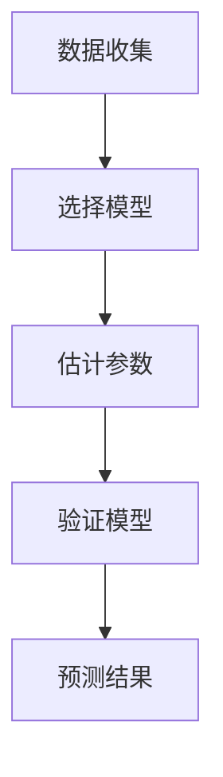
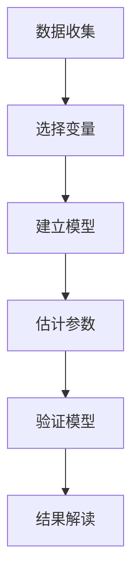
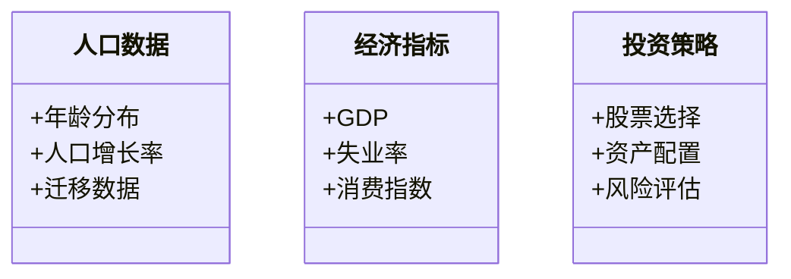
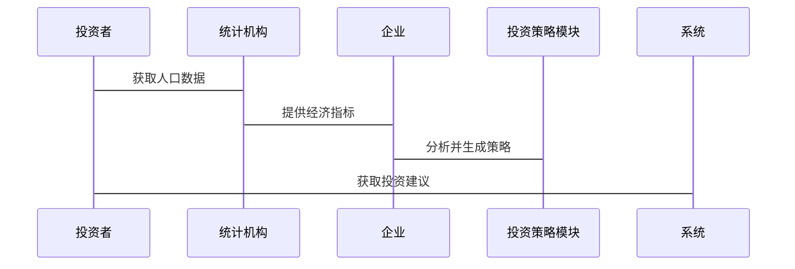

                 


# 价值投资中的人口趋势分析

> 关键词：价值投资，人口趋势分析，经济周期，投资策略，人口结构，数据分析，算法模型

> 摘要：本文探讨了如何利用人口趋势分析进行价值投资，分析了人口结构变化对企业价值和投资策略的影响，结合时间序列分析和回归分析等算法，构建了数学模型，并通过系统架构设计和项目实战展示了如何在实际投资中应用这些方法。

---

## 第一部分：背景介绍

### 第1章：人口趋势分析的背景与价值投资

#### 1.1 人口趋势分析的背景

人口趋势分析从传统的人口统计发展到现代的数据驱动分析，成为影响经济和投资的重要因素。随着全球老龄化加剧和生育率下降，人口结构的变化对企业价值和投资决策产生了深远影响。

#### 1.2 人口趋势分析与价值投资的关系

人口趋势影响经济周期，进而影响投资策略。不同人口阶段（如老龄化社会）对投资策略的选择和资产配置有重要影响，投资者需根据人口结构变化调整投资组合。

#### 1.3 问题背景与问题描述

- 人口老龄化导致劳动力减少，影响经济增长和企业盈利能力。
- 出生率下降影响消费市场，尤其是年轻消费群体的变化。
- 人口迁移影响地区经济发展和企业布局。

#### 1.4 问题解决与边界条件

通过人口趋势预测投资机会，明确边界条件如时间范围、数据质量和地域限制，分析核心要素如年龄分布、人口迁移率等。

---

## 第二部分：核心概念与联系

### 第2章：人口趋势分析的核心概念

#### 2.1 核心概念原理

人口趋势分析通过统计和预测模型，研究人口结构变化对企业价值的影响。价值投资关注长期稳定的回报，结合人口趋势分析，优化投资策略。

#### 2.2 核心概念属性对比

| 属性       | 人口趋势分析               | 价值投资               |
|------------|--------------------------|------------------------|
| 目标       | 预测人口变化及其影响       | 寻找被低估的投资标的   |
| 方法       | 数据分析、预测模型         | 财务分析、基本面研究   |
| 输入       | 人口统计数据、经济指标     | 财务报表、行业数据     |
| 输出       | 人口趋势预测、投资建议     | 投资价值评估、投资决策 |

#### 2.3 ER实体关系图

```mermaid
er
actor 投资者
actor 统计机构
actor 企业
entity 人口结构
entity 经济指标
entity 投资策略
```

---

## 第三部分：算法原理讲解

### 第3章：人口趋势分析的算法原理

#### 3.1 时间序列分析

时间序列分析用于预测未来人口趋势，常用ARIMA模型。步骤包括数据收集、模型选择、参数估计和验证。



代码示例：

```python
from statsmodels.tsa.arima.model import ARIMA
import pandas as pd

data = pd.read_csv('population.csv')
model = ARIMA(data['population'], order=(1, 1, 1))
model_fit = model.fit()
 forecast = model_fit.forecast(steps=5)
```

#### 3.2 回归分析

回归分析用于研究人口因素与经济指标的关系，如人口年龄与GDP的关系。



代码示例：

```python
import statsmodels.api as sm

data = pd.read_csv('population.csv')
X = data['age']
y = data['gdp']

X = sm.add_constant(X)
model = sm.OLS(y, X)
results = model.fit()
print(results.summary())
```

---

## 第四部分：数学模型与公式

### 第4章：数学模型与公式

#### 4.1 时间序列模型

ARIMA模型公式：

$$ARIMA(p, d, q)$$

示例：使用ARIMA预测未来5年的人口增长。

#### 4.2 回归分析模型

线性回归公式：

$$y = \beta_0 + \beta_1x + \epsilon$$

示例：分析人口年龄与GDP的关系，得到回归系数。

---

## 第五部分：系统分析与架构设计

### 第5章：系统分析与架构设计

#### 5.1 问题场景介绍

构建一个基于人口趋势分析的价值投资系统，解决如何利用人口数据优化投资决策的问题。

#### 5.2 系统功能设计

领域模型：



#### 5.3 系统架构设计

系统架构：

```mermaid
rectangle 数据层 {
    数据库
    表：人口数据、经济指标
}
rectangle 业务逻辑层 {
    人口趋势分析模块
    投资策略模块
}
rectangle 表现层 {
    用户界面
}
```

#### 5.4 系统接口设计

API接口：



---

## 第六部分：项目实战

### 第6章：项目实战

#### 6.1 环境安装

安装Python、Pandas、Statsmodels、Mermaid工具。

#### 6.2 系统核心实现源代码

时间序列分析代码：

```python
import pandas as pd
from statsmodels.tsa.arima.model import ARIMA

data = pd.read_csv('population.csv')
model = ARIMA(data['population'], order=(1, 1, 1))
model_fit = model.fit()
forecast = model_fit.forecast(steps=5)
print(forecast)
```

回归分析代码：

```python
import statsmodels.api as sm

data = pd.read_csv('population.csv')
X = data['age']
y = data['gdp']

X = sm.add_constant(X)
model = sm.OLS(y, X)
results = model.fit()
print(results.summary())
```

#### 6.3 代码应用解读与分析

时间序列分析预测未来人口趋势，帮助投资者判断经济周期；回归分析识别人口因素与经济指标的关系，优化投资策略。

#### 6.4 实际案例分析

案例分析：分析老龄化社会对股票市场的影响，调整投资组合。

#### 6.5 项目小结

总结项目实施过程，强调数据质量、模型选择和结果验证的重要性。

---

## 第七部分：总结

### 第7章：总结

#### 7.1 最佳实践 tips

- 数据质量是关键，确保数据准确性和完整性。
- 结合多种分析方法，提高模型的准确性。
- 定期更新模型，适应新的数据和市场变化。

#### 7.2 小结

人口趋势分析是价值投资的重要工具，通过数据分析和模型构建，投资者可以更好地把握市场趋势，优化投资决策。

#### 7.3 注意事项

- 考虑模型的局限性，避免过度依赖单一方法。
- 确保数据隐私和合规性，遵守相关法律法规。

#### 7.4 拓展阅读

推荐书籍和资源，进一步学习人口经济学和投资策略。

---

通过以上步骤，文章详细讲解了人口趋势分析在价值投资中的应用，从理论到实践，帮助读者掌握相关知识和技能。

