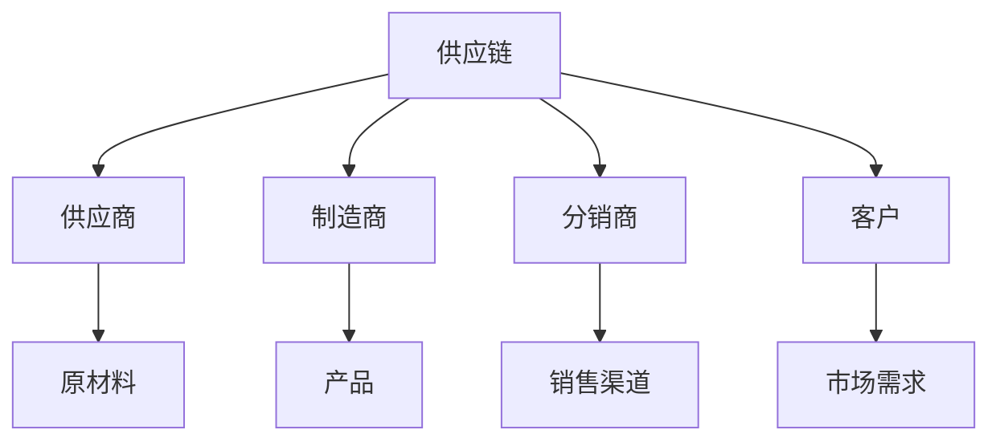
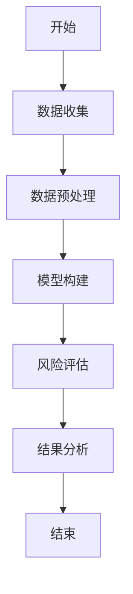
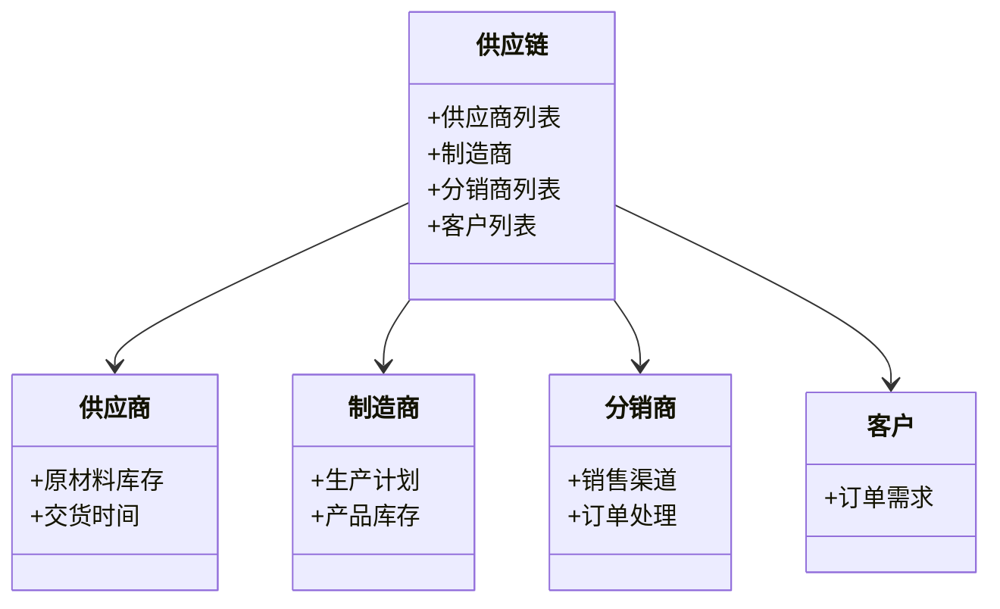
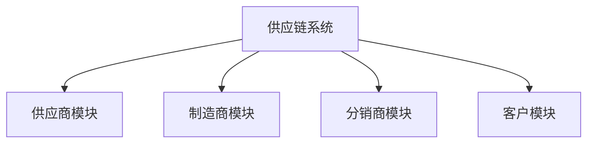
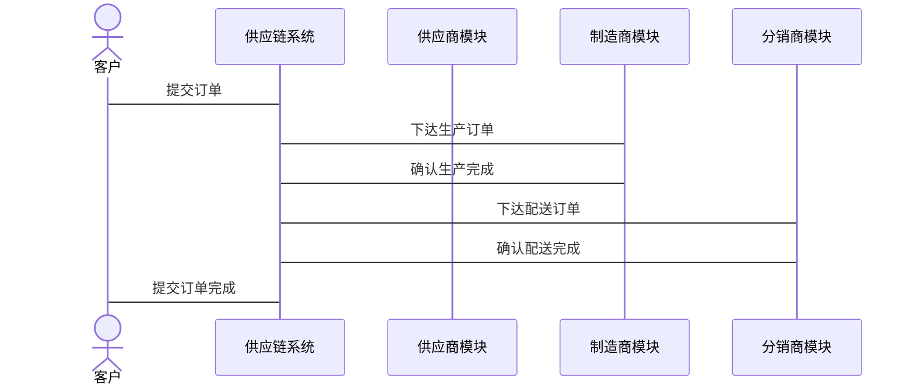

                 


# 价值投资中的供应链分析

## 关键词：供应链分析，价值投资，企业价值，风险评估，数据建模

## 摘要：  
供应链分析在价值投资中扮演着至关重要的角色。通过对供应链的成本、效率和稳定性进行深入分析，投资者可以更好地评估企业的核心竞争力和潜在风险。本文从供应链的基本概念入手，结合数学模型和实际案例，系统地阐述了供应链分析的原理、方法及其在价值投资中的应用。

---

## 第一部分: 供应链分析的背景与价值投资基础

## 第1章: 供应链分析的背景与重要性

### 1.1 供应链的基本概念与定义

#### 1.1.1 供应链的定义与核心要素
供应链是指从原材料采购到最终产品交付给客户的整个过程中的所有参与者和资源的网络。其核心要素包括：

- **供应商**：提供原材料或零部件的企业。
- **制造商**：将原材料转化为最终产品的企业。
- **分销商**：将产品分发到各个销售渠道的企业。
- **客户**：最终消费者或企业客户。
- **物流**：产品在供应链中的运输和存储过程。

供应链的稳定性直接影响企业的运营效率和成本控制能力。

#### 1.1.2 供应链在企业运营中的作用
供应链不仅是企业生产活动的基础，还是企业竞争优势的重要来源。高效的供应链能够降低库存成本、缩短交货时间、提高客户满意度，并增强企业的市场响应能力。

#### 1.1.3 供应链管理的核心目标与挑战
- **核心目标**：实现供应链各环节的高效协同，降低运营成本，提高产品交付速度。
- **主要挑战**：供应链的复杂性、不确定性（如原材料价格波动、物流中断等）以及全球化背景下的管理难度。

### 1.2 价值投资的基本原理

#### 1.2.1 价值投资的定义与核心理念
价值投资是一种投资策略，强调以低于其内在价值的价格购买优质资产。其核心理念是寻找市场低估的企业，长期持有，等待其价值回归。

#### 1.2.2 供应链分析在价值投资中的作用
供应链分析可以帮助投资者评估企业的成本控制能力、运营效率和抗风险能力，从而更准确地判断其内在价值。

#### 1.2.3 供应链分析与其他投资分析方法的区别
与传统的财务分析和市场分析不同，供应链分析关注企业的生产过程和上下游合作关系，能够揭示企业竞争优势的来源。

### 1.3 供应链分析的边界与外延

#### 1.3.1 供应链分析的边界
供应链分析的边界通常包括企业的上游供应商和下游客户，但不涉及企业的核心研发和营销活动。

#### 1.3.2 供应链分析的外延与相关领域
供应链分析与其他领域（如风险管理、成本会计）密切相关，但需要明确区分其研究范围。

#### 1.3.3 供应链分析与企业价值的关系
供应链的效率和稳定性直接影响企业的盈利能力和成长潜力，从而影响其市场价值。

---

## 第2章: 供应链分析的核心概念与联系

### 2.1 核心概念原理

#### 2.1.1 供应链的运作机制
供应链的运作机制包括原材料采购、生产加工、物流配送和产品交付等环节。每个环节的成本和效率都会影响整体供应链的表现。

#### 2.1.2 供应链的成本结构与效率
供应链的成本结构包括原材料成本、物流成本和库存成本等。提高供应链效率可以降低整体成本，增强企业的盈利能力。

#### 2.1.3 供应链的稳定性与风险
供应链的稳定性直接影响企业的抗风险能力。例如，原材料短缺或物流中断可能导致生产停滞，从而影响企业的业绩。

### 2.2 核心概念属性特征对比表格

| **属性**       | **供应商管理** | **生产管理** | **物流管理** |
|----------------|----------------|---------------|---------------|
| **核心目标**   | 保证原材料供应 | 提高生产效率   | 优化配送成本 |
| **关键指标**   | 交货时间、质量 | 生产周期、合格率 | 运输成本、配送时间 |

### 2.3 ER实体关系图架构



---

## 第3章: 供应链分析的算法原理

### 3.1 算法原理概述

#### 3.1.1 数据流分析
数据流分析是供应链分析的基础，包括数据的收集、预处理和建模。

#### 3.1.2 网络流分析
网络流分析用于评估供应链中的瓶颈环节，优化物流路径。

#### 3.1.3 风险评估模型
风险评估模型用于识别供应链中的潜在风险，并制定应对策略。

### 3.2 算法流程图



### 3.3 核心算法实现

#### 3.3.1 算法代码示例

```python
def supply_chain_analysis(data):
    # 数据预处理
    processed_data = preprocess(data)
    # 模型构建
    model = build_model(processed_data)
    # 风险评估
    risk_score = evaluate_risk(model)
    return risk_score
```

---

## 第4章: 供应链分析的数学模型与公式

### 4.1 数学模型概述

#### 4.1.1 供应链成本模型
供应链成本模型用于计算供应链的总成本，包括采购成本、物流成本和库存成本。

#### 4.1.2 供应链效率模型
供应链效率模型用于评估供应链的整体效率，包括生产周期、物流时间等指标。

#### 4.1.3 供应链风险模型
供应链风险模型用于评估供应链的潜在风险，包括原材料短缺、物流中断等。

### 4.2 核心公式与推导

#### 公式4-1: 供应链总成本计算

$$ \text{总成本} = \text{采购成本} + \text{运输成本} + \text{库存成本} $$

---

## 第5章: 供应链分析的系统架构与设计方案

### 5.1 系统分析与架构设计方案

#### 5.1.1 问题场景介绍
以某制造企业为例，分析其供应链的现状和存在的问题。

#### 5.1.2 系统功能设计（领域模型）



#### 5.1.3 系统架构设计



#### 5.1.4 系统接口设计
系统接口设计包括供应商接口、制造商接口、分销商接口和客户接口。

#### 5.1.5 系统交互设计



---

## 第6章: 供应链分析的实战案例与小结

### 6.1 项目实战

#### 6.1.1 环境安装
需要安装Python、Pandas、Scikit-learn等工具。

#### 6.1.2 核心实现源代码

```python
import pandas as pd
from sklearn.metrics import accuracy_score

def preprocess(data):
    # 数据清洗和特征工程
    processed_data = data.dropna()
    return processed_data

def build_model(data):
    # 构建机器学习模型
    from sklearn.ensemble import RandomForestClassifier
    model = RandomForestClassifier()
    model.fit(data.drop('label', axis=1), data['label'])
    return model

def evaluate_risk(model, test_data):
    # 风险评估
    predictions = model.predict(test_data.drop('label', axis=1))
    accuracy = accuracy_score(test_data['label'], predictions)
    return accuracy
```

#### 6.1.3 实际案例分析
以某制造企业的供应链为例，分析其成本、效率和风险。

### 6.2 小结

供应链分析是价值投资中的重要工具，能够帮助投资者更好地评估企业的内在价值和风险。通过本文的系统分析和实战案例，读者可以掌握供应链分析的基本方法和实际应用。

---

## 第7章: 供应链分析的未来趋势与最佳实践

### 7.1 未来趋势

#### 7.1.1 数字化供应链
随着大数据和人工智能技术的发展，供应链将更加数字化和智能化。

#### 7.1.2 可持续供应链
可持续供应链将成为未来的重要趋势，企业需要关注环保和社会责任。

### 7.2 最佳实践 Tips

#### 7.2.1 数据驱动决策
利用数据建模和分析工具，提高供应链分析的准确性和效率。

#### 7.2.2 风险管理
建立完善的供应链风险评估和应对机制，降低供应链中断的风险。

#### 7.2.3 持续优化
定期评估和优化供应链的各个环节，提升整体效率和成本控制能力。

---

## 第8章: 总结与展望

### 8.1 总结
供应链分析是价值投资中的重要工具，能够帮助投资者更好地评估企业的内在价值和风险。本文系统地介绍了供应链分析的核心概念、算法原理、数学模型和实战案例。

### 8.2 展望
随着技术的进步，供应链分析将更加智能化和数据化，为企业和投资者提供更强大的决策支持。

---

通过以上内容，读者可以系统地了解供应链分析在价值投资中的重要性，并掌握其核心方法和实际应用。

