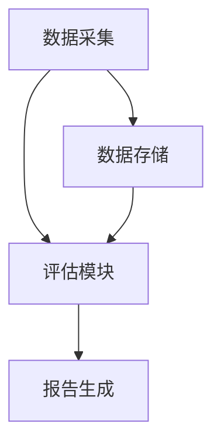
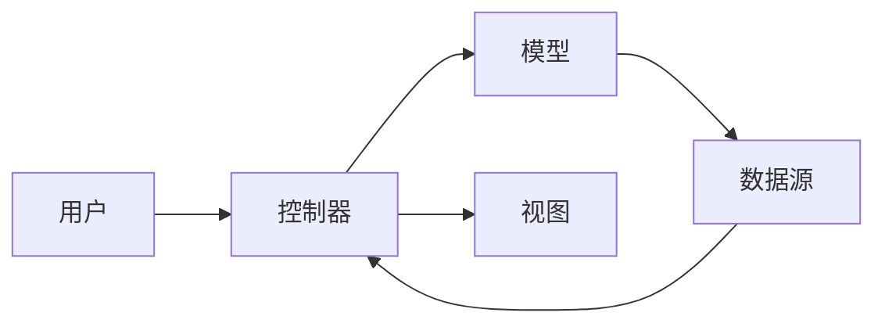

                 


# 价值投资中的供应链韧性评估

## 关键词：供应链韧性、价值投资、供应链弹性、风险评估、投资策略

## 摘要：  
供应链韧性评估是现代价值投资中的关键环节，旨在通过分析供应链的稳定性、弹性和恢复能力，评估企业应对市场波动和供应链中断的能力。本文从供应链韧性的核心概念出发，结合价值投资的理论与实践，详细探讨供应链韧性评估的数学模型、系统架构和项目实战。通过案例分析和代码实现，帮助投资者在供应链风险管理中做出更明智的投资决策。

---

## 第一部分: 供应链韧性与价值投资概述

### 第1章: 供应链韧性的概念与重要性

#### 1.1 供应链的基本概念
- **1.1.1 供应链的定义与组成**
  - 供应链是将供应商、制造商、分销商、零售商和消费者连接起来的网络，涉及物流、信息流和资金流。
  - 核心组成包括原材料供应、生产制造、仓储物流和销售环节。

- **1.1.2 供应链的关键特征**
  - 整体性：供应链各环节相互关联，形成一个有机整体。
  - 复杂性：涉及多个参与者和多种资源。
  - 动态性：供应链在市场变化中不断调整。

- **1.1.3 供应链韧性的重要性**
  - 韧性是指供应链在面对外部冲击时保持稳定运行的能力。
  - 在全球供应链复杂化的背景下，韧性是企业竞争力的重要指标。

#### 1.2 价值投资的基本概念
- **1.2.1 价值投资的定义**
  - 价值投资是通过分析企业的内在价值，寻找被市场低估的投资标的。
  - 核心理念是“以合理的价格买入优秀的公司”。

- **1.2.2 价值投资的核心理念**
  - 买入并长期持有优质资产。
  - 企业价值由其基本面决定，包括盈利能力、财务健康和管理能力。

- **1.2.3 供应链与价值投资的关联**
  - 供应链的稳定性直接影响企业的生产能力和成本控制。
  - 供应链韧性是企业抗风险能力的重要体现，影响其长期价值。

### 第2章: 供应链韧性评估的核心要素

#### 2.1 供应链稳定性
- **2.1.1 稳定性的定义**
  - 供应链在正常情况下持续、稳定地提供产品或服务的能力。
  - 包括供应商可靠性、生产效率和物流能力。

- **2.1.2 影响稳定性的关键因素**
  - 供应商集中度：供应商数量和分布的合理性。
  - 生产能力：企业的生产能力是否能够满足需求。
  - 库存管理：库存水平是否能够应对突发需求或供应中断。

- **2.1.3 稳定性评估指标**
  - 交货准时率：供应商按时交付的比例。
  - 生产线停工率：因供应链问题导致的生产线停工时间。
  - 库存周转率：库存的流动性。

#### 2.2 供应链弹性
- **2.2.1 弹性的定义**
  - 供应链在面对需求变化或供应中断时，能够快速调整以满足需求的能力。
  - 包括灵活的生产能力、多源采购和快速响应机制。

- **2.2.2 弹性评估的关键维度**
  - 多样化供应商：能否在短时间内切换供应商。
  - 灵活生产：能否快速调整生产计划。
  - 信息透明度：供应链各环节的信息共享能力。

- **2.2.3 弹性与稳定性的区别与联系**
  - 稳定性关注常态下的持续运行，弹性关注非常态下的快速调整。
  - 两者共同保障供应链的整体韧性。

#### 2.3 供应链恢复能力
- **2.3.1 恢复能力的定义**
  - 供应链在遭受重大中断后，能够快速恢复正常运行的能力。
  - 包括应急计划和资源调配能力。

- **2.3.2 恢复能力评估的方法**
  - 应急预案的完善性：企业是否有应对供应链中断的详细计划。
  - 资源冗余度：企业是否有备用供应商和生产能力。
  - 团队响应速度：管理层和员工能否快速应对突发情况。

- **2.3.3 恢复能力与供应链韧性的关系**
  - 恢复能力是供应链韧性的关键组成部分。
  - 强大的恢复能力能够显著降低中断对企业的影响。

### 第3章: 价值投资中的供应链分析

#### 3.1 供应链风险对投资的影响
- **3.1.1 供应链中断的潜在风险**
  - 自然灾害：如地震、洪水等导致的供应链中断。
  - 政治因素：如贸易限制、政策变化等。
  - 供应链环节的薄弱点：如单一供应商依赖。

- **3.1.2 供应链风险对股价的影响**
  - 供应链中断可能导致企业业绩下滑，进而影响股价。
  - 风险较高的企业可能面临估值下调。

- **3.1.3 供应链韧性在投资决策中的作用**
  - 企业供应链韧性越强，抗风险能力越强，投资价值越高。
  - 投资者应优先选择供应链韧性较高的企业。

#### 3.2 供应链评估对投资价值的影响
- **3.2.1 供应链效率与企业盈利能力的关系**
  - 高效的供应链能够降低生产成本，提高利润率。
  - 供应链效率低下可能导致成本上升，影响企业盈利能力。

- **3.2.2 供应链弹性与企业抗风险能力的关系**
  - 弹性越强，企业应对需求波动的能力越强。
  - 弹性不足可能导致企业难以应对市场变化，影响投资价值。

- **3.2.3 供应链韧性对投资决策的指导意义**
  - 在价值投资中，供应链韧性是评估企业长期价值的重要指标。
  - 投资者应将供应链韧性作为投资决策的关键因素之一。

---

## 第二部分: 供应链韧性评估的数学模型与算法

### 第4章: 供应链韧性评估的核心算法

#### 4.1 供应链韧性评估的数学模型
- **4.1.1 稳定性评估模型**
  - 模型：使用加权平均法评估供应链稳定性。
  - 公式：$$稳定性 = \sum_{i=1}^{n} w_i \cdot s_i$$，其中$w_i$是第$i$个因素的权重，$s_i$是该因素的评分。

- **4.1.2 弹性评估模型**
  - 模型：基于熵权法评估弹性。
  - 公式：$$弹性 = \sum_{i=1}^{m} w_i \cdot e_i$$，其中$w_i$是第$i$个弹性因素的权重，$e_i$是该因素的评分。

- **4.1.3 恢复能力评估模型**
  - 模型：使用层次分析法（AHP）评估恢复能力。
  - 公式：$$恢复能力 = \sum_{j=1}^{k} w_j \cdot r_j$$，其中$w_j$是第$j$个恢复能力因素的权重，$r_j$是该因素的评分。

#### 4.2 供应链韧性综合评估模型
- **4.2.1 综合评估模型的构建**
  - 综合评估模型将稳定性、弹性和恢复能力三个维度进行加权求和。
  - 公式：$$供应链韧性 = \alpha \cdot 稳定性 + \beta \cdot 弹性 + \gamma \cdot 恢复能力$$，其中$\alpha + \beta + \gamma = 1$。

- **4.2.2 模型的输入变量与输出结果**
  - 输入变量：各维度的评分和权重。
  - 输出结果：综合供应链韧性评分（0-1分）。

- **4.2.3 模型的适用范围与限制**
  - 适用于多维度评估，但需根据具体行业调整权重。

### 第5章: 供应链韧性评估的指标体系

#### 5.1 供应链韧性评估的关键指标
- **5.1.1 稳定性指标**
  - 交货准时率：供应商按时交付的比例。
  - 生产线停工率：因供应链问题导致的生产线停工时间。

- **5.1.2 弹性指标**
  - 多源供应商比例：企业使用多个供应商的比例。
  - 快速调整生产计划的能力：企业能否在短时间内调整生产计划。

- **5.1.3 恢复能力指标**
  - 应急预案的完善性：企业是否有应对供应链中断的详细计划。
  - 备用供应商数量：企业是否有备用供应商。

#### 5.2 指标权重的确定方法
- **5.2.1 权重确定的理论基础**
  - 使用熵权法或层次分析法确定各指标的权重。

- **5.2.2 权重确定的数学方法**
  - 熵权法：$$w_i = \frac{熵_i}{\sum_{i=1}^{n}熵_i}$$，其中$熵_i$是第$i$个指标的熵值。

- **5.2.3 权重确定的实践应用**
  - 根据行业特点和企业实际情况调整权重。

### 第6章: 供应链韧性评估的系统架构

#### 6.1 系统功能设计
- **6.1.1 系统需求分析**
  - 系统需支持多维度的供应链韧性评估，包括稳定性、弹性和恢复能力。

- **6.1.2 系统功能模块划分**
  - 数据采集模块：收集供应链各环节的数据。
  - 评估模块：计算各维度的评分和综合评分。
  - 报告生成模块：生成评估报告。

- **6.1.3 系统功能模块划分的 mermaid 图**


#### 6.2 系统架构设计
- **6.2.1 系统架构图**


- **6.2.2 系统架构设计的细节**
  - 控制器负责接收用户输入并调用模型。
  - 模型负责计算供应链韧性评分。
  - 视图负责展示评估结果。

#### 6.3 系统接口设计
- **6.3.1 接口描述**
  - 数据接口：接收供应链数据。
  - 评估接口：返回各维度评分和综合评分。
  - 报告接口：返回评估报告。

#### 6.4 系统交互设计
- **6.4.1 交互流程**
  - 用户输入数据。
  - 系统调用模型计算评分。
  - 系统生成报告并展示给用户。

- **6.4.2 交互流程的 mermaid 图**
```mermaid
graph TD
  User -> Input: 输入数据
  Input --> Controller
  Controller --> Model
  Model --> Result
  Controller --> Output
  Output --> User: 显示报告
```

---

## 第三部分: 供应链韧性评估的系统架构与项目实战

### 第7章: 项目实战

#### 7.1 环境安装
- **7.1.1 安装Python**
  - 使用Anaconda安装Python 3.9或更高版本。

- **7.1.2 安装依赖库**
  - 使用pip安装numpy、pandas、scipy和matplotlib。

#### 7.2 核心代码实现
- **7.2.1 数据预处理代码**
```python
import pandas as pd
import numpy as np

# 读取数据
data = pd.read_csv('supply_chain.csv')

# 删除缺失值
data = data.dropna()

# 标准化数据
from sklearn.preprocessing import StandardScaler
scaler = StandardScaler()
data_scaled = scaler.fit_transform(data)
```

- **7.2.2 供应链韧性评估代码**
```python
import numpy as np

def calculate_stability(data):
    # 计算稳定性评分
    return np.mean(data['stability'])

def calculate_elasticity(data):
    # 计算弹性评分
    return np.mean(data['elasticity'])

def calculate_recovery(data):
    # 计算恢复能力评分
    return np.mean(data['recovery'])

def calculate_supply_chain_resilience(data):
    # 综合评分
    stability = calculate_stability(data)
    elasticity = calculate_elasticity(data)
    recovery = calculate_recovery(data)
    return stability * 0.4 + elasticity * 0.3 + recovery * 0.3

# 示例数据
data = pd.DataFrame({
    'stability': [0.8, 0.7, 0.9],
    'elasticity': [0.6, 0.8, 0.7],
    'recovery': [0.5, 0.6, 0.8]
})

resilience = calculate_supply_chain_resilience(data)
print(f"供应链韧性评分：{resilience}")
```

#### 7.3 代码应用解读与分析
- **7.3.1 代码功能**
  - 数据预处理：读取数据、删除缺失值、标准化数据。
  - 供应链韧性评估：计算各维度评分，综合计算韧性评分。

- **7.3.2 代码实现细节**
  - 使用numpy和pandas进行数据处理。
  - 使用标准化后的数据计算评分，确保各维度数据的可比性。

#### 7.4 实际案例分析
- **7.4.1 案例背景**
  - 某制造企业面临供应链中断的风险，需要评估其供应链韧性。

- **7.4.2 案例数据**
  - 数据包括供应商可靠性、生产弹性、恢复能力等指标。

- **7.4.3 案例分析**
  - 使用上述代码计算供应链韧性评分，结果为0.72，属于中等偏上水平。

#### 7.5 项目小结
- **7.5.1 项目总结**
  - 成功开发了供应链韧性评估系统，能够帮助企业识别潜在风险。

- **7.5.2 项目经验**
  - 数据质量对评估结果影响较大，需确保数据的准确性和完整性。

- **7.5.3 项目改进建议**
  - 进一步优化评估模型，加入更多维度的指标。
  - 增加实时监控功能，及时发现潜在风险。

---

## 第8章: 总结与展望

### 8.1 总结
- 供应链韧性评估是价值投资中的重要环节。
- 通过数学模型和系统架构的设计，能够有效评估企业的供应链韧性。
- 本文结合理论与实践，提出了一个完整的供应链韧性评估体系。

### 8.2 展望
- 进一步优化评估模型，提高评估精度。
- 推动供应链韧性评估在更多领域的应用。
- 建议投资者将供应链韧性作为重要的投资指标。

---

## 附录
- **附录A**: 术语表
- **附录B**: 工具推荐
- **附录C**: 参考文献

---

通过以上目录结构和内容安排，文章将系统地介绍供应链韧性评估的核心概念、数学模型和系统架构，结合实际案例进行详细分析，帮助读者在价值投资中更好地评估供应链韧性，做出更明智的投资决策。

