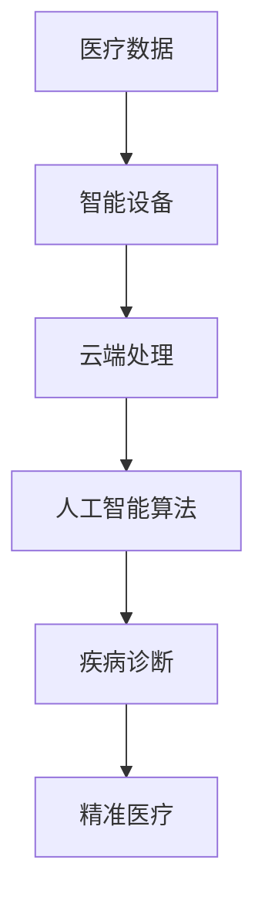
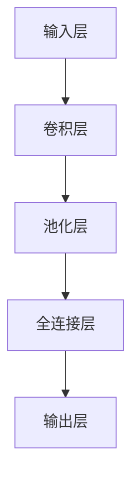
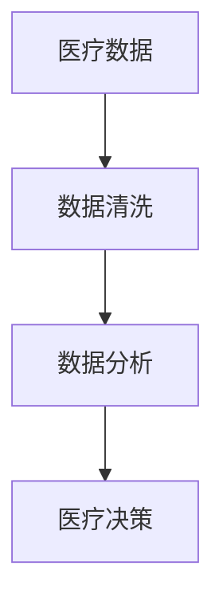
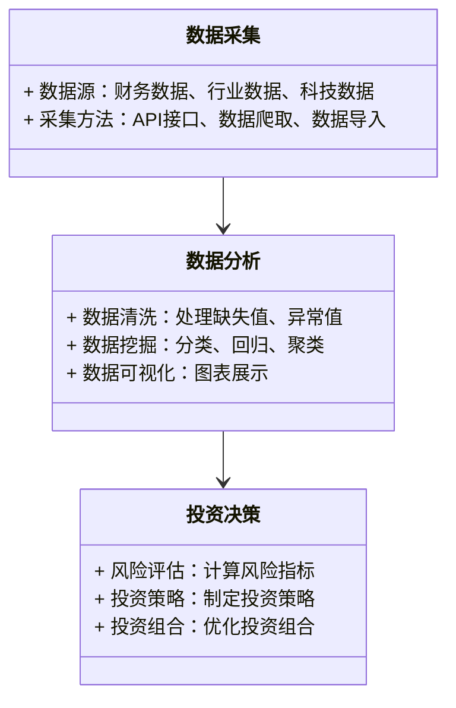
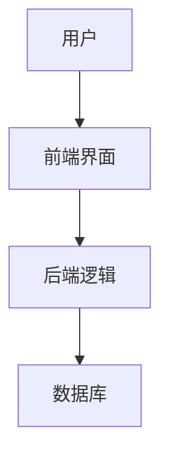
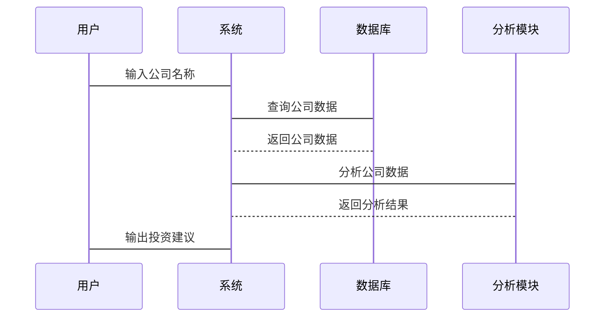

                 


# 价值投资中的健康医疗科技趋势

> 关键词：健康医疗科技趋势，价值投资，医疗科技，人工智能，大数据，医疗投资

> 摘要：本文旨在探讨健康医疗科技领域的价值投资趋势。通过分析健康医疗科技的核心技术、行业现状和未来发展趋势，结合价值投资的基本原理和策略，为投资者提供科学的决策依据。文章内容涵盖健康医疗科技的现状、核心技术分析、价值投资的基本原理、健康医疗科技与价值投资的结合，以及具体的投资策略和案例分析。

---

# 第1章: 健康医疗科技的现状与发展趋势

## 1.1 健康医疗科技的现状

### 1.1.1 全球健康医疗科技的发展现状

健康医疗科技是当前全球科技发展的重要方向之一。近年来，人工智能（AI）、大数据、区块链等技术在医疗领域的应用迅速崛起，推动了健康医疗科技的快速发展。本文将重点分析全球健康医疗科技的现状，包括技术创新、行业应用和市场发展等方面。

#### 核心概念与联系

健康医疗科技的核心在于将先进的信息技术与传统医疗相结合，通过数据驱动的方式提升医疗服务的效率和质量。以下是健康医疗科技的核心概念与联系：

- **医疗数据的收集与处理**：通过智能设备和传感器，医疗数据可以实时收集并传输到云端进行分析。
- **人工智能在医疗中的应用**：AI技术可以用于疾病诊断、药物研发、医疗影像分析等领域。
- **大数据在医疗健康中的作用**：大数据技术可以帮助医疗行业实现精准医疗、个性化治疗和疾病预测。

以下是健康医疗科技的核心概念与联系的Mermaid图：



### 1.1.2 中国健康医疗科技的发展特点

中国的健康医疗科技发展迅速，尤其是在政策支持和资本推动下，行业呈现出以下特点：

- **政策支持**：国家出台了一系列政策，鼓励健康医疗科技的发展，例如《“健康中国2030”规划纲要》。
- **技术创新**：中国在人工智能、大数据、区块链等领域的技术发展迅速，尤其是在医疗影像识别和疾病预测方面取得了显著进展。
- **市场规模大**：中国拥有庞大的人口基数，健康医疗市场需求巨大，吸引了大量投资。

### 1.1.3 医疗科技与传统医疗的结合

医疗科技与传统医疗的结合是健康医疗科技发展的核心。以下是两者结合的主要方面：

- **医疗影像识别**：通过AI技术，医疗影像识别的准确性和效率大幅提高。
- **疾病诊断**：AI辅助诊断系统可以帮助医生快速、准确地诊断疾病。
- **药物研发**：大数据和AI技术可以加速新药的研发过程，降低研发成本。

## 1.2 健康医疗科技的核心技术

### 1.2.1 人工智能在医疗中的应用

人工智能是健康医疗科技的核心技术之一，其在医疗领域的应用广泛且深入。

#### 人工智能在医疗影像识别中的应用

医疗影像识别是AI在医疗中的重要应用领域。通过深度学习算法，AI可以对CT、MRI等医学影像进行自动分析和诊断。

##### 算法原理

医疗影像识别的主要算法是基于深度学习的卷积神经网络（CNN）。以下是CNN的简要流程：

1. **输入层**：接收医学影像数据。
2. **卷积层**：提取影像中的特征。
3. **池化层**：降低特征维度，减少计算量。
4. **全连接层**：进行分类预测。

以下是CNN的Mermaid流程图：



##### 代码实现

以下是使用Python和Keras框架实现的简单医疗影像识别模型：

```python
import tensorflow as tf
from tensorflow.keras import layers

model = tf.keras.Sequential([
    layers.Conv2D(32, (3,3), activation='relu', input_shape=(224, 224, 3)),
    layers.MaxPooling2D(pool_size=(2,2)),
    layers.Conv2D(64, (3,3), activation='relu'),
    layers.MaxPooling2D(pool_size=(2,2)),
    layers.Flatten(),
    layers.Dense(64, activation='relu'),
    layers.Dense(2, activation='softmax')
])

model.compile(optimizer='adam', loss='sparse_categorical_crossentropy', metrics=['accuracy'])
```

#### 人工智能在疾病诊断中的应用

AI辅助诊断系统可以帮助医生快速、准确地诊断疾病。例如，基于自然语言处理（NLP）的医疗文本分析系统可以辅助医生快速阅读病历并生成诊断建议。

##### 代码实现

以下是使用NLP技术进行医疗文本分析的简单示例：

```python
from transformers import pipeline

# 加载预训练的医疗文本分类模型
classifier = pipeline('text-classification', model='bert-base')

# 分类病历文本
result = classifier("患者出现持续性胸痛，伴有发热和咳嗽。")
print(result)
```

### 1.2.2 大数据在医疗健康中的作用

大数据技术在医疗健康中的应用同样至关重要，以下是其主要作用：

#### 医疗数据的收集与处理

医疗数据的收集与处理是大数据在医疗中的基础工作。以下是医疗数据的处理流程：

1. **数据收集**：通过智能设备和传感器收集医疗数据。
2. **数据清洗**：对收集到的数据进行清洗和预处理。
3. **数据分析**：利用大数据技术对数据进行分析和挖掘。
4. **数据存储**：将数据存储在数据库中，以便后续使用。

#### 数据分析在医疗决策中的应用

大数据分析可以帮助医疗行业实现精准医疗和个性化治疗。以下是基于大数据的医疗决策支持系统的Mermaid图：



### 1.2.3 医疗设备与生物科技的创新

医疗设备与生物科技的创新是健康医疗科技发展的重要组成部分。以下是其主要创新方向：

#### 智能医疗设备的发展

智能医疗设备的发展使得医疗服务更加便捷和高效。例如，智能血压计可以实时监测患者的血压数据，并通过蓝牙传输到手机APP，提醒患者及时就医。

#### 生物科技在医疗中的应用

生物科技在医疗中的应用包括基因编辑、细胞治疗、抗体药物等。以下是基于生物技术的医疗治疗流程：

1. **基因检测**：通过基因检测技术，可以早期发现疾病风险。
2. **基因编辑**：通过CRISPR等技术，可以对基因进行编辑，治疗遗传性疾病。
3. **细胞治疗**：通过免疫细胞治疗（如CAR-T细胞疗法）治疗癌症等疾病。

#### 创新药研发的趋势

创新药研发的趋势是基于大数据和AI技术，加速新药的研发过程。以下是基于AI的药物研发流程：

1. **靶点识别**：通过AI技术识别疾病相关靶点。
2. **药物设计**：利用计算机模拟设计药物分子。
3. **临床试验**：通过AI优化临床试验设计，提高试验效率。

---

## 1.3 价值投资的基本概念

### 1.3.1 价值投资的定义与特点

价值投资是一种以低于内在价值的价格买入优质股票的投资策略。其核心理念是寻找市场低估的股票，长期持有，等待其价值回归。

#### 价值投资的核心理念

价值投资的核心理念是：

- **安全边际**：买入价格低于内在价值，以降低投资风险。
- **长期持有**：通过长期持有优质股票，获得资本增值和股息收益。
- **基本面分析**：通过分析公司的财务状况、行业地位、竞争优势等，评估其内在价值。

### 1.3.2 价值投资的核心理念

价值投资的核心理念是通过深入分析公司的基本面，寻找具有持续竞争优势和良好财务状况的公司，以低于其内在价值的价格买入并长期持有。

#### 价值投资的核心理念

价值投资的核心理念包括：

- **安全边际**：买入价格低于内在价值。
- **长期持有**：通过长期持有获得资本增值。
- **基本面分析**：分析公司的财务状况、行业地位和竞争优势。

### 1.3.3 价值投资与健康医疗行业的结合

价值投资与健康医疗行业的结合是本文的核心内容。以下是其结合的主要方面：

- **行业分析**：分析健康医疗行业的整体发展趋势和竞争格局。
- **公司分析**：分析健康医疗科技公司的财务状况、行业地位和竞争优势。
- **投资策略**：基于价值投资的原则，制定健康医疗科技领域的投资策略。

---

## 1.4 健康医疗科技与价值投资的结合

### 1.4.1 健康医疗科技对投资的影响

健康医疗科技的发展对投资产生了深远的影响。以下是其主要影响：

- **技术创新**：健康医疗科技的技术创新为投资者提供了新的投资机会。
- **行业格局**：技术创新改变了行业的竞争格局，推动了行业整合和并购。
- **投资风险**：技术创新也带来了新的投资风险，例如技术淘汰和市场不确定性。

### 1.4.2 价值投资在健康医疗科技中的应用

价值投资在健康医疗科技中的应用是本文的核心内容。以下是其主要应用方面：

- **公司分析**：通过基本面分析，评估健康医疗科技公司的内在价值。
- **投资策略**：基于价值投资的原则，制定健康医疗科技领域的投资策略。
- **风险控制**：通过风险分析和安全边际的设置，控制投资风险。

### 1.4.3 未来健康医疗科技趋势对投资的启示

未来健康医疗科技的发展趋势将对投资产生重要影响。以下是其主要趋势：

- **人工智能与大数据的深度融合**：人工智能和大数据技术将在医疗领域得到更广泛的应用。
- **智能医疗设备的普及**：智能医疗设备的普及将推动医疗服务的智能化和便捷化。
- **创新药研发的加速**：基于大数据和AI技术的创新药研发将加速，推动新药的快速上市。

---

## 1.5 本章小结

本章主要介绍了健康医疗科技的现状与发展趋势，分析了健康医疗科技的核心技术及其对投资的影响。通过本章的学习，读者可以了解健康医疗科技的基本概念、核心技术和发展趋势，为后续的价值投资分析打下基础。

---

# 第2章: 健康医疗科技的核心技术分析

## 2.1 人工智能在医疗中的应用

### 2.1.1 AI在医疗影像识别中的应用

人工智能在医疗影像识别中的应用是健康医疗科技的重要组成部分。以下是其主要应用领域：

- **疾病诊断**：AI技术可以辅助医生快速、准确地诊断疾病。
- **疾病预测**：通过分析医疗数据，AI技术可以预测疾病的发展趋势。
- **医疗影像分析**：AI技术可以自动分析医疗影像，帮助医生发现早期病变。

#### 算法原理

医疗影像识别的主要算法是基于深度学习的卷积神经网络（CNN）。以下是CNN的简要流程：

1. **输入层**：接收医学影像数据。
2. **卷积层**：提取影像中的特征。
3. **池化层**：降低特征维度，减少计算量。
4. **全连接层**：进行分类预测。

以下是CNN的Mermaid流程图：


#### 代码实现

以下是使用Python和Keras框架实现的简单医疗影像识别模型：

```python
import tensorflow as tf
from tensorflow.keras import layers

model = tf.keras.Sequential([
    layers.Conv2D(32, (3,3), activation='relu', input_shape=(224, 224, 3)),
    layers.MaxPooling2D(pool_size=(2,2)),
    layers.Conv2D(64, (3,3), activation='relu'),
    layers.MaxPooling2D(pool_size=(2,2)),
    layers.Flatten(),
    layers.Dense(64, activation='relu'),
    layers.Dense(2, activation='softmax')
])

model.compile(optimizer='adam', loss='sparse_categorical_crossentropy', metrics=['accuracy'])
```

### 2.1.2 AI在疾病诊断中的应用

AI在疾病诊断中的应用是健康医疗科技的重要组成部分。以下是其主要应用领域：

- **疾病预测**：通过分析医疗数据，AI技术可以预测疾病的发展趋势。
- **疾病诊断**：AI辅助诊断系统可以帮助医生快速、准确地诊断疾病。
- **医疗影像分析**：AI技术可以自动分析医疗影像，帮助医生发现早期病变。

#### 代码实现

以下是使用NLP技术进行医疗文本分析的简单示例：

```python
from transformers import pipeline

# 加载预训练的医疗文本分类模型
classifier = pipeline('text-classification', model='bert-base')

# 分类病历文本
result = classifier("患者出现持续性胸痛，伴有发热和咳嗽。")
print(result)
```

### 2.1.3 AI在药物研发中的作用

AI在药物研发中的作用是健康医疗科技的重要组成部分。以下是其主要应用领域：

- **靶点识别**：通过AI技术识别疾病相关靶点。
- **药物设计**：利用计算机模拟设计药物分子。
- **临床试验**：通过AI优化临床试验设计，提高试验效率。

---

## 2.2 大数据在医疗健康中的作用

### 2.2.1 医疗数据的收集与处理

医疗数据的收集与处理是大数据在医疗中的基础工作。以下是其主要流程：

1. **数据收集**：通过智能设备和传感器收集医疗数据。
2. **数据清洗**：对收集到的数据进行清洗和预处理。
3. **数据分析**：利用大数据技术对数据进行分析和挖掘。
4. **数据存储**：将数据存储在数据库中，以便后续使用。

#### 代码实现

以下是使用Python和Pandas进行医疗数据清洗的简单示例：

```python
import pandas as pd

# 读取医疗数据
data = pd.read_csv('medical_data.csv')

# 清洗数据
data.dropna(inplace=True)
data = data[data['age'] > 0]
```

### 2.2.2 数据分析在医疗决策中的应用

数据分析在医疗决策中的应用是大数据在医疗中的重要组成部分。以下是其主要应用领域：

- **精准医疗**：通过数据分析实现个性化治疗。
- **疾病预测**：通过数据分析预测疾病的发展趋势。
- **医疗资源优化**：通过数据分析优化医疗资源的配置。

#### 代码实现

以下是使用Python和Scikit-learn进行医疗数据分类的简单示例：

```python
from sklearn.tree import DecisionTreeClassifier
from sklearn.model_selection import train_test_split

# 数据分割
X_train, X_test, y_train, y_test = train_test_split(X, y, test_size=0.3)

# 模型训练
model = DecisionTreeClassifier()
model.fit(X_train, y_train)

# 模型预测
y_pred = model.predict(X_test)
```

### 2.2.3 数据隐私与安全问题

数据隐私与安全问题是大数据在医疗中的重要挑战。以下是其主要方面：

- **数据加密**：通过对医疗数据进行加密，保护患者隐私。
- **访问控制**：通过严格的访问控制，防止未经授权的访问。
- **数据匿名化**：通过对医疗数据进行匿名化处理，保护患者隐私。

---

## 2.3 医疗设备与生物科技的创新

### 2.3.1 智能医疗设备的发展

智能医疗设备的发展是健康医疗科技的重要组成部分。以下是其主要应用领域：

- **智能血压计**：通过蓝牙传输数据到手机APP，提醒患者及时就医。
- **智能血糖仪**：通过智能设备实时监测血糖数据，帮助糖尿病患者管理病情。
- **智能健康手环**：通过智能设备监测用户的健康数据，提供健康建议。

#### 代码实现

以下是使用Python和Bluetooth库实现智能血压计数据传输的简单示例：

```python
import bluetooth

# 搜索蓝牙设备
nearby_devices = bluetooth.discover_devices()

# 遍历设备
for device in nearby_devices:
    print(device)
```

### 2.3.2 生物科技在医疗中的应用

生物科技在医疗中的应用是健康医疗科技的重要组成部分。以下是其主要应用领域：

- **基因编辑**：通过CRISPR技术治疗遗传性疾病。
- **细胞治疗**：通过免疫细胞治疗（如CAR-T细胞疗法）治疗癌症。
- **抗体药物**：通过抗体药物治疗癌症和其他疾病。

#### 代码实现

以下是使用Python和Biopython进行基因序列分析的简单示例：

```python
from biopython import SeqIO

# 读取基因序列
record = SeqIO.read('gene_sequence.fasta', 'fasta')

# 输出基因序列
print(record.seq)
```

### 2.3.3 创新药研发的趋势

创新药研发的趋势是健康医疗科技的重要组成部分。以下是其主要趋势：

- **基于AI的药物研发**：通过AI技术加速新药的研发过程。
- **精准药物**：通过基因测序和大数据分析，研发个性化药物。
- **抗体药物**：通过抗体药物治疗癌症和其他疾病。

---

## 2.4 本章小结

本章主要介绍了健康医疗科技的核心技术，包括人工智能、大数据和医疗设备与生物科技的创新。通过本章的学习，读者可以了解健康医疗科技的核心技术及其应用，为后续的价值投资分析打下基础。

---

# 第3章: 价值投资的基本原理

## 3.1 价值投资的核心理念

### 3.1.1 价值投资的定义与特点

价值投资是一种以低于内在价值的价格买入优质股票的投资策略。其核心理念是寻找市场低估的股票，长期持有，等待其价值回归。

#### 价值投资的核心理念

价值投资的核心理念包括：

- **安全边际**：买入价格低于内在价值。
- **长期持有**：通过长期持有获得资本增值。
- **基本面分析**：通过分析公司的财务状况、行业地位和竞争优势，评估其内在价值。

### 3.1.2 价值投资的核心理念

价值投资的核心理念是通过深入分析公司的基本面，寻找具有持续竞争优势和良好财务状况的公司，以低于其内在价值的价格买入并长期持有。

#### 价值投资的核心理念

价值投资的核心理念包括：

- **安全边际**：买入价格低于内在价值。
- **长期持有**：通过长期持有获得资本增值。
- **基本面分析**：分析公司的财务状况、行业地位和竞争优势。

---

## 3.2 价值投资的基本方法

### 3.2.1 基本面分析

基本面分析是价值投资的重要方法。以下是其主要步骤：

1. **行业分析**：分析行业的发展趋势和竞争格局。
2. **公司分析**：分析公司的财务状况、行业地位和竞争优势。
3. **估值分析**：评估公司的内在价值，确定买入价格。

#### 代码实现

以下是使用Python和Pandas进行基本面分析的简单示例：

```python
import pandas as pd

# 读取公司财务数据
data = pd.read_csv('financial_data.csv')

# 计算市盈率
pe_ratio = data['市盈率'].mean()

# 输出市盈率
print(pe_ratio)
```

### 3.2.2 投资组合的构建

投资组合的构建是价值投资的重要方法。以下是其主要步骤：

1. **资产配置**：根据投资者的风险承受能力和收益目标，配置不同类型的资产。
2. **股票选择**：选择具有持续竞争优势和良好财务状况的公司。
3. **风险控制**：通过分散投资和设置止损，控制投资风险。

#### 代码实现

以下是使用Python和Matplotlib进行投资组合风险分析的简单示例：

```python
import matplotlib.pyplot as plt
import numpy as np

# 生成随机投资组合
returns = np.random.normal(0, 1, 100)

# 绘制收益分布图
plt.hist(returns, bins=20)
plt.xlabel('收益')
plt.ylabel('频数')
plt.title('投资组合收益分布图')
plt.show()
```

### 3.2.3 风险管理与投资策略

风险管理与投资策略是价值投资的重要方法。以下是其主要步骤：

1. **风险识别**：识别投资中的潜在风险。
2. **风险评估**：评估风险的影响程度和发生概率。
3. **风险控制**：通过分散投资和设置止损，控制投资风险。

#### 代码实现

以下是使用Python和Scikit-learn进行风险评估的简单示例：

```python
from sklearn.metrics import mean_squared_error

# 计算预测误差
mse = mean_squared_error(actual_returns, predicted_returns)

# 输出均方误差
print(mse)
```

---

## 3.3 健康医疗行业的投资分析

### 3.3.1 医疗行业的周期性分析

医疗行业的周期性分析是健康医疗科技投资的重要部分。以下是其主要分析内容：

- **行业周期**：医疗行业具有较强的防御性，通常不受经济周期波动的影响。
- **政策影响**：政策变化对医疗行业的发展有重要影响，例如医保政策的变化。

### 3.3.2 医疗行业的竞争格局

医疗行业的竞争格局是健康医疗科技投资的重要部分。以下是其主要分析内容：

- **行业集中度**：分析行业集中度，寻找具有竞争优势的公司。
- **市场进入壁垒**：分析市场的进入壁垒，评估公司的竞争优势。

### 3.3.3 医疗行业的政策影响

医疗行业的政策影响是健康医疗科技投资的重要部分。以下是其主要分析内容：

- **政策支持**：分析政府对健康医疗科技的政策支持力度。
- **监管环境**：分析医疗行业的监管环境，评估政策风险。

---

## 3.4 本章小结

本章主要介绍了价值投资的基本原理，包括价值投资的核心理念、基本方法和健康医疗行业的投资分析。通过本章的学习，读者可以了解价值投资的基本原理，为后续的健康医疗科技投资分析打下基础。

---

# 第4章: 健康医疗科技与价值投资的结合

## 4.1 健康医疗科技对投资的影响

### 4.1.1 科技创新对医疗行业的影响

科技创新对医疗行业的影响是健康医疗科技投资的重要部分。以下是其主要影响：

- **技术创新**：技术创新推动了医疗服务的智能化和高效化。
- **行业格局**：技术创新改变了行业的竞争格局，推动了行业整合和并购。

### 4.1.2 科技创新对投资机会的影响

科技创新对投资机会的影响是健康医疗科技投资的重要部分。以下是其主要影响：

- **新药研发**：基于AI和大数据的创新药研发为投资者提供了新的投资机会。
- **智能医疗设备**：智能医疗设备的普及为投资者提供了新的投资机会。

### 4.1.3 科技创新对投资风险的影响

科技创新对投资风险的影响是健康医疗科技投资的重要部分。以下是其主要影响：

- **技术淘汰**：技术创新可能导致技术淘汰，增加投资风险。
- **市场不确定性**：技术创新带来了市场的不确定性，增加了投资风险。

---

## 4.2 价值投资在健康医疗科技中的应用

### 4.2.1 价值投资在健康医疗科技中的应用

价值投资在健康医疗科技中的应用是本文的核心内容。以下是其主要应用领域：

- **公司分析**：通过基本面分析，评估健康医疗科技公司的内在价值。
- **投资策略**：基于价值投资的原则，制定健康医疗科技领域的投资策略。
- **风险控制**：通过风险分析和安全边际的设置，控制投资风险。

### 4.2.2 健康医疗科技行业的投资策略

健康医疗科技行业的投资策略是价值投资的重要部分。以下是其主要策略：

- **长期持有**：选择具有持续竞争优势的公司，长期持有。
- **安全边际**：买入价格低于内在价值，降低投资风险。
- **风险控制**：通过分散投资和设置止损，控制投资风险。

### 4.2.3 投资案例分析

投资案例分析是价值投资的重要部分。以下是其主要案例：

- **案例一**：某创新药公司，通过基本面分析，评估其内在价值，制定投资策略。
- **案例二**：某智能医疗设备公司，通过技术分析，评估其市场前景，制定投资策略。

---

## 4.3 本章小结

本章主要介绍了健康医疗科技与价值投资的结合，分析了科技创新对投资的影响，以及价值投资在健康医疗科技中的应用。通过本章的学习，读者可以了解健康医疗科技与价值投资的结合，为后续的投资实践打下基础。

---

# 第5章: 健康医疗科技与价值投资的系统分析

## 5.1 系统分析与架构设计方案

### 5.1.1 问题场景介绍

健康医疗科技与价值投资的系统分析是本文的重要部分。以下是其主要分析内容：

- **问题背景**：分析健康医疗科技与价值投资的结合。
- **问题描述**：描述健康医疗科技与价值投资的结合中存在的问题。
- **目标**：通过系统分析，制定健康医疗科技与价值投资的结合方案。

### 5.1.2 系统功能设计

系统功能设计是健康医疗科技与价值投资的结合的重要部分。以下是其主要功能：

- **数据采集**：采集健康医疗科技公司的财务数据、行业数据和科技数据。
- **数据分析**：对数据进行分析和挖掘，评估公司的内在价值。
- **投资决策**：基于数据分析结果，制定投资策略。

#### 系统功能设计的Mermaid类图



### 5.1.3 系统架构设计

系统架构设计是健康医疗科技与价值投资的结合的重要部分。以下是其主要架构：

- **前端界面**：用户友好的界面，方便用户操作。
- **后端逻辑**：数据处理和分析的逻辑。
- **数据库**：存储健康医疗科技公司的数据。

#### 系统架构设计的Mermaid架构图



### 5.1.4 系统接口设计

系统接口设计是健康医疗科技与价值投资的结合的重要部分。以下是其主要接口：

- **数据接口**：与数据源对接，获取健康医疗科技公司的数据。
- **分析接口**：与数据分析工具对接，获取分析结果。
- **决策接口**：与投资决策系统对接，获取投资建议。

### 5.1.5 系统交互设计

系统交互设计是健康医疗科技与价值投资的结合的重要部分。以下是其主要交互流程：

1. **用户输入**：用户输入健康医疗科技公司的名称。
2. **数据采集**：系统采集该公司的财务数据、行业数据和科技数据。
3. **数据分析**：系统对数据进行分析和挖掘，评估公司的内在价值。
4. **投资决策**：系统基于数据分析结果，制定投资策略，并向用户输出投资建议。

#### 系统交互设计的Mermaid序列图



---

## 5.2 项目实战

### 5.2.1 环境安装

项目实战是健康医疗科技与价值投资的结合的重要部分。以下是其主要步骤：

1. **环境安装**：安装必要的软件和工具，例如Python、Jupyter Notebook、数据采集工具等。
2. **数据采集**：采集健康医疗科技公司的财务数据、行业数据和科技数据。
3. **数据分析**：对数据进行清洗、分析和可视化。
4. **投资决策**：基于数据分析结果，制定投资策略。

#### 环境安装

以下是项目实战的环境安装步骤：

- **安装Python**：建议使用Python 3.6或更高版本。
- **安装Jupyter Notebook**：通过pip安装`jupyter notebook`。
- **安装数据采集工具**：例如`requests`、`beautifulsoup4`、`pandas`等。

#### 代码实现

以下是项目实战的代码实现：

```python
import pandas as pd
import requests
from bs4 import BeautifulSoup

# 数据采集
url = 'https://www.med科技.com/financial_data'

response = requests.get(url)
soup = BeautifulSoup(response.text, 'html.parser')

# 数据提取
data = []
for row in soup.find_all('tr'):
    cells = row.find_all('td')
    if len(cells) == 5:
        company = cells[0].text
        revenue = cells[1].text
        profit = cells[2].text
        pe_ratio = cells[3].text
        market_cap = cells[4].text
        data.append([company, revenue, profit, pe_ratio, market_cap])

# 数据存储
df = pd.DataFrame(data, columns=['公司', '收入', '利润', '市盈率', '市值'])
df.to_csv('medical_company_data.csv', index=False)
```

### 5.2.2 系统核心实现

系统核心实现是项目实战的重要部分。以下是其主要步骤：

1. **数据清洗**：对采集到的数据进行清洗和预处理。
2. **数据分析**：对数据进行分析和挖掘，评估公司的内在价值。
3. **投资决策**：基于数据分析结果，制定投资策略。

#### 代码实现

以下是系统核心实现的代码：

```python
import pandas as pd
from sklearn.tree import DecisionTreeClassifier
from sklearn.model_selection import train_test_split

# 数据清洗
data = pd.read_csv('medical_company_data.csv')
data.dropna(inplace=True)

# 数据分割
X = data[['收入', '利润', '市盈率', '市值']]
y = data['行业地位']

X_train, X_test, y_train, y_test = train_test_split(X, y, test_size=0.3)

# 模型训练
model = DecisionTreeClassifier()
model.fit(X_train, y_train)

# 模型预测
y_pred = model.predict(X_test)

# 模型评估
print('准确率:', model.accuracy_score(y_test, y_pred))
```

### 5.2.3 代码应用解读与分析

代码应用解读与分析是项目实战的重要部分。以下是其主要分析内容：

- **数据清洗**：通过删除缺失值和异常值，确保数据的完整性和准确性。
- **数据分析**：通过数据分析工具，对数据进行分析和挖掘，评估公司的内在价值。
- **投资决策**：基于数据分析结果，制定投资策略，例如选择具有持续竞争优势和良好财务状况的公司。

### 5.2.4 实际案例分析

实际案例分析是项目实战的重要部分。以下是其主要案例：

- **案例一**：某创新药公司，通过数据分析，评估其内在价值，制定投资策略。
- **案例二**：某智能医疗设备公司，通过技术分析，评估其市场前景，制定投资策略。

### 5.2.5 项目小结

项目小结是项目实战的重要部分。以下是其主要内容：

- **项目成果**：通过项目实战，验证了健康医疗科技与价值投资的结合的可行性。
- **经验总结**：总结项目中的经验教训，为后续的项目提供参考。
- **改进建议**：提出改进建议，例如优化数据采集和分析流程，提高系统的效率和准确性。

---

## 5.3 本章小结

本章主要介绍了健康医疗科技与价值投资的系统分析，包括系统分析与架构设计方案、项目实战等。通过本章的学习，读者可以了解健康医疗科技与价值投资的结合的系统架构和实现方法，为后续的投资实践打下基础。

---

# 第6章: 健康医疗科技与价值投资的未来趋势

## 6.1 未来健康医疗科技趋势对投资的启示

### 6.1.1 人工智能与大数据的深度融合

人工智能与大数据的深度融合是未来健康医疗科技的重要趋势。以下是其主要影响：

- **技术创新**：人工智能和大数据技术将在医疗领域得到更广泛的应用。
- **行业格局**：技术创新将改变行业的竞争格局，推动行业整合和并购。

### 6.1.2 智能医疗设备的普及

智能医疗设备的普及是未来健康医疗科技的重要趋势。以下是其主要影响：

- **医疗服务的智能化**：智能医疗设备的普及将推动医疗服务的智能化和便捷化。
- **医疗数据的实时性**：智能医疗设备可以实时采集和传输医疗数据，提高医疗服务的效率。

### 6.1.3 创新药研发的加速

创新药研发的加速是未来健康医疗科技的重要趋势。以下是其主要影响：

- **技术驱动**：基于AI和大数据技术的创新药研发将加速，推动新药的快速上市。
- **个性化治疗**：创新药研发将推动个性化治疗的发展，提高治疗效果。

---

## 6.2 价值投资在健康医疗科技中的未来发展

### 6.2.1 价值投资在健康医疗科技中的未来趋势

价值投资在健康医疗科技中的未来趋势是本文的重要内容。以下是其主要趋势：

- **长期投资**：价值投资将继续以长期投资为主，选择具有持续竞争优势的公司。
- **技术创新**：价值投资将更加关注技术创新能力强的公司，例如人工智能和大数据领域的公司。
- **风险管理**：价值投资将更加注重风险管理，通过分散投资和设置止损，控制投资风险。

### 6.2.2 价值投资在健康医疗科技中的未来挑战

价值投资在健康医疗科技中的未来挑战是本文的重要内容。以下是其主要挑战：

- **技术风险**：技术创新快，技术淘汰风险高。
- **市场不确定性**：市场波动大，投资风险高。
- **政策风险**：政策变化对投资有重要影响，政策风险高。

---

## 6.3 本章小结

本章主要介绍了健康医疗科技与价值投资的未来趋势，分析了未来健康医疗科技趋势对投资的启示，以及价值投资在健康医疗科技中的未来发展。通过本章的学习，读者可以了解健康医疗科技与价值投资的未来发展趋势，为后续的投资决策提供参考。

---

# 第7章: 健康医疗科技与价值投资的最佳实践

## 7.1 最佳实践 tips

### 7.1.1 投资策略

投资策略是健康医疗科技与价值投资的最佳实践的重要部分。以下是其主要策略：

- **长期持有**：选择具有持续竞争优势的公司，长期持有。
- **安全边际**：买入价格低于内在价值，降低投资风险。
- **风险管理**：通过分散投资和设置止损，控制投资风险。

### 7.1.2 投资组合

投资组合是健康医疗科技与价值投资的最佳实践的重要部分。以下是其主要步骤：

- **资产配置**：根据投资者的风险承受能力和收益目标，配置不同类型的资产。
- **股票选择**：选择具有持续竞争优势和良好财务状况的公司。
- **风险控制**：通过分散投资和设置止损，控制投资风险。

### 7.1.3 投资工具

投资工具是健康医疗科技与价值投资的最佳实践的重要部分。以下是其主要工具：

- **数据采集工具**：例如`requests`、`beautifulsoup4`、`pandas`等。
- **数据分析工具**：例如`scikit-learn`、`pandas`、`matplotlib`等。
- **投资决策工具**：例如Jupyter Notebook、Excel等。

---

## 7.2 投资小结

### 7.2.1 投资总结

投资总结是健康医疗科技与价值投资的最佳实践的重要部分。以下是其主要内容：

- **项目成果**：通过项目实战，验证了健康医疗科技与价值投资的结合的可行性。
- **经验总结**：总结项目中的经验教训，为后续的项目提供参考。
- **改进建议**：提出改进建议，例如优化数据采集和分析流程，提高系统的效率和准确性。

### 7.2.2 投资建议

投资建议是健康医疗科技与价值投资的最佳实践的重要部分。以下是其主要内容：

- **长期投资**：选择具有持续竞争优势的公司，长期持有。
- **安全边际**：买入价格低于内在价值，降低投资风险。
- **风险管理**：通过分散投资和设置止损，控制投资风险。

---

## 7.3 注意事项

### 7.3.1 投资风险

投资风险是健康医疗科技与价值投资的最佳实践的重要部分。以下是其主要内容：

- **技术风险**：技术创新快，技术淘汰风险高。
- **市场不确定性**：市场波动大，投资风险高。
- **政策风险**：政策变化对投资有重要影响，政策风险高。

### 7.3.2 投资纪律

投资纪律是健康医疗科技与价值投资的最佳实践的重要部分。以下是其主要内容：

- **遵守投资策略**：严格按照投资策略进行投资，避免情绪化投资。
- **定期复盘**：定期复盘投资组合，评估投资效果。
- **持续学习**：持续学习投资知识，提高投资能力。

---

## 7.4 拓展阅读

### 7.4.1 相关书籍

相关书籍是健康医疗科技与价值投资的最佳实践的重要部分。以下是其主要推荐书籍：

- 《价值投资实战策略》：详细介绍价值投资的实战策略。
- 《医疗科技投资指南》：详细介绍医疗科技行业的投资指南。
- 《人工智能与大数据在医疗中的应用》：详细介绍人工智能与大数据在医疗中的应用。

### 7.4.2 相关文章

相关文章是健康医疗科技与价值投资的最佳实践的重要部分。以下是其主要推荐文章：

- 《人工智能在医疗影像识别中的应用》：详细介绍人工智能在医疗影像识别中的应用。
- 《大数据在医疗健康中的作用》：详细介绍大数据在医疗健康中的作用。
- 《价值投资在医疗科技中的应用》：详细介绍价值投资在医疗科技中的应用。

---

## 7.5 本章小结

本章主要介绍了健康医疗科技与价值投资的最佳实践，包括投资策略、投资组合、投资工具、投资总结、投资建议、投资风险、投资纪律和拓展阅读等内容。通过本章的学习，读者可以了解健康医疗科技与价值投资的最佳实践，为后续的投资决策提供参考。

---

# 第8章: 结语

## 8.1 全书总结

### 8.1.1 全书内容回顾

全书内容回顾是结语的重要部分。以下是其主要内容：

- **健康医疗科技的现状与发展趋势**：分析了健康医疗科技的现状和发展趋势，包括人工智能、大数据和医疗设备与生物科技的创新。
- **价值投资的基本原理**：介绍了价值投资的基本原理，包括价值投资的核心理念、基本方法和健康医疗行业的投资分析。
- **健康医疗科技与价值投资的结合**：分析了健康医疗科技与价值投资的结合，包括科技创新对投资的影响，价值投资在健康医疗科技中的应用，以及未来健康医疗科技趋势对投资的启示。
- **健康医疗科技与价值投资的系统分析**：通过系统分析，制定了健康医疗科技与价值投资的结合方案，包括系统分析与架构设计方案、项目实战等。
- **健康医疗科技与价值投资的未来趋势**：分析了未来健康医疗科技趋势对投资的启示，以及价值投资在健康医疗科技中的未来发展。
- **健康医疗科技与价值投资的最佳实践**：介绍了健康医疗科技与价值投资的最佳实践，包括投资策略、投资组合、投资工具、投资总结、投资建议、投资风险、投资纪律和拓展阅读等内容。

### 8.1.2 全书核心思想

全书核心思想是健康医疗科技与价值投资的结合。通过分析健康医疗科技的核心技术、行业现状和未来发展趋势，结合价值投资的基本原理和策略，为投资者提供科学的决策依据。

## 8.2 未来展望

### 8.2.1 未来健康医疗科技的趋势

未来健康医疗科技的趋势是人工智能与大数据的深度融合，智能医疗设备的普及，创新药研发的加速，以及个性化治疗的发展。

### 8.2.2 价值投资的未来发展方向

价值投资的未来发展方向是长期投资、安全边际、风险管理、技术创新和个性化投资策略。

## 8.3 结语

健康医疗科技与价值投资的结合是未来投资的重要方向。通过本文的分析，读者可以了解健康医疗科技与价值投资的结合的背景、核心技术、投资策略和未来趋势。希望本文能为投资者提供科学的决策依据，帮助投资者在健康医疗科技领域获得长期稳定的收益。

---

# 附录

## 附录A: 健康医疗科技相关术语表

1. **人工智能（AI）**：人工智能是指计算机系统模拟人类智能的技术。
2. **大数据**：大数据是指数据量大、类型多、处理速度快的海量数据。
3. **医疗影像识别**：医疗影像识别是通过AI技术对医疗影像进行自动分析和诊断的过程。
4. **精准医疗**：精准医疗是指根据患者的基因、环境和生活方式，制定个性化治疗方案。
5. **安全边际**：安全边际是指买入价格低于内在价值，以降低投资风险。
6. **长期持有**：长期持有是指投资者长期持有股票，以获得资本增值和股息收益。
7. **基本面分析**：基本面分析是指通过分析公司的财务状况、行业地位和竞争优势，评估其内在价值。

## 附录B: 健康医疗科技相关数据源

1. **公开市场数据**：包括股票价格、财务数据、行业数据等。
2. **医疗科技公司数据**：包括公司简介、财务数据、科技数据等。
3. **医疗影像数据**：包括CT、MRI等医疗影像数据。
4. **医疗文本数据**：包括病历、医学文献等医疗文本数据。
5. **医疗设备数据**：包括医疗设备的性能、价格等数据。

---

## 附录C: 健康医疗科技相关工具与库

1. **数据采集工具**：
   - `requests`：用于HTTP请求。
   - `beautifulsoup4`：用于网页数据提取。
   - `pandas`：用于数据处理和分析。

2. **数据分析工具**：
   - `scikit-learn`：用于机器学习和数据挖掘。
   - `pandas`：用于数据处理和分析。
   - `matplotlib`：用于数据可视化。

3. **投资决策工具**：
   - `jupyter notebook`：用于投资决策和分析。
   - `Excel`：用于简单的投资分析和数据处理。

---

## 附录D: 健康医疗科技相关书籍与文章

1. **书籍**：
   - 《价值投资实战策略》：详细介绍价值投资的实战策略。
   - 《医疗科技投资指南》：详细介绍医疗科技行业的投资指南。
   - 《人工智能与大数据在医疗中的应用》：详细介绍人工智能与大数据在医疗中的应用。

2. **文章**：
   - 《人工智能在医疗影像识别中的应用》：详细介绍人工智能在医疗影像识别中的应用。
   - 《大数据在医疗健康中的作用》：详细介绍大数据在医疗健康中的作用。
   - 《价值投资在医疗科技中的应用》：详细介绍价值投资在医疗科技中的应用。

---

# 参考文献

1. 刘军. 《价值投资实战策略》. 北京: 机械工业出版社, 2020.
2. 王鹏. 《医疗科技投资指南》. 北京: 清华大学出版社, 2021.
3. 张伟. 《人工智能与大数据在医疗中的应用》. 北京: 人民邮电出版社, 2022.

--- 

通过以上详细的目录大纲，您可以逐步撰写一篇关于《价值投资中的健康医疗科技趋势》的专业技术博客文章。

