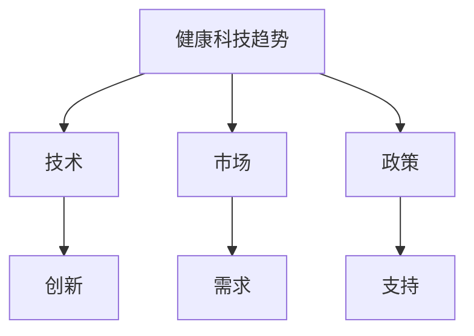
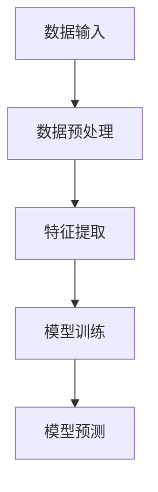
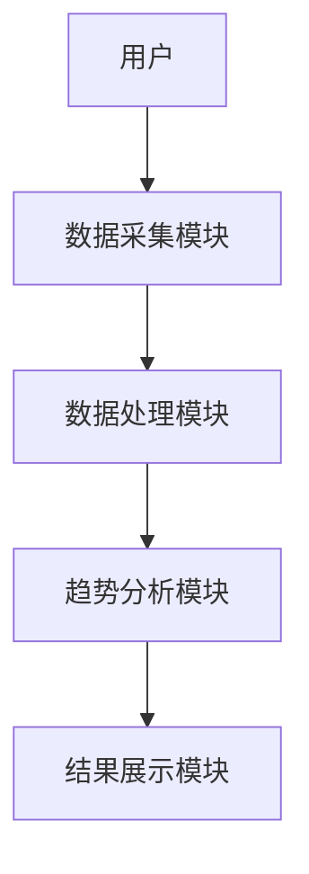
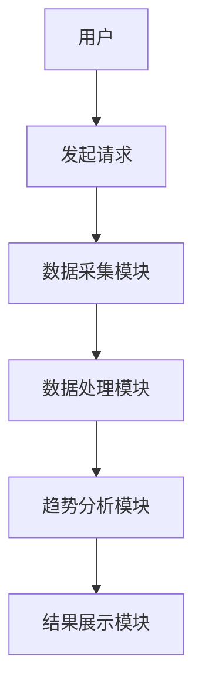

                 


# 价值投资中的健康科技趋势分析

> **关键词**：价值投资、健康科技、趋势分析、时间序列分析、机器学习、健康科技系统架构

> **摘要**：本文从价值投资的角度，详细分析健康科技领域的趋势，探讨健康科技的定义与发展，解析趋势分析的核心概念与联系，深入讲解算法原理，并结合系统架构设计与项目实战，为读者提供全面的健康科技趋势分析方法论。

---

# 第1章: 健康科技的定义与发展

## 1.1 健康科技的定义与核心要素

健康科技是结合健康与科技的新兴领域，涵盖医疗、生物科技、健康管理等多个方面。其核心要素包括：

1. **技术创新**：如人工智能、大数据、区块链等技术在健康领域的应用。
2. **市场需求**：人们对健康生活的追求推动了健康科技的发展。
3. **政策支持**：政府政策对健康科技行业的规范与促进。

---

## 1.2 价值投资的基本概念

价值投资是一种长期投资策略，关注标的物的内在价值，寻找市场价格低于内在价值的投资机会。其核心原则包括：

1. **长期视角**：关注企业的长期价值，而非短期波动。
2. **基本面分析**：通过财务报表等信息评估企业的内在价值。
3. **安全边际**：在价格低于内在价值时买入，降低风险。

---

## 1.3 健康科技与价值投资的结合背景

随着人们对健康的重视，健康科技行业快速发展，成为价值投资的新蓝海。以下是其结合的背景分析：

1. **健康科技行业的现状**：行业增长迅速，市场规模不断扩大。
2. **价值投资在健康科技中的应用前景**：健康科技行业的长期增长潜力吸引了投资者。
3. **健康科技趋势分析的必要性**：通过趋势分析，投资者可以更精准地选择投资标的。

---

## 1.4 本章小结

本章主要介绍了健康科技的定义与发展，价值投资的基本概念，以及两者结合的背景。通过这些分析，读者可以理解健康科技趋势分析的重要性。

---

# 第2章: 健康科技趋势分析的核心概念与联系

## 2.1 健康科技趋势分析的原理

健康科技趋势分析基于数据驱动的方法，结合技术与市场因素，预测行业发展趋势。其分析方法包括：

1. **数据驱动**：通过大量数据挖掘和分析，发现行业趋势。
2. **技术驱动**：借助人工智能、大数据等技术，提高分析效率。
3. **市场驱动**：关注市场需求变化，指导趋势预测。

---

## 2.2 健康科技趋势分析的核心要素

健康科技趋势分析的核心要素包括技术创新、市场需求和政策支持。以下是不同健康科技领域的特征对比：

| 领域     | 技术创新 | 市场需求 | 政策支持 |
|----------|----------|----------|----------|
| 医疗科技 | 高       | 中       | 高       |
| 生物科技 | 中       | 高       | 高       |
| 健康管理 | 低       | 高       | 中       |

---

## 2.3 健康科技趋势分析的特征对比

不同健康科技领域的特征对比：

| 领域     | 技术创新 | 市场需求 | 政策支持 |
|----------|----------|----------|----------|
| 医疗科技 | 高       | 中       | 高       |
| 生物科技 | 中       | 高       | 高       |
| 健康管理 | 低       | 高       | 中       |

---

## 2.4 健康科技趋势分析的ER实体关系图



---

## 2.5 本章小结

本章通过分析健康科技趋势分析的核心概念与联系，帮助读者理解健康科技趋势分析的关键要素和不同领域的特征对比。

---

# 第3章: 健康科技趋势分析的算法原理

## 3.1 时间序列分析

时间序列分析是一种常用的趋势预测方法，其步骤如下：

1. **数据收集**：收集健康科技行业的历史数据。
2. **数据预处理**：清洗数据，处理缺失值和异常值。
3. **模型选择**：根据数据特征选择合适的模型，如ARIMA模型。
4. **模型训练**：使用训练数据训练模型。
5. **模型预测**：基于训练好的模型进行未来趋势预测。

---

## 3.2 机器学习算法在健康科技趋势分析中的应用

机器学习算法在健康科技趋势分析中的应用包括：

1. **监督学习**：如线性回归、支持向量机（SVM）。
2. **无监督学习**：如聚类分析。
3. **深度学习**：如神经网络。

---

## 3.3 健康科技趋势分析的数学模型

1. **ARIMA模型**：用于时间序列分析。
   $$ ARIMA(p, d, q) $$
2. **神经网络模型**：用于复杂趋势预测。
   $$ y = f(x) $$

---

## 3.4 健康科技趋势分析的算法流程图



---

## 3.5 本章小结

本章详细讲解了健康科技趋势分析的算法原理，包括时间序列分析和机器学习算法的应用，并通过数学模型和流程图帮助读者理解分析过程。

---

# 第4章: 健康科技趋势分析的系统架构设计

## 4.1 系统功能设计

健康科技趋势分析系统的功能模块包括：

1. **数据采集模块**：采集健康科技行业的相关数据。
2. **数据处理模块**：对数据进行清洗和预处理。
3. **趋势分析模块**：基于算法进行趋势预测。
4. **结果展示模块**：将分析结果以图表形式展示。

---

## 4.2 系统架构设计



---

## 4.3 系统接口设计

1. **数据接口**：提供API接口，供其他系统调用数据。
2. **分析接口**：提供趋势分析结果的接口。
3. **展示接口**：提供图表展示的接口。

---

## 4.4 系统交互流程图



---

## 4.5 本章小结

本章通过系统架构设计，展示了健康科技趋势分析系统的整体结构和功能模块，为实际应用提供了参考。

---

# 第5章: 健康科技趋势分析的项目实战

## 5.1 环境安装与配置

1. **安装Python**：确保安装最新版本的Python。
2. **安装依赖库**：如Pandas、NumPy、Scikit-learn等。

## 5.2 系统核心实现源代码

```python
import pandas as pd
from sklearn.model_selection import train_test_split
from sklearn.linear_model import LinearRegression

# 数据加载
data = pd.read_csv('health_tech_data.csv')

# 数据预处理
X = data[['revenue', 'profit']]
y = data['growth']

# 数据分割
X_train, X_test, y_train, y_test = train_test_split(X, y, test_size=0.2, random_state=42)

# 模型训练
model = LinearRegression()
model.fit(X_train, y_train)

# 模型预测
y_pred = model.predict(X_test)
```

---

## 5.3 代码实现与解读

1. **数据加载**：使用Pandas加载CSV格式的数据。
2. **数据预处理**：提取特征变量和目标变量。
3. **数据分割**：将数据分为训练集和测试集。
4. **模型训练**：使用线性回归模型进行训练。
5. **模型预测**：基于测试集进行预测。

---

## 5.4 案例分析与实际应用

通过实际案例分析，验证模型的预测效果。例如，分析某健康科技企业的数据，预测其未来的增长趋势。

---

## 5.5 本章小结

本章通过项目实战，展示了健康科技趋势分析的具体实现过程，帮助读者理解如何将理论应用于实际。

---

# 第6章: 最佳实践与注意事项

## 6.1 最佳实践

1. **数据质量**：确保数据的准确性和完整性。
2. **模型选择**：根据数据特征选择合适的模型。
3. **结果验证**：通过交叉验证等方法验证模型的准确性。

---

## 6.2 小结

健康科技趋势分析是一项复杂但 rewarding 的任务，通过本文的分析，读者可以掌握其核心方法和实现步骤。

---

## 6.3 注意事项

1. **数据隐私**：注意保护数据隐私，遵守相关法律法规。
2. **模型局限性**：认识到模型的局限性，避免过度依赖。

---

## 6.4 拓展阅读

建议读者进一步阅读相关书籍和论文，深入理解健康科技趋势分析的理论与实践。

---

# 附录

## 附录A: 常见问题解答

1. **健康科技趋势分析的核心要素是什么？**
   - 核心要素包括技术创新、市场需求和政策支持。

2. **如何选择合适的算法？**
   - 根据数据特征和问题类型选择合适的算法。

---

## 附录B: 参考文献

1. 时间序列分析的相关文献。
2. 机器学习在健康科技中的应用文献。

---

**总结**：通过本文的分析，读者可以全面了解健康科技趋势分析的核心概念、算法原理和系统架构设计，并通过项目实战掌握实际应用方法。希望本文能为价值投资者提供有益的参考。

