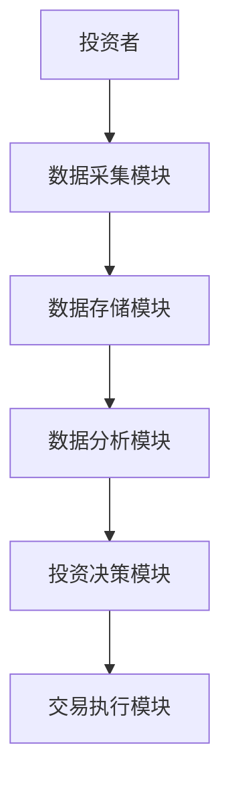
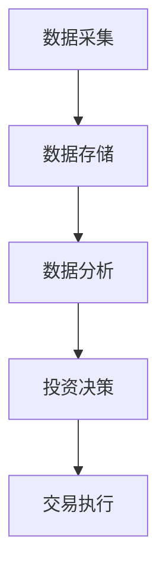

                 


# 价值投资中的全球视野：跨境投资的机遇与挑战

> 关键词：价值投资，全球视野，跨境投资，风险管理，资产配置，对冲策略

> 摘要：  
> 在全球化不断深化的背景下，价值投资已不再局限于单一市场，而是扩展到全球视野下的跨境投资。本文从价值投资的核心概念出发，探讨如何在全球范围内寻找投资机会，分析跨境投资的策略与挑战，包括市场分析、资产配置、风险管理等方面，并结合实际案例和系统架构，为投资者提供实践指导。通过本文的系统化分析，读者将能够更好地理解如何在国际化背景下进行有效的价值投资。

---

## 第一章：价值投资的核心概念与全球视野的引入

### 1.1 价值投资的基本定义与原则

价值投资是一种以基本面分析为基础的投资策略，强调以低于内在价值的价格买入优质资产。其核心原则包括：

1. **安全边际**：买入价格低于内在价值，以确保投资的安全性。
2. **长期视角**：关注企业的长期盈利能力，而非短期市场波动。
3. **企业基本面分析**：通过财务报表、行业地位、竞争优势等指标评估企业的内在价值。

价值投资的创始人本杰明·格雷厄姆曾提出“margin of safety”（安全边际）的概念，强调在价格低于内在价值时买入资产，以降低投资风险。

### 1.2 全球化视角下的价值投资

随着经济全球化的深入发展，市场的互联互通使得投资者能够在全球范围内配置资产。全球视野下的价值投资不仅仅是关注单一市场，而是通过分析全球市场的经济周期、行业趋势和企业基本面，寻找具有持续竞争优势的企业。

#### 1.2.1 全球化投资的背景与趋势

1. **经济全球化**：跨国公司和全球供应链的形成，使得企业的经营不再局限于单一市场。
2. **市场开放**：各国资本市场的开放，降低了跨境投资的门槛。
3. **技术进步**：互联网和大数据技术的普及，使得全球市场信息更加透明。

#### 1.2.2 跨境投资的核心要素

1. **市场分析**：研究不同市场的经济周期、政策环境和行业趋势。
2. **资产配置**：在不同市场之间分散投资，降低风险。
3. **风险管理**：应对汇率波动、地缘政治等全球性风险。

### 1.3 价值投资与全球视野的结合

1. **全球经济周期**：全球经济的增长和衰退周期对投资策略有重要影响。例如，在全球经济衰退期间，具有防御性的行业（如公用事业、医疗保健）可能表现较好。
2. **市场结构差异**：不同市场的监管政策、税率、流动性等差异会影响投资决策。
3. **文化与政策差异**：例如，新兴市场的政策不确定性较高，但在某些行业（如科技、消费）可能有更高的增长潜力。

---

## 第二章：跨境投资的市场分析与资产配置

### 2.1 全球主要市场的经济特征与投资机会

1. **美国市场**：作为全球最大的资本市场，美国市场的科技、消费和金融行业具有较高的投资价值。
2. **欧洲市场**：欧洲市场在制造业和服务业方面具有优势，同时需要关注地缘政治风险（如俄乌冲突）。
3. **亚洲市场**：新兴市场如中国、印度等增长潜力大，但政策风险较高。

#### 2.1.1 美国市场的科技与消费行业

- **科技行业**：美国的科技公司在全球具有领先地位，如苹果、谷歌、亚马逊等。
- **消费行业**：美国的消费市场成熟，品牌忠诚度高，如可口可乐、麦当劳等。

#### 2.1.2 欧洲市场的制造业与服务业

- **制造业**：德国的汽车制造和高端装备制造具有全球竞争力。
- **服务业**：英国的金融服务业和法国的文化产业具有独特优势。

#### 2.1.3 亚洲市场的新兴行业

- **科技与互联网**：中国的科技巨头（如腾讯、阿里巴巴）在全球具有重要地位。
- **消费与制造业**：印度的IT服务和制造业增长迅速。

### 2.2 跨境资产配置的原理与方法

1. **分散化原则**：通过在全球范围内配置资产，降低单一市场风险。
2. **资产类别选择**：包括股票、债券、房地产、商品等多种资产类别。
3. **动态调整**：根据全球经济环境的变化，定期调整资产配置比例。

#### 2.2.1 资产配置的数学模型

假设投资者有100万美元可用于配置，根据全球经济环境，决定将60%投资于股票、30%投资于债券、10%投资于黄金。

- 股票：60%（包括20%美国股票、20%欧洲股票、20%亚洲股票）
- 债券：30%（包括20%美国国债、10%欧洲国债）
- 黄金：10%

数学公式表示为：
$$
\text{资产配置比例} = \{ \text{股票：60\%}, \text{债券：30\%}, \text{黄金：10\%} \}
$$

### 2.3 行业研究与个股选择的全球化视角

1. **行业周期分析**：在全球范围内分析行业的生命周期，寻找具有增长潜力的行业。
2. **竞争优势分析**：关注具有全球竞争优势的企业，如品牌、技术、成本优势等。
3. **管理层能力**：优秀的管理层是企业长期成功的关键因素。

#### 2.3.1 全球行业周期分析

- **科技行业**：处于成长期，技术创新驱动增长。
- **能源行业**：受地缘政治和能源转型影响较大，需关注可持续发展。
- **消费行业**：需求稳定，适合长期投资。

#### 2.3.2 竞争优势分析

以苹果公司为例，其竞争优势包括技术创新、品牌影响力和全球销售渠道。这些优势使其在全球市场上具有强大的竞争力。

---

## 第三章：跨境投资中的风险管理与对冲策略

### 3.1 跨境投资的主要风险因素

1. **汇率风险**：汇率波动可能影响投资收益。
2. **市场波动风险**：全球市场的不确定性可能导致资产价格波动。
3. **政策风险**：各国政策变化可能影响投资环境。

#### 3.1.1 汇率风险的数学模型

假设投资者将100万美元投资于欧元区市场，欧元对美元的汇率为1.2。如果汇率波动导致欧元贬值10%，投资者的损失为：
$$
\text{损失金额} = 100 \times 1.2 \times 0.1 = 12 \text{万美元}
$$

### 3.2 风险管理的理论与实践

1. **分散化**：通过投资不同市场和资产类别，降低风险。
2. **对冲策略**：使用金融衍生品（如期货、期权）对冲汇率和市场风险。

#### 3.2.1 期货对冲的数学模型

假设投资者持有价值100万美元的欧元区股票，使用欧元对美元期货合约进行对冲。假设期货价格与股票价格波动相关性为0.8，对冲后的风险降低。

---

## 第四章：系统架构与技术实现

### 4.1 跨境投资系统的功能设计

1. **数据采集**：收集全球市场的实时数据，包括股票价格、汇率、经济指标等。
2. **数据分析**：通过算法分析数据，识别投资机会和风险。
3. **投资决策**：基于分析结果，生成投资策略。

#### 4.1.1 数据流的系统架构

使用Mermaid图表示系统的数据流：



### 4.2 技术实现细节

1. **数据采集模块**：使用API接口获取全球市场的实时数据。
2. **数据分析模块**：利用Python和Pandas进行数据清洗和分析。
3. **投资决策模块**：基于机器学习算法（如随机森林、支持向量机）进行预测。

#### 4.2.1 数据分析的Python代码

```python
import pandas as pd
import numpy as np

# 示例数据：全球主要指数的收益率
data = {
    '美国市场': [0.05, 0.03, 0.02, 0.04],
    '欧洲市场': [0.03, 0.02, 0.05, 0.01],
    '亚洲市场': [0.02, 0.04, 0.03, 0.06]
}

df = pd.DataFrame(data)
print(df)
```

### 4.3 系统架构设计

1. **系统功能模块**：数据采集、存储、分析、决策、执行。
2. **系统架构图**



---

## 第五章：项目实战与案例分析

### 5.1 背景介绍

假设我们是一家管理1000万美元的机构投资者，目标是通过跨境投资实现资产的保值增值。

### 5.2 实战步骤

1. **市场分析**：分析全球主要市场的经济周期和行业趋势。
2. **资产配置**：根据分析结果，制定资产配置方案。
3. **风险管理**：使用金融衍生品对冲汇率和市场风险。

#### 5.2.1 资产配置方案

- 60%股票：20%美国股票、20%欧洲股票、20%亚洲股票
- 30%债券：20%美国国债、10%欧洲国债
- 10%黄金

### 5.3 案例分析

以2020年新冠疫情为例，分析全球经济衰退期间的资产配置策略。

1. **市场表现**：
   - 美国市场：科技股表现强劲。
   - 欧洲市场：制造业受到较大冲击。
   - 亚洲市场：中国经济复苏较快。

2. **投资策略调整**：
   - 增加对美国科技股的配置。
   - 减少对欧洲制造业股票的配置。
   - 增加对亚洲市场的配置。

---

## 第六章：最佳实践与小结

### 6.1 最佳实践

1. **长期视角**：关注企业的长期价值，而非短期市场波动。
2. **风险管理**：使用金融衍生品对冲风险，保持资产配置的灵活性。
3. **持续学习**：全球经济环境不断变化，投资者需要持续学习和调整策略。

### 6.2 小结

在全球化背景下，价值投资需要具备全球视野，关注全球市场的经济周期、行业趋势和企业基本面。通过科学的资产配置和风险管理，投资者可以在跨境投资中抓住机遇，规避风险。

---

## 附录

### 附录A：术语表

- **内在价值**：企业未来现金流的现值。
- **安全边际**：买入价格低于内在价值的差额。
- **分散化**：通过投资不同资产降低风险。

### 附录B：参考文献

1. 格雷厄姆《证券分析》
2. 巴菲特《致股东的信》
3. 罗伯特·席勒《非理性繁荣》

---

通过以上系统的分析和实践，投资者可以更好地在全球视野下进行价值投资，抓住跨境投资的机遇，应对复杂的市场挑战。

