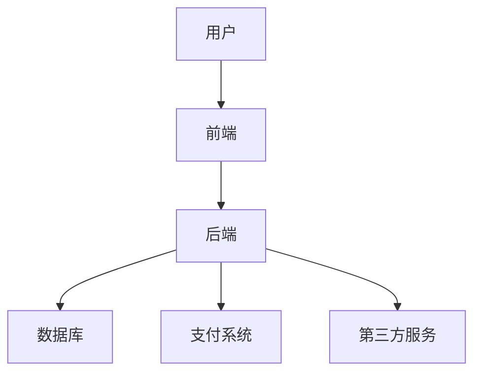

                 


# 价值投资中的共享经济机会

## 关键词
价值投资，共享经济，投资机会，风险管理，系统设计，项目实战

## 摘要
本文深入探讨了价值投资与共享经济的结合，分析共享经济的商业模式及其投资机会，通过系统设计和项目实战，展示如何在共享经济中寻找投资机会并进行风险管理。

---

## 第一部分: 共享经济概述

### 第1章: 共享经济的起源与发展

#### 1.1 共享经济的定义与起源
共享经济是一种基于共享资源使用权的经济模式，通过数字化平台连接供需双方，实现资源的高效利用。其起源可追溯到2008年金融危机后，共享经济作为一种替代传统消费模式的经济模式兴起。

#### 1.2 共享经济的核心特征
- **资源使用权共享**：用户按需使用资源，而非拥有资源。
- **技术驱动**：依赖互联网和移动应用平台实现供需匹配。
- **去中心化**：通过平台实现资源的分散式共享。

#### 1.3 共享经济的模式对比
| 模式类型 | 描述 | 代表企业 |
|----------|------|----------|
| 资产共享 | 用户共享闲置资产，如共享汽车、民宿 | 滴滴、Airbnb |
| 服务共享 | 用户共享技能或时间，提供服务 | 接送服务、家教平台 |

### 第2章: 价值投资的基本原理

#### 2.1 价值投资的定义与核心理念
价值投资是一种投资策略，强调以低于内在价值的价格购买优质资产。核心理念是寻找市场低估的公司，长期持有，获得超额收益。

#### 2.2 共享经济与价值投资的结合点
- **资产高效利用**：共享经济通过提高资源利用率，降低单位成本。
- **网络效应**：平台规模越大，边际成本越低，收益增长更快。
- **护城河**：优秀的共享经济平台往往具有强大的网络效应和品牌优势。

---

## 第二部分: 共享经济中的投资机会分析

### 第3章: 共享经济的商业模式与价值投资策略

#### 3.1 共享经济的主要商业模式
- **资产共享模式**：用户通过平台分享闲置资产，如共享汽车、共享办公空间。
- **服务共享模式**：提供服务而非产品，如家教、保洁服务。
- **平台共享模式**：搭建平台，连接供需双方，抽取佣金或服务费。

#### 3.2 价值投资的核心策略
- **评估资产价值**：分析共享经济平台的资产质量、使用效率和变现能力。
- **分析用户增长**：关注平台用户活跃度和增长率，用户规模是平台价值的重要指标。
- **考察运营效率**：评估平台的运营成本、订单履约率和用户体验。

### 第4章: 共享经济中的投资机会分析

#### 4.1 共享经济的主要行业分析
- **出行共享行业**：分析滴滴出行的市场占有率、用户增长和盈利能力。
- **住宿共享行业**：评估Airbnb的市场份额、用户体验和平台扩张能力。
- **共享办公空间**：考察WeWork的商业模式、用户需求和市场前景。

#### 4.2 企业案例分析
- **滴滴出行**：通过数据分析其市场地位、用户规模和盈利模式。
- **Airbnb**：分析其在全球民宿市场的布局和竞争优势。
- **共享办公空间**：比较不同平台的租金结构、服务内容和用户反馈。

---

## 第三部分: 共享经济中的风险管理与投资策略

### 第5章: 共享经济中的风险管理

#### 5.1 共享经济中的主要风险
- **市场风险**：市场需求波动、竞争加剧。
- **运营风险**：平台运营成本高、用户体验差。
- **政策风险**：政府监管加强、法律法规变化。

#### 5.2 价值投资中的风险管理策略
- **风险评估模型**：构建包含市场、运营和政策风险的多因素评估模型。
- **风险分散策略**：通过投资不同行业的共享经济平台，分散风险。
- **风险应对措施**：制定应对政策变化的策略，如多元化投资。

### 第6章: 共享经济的系统分析与架构设计

#### 6.1 系统功能设计
- **用户需求分析**：识别用户的使用场景和需求，设计用户界面和功能模块。
- **平台功能设计**：包括用户注册、信息发布、订单管理、支付结算等功能。
- **交易流程设计**：优化交易流程，提升用户体验和平台效率。

#### 6.2 系统架构设计


---

## 第四部分: 价值投资中的共享经济项目实战

### 第7章: 项目环境安装与配置

#### 7.1 开发环境搭建
- **操作系统**：建议使用macOS或Linux系统。
- **编程语言**：推荐使用Python和JavaScript。
- **开发工具**：安装Jupyter Notebook、PyCharm等开发工具。

#### 7.2 依赖库安装
- **Python依赖**：使用pip安装numpy、pandas、matplotlib等库。
- **其他工具**：安装PostgreSQL数据库和Redis缓存。

### 第8章: 项目核心实现

#### 8.1 核心算法实现
```python
import numpy as np
import pandas as pd

def calculate_intrinsic_value(revenue, profit_margin, roe):
    # 计算内在价值的简化模型
    return revenue * profit_margin * roe

revenue = 1000000000
profit_margin = 0.2
roe = 0.15

intrinsic_value = calculate_intrinsic_value(revenue, profit_margin, roe)
print(f"内在价值为：{intrinsic_value}")
```

#### 8.2 系统接口设计
- **用户接口**：API接口用于用户注册、登录、发布资源。
- **平台接口**：API接口用于处理订单、支付、反馈评价。

### 第9章: 项目案例分析与总结

#### 9.1 案例分析
以滴滴出行为例，分析其市场地位、用户增长和盈利能力，评估其投资价值。

#### 9.2 项目总结
通过项目实战，验证共享经济平台的价值评估方法和风险管理策略，总结经验教训，提出改进建议。

---

## 总结
通过系统分析和项目实战，本文详细探讨了价值投资在共享经济中的机会与挑战，帮助投资者在共享经济浪潮中找到可靠的投资机会，实现长期稳定的收益。

