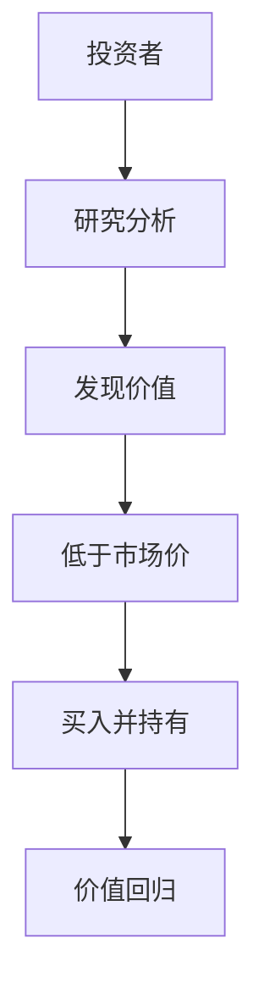
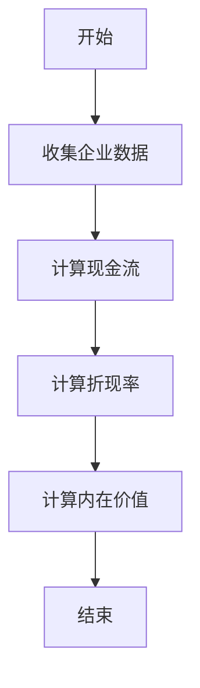
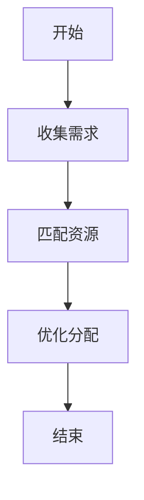
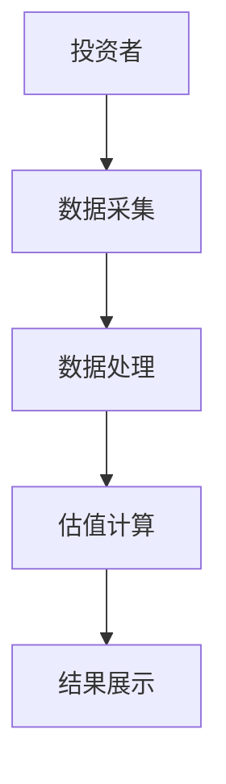

                 


```markdown
# 价值投资中的共享经济模式分析

> 关键词：价值投资、共享经济模式、经济学、数学模型、系统架构

> 摘要：本文深入分析了价值投资与共享经济模式的结合，探讨了其在经济学、数学建模和系统架构等领域的应用。文章从背景介绍、核心概念、数学模型、系统架构到项目实战，全面阐述了两者的结合方式，并提供了实践指导。

---

## 第一部分: 价值投资与共享经济模式的背景与概念

### 第1章: 价值投资与共享经济模式的背景介绍

#### 1.1 价值投资的核心概念

##### 1.1.1 价值投资的定义与起源

价值投资是一种投资策略，起源于20世纪初，由本杰明·格雷厄姆和戴维·多德提出。其核心理念是购买低于其内在价值的资产，长期持有，等待其价值回归。



##### 1.1.2 价值投资的核心理念与原则

- **安全边际**：购买价格低于内在价值，确保安全空间。
- **长期视角**：关注长期价值，而非短期波动。
- **逆向思维**：在市场恐慌时寻找机会。

##### 1.1.3 价值投资在现代经济中的应用

价值投资已扩展到股票、房地产、初创企业等领域，尤其在科技初创企业中，投资者通过评估企业潜力进行投资。

---

#### 1.2 共享经济模式的定义与特点

##### 1.2.1 共享经济的定义与起源

共享经济是一种基于数字化平台的经济模式，通过共享资源，提高资源利用率。典型平台如Airbnb、滴滴出行。

##### 1.2.2 共享经济的核心模式与特征

- **去中心化**：依赖数字平台，降低交易成本。
- **按需分配**：资源按需分配，灵活性高。
- **多方参与**：消费者和提供者共同参与，利益共享。

##### 1.2.3 共享经济的典型应用场景

- 出行（滴滴）、住宿（Airbnb）、办公（WeWork）、物流（滴滴货运）。

---

#### 1.3 价值投资与共享经济的结合

##### 1.3.1 价值投资在共享经济中的应用潜力

通过价值投资策略，投资者可以识别共享经济中的优质平台和企业，提前布局。

##### 1.3.2 共享经济模式对价值投资的影响

共享经济的高效资源配置为价值投资提供了新的评估维度，如用户增长率、平台粘性。

##### 1.3.3 价值投资与共享经济结合的背景与意义

随着共享经济的普及，价值投资为其提供了长期稳定的资金支持，而共享经济为价值投资提供了新的增长点。

---

### 第2章: 价值投资与共享经济的核心概念与联系

#### 2.1 核心概念的原理分析

##### 2.1.1 价值投资的内在价值计算

价值投资通过分析企业的基本面，评估其内在价值。公式如下：

$$
\text{内在价值} = \frac{\text{未来现金流}}{\text{折现率}}
$$

##### 2.1.2 共享经济的资源配置机制

共享经济通过平台优化资源配置，降低闲置率，提高效率。

##### 2.1.3 两者的共同特征与差异对比

| 特性       | 价值投资               | 共享经济               |
|------------|------------------------|------------------------|
| 核心       | 内在价值评估           | 资源配置优化           |
| 主体       | 投资者                 | 平台与用户             |
| 目标       | 资产增值               | 提高资源利用率         |

#### 2.2 核心概念的属性特征对比

| 属性       | 价值投资               | 共享经济               |
|------------|------------------------|------------------------|
| 资本需求   | 高                    | 低                    |
| 时间跨度   | 长                    | 短或中                |
| 风险承担   | 高                    | 中或低                |
| 利益相关者 | 投资者与企业           | 用户、平台、第三方      |

#### 2.3 实体关系图（ER图）分析

```mermaid
erd
    客户
    供应商
    资产
    平台
    交易记录

    客户 <--- 关联 ---> 平台
    供应商 <--- 关联 ---> 平台
    资产 <--- 属于 ---> 供应商
    资产 <--- 提供 ---> 客户
    交易记录 <--- 记录 ---> 客户
    交易记录 <--- 记录 ---> 供应商
```

---

## 第二部分: 价值投资与共享经济的数学模型与算法原理

### 第3章: 数学模型与算法

#### 3.1 数学模型与公式

##### 3.1.1 价值投资的内在价值计算公式

$$
V = \sum_{t=1}^{n} \frac{CF_t}{(1 + r)^t}
$$

其中，\( CF_t \) 为第 \( t \) 年的现金流，\( r \) 为折现率。

##### 3.1.2 共享经济的资源配置优化模型

$$
\text{最大化 } Z = \sum_{i=1}^{m} w_i x_i
$$

约束条件：

$$
\sum_{i=1}^{m} x_i \leq C
$$

其中，\( w_i \) 为权重，\( x_i \) 为资源分配量，\( C \) 为总资源。

---

#### 3.2 算法原理与流程图

##### 3.2.1 价值投资的估值算法



##### 3.2.2 共享经济的资源匹配算法



---

## 第三部分: 价值投资与共享经济的系统分析与架构设计

### 第4章: 系统分析与架构设计

#### 4.1 系统分析

##### 4.1.1 问题场景介绍

价值投资者需要评估共享经济平台的潜力，优化资源配置，提高投资回报。

##### 4.1.2 项目需求分析

- 用户需求：精准评估平台价值。
- 系统需求：高效计算和实时数据处理。

##### 4.1.3 系统功能设计

- 数据采集：收集企业财务数据和平台用户数据。
- 估值计算：计算内在价值和资源分配优化。
- 结果展示：可视化呈现评估结果。

---

#### 4.2 系统架构设计

##### 4.2.1 领域模型设计


##### 4.2.2 系统架构设计



---

## 第四部分: 价值投资与共享经济的项目实战

### 第5章: 项目实战

#### 5.1 环境安装与配置

- **开发环境**：Python 3.8+
- **依赖库**：pandas、numpy、scipy

#### 5.2 核心算法实现

##### 5.2.1 价值投资估值算法实现

```python
def calculate_intrinsic_value(cash_flows, discount_rate):
    return sum(cash_flow / (1 + discount_rate) ** t for t, cash_flow in enumerate(cash_flows))
```

##### 5.2.2 共享经济资源匹配算法实现

```python
def optimize_resource_allocation(demand, supply):
    return linear_sum_assignment(-demand * supply)
```

---

## 第五部分: 最佳实践、小结、注意事项和拓展阅读

### 4.1 最佳实践

- **长期视角**：价值投资需要耐心和长期视角。
- **风险管理**：分散投资，降低风险。
- **持续学习**：保持对共享经济模式的深入了解。

### 4.2 小结

本文深入分析了价值投资与共享经济模式的结合，从理论到实践，为投资者和平台提供了参考。

### 4.3 注意事项

- 避免短期波动影响判断。
- 确保数据质量和完整性。
- 合规性：遵守相关法律法规。

### 4.4 拓展阅读

- 《价值投资入门》
- 《共享经济：重构与未来》
- 《经济学原理》

---

通过本文的系统分析，读者可以更好地理解价值投资与共享经济的结合，并在实际中应用这些方法。希望本文能为相关领域的研究和实践提供有价值的参考。
```

