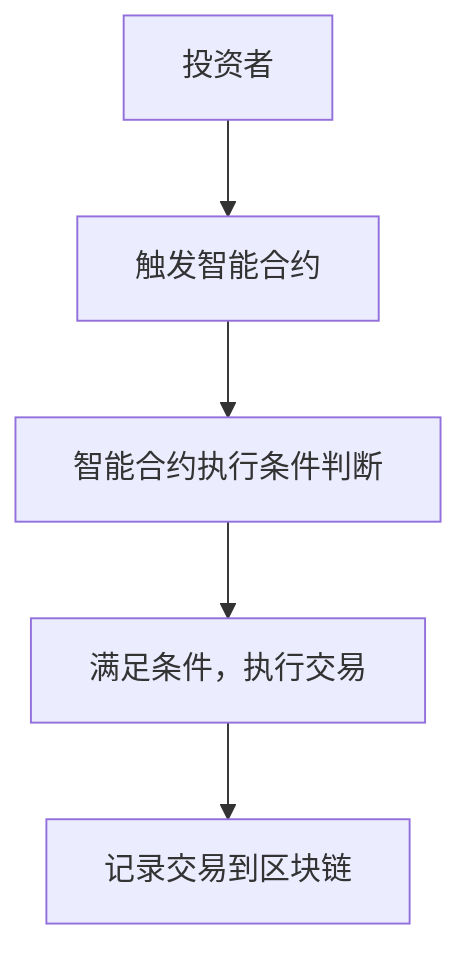

                 


# 价值投资中的区块链技术应用

---

## 关键词：
区块链技术、价值投资、分布式账本、智能合约、共识机制、DeFi、投资分析

---

## 摘要：
本文探讨区块链技术在价值投资中的应用，分析其如何提升投资透明度、安全性和效率。通过区块链技术，投资者可以实现资产的分布式记账、智能合约自动化执行以及去中心化的交易，从而优化投资流程并降低信任风险。

---

# 第一部分：背景介绍

## 第1章：区块链技术的基本概念

### 1.1 区块链的定义与特点
区块链是一种去中心化的分布式账本技术，通过密码学保证数据的安全性和不可篡改性。其特点包括：
- **去中心化**：无需依赖中央机构，通过节点网络达成共识。
- **不可篡改**：数据一旦写入区块链，难以被修改。
- **透明性**：所有交易记录公开可查，确保透明度。

### 1.2 价值投资的基本原理
价值投资是一种长期投资策略，强调通过基本面分析寻找被低估的资产。其核心在于识别资产的内在价值，并在价格低于价值时进行投资。传统价值投资依赖于市场参与者的信任和中介结构，而区块链技术可以优化这一过程。

### 1.3 区块链技术对价值投资的影响
区块链技术为价值投资提供了新的工具和平台，能够实现以下目标：
- 提高交易透明度。
- 降低交易成本。
- 提升投资组合管理效率。

---

## 第2章：区块链与价值投资的结合

### 2.1 区块链在金融资产中的应用
区块链可以用于记录和转移各种金融资产，如股票、债券和基金份额。通过智能合约自动执行投资协议，减少人为干预和错误。

### 2.2 区块链在投资风险管理中的应用
区块链技术能够实时监控投资组合的风险，通过智能合约自动调整投资策略，从而降低市场波动带来的影响。

### 2.3 区块链在价值发现中的应用
通过区块链技术，投资者可以实时获取全球市场的数据，分析潜在投资标的的内在价值，从而做出更明智的投资决策。

---

# 第二部分：核心概念与技术原理

## 第3章：分布式账本技术

### 3.1 分布式账本的定义与特点
分布式账本是一种在多个节点上同步记录的账本，具有高冗余性和抗单点故障的特点。

### 3.2 分布式账本在价值投资中的应用
- **资产记录**：记录投资者持有的资产，确保数据的准确性和安全性。
- **交易结算**：实现快速、透明的资产转移，减少结算时间和成本。

### 3.3 分布式账本的安全性分析
通过密码学算法确保数据的安全性，防止未经授权的修改和访问。

---

## 第4章：共识机制

### 4.1 共识机制的定义与分类
共识机制是区块链节点达成一致的方法，常见的包括工作量证明（PoW）、权益证明（PoS）和拜占庭容错（BFT）。

### 4.2 共识机制在价值投资中的应用
- **交易验证**：确保每一笔交易的真实性和合法性。
- **账本同步**：保证所有节点上的账本一致，维护系统的稳定性。

### 4.3 不同共识机制的优缺点比较

| 共识机制 | 优点                          | 缺点                          |
|----------|-------------------------------|-------------------------------|
| PoW     | 安全性高，去中心化              | 能耗高，效率低                 |
| PoS     | 能耗低，效率高                 | 中心化风险较高                 |
| BFT      | 效率高，适合大-scale网络       | 对节点信任度要求较高           |

---

## 第5章：智能合约

### 5.1 智能合约的定义与特点
智能合约是一种自动执行的计算机程序，部署在区块链上，根据预设条件自动触发相应的操作。

### 5.2 智能合约在价值投资中的应用
- **自动投资**：根据市场变化自动执行买卖指令。
- **风险管理**：设定止损点，自动平仓，降低投资风险。

### 5.3 智能合约的工作流程



---

# 第三部分：系统分析与架构设计

## 第6章：区块链价值投资系统的架构设计

### 6.1 系统功能设计
- **资产发行**：允许投资者在区块链上发行和转让资产。
- **投资管理**：通过智能合约实现自动化的投资组合管理。
- **风险管理**：实时监控市场波动，调整投资策略。

### 6.2 系统架构设计


### 6.3 系统交互设计

```mermaid
sequence-diagram
投资者->API Gateway: 发起投资请求
API Gateway->Backend: 处理请求
Backend->Blockchain Nodes: 部署智能合约
Blockchain Nodes->Database: 更新资产记录
Database->Backend: 返回确认信息
Backend->投资者: 确认投资结果
```

---

## 第7章：项目实战

### 7.1 智能合约开发

#### 7.1.1 环境安装
```bash
npm install -g truffle
```

#### 7.1.2 智能合约实现

```solidity
// SPDX-License-Identifier: MIT
pragma solidity ^0.8.0;

contract Investment {
    uint256 public totalInvestment;
    address payable public investor;

    function invest() public payable {
        require(msg.value > 0, "Investment amount must be greater than 0");
        investor.transfer(msg.value);
        totalInvestment += msg.value;
    }

    function withdraw(uint256 amount) public {
        require(investor == msg.sender, "Only investor can withdraw funds");
        require(amount <= totalInvestment, "Cannot withdraw more than total investment");
        payable(msg.sender).transfer(amount);
        totalInvestment -= amount;
    }
}
```

#### 7.1.3 功能解读
- `invest`函数：允许投资者注入资金。
- `withdraw`函数：允许投资者提取指定金额。

### 7.2 实际案例分析
以DeFi平台为例，投资者通过智能合约自动执行投资协议，实现无信任的资产管理和交易。

---

## 第8章：最佳实践与总结

### 8.1 最佳实践
- **安全性**：确保智能合约代码经过严格审计。
- **合规性**：遵守当地金融法规，避免法律风险。
- **可扩展性**：选择适合的共识机制，确保系统的高性能。

### 8.2 本章小结
区块链技术为价值投资提供了新的可能性，通过智能合约和分布式账本实现更高效、更安全的投资流程。

### 8.3 注意事项
- 投资者需具备相关技术知识，或依赖专业团队进行操作。
- 选择可靠的区块链平台，确保系统的稳定性和安全性。

### 8.4 拓展阅读
- 推荐阅读《Mastering Blockchain》和《The Definitive Guide to DeFi》。

---

# 结语
区块链技术正在改变金融行业的运作方式，为价值投资带来了前所未有的机遇。通过区块链技术，投资者可以实现更高效、更透明、更安全的投资流程。未来，随着技术的进一步发展，区块链在价值投资中的应用将更加广泛和深入。

--- 

（全文完）

