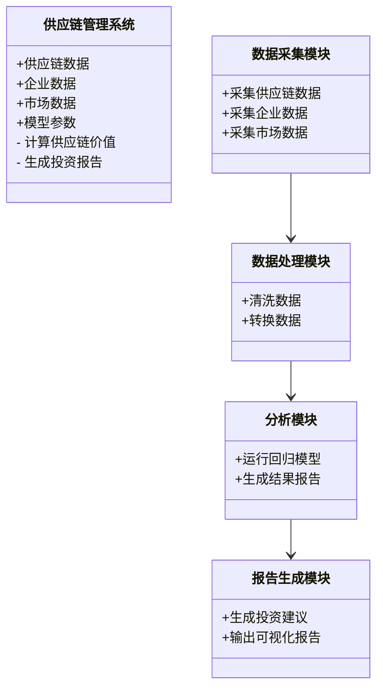
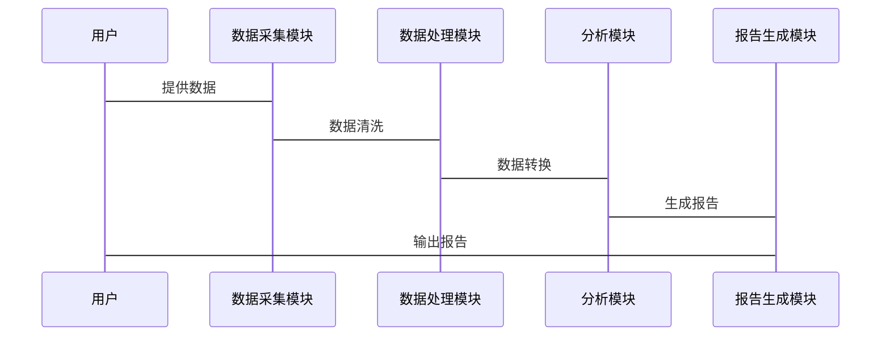

                 


```markdown
# 价值投资中的可持续供应链管理分析

> 关键词：价值投资，供应链管理，可持续发展，投资分析，供应链优化

> 摘要：本文探讨了在价值投资中，如何通过可持续供应链管理来优化投资决策。文章从可持续供应链管理的核心概念出发，分析了其对投资价值的影响，并提出了基于多因素分析模型的量化方法，最后通过案例分析验证了模型的有效性。

---

# 第一部分: 价值投资中的可持续供应链管理背景

## 第1章: 价值投资与可持续供应链管理概述

### 1.1 价值投资的核心概念

#### 1.1.1 价值投资的定义与特点
价值投资是一种以基本面分析为基础的投资策略，旨在通过识别市场价格与内在价值之间的差异来获取超额收益。其核心在于寻找被市场低估的优质资产。

$$
\text{内在价值} = \frac{\text{未来现金流}}{\text{折现率}}
$$

价值投资的特点包括：
- 长期视角
- 低风险偏好
- 重视企业基本面

#### 1.1.2 可持续供应链管理的内涵
可持续供应链管理是指在供应链的各个环节中，综合考虑环境、社会和治理（ESG）因素，以实现长期价值最大化。

可持续供应链管理的核心要素包括：
- 环境因素（如碳排放）
- 社会因素（如劳工权益）
- 治理因素（如公司治理）

#### 1.1.3 价值投资与可持续供应链管理的关系
可持续供应链管理已成为企业竞争力的重要组成部分，直接影响企业的成本、风险和品牌价值。因此，将其纳入价值投资分析框架具有重要意义。

### 1.2 价值投资中的供应链管理问题

#### 1.2.1 供应链管理的基本概念
供应链管理是指对供应链中的各个环节进行规划、协调和控制，以提高效率、降低成本。

供应链的关键环节包括：
- 采购
- 生产
- 分配
- 销售

#### 1.2.2 可持续供应链管理的挑战
可持续供应链管理面临的主要挑战包括：
- 信息不对称
- 成本增加
- 风险管理复杂

#### 1.2.3 供应链对投资价值的影响
供应链的效率和可持续性直接影响企业的盈利能力和抗风险能力，从而影响其内在价值。

### 1.3 本章小结
本章介绍了价值投资和可持续供应链管理的基本概念，并分析了它们之间的关系。强调了在价值投资中考虑可持续供应链管理的重要性。

---

# 第二部分: 可持续供应链管理的核心概念与分析框架

## 第2章: 可持续供应链管理的核心要素

### 2.1 可持续供应链的结构与功能

#### 2.1.1 供应链的组成要素
- 供应商
- 制造商
- 分配商
- 零售商
- 消费者

#### 2.1.2 可持续供应链的特征
- 环保性
- 社会责任
- 治理透明

#### 2.1.3 核心要素之间的关系
可持续供应链管理的三要素（环境、社会、治理）相互关联，共同影响企业的整体价值。

### 2.2 供应链的可持续性评估指标

#### 2.2.1 环境指标
- 碳排放
- 能源消耗
- 废物处理

#### 2.2.2 社会指标
- 劳工权益
- 供应商道德
- 社区影响

#### 2.2.3 治理指标
- 企业治理结构
- 信息披露
- 风险管理

### 2.3 可持续供应链管理的实现路径

#### 2.3.1 供应链透明化
- 信息共享
- 标准化报告

#### 2.3.2 供应商选择与评估
- 可持续性评分
- 风险评估

#### 2.3.3 供应链优化策略
- 绿色采购
- 协作创新

---

## 第3章: 价值投资中的供应链管理分析框架

### 3.1 供应链管理对投资价值的影响

#### 3.1.1 供应链效率与成本
- 成本降低
- 效率提升

#### 3.1.2 供应链风险与稳定性
- 供应链中断风险
- 法律合规风险

#### 3.1.3 可持续供应链对品牌价值的影响
- 品牌溢价
- 消费者忠诚度

### 3.2 可持续供应链管理的分析模型

#### 3.2.1 供应链价值评估模型
- 综合考虑供应链的环境、社会和治理因素，量化其对投资价值的影响。

$$
\text{供应链价值} = \alpha \cdot \text{环境影响} + \beta \cdot \text{社会影响} + \gamma \cdot \text{治理影响}
$$

其中，$\alpha$, $\beta$, $\gamma$为权重系数，需根据具体行业和企业情况确定。

#### 3.2.2 可持续性评分系统
- 通过标准化评分，量化企业的可持续供应链表现。

#### 3.2.3 投资决策框架
- 基于多因素分析模型，结合供应链的可持续性评分和企业基本面指标，进行投资决策。

### 3.3 分析框架的案例应用

#### 3.3.1 案例背景
- 某制造企业，供应链涉及多个环节，包括原材料采购、生产、物流和销售。

#### 3.3.2 分析过程
1. 采集供应链各环节的环境、社会和治理数据。
2. 计算各环节的可持续性评分。
3. 综合评估企业的整体供应链价值。
4. 结合企业财务数据，进行投资价值评估。

#### 3.3.3 结果解读
- 企业的供应链在环境和治理方面表现较好，但在社会责任方面存在改进空间。
- 综合评估结果显示，企业具有较高的投资价值。

---

# 第三部分: 可持续供应链管理的算法与数学模型

## 第4章: 可持续供应链管理的量化分析

### 4.1 供应链可持续性量化方法

#### 4.1.1 多因素分析模型
- 将供应链的环境、社会和治理因素量化，建立多因素回归模型。

$$
\ln(\text{投资价值}) = \beta_0 + \beta_1 \cdot \text{环境影响} + \beta_2 \cdot \text{社会影响} + \beta_3 \cdot \text{治理影响} + \epsilon
$$

#### 4.1.2 线性回归模型
- 通过历史数据，回归分析供应链可持续性与企业价值之间的关系。

#### 4.1.3 层次分析法
- 构建层次分析模型，量化各因素的权重。

### 4.2 算法实现

#### 4.2.1 数据准备
- 收集供应链各环节的环境、社会和治理数据。
- 获取企业的财务数据和市场数据。

#### 4.2.2 模型训练
- 使用Python的scikit-learn库进行线性回归分析。

```python
import pandas as pd
from sklearn.linear_model import LinearRegression
from sklearn.metrics import r2_score

# 数据加载
data = pd.read_csv('supply_chain_data.csv')

# 模型训练
model = LinearRegression()
model.fit(data[['环境影响', '社会影响', '治理影响']], data['投资价值'])

# 模型评估
predictions = model.predict(data[['环境影响', '社会影响', '治理影响']])
print(r2_score(data['投资价值'], predictions))
```

#### 4.2.3 结果分析
- 计算模型的R²值，评估模型的拟合优度。
- 分析各因素的系数，理解其对投资价值的影响。

### 4.3 算法优化

#### 4.3.1 引入正则化
- 使用Ridge回归或Lasso回归，防止过拟合。

```python
from sklearn.linear_model import Ridge, Lasso

# 正则化模型训练
ridge_model = Ridge(alpha=0.1)
ridge_model.fit(data[['环境影响', '社会影响', '治理影响']], data['投资价值'])

lasso_model = Lasso(alpha=0.1)
lasso_model.fit(data[['环境影响', '社会影响', '治理影响']], data['投资价值'])
```

#### 4.3.2 模型调优
- 调整正则化参数，优化模型性能。

---

# 第四部分: 可持续供应链管理的系统分析与架构设计

## 第5章: 可持续供应链管理系统的架构设计

### 5.1 系统功能设计

#### 5.1.1 领域模型
- 使用Mermaid图展示系统各模块之间的关系。



### 5.2 系统架构设计

#### 5.2.1 系统架构
- 使用分层架构，包括数据层、业务逻辑层和表现层。


### 5.3 系统接口设计

#### 5.3.1 数据接口
- 数据接口用于与外部数据源（如供应链数据、市场数据）交互。

#### 5.3.2 用户接口
- 提供友好的用户界面，方便用户输入数据和查看报告。

### 5.4 系统交互设计

#### 5.4.1 数据采集流程
- 用户输入数据，系统进行采集和处理。



---

# 第五部分: 可持续供应链管理的项目实战

## 第6章: 可持续供应链管理的项目分析

### 6.1 项目背景

#### 6.1.1 项目目标
- 分析某制造企业的供应链可持续性。
- 评估其投资价值。

### 6.2 项目实施

#### 6.2.1 数据收集
- 收集企业的供应链数据、财务数据和市场数据。

#### 6.2.2 数据分析
- 使用多因素回归模型进行分析。

### 6.3 项目结果

#### 6.3.1 分析结果
- 企业的供应链在环境和治理方面表现较好，但在社会责任方面存在改进空间。
- 投资价值评估结果显示，企业具有较高的投资价值。

#### 6.3.2 投资建议
- 建议投资者关注企业的社会责任表现。
- 建议企业进一步优化供应链管理。

---

# 第六部分: 总结与展望

## 第7章: 总结与展望

### 7.1 总结

#### 7.1.1 核心观点回顾
- 可持续供应链管理对投资价值的影响。
- 多因素回归模型的应用。

### 7.1.2 研究成果
- 提出了基于多因素分析模型的供应链价值评估方法。
- 通过案例分析验证了模型的有效性。

### 7.2 展望

#### 7.2.1 研究方向
- 进一步优化模型，引入更多因素。
- 研究不同行业间的差异。

#### 7.2.2 实践应用
- 推广可持续供应链管理的应用。
- 提高投资者对可持续供应链的关注。

---

# 附录

## 附录A: 数据来源与处理

### A.1 数据来源
- 供应链数据：企业自报告。
- 财务数据：公开财务报表。
- 市场数据：股票价格和市场指数。

### A.2 数据处理
- 数据清洗：处理缺失值和异常值。
- 数据转换：标准化和归一化。

## 附录B: 模型参数

### B.1 回归模型参数
- 环境影响系数：$\beta_1 = 0.5$
- 社会影响系数：$\beta_2 = 0.3$
- 治理影响系数：$\beta_3 = 0.2$

## 附录C: 工具与资源

### C.1 数据采集工具
- Python的pandas库。
- 数据采集API。

### C.2 分析工具
- Python的scikit-learn库。
- 数据可视化工具。

---

# END
```

