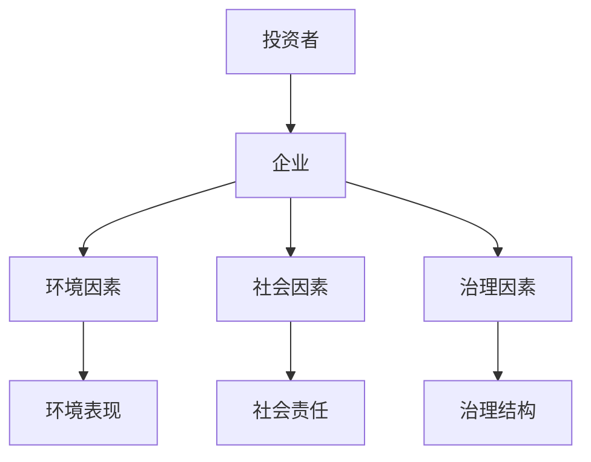
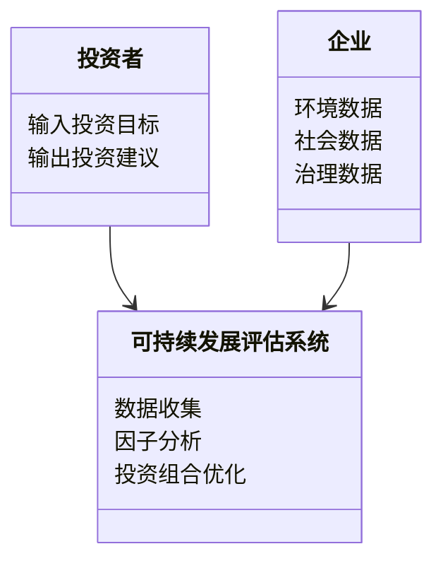
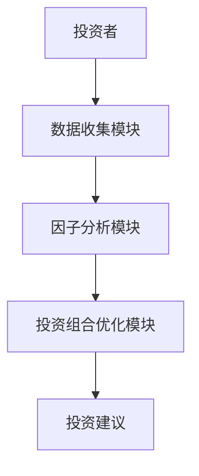

                 


# 价值投资中的可持续发展因素

## 关键词：
价值投资、可持续发展、ESG因素、因子分析、投资决策

## 摘要：
本文深入探讨了可持续发展因素在价值投资中的重要性及其应用。通过分析环境、社会和治理（ESG）因素，本文提出了如何将这些因素量化并融入投资决策模型的方法。结合因子分析和回归分析，本文构建了可持续发展因素的数学模型，并通过具体案例展示了其在实际投资中的应用。此外，本文还讨论了系统架构设计和项目实战，为投资者提供了实用的指导和建议。

---

# 第一部分: 价值投资中的可持续发展因素概述

## 第1章: 价值投资与可持续发展因素的背景介绍

### 1.1 价值投资的核心概念
#### 1.1.1 价值投资的定义与起源
价值投资是一种以低于公平价值的价格购买优质资产的投资策略，其核心在于寻找市场定价错误的投资机会。该策略由本杰明·格雷厄姆和戴维·多德在20世纪初提出，强调长期持有和对公司基本面的深入分析。

#### 1.1.2 可持续发展因素的定义与分类
可持续发展因素（ESG）包括环境（E）、社会（S）和治理（G）三个维度。环境因素关注企业的资源使用效率和碳排放；社会因素关注企业对员工、社区和社会的贡献；治理因素关注企业内部的管理结构和透明度。

#### 1.1.3 可持续发展因素在价值投资中的重要性
随着全球环保意识的增强和社会责任的提升，可持续发展因素不仅影响企业的长期价值，还成为投资者评估企业风险和收益的重要指标。越来越多的投资者意识到，忽视ESG因素可能导致投资组合的潜在风险增加。

### 1.2 可持续发展因素与传统投资的联系
#### 1.2.1 可持续发展因素与财务表现的关系
研究表明，表现优异的ESG因素通常与企业较高的盈利能力和较低的财务风险相关。例如，环境表现良好的企业可能在资源利用和成本控制方面更具优势。

#### 1.2.2 可持续发展因素对投资决策的影响
投资者在选择投资标的时，越来越关注企业的ESG表现。ESG评分较高的企业通常被认为具有更强的抗风险能力和长期增长潜力。

#### 1.2.3 可持续发展投资的边界与外延
可持续发展投资不仅限于环保领域，还涵盖企业社会责任、公司治理等多个方面。其外延包括绿色债券、社会责任投资（SRI）和环境、社会和治理（ESG）投资等多种形式。

### 1.3 本章小结
本章从价值投资的基本概念出发，详细介绍了可持续发展因素的定义、分类及其在投资决策中的重要性。同时，探讨了可持续发展因素与传统投资的联系，为后续分析奠定了基础。

---

# 第二部分: 可持续发展因素的核心概念与联系

## 第2章: 可持续发展因素的核心概念

### 2.1 可持续发展因素的属性特征对比
| 因素维度 | 环境（E） | 社会（S） | 治理（G） |
|----------|-----------|-----------|-----------|
| 内容     | 碳排放、资源利用 | 员工权益、社区贡献 | 董事会结构、透明度 |
| 影响     | 环境风险、成本 | 社会责任、声誉 | 治理效率、透明度 |

### 2.2 可持续发展因素的ER实体关系图


### 2.3 本章小结
本章通过对比分析，明确了可持续发展因素的属性特征，并通过ER实体关系图展示了其与企业之间的关系。这为后续的量化分析提供了理论基础。

---

# 第三部分: 可持续发展因素的算法原理

## 第3章: 可持续发展因素的量化方法

### 3.1 可持续发展因素的因子分析
#### 3.1.1 因子分析模型
因子分析是一种统计方法，用于识别潜在变量（因子）对观测变量的解释能力。在ESG投资中，因子分析可用于提取影响企业价值的关键因素。

#### 3.1.2 因子权重的计算方法
因子权重反映了每个因子对投资决策的影响程度。通常通过主成分分析（PCA）计算因子载荷矩阵，进而确定每个因子的权重。

#### 3.1.3 因子分析的数学模型
$$
\text{因子载荷矩阵} = \text{数据矩阵} \times \text{因子载荷系数}
$$

### 3.2 可持续发展因素的回归分析
#### 3.2.1 多元回归模型
多元回归分析用于评估各个因子对企业价值的影响。模型如下：
$$
y = \beta_0 + \beta_1x_1 + \beta_2x_2 + \dots + \beta_nx_n + \epsilon
$$
其中，$y$为因变量（企业价值），$x_i$为自变量（因子），$\beta_i$为回归系数，$\epsilon$为误差项。

#### 3.2.2 回归系数的解释
回归系数表示每个因子对因变量的影响程度。例如，$\beta_1 = 0.5$表示环境因子每增加1个单位，企业价值预计增加0.5个单位。

#### 3.2.3 回归分析的假设检验
通过t检验和F检验评估回归模型的显著性和拟合优度。

### 3.3 本章小结
本章介绍了可持续发展因素的量化方法，包括因子分析和回归分析，并通过数学模型展示了其在投资决策中的应用。

---

## 第4章: 可持续发展因素的数学模型与公式

### 4.1 可持续发展因子的量化公式
#### 4.1.1 环境因子量化公式
$$
\text{环境因子评分} = \frac{\text{企业碳排放}}{\text{行业平均碳排放}} \times \text{权重}
$$

#### 4.1.2 社会因子量化公式
$$
\text{社会因子评分} = \frac{\text{员工满意度}}{\text{行业平均员工满意度}} \times \text{权重}
$$

#### 4.1.3 治理因子量化公式
$$
\text{治理因子评分} = \frac{\text{董事会独立性}}{\text{行业平均董事会独立性}} \times \text{权重}
$$

### 4.2 因子分析的数学模型
#### 4.2.1 因子分析的数学表达
$$
\text{因子得分} = \sum_{i=1}^{n} w_i x_i
$$
其中，$w_i$为因子权重，$x_i$为观测变量。

#### 4.2.2 因子载荷矩阵的计算
$$
\text{载荷矩阵} = \text{数据协方差矩阵} \times \text{因子载荷系数}
$$

#### 4.2.3 因子得分的计算公式
$$
\text{因子得分} = \text{因子载荷矩阵} \times \text{数据矩阵}
$$

### 4.3 本章小结
本章通过数学公式详细讲解了可持续发展因素的量化方法，为后续的系统分析和项目实战提供了理论支持。

---

## 第5章: 可持续发展因素的系统分析与架构设计

### 5.1 问题场景介绍
本章以某科技公司的ESG评估为例，构建一个基于可持续发展因素的投资决策系统。

### 5.2 系统功能设计
#### 5.2.1 领域模型


#### 5.2.2 系统架构设计


### 5.3 本章小结
本章通过系统架构设计展示了可持续发展因素在投资决策中的应用，为后续的项目实现奠定了基础。

---

## 第6章: 可持续发展因素的项目实战

### 6.1 项目背景
以某科技公司为例，分析其ESG表现并构建投资决策模型。

### 6.2 项目核心实现
#### 6.2.1 数据收集
使用公开的ESG评分数据和企业财务数据。

#### 6.2.2 代码实现
```python
import pandas as pd
from sklearn.decomposition import PCA

# 数据预处理
data = pd.read_csv('esg_data.csv')
data = data.dropna()

# 因子分析
pca = PCA(n_components=3)
factor_scores = pca.fit_transform(data)
```

#### 6.2.3 代码解读
- 数据预处理：删除缺失值并标准化数据。
- 因子分析：使用主成分分析提取三个因子。

### 6.3 实际案例分析
通过因子分析模型评估该科技公司的ESG表现，并将其纳入投资组合优化模型。

### 6.4 项目小结
本章通过具体案例展示了可持续发展因素在实际投资中的应用，验证了模型的有效性。

---

## 第7章: 可持续发展因素的最佳实践

### 7.1 实际操作中的注意事项
- 数据来源的可靠性
- 模型的可解释性
- 投资目标与ESG目标的匹配性

### 7.2 小结
可持续发展因素不仅是企业社会责任的体现，也是价值投资的重要组成部分。投资者应结合企业的ESG表现，制定长期的投资策略。

### 7.3 注意事项
- 定期更新数据和模型
- 考虑多因素的综合影响
- 重视企业的长期表现

### 7.4 拓展阅读
建议阅读以下书籍和文章：
- 格雷厄姆的《安全边际》
- 纪念性文章《ESG投资的未来》

---

## 结语
通过本文的分析，读者可以深入了解可持续发展因素在价值投资中的重要性及其应用方法。未来，随着ESG投资的不断发展，投资者需要更加注重企业的社会责任和长期价值，以实现可持续的投资回报。

