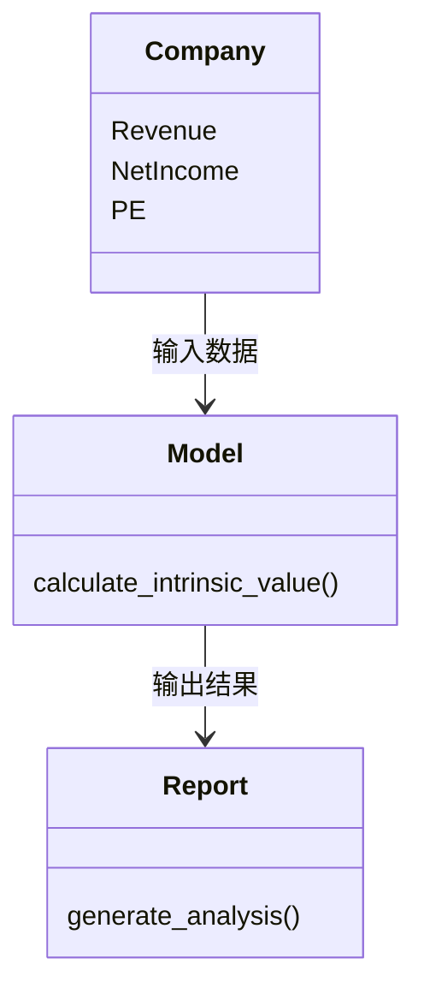

                 


# 价值投资中的可控核聚变前景分析

> 关键词：价值投资、可控核聚变、前景分析、数学模型、投资策略

> 摘要：本文探讨了价值投资在可控核聚变领域的前景分析，通过数学模型和算法原理，结合系统架构设计，分析了可控核聚变技术的现状、挑战与经济潜力。文章从背景介绍、核心概念、技术分析、系统设计、项目实战等多方面展开，为投资者提供深度分析和决策参考。

---

## 第一部分：价值投资与可控核聚变的背景

### 第1章：价值投资与可控核聚变的概述

#### 1.1 价值投资的基本概念
价值投资是一种投资策略，强调以低于内在价值的价格购买优质资产。其核心理念是寻找市场低估的公司，长期持有以实现收益。可控核聚变是通过受控条件下的核聚变反应，产生清洁能源的技术，被认为是未来能源革命的关键。

#### 1.2 可控核聚变技术的现状与潜力
可控核聚变技术目前仍处于研发阶段，但其潜力巨大。与传统能源相比，核聚变具有无限资源、零碳排放、安全可控等优势。然而，技术难度高、成本高昂是其主要挑战。

#### 1.3 价值投资的核心逻辑与方法
价值投资的核心是通过基本面分析，找到具有持续竞争优势和良好治理结构的公司。在可控核聚变领域，投资者需关注技术进展、市场需求、政策支持等因素，评估公司的长期价值。

---

## 第二部分：可控核聚变的技术与经济性分析

### 第2章：可控核聚变技术的深度分析

#### 2.1 可控核聚变技术的核心原理
核聚变反应通过高温高压条件，将轻核原子聚合成重核原子，释放巨大能量。可控核聚变的关键在于维持反应的稳定性和可控性，目前主流技术包括磁约束和惯性约束两种路线。

#### 2.2 可控核聚变技术的关键挑战
- **技术瓶颈**：反应堆设计、等离子体控制等技术难题尚未完全解决。
- **成本与效率**：核聚变发电的经济性尚未得到验证，成本控制是关键。
- **材料与工程**：需要高温耐受材料和先进的工程能力。

#### 2.3 可控核聚变的经济性评估
经济性评估包括投资成本、运营成本、市场回报等。通过建立数学模型，分析核聚变发电的经济效益和市场竞争力，评估其是否具备商业化潜力。

---

## 第三部分：价值投资中的数学模型与算法

### 第3章：价值投资的数学模型与算法原理

#### 3.1 价值投资的核心数学模型
价值投资模型基于基本面分析，通过财务指标评估公司内在价值。常用的指标包括市盈率（P/E）、市净率（P/B）、股息率等。

**公式：**
$$ V = \frac{E}{k} $$
其中，\( V \) 表示内在价值，\( E \) 是公司的预期收益，\( k \) 是折现率。

#### 3.2 可控核聚变领域的投资算法
投资算法结合技术评估和市场分析，预测公司的未来收益。算法步骤包括：
1. 收集公司数据，包括技术进展、财务状况、市场前景。
2. 建立评估模型，预测公司未来收益和风险。
3. 结合市场情绪和行业趋势，调整投资策略。

**Python代码示例：**
```python
import pandas as pd
import numpy as np

# 示例数据：公司财务数据
data = {
    'Revenue': [100, 120, 130],
    'NetIncome': [10, 12, 15],
    'PE': [20, 18, 16]
}

df = pd.DataFrame(data)

# 计算内在价值（简化模型）
def calculate_intrinsic_value(row):
    return row['NetIncome'] / 0.1  # 假设折现率为10%

df['IntrinsicValue'] = df.apply(calculate_intrinsic_value, axis=1)
print(df)
```

#### 3.3 数学模型与算法的实现
通过数学模型和算法，评估公司在可控核聚变领域的投资潜力。模型需考虑技术可行性、市场需求、政策支持等因素，预测公司的未来表现。

---

## 第四部分：系统分析与架构设计

### 第4章：可控核聚变投资的系统分析

#### 4.1 问题场景介绍
分析一家可控核聚变公司的投资潜力，需考虑其技术能力、财务状况、市场需求和政策环境。系统需整合多源数据，提供全面的分析报告。

#### 4.2 系统功能设计
系统功能包括数据采集、分析模型、可视化界面和投资建议模块。通过模块化设计，确保系统的可扩展性和灵活性。

**Mermaid类图：**


#### 4.3 系统架构设计
采用分层架构，包括数据层、业务逻辑层和表现层。数据层负责数据存储与管理，业务逻辑层处理分析逻辑，表现层提供用户界面。

**Mermaid架构图：**
```mermaid
ditaa
[数据层] ---(读写)--> [数据库]
[业务逻辑层] ---(调用)--> [数据层]
[表现层] --> [用户界面]
```

---

## 第五部分：项目实战与总结

### 第5章：项目实战分析

#### 5.1 环境安装与数据准备
安装必要的开发工具和库，如Python、Pandas、NumPy等。收集目标公司的财务数据和技术进展数据。

#### 5.2 核心代码实现
实现价值评估模型，结合技术分析和财务分析，评估公司的投资潜力。

**Python代码示例：**
```python
import pandas as pd
import numpy as np

# 示例数据：公司财务数据
data = {
    'Revenue': [100, 120, 130],
    'NetIncome': [10, 12, 15],
    'PE': [20, 18, 16]
}

df = pd.DataFrame(data)

# 计算内在价值（简化模型）
def calculate_intrinsic_value(row):
    return row['NetIncome'] / 0.1  # 假设折现率为10%

df['IntrinsicValue'] = df.apply(calculate_intrinsic_value, axis=1)
print(df)
```

#### 5.3 案例分析与解读
通过实际案例分析，验证模型的有效性，评估公司在可控核聚变领域的投资价值。

---

## 第六部分：总结与展望

### 6.1 总结
本文通过分析价值投资在可控核聚变领域的应用，提出了系统的分析方法和数学模型。投资者需结合技术、经济、政策等多方面因素，评估公司的长期潜力。

### 6.2 展望
随着技术进步和成本下降，可控核聚变有望成为未来的清洁能源主流。投资者应关注技术创新和政策支持，抓住投资机遇。

---

## 关键词提示
- 价值投资、可控核聚变、前景分析、数学模型、投资策略

通过本文的分析，投资者可以更好地理解可控核聚变领域的投资机会，做出明智的决策。

