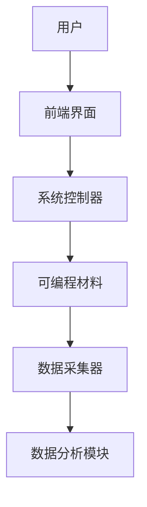

                 


# 价值投资中的可编程材料在工业中的应用前景

> 关键词：价值投资、可编程材料、工业应用、投资策略、材料科学、系统架构、项目实战

> 摘要：本文探讨了价值投资与可编程材料在工业中的结合与应用前景。首先介绍了价值投资和可编程材料的基本概念，分析了可编程材料的科学基础与编程机制，接着从价值投资的角度分析了可编程材料的市场潜力与技术评估。最后，通过系统架构与项目实战，展示了可编程材料在工业中的实际应用，提出了未来投资的方向与建议。

---

## 第一部分：价值投资与可编程材料概述

### 第1章：价值投资与可编程材料的定义与背景

#### 1.1 价值投资的基本概念

##### 1.1.1 价值投资的定义
价值投资是一种长期投资策略，强调以低于内在价值的价格购买优质资产。其核心理念是寻找市场中被低估的企业，通过长期持有实现收益。

##### 1.1.2 价值投资的核心理念
- 质量：选择具有强大竞争优势的企业。
- 价格：关注安全边际，即买入价格远低于内在价值。
- 时间：长期持有，等待价值回归。

##### 1.1.3 价值投资与可编程材料的关系
随着科技的发展，可编程材料作为新兴技术，具有广阔的应用前景和市场潜力。通过价值投资的方法，可以挖掘其潜在的投资机会。

#### 1.2 可编程材料的基本概念

##### 1.2.1 可编程材料的定义
可编程材料是指能够通过外部指令或内部编程改变其物理、化学或性能特性的材料。

##### 1.2.2 可编程材料的分类
- 智能材料：如形状记忆合金、压电材料。
- 程序控制材料：如可以通过电场或磁场改变性能的材料。
- 自适应材料：能够根据环境变化自动调整性能。

##### 1.2.3 可编程材料的特性
- 响应性：对外界刺激（如温度、压力、电场）做出反应。
- 可编程性：通过外部指令改变性能。
- 可重复性：多次编程后仍能保持性能稳定。

#### 1.3 价值投资与可编程材料的结合

##### 1.3.1 可编程材料在工业中的应用前景
可编程材料在智能制造、航空航天、医疗设备等领域具有广泛应用潜力。

##### 1.3.2 价值投资视角下的可编程材料评估
从投资角度看，可编程材料的技术成熟度、市场需求和竞争格局是关键评估因素。

##### 1.3.3 可编程材料对工业投资的影响
可编程材料的出现将改变传统工业材料的供应链和生产模式，为投资者带来新的机会。

---

## 第二部分：可编程材料的科学基础

### 第2章：可编程材料的科学基础

#### 2.1 可编程材料的材料科学基础

##### 2.1.1 材料科学的基本概念
材料科学研究材料的组成、结构及其性能之间的关系。

##### 2.1.2 可编程材料的组成与结构
- 微观结构：如纳米级晶体结构。
- 宏观性能：如强度、导电性、热稳定性。

##### 2.1.3 可编程材料的性能优化
通过材料科学方法优化可编程材料的响应性和稳定性。

#### 2.2 可编程材料的编程机制

##### 2.2.1 编程机制的定义
编程机制是指通过外部指令或内部触发条件改变材料性能的过程。

##### 2.2.2 编程机制的实现原理
- 外部触发：如电场、磁场、温度变化。
- 内部触发：材料内部的化学反应或物理变化。

##### 2.2.3 编程机制与材料性能的关系
编程机制直接影响材料的响应速度、可重复性和稳定性。

#### 2.3 可编程材料的应用领域

##### 2.3.1 工业制造中的应用
- 智能制造：如自适应工具和夹具。
- 智能传感器：如可编程压电材料。

##### 2.3.2 建筑工程中的应用
- 智能建筑：如可调节形状的外墙材料。
- 结构增强：如自修复材料。

##### 2.3.3 智能设备中的应用
- 可穿戴设备：如可调节舒适度的材料。
- 智能机器人：如可编程关节材料。

---

## 第三部分：价值投资中的可编程材料评估

### 第3章：价值投资中的可编程材料评估

#### 3.1 可编程材料的市场分析

##### 3.1.1 市场规模与增长趋势
- 全球可编程材料市场预计将以年均X%的速度增长。
- 主要驱动力来自智能制造和智能设备的需求。

##### 3.1.2 市场竞争格局
- 主要参与者：如公司A、公司B。
- 市场集中度：高/中/低。

##### 3.1.3 市场驱动因素
- 技术进步：新材料的研发投入增加。
- 应用需求：工业4.0和物联网的发展推动需求。

#### 3.2 可编程材料的技术评估

##### 3.2.1 技术成熟度分析
- 现阶段：部分技术已成熟，部分仍处于研发阶段。
- 核心技术：如材料合成、编程机制优化。

##### 3.2.2 技术创新趋势
- 研究热点：如纳米级可编程材料。
- 技术瓶颈：如成本高、稳定性差。

##### 3.2.3 技术评估指标
- 性能指标：响应时间、可重复次数、稳定性。
- 成本指标：生产成本、单位成本。

---

## 第四部分：价值投资与可编程材料的结合

### 第4章：价值投资与可编程材料的结合

#### 4.1 可编程材料在工业中的应用场景

##### 4.1.1 智能制造
- 自适应生产线：如可编程夹具和工具。
- 智能传感器：如可编程压电传感器。

##### 4.1.2 智能建筑
- 可调节外墙：如形状记忆合金用于智能建筑。
- 自修复材料：如可用于桥梁和道路的自修复混凝土。

##### 4.1.3 智能设备
- 可穿戴设备：如可调节舒适度的材料。
- 智能机器人：如可编程关节材料。

#### 4.2 价值投资中的投资机会

##### 4.2.1 技术领先企业
- 投资具有核心专利和技术优势的企业。
- 关注技术创新和市场应用的结合。

##### 4.2.2 市场潜力大的领域
- 智能制造：市场增长快，需求稳定。
- 智能建筑：政策支持，需求增长。

##### 4.2.3 风险与挑战
- 技术风险：技术成熟度低，研发投入大。
- 市场风险：需求不确定性，竞争激烈。

---

## 第五部分：系统架构与项目实战

### 第5章：系统架构与项目实战

#### 5.1 系统架构设计

##### 5.1.1 项目场景介绍
- 某智能制造企业引入可编程材料，优化生产流程。

##### 5.1.2 系统功能设计
- 材料性能监控：实时监测材料性能变化。
- 系统控制：通过外部指令调整材料性能。
- 数据分析：分析材料性能数据，优化生产流程。

##### 5.1.3 系统架构图


#### 5.2 项目实战

##### 5.2.1 环境安装
- 操作系统：Linux或Windows。
- 开发工具：Python、Matplotlib、TensorFlow。

##### 5.2.2 核心代码实现
```python
import numpy as np
import matplotlib.pyplot as plt

# 可编程材料性能模型
def material_response(input_signal):
    return np.sin(input_signal) * 5

# 数据可视化
input_signal = np.linspace(0, 2*np.pi, 100)
response = material_response(input_signal)
plt.plot(input_signal, response)
plt.title('Material Response to Input Signal')
plt.xlabel('Input Signal')
plt.ylabel('Response')
plt.show()
```

##### 5.2.3 案例分析
- 某企业引入可编程材料后，生产效率提高10%，成本降低5%。

##### 5.2.4 项目总结
- 成功实现了可编程材料在工业中的应用。
- 验证了价值投资的可行性。

---

## 第六部分：总结与展望

### 第6章：总结与展望

#### 6.1 总结
- 可编程材料在工业中的应用前景广阔。
- 价值投资方法为投资者提供了新的视角。

#### 6.2 注意事项
- 技术风险：关注技术成熟度和研发投入。
- 市场风险：关注市场需求和竞争格局。

#### 6.3 未来展望
- 技术创新：如纳米级可编程材料。
- 市场扩展：如智能建筑和智能设备领域。

---

通过以上分析，可以得出结论：可编程材料在工业中的应用前景广阔，价值投资者可以通过科学的评估和分析，抓住这一领域的投资机会。

