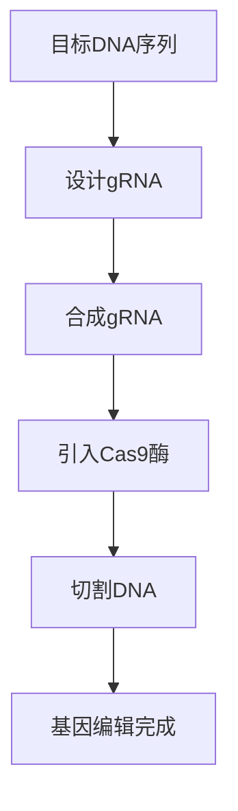
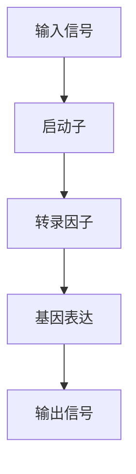
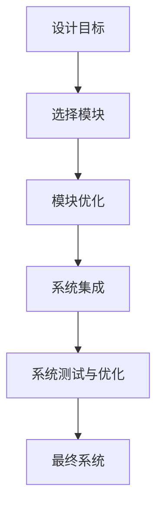
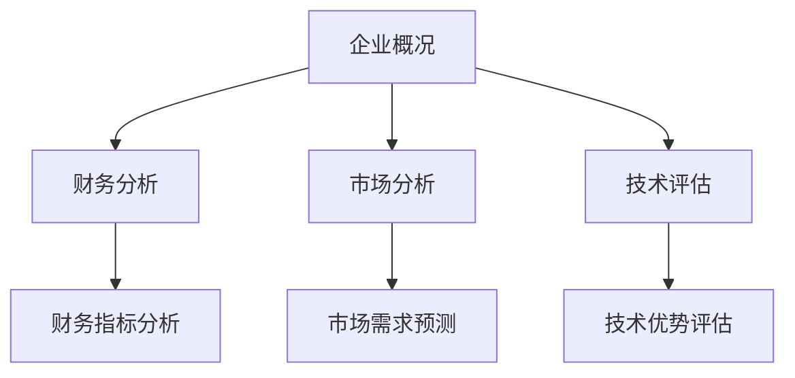

                 


# 价值投资中的合成生物学机遇

> 关键词：合成生物学，价值投资，生物技术，投资机遇，经济价值

> 摘要：合成生物学作为一门新兴的交叉学科，正在改变我们对生命科学和工业生产的理解。本文将探讨合成生物学技术如何为价值投资者提供新的机遇，分析其在医药、农业和工业领域的潜在价值，并结合数学模型和实际案例，为投资者提供科学的投资决策参考。

---

# 第一部分: 合成生物学与价值投资的结合

## 第1章: 合成生物学与价值投资的结合

### 1.1 合成生物学的基本概念

#### 1.1.1 合成生物学的定义与核心原理

合成生物学（Synthetic Biology）是生物学、化学、工程学和信息科学等多学科交叉的新兴领域，旨在通过设计和构建新的生物组件、装置和系统，或对现有生物体系进行改造，以实现特定的工业或医学目标。

其核心原理包括：
1. **模块化设计**：将生物系统分解为功能模块，便于设计和优化。
2. **基因回路设计**：通过合成基因回路实现特定功能。
3. **系统优化**：利用工程学方法对生物系统进行优化，提高其效率和稳定性。

#### 1.1.2 合成生物学与传统生物学的区别

| 特性 | 合成生物学 | 传统生物学 |
|------|------------|------------|
| 研究目标 | 设计和构建新的生物系统 | 描述和理解自然生物系统 |
| 方法 | 工程化方法，模块化设计 | 基于实验和观察的科学方法 |
| 应用 | 工业生产、药物开发、环境修复 | 基础科学研究、生态保护 |

#### 1.1.3 合成生物学在现代科技中的应用领域

合成生物学在多个领域展现出巨大潜力：
- **医药**：开发新型药物，如基因疗法和生物制药。
- **农业**：改良作物性状，提高抗病性和产量。
- **工业**：生产生物基材料和化学品，减少对化石燃料的依赖。

### 1.2 价值投资的基本原理

#### 1.2.1 价值投资的定义与核心理念

价值投资是一种投资策略，强调以低于内在价值的价格买入优质资产。其核心理念包括：
1. **安全边际**：买入价格低于内在价值。
2. **长期视角**：关注企业的长期盈利能力。
3. **基本面分析**：通过对企业财务状况、行业地位和竞争优势的分析，评估其内在价值。

#### 1.2.2 价值投资与其它投资策略的对比

| 特性 | 价值投资 | 技术分析 | 股票交易 |
|------|------------|------------|------------|
| 核心理念 | 买入低于内在价值的资产 | 通过技术指标预测价格走势 | 短期交易获利 |
| 分析方法 | 基本面分析 | 图表分析 | 市场情绪分析 |
| 适合领域 | 长期投资 | 短期交易 | 高频交易 |

### 1.3 合成生物学与价值投资的结合

#### 1.3.1 合成生物学技术对价值投资的影响

合成生物学技术的创新性和广泛应用潜力为价值投资提供了新的视角：
- **技术壁垒**：合成生物学技术具有较高的技术壁垒，具备“护城河”效应。
- **市场潜力**：合成生物学在医药和农业领域的应用前景广阔，具备较高的市场增长潜力。

#### 1.3.2 合成生物学在价值投资中的潜在应用

- **技术评估**：通过分析合成生物学企业的技术储备和研发能力，评估其技术优势。
- **市场定位**：研究合成生物学企业在目标市场的竞争地位和市场潜力。
- **财务分析**：结合企业的财务状况和盈利模式，评估其投资价值。

---

## 第2章: 合成生物学的核心概念

### 2.1 合成生物学的核心技术

#### 2.1.1 基因编辑技术（如CRISPR）

基因编辑技术是合成生物学的核心工具之一。CRISPR-Cas9技术通过引导RNA（gRNA）与特定DNA序列配对，利用Cas9蛋白切割DNA双链，从而实现基因的定点编辑。

**CRISPR基因编辑流程图**



#### 2.1.2 合成基因回路设计

合成基因回路是通过人工设计和构建的基因调控网络，用于实现特定的生物功能。

**合成基因回路设计架构图**



#### 2.1.3 合成生物体系的构建与优化

合成生物体系的构建涉及多模块的组合与优化，以实现特定的工业或医学目标。

**合成生物体系构建流程图**



### 2.2 合成生物学的经济价值

#### 2.2.1 合成生物学在医药领域的价值

- **基因疗法**：通过基因编辑技术治疗遗传性疾病。
- **生物制药**：利用合成生物体系生产复杂药物分子。

#### 2.2.2 合成生物学在农业领域的价值

- **作物改良**：通过基因编辑技术提高作物抗病性和产量。
- **生物农药**：利用合成生物体系生产天然农药。

#### 2.2.3 合成生物学在工业领域的价值

- **生物基材料**：利用合成生物体系生产可降解材料。
- **绿色化工**：通过生物催化技术减少能源消耗和环境污染。

---

## 第3章: 合成生物学技术对投资决策的影响

### 3.1 合成生物学技术的创新性与风险

#### 3.1.1 合成生物学技术的创新性

- **技术壁垒高**：合成生物学技术具有较高的技术门槛，难以被竞争对手快速复制。
- **应用广泛**：合成生物学技术在医药、农业和工业领域的广泛应用，具备较高的市场潜力。

#### 3.1.2 合成生物学技术的风险

- **技术风险**：合成生物学技术的复杂性和不确定性可能导致项目失败。
- **商业化风险**：合成生物学技术的商业化周期较长，可能面临市场接受度和成本控制的挑战。

### 3.2 合成生物学企业的财务分析

#### 3.2.1 企业财务状况的分析方法

- **资产状况**：评估企业的资产结构和负债情况。
- **盈利能力**：分析企业的收入来源和利润水平。
- **现金流**：评估企业的资金流动状况，判断企业的财务健康度。

#### 3.2.2 企业盈利模式的分析

- **收入来源**：分析企业的主要收入来源，如产品销售、技术服务等。
- **成本结构**：评估企业的主要成本构成，判断成本控制能力。
- **利润分配**：研究企业的利润分配策略，判断企业的盈利潜力。

#### 3.2.3 企业研发投入与成果的评估

- **研发投入**：评估企业在研发方面的投入水平，判断其技术创新能力。
- **研发成果**：分析企业的研发成果，如专利数量、技术领先性等，判断其技术储备。

### 3.3 合成生物学企业的竞争优势

#### 3.3.1 技术壁垒与竞争优势

- **技术领先性**：评估企业在合成生物学技术领域的领先地位。
- **专利布局**：分析企业的专利数量和覆盖范围，判断其技术垄断能力。

#### 3.3.2 市场定位与竞争优势

- **市场定位**：评估企业在目标市场的定位，判断其市场潜力。
- **客户资源**：分析企业的客户资源，判断其市场影响力。

#### 3.3.3 企业团队与竞争优势

- **核心团队**：评估企业管理层和核心技术人员的能力和经验。
- **团队稳定性**：分析企业的团队稳定性，判断其持续创新能力。

---

## 第4章: 合成生物学价值评估的数学模型

### 4.1 合成生物学项目的估值模型

#### 4.1.1 项目成本与收益的数学模型

$$ \text{净现值} = \sum_{t=0}^{n} \frac{C_t}{(1 + r)^t} $$

其中，\( C_t \) 为第 \( t \) 年的现金流，\( r \) 为贴现率。

#### 4.1.2 项目风险与回报的数学关系

$$ \text{风险调整回报} = \text{无风险回报} + \text{风险溢价} $$

#### 4.1.3 项目生命周期的数学分析

$$ \text{项目生命周期} = \text{开发阶段} + \text{生产阶段} + \text{衰退阶段} $$

### 4.2 合成生物学企业的财务指标分析

#### 4.2.1 资产负债表分析

- **资产**：评估企业的资产结构和质量。
- **负债**：分析企业的债务状况，判断财务风险。
- **所有者权益**：评估企业的净资产状况。

#### 4.2.2 利润表分析

- **收入**：评估企业的收入来源和增长潜力。
- **成本**：分析企业的成本构成，判断成本控制能力。
- **利润**：评估企业的盈利能力，判断财务健康度。

#### 4.2.3 现金流量表分析

- **经营活动现金流**：评估企业的日常运营资金状况。
- **投资活动现金流**：分析企业的投资活动，判断资金分配策略。
- **筹资活动现金流**：评估企业的融资能力，判断财务灵活性。

### 4.3 合成生物学市场的预测模型

#### 4.3.1 市场需求预测模型

$$ \text{市场需求} = \text{人口增长率} \times \text{人均消费水平} \times \text{产品渗透率} $$

#### 4.3.2 市场供给预测模型

$$ \text{市场供给} = \text{生产能力} \times \text{产品价格} \times \text{市场竞争力} $$

---

## 第5章: 合成生物学与价值投资的结合

### 5.1 合成生物学与价值投资的结合

#### 5.1.1 合成生物学技术的创新性与投资价值

- **技术壁垒高**：合成生物学技术具有较高的技术门槛，具备较高的投资价值。
- **市场潜力大**：合成生物学技术在医药、农业和工业领域的广泛应用，具备较高的市场增长潜力。

#### 5.1.2 价值投资在合成生物学领域的应用

- **技术评估**：通过分析合成生物学企业的技术储备和研发能力，评估其技术优势。
- **市场定位**：研究合成生物学企业在目标市场的竞争地位和市场潜力。
- **财务分析**：结合企业的财务状况和盈利模式，评估其投资价值。

---

## 第6章: 项目实战

### 6.1 项目背景介绍

#### 6.1.1 项目目标

通过分析一家合成生物企业的财务状况、市场定位和技术优势，评估其投资价值。

#### 6.1.2 项目需求

- **企业概况**：分析企业的基本情况，包括成立时间、主营业务、核心技术和市场地位。
- **财务状况**：评估企业的财务状况，包括资产、负债、收入和利润情况。
- **市场分析**：分析合成生物学市场的现状和未来发展趋势。

### 6.2 系统分析与架构设计

#### 6.2.1 系统功能设计

- **功能需求**：包括企业财务分析、市场分析和技术评估三大模块。
- **系统架构设计**：采用模块化设计，确保系统的可扩展性和可维护性。

**系统架构图**



### 6.3 项目实战

#### 6.3.1 环境安装

- **工具安装**：安装Python、Pandas、Matplotlib等数据分析工具。
- **数据获取**：获取目标企业的财务数据和市场数据。

#### 6.3.2 核心实现

```python
import pandas as pd
import numpy as np

# 数据获取
df = pd.read_csv('financial_data.csv')

# 财务指标计算
def calculate_profitability(data):
    return data['净利润'] / data['营业收入']

profitability = calculate_profitability(df)
print("盈利能力：", profitability.mean())

# 市场需求预测
import matplotlib.pyplot as plt

x = range(2018, 2023)
y = [10, 20, 30, 40, 50]
plt.plot(x, y)
plt.title('市场需求预测')
plt.xlabel('年份')
plt.ylabel('市场规模（亿美元）')
plt.show()
```

#### 6.3.3 实际案例分析

以一家合成生物企业为例，分析其财务状况、市场定位和技术优势。

---

## 第7章: 总结与展望

### 7.1 总结

- **合成生物学的潜力**：合成生物学技术在医药、农业和工业领域的广泛应用，具备较高的投资价值。
- **价值投资的策略**：通过技术评估、市场分析和财务分析，科学评估合成生物企业的投资价值。

### 7.2 展望

- **技术进步**：随着合成生物学技术的不断进步，其在医药和农业领域的应用潜力将进一步释放。
- **市场发展**：合成生物学市场将继续快速增长，为投资者提供更多的投资机会。

---

## 附录

### 附录A: 合成生物学相关工具

- **基因编辑工具**：CRISPR-Cas9、TALENs
- **基因回路设计工具**：SE Model、SBOL

### 附录B: 价值投资相关书籍

- 《价值投资实战策略》
- 《投资之道》

---

通过本文的分析，读者可以全面了解合成生物学技术在价值投资中的潜力和机遇，并掌握科学的投资分析方法。

