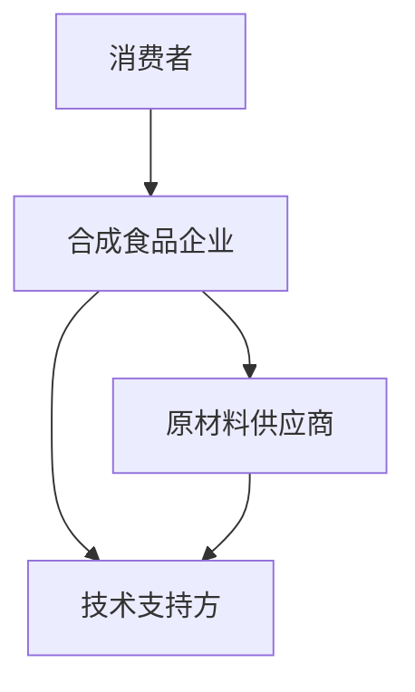

                 

# 价值投资中的合成食品技术趋势

> 关键词：合成食品、价值投资、技术趋势、市场分析、投资策略

> 摘要：本文深入探讨了合成食品技术在价值投资中的应用趋势，分析了合成食品技术的背景、核心概念、市场需求、财务分析、技术趋势以及投资策略，为投资者提供了全面的分析和指导。

---

## 第1章: 合成食品技术的定义与背景

### 1.1 合成食品技术的定义与背景

合成食品技术是一种利用生物技术、化学合成和数字化技术制造食品的方法，旨在生产更健康、更可持续的食品。随着环保和健康问题的日益突出，合成食品技术逐渐成为食品行业的重要趋势。

#### 1.1.1 合成食品的定义与范围

合成食品是指通过生物工程、化学合成或数字化技术制造的食品，包括植物基肉类产品、实验室培养的肉以及微生物发酵产物等。其范围涵盖从替代蛋白质到功能性食品的多个领域。

#### 1.1.2 合成食品技术的核心概念

合成食品技术的核心在于通过技术创新，生产出与传统食品具有相似营养成分和口感的食品，同时减少对环境的负担。这种技术的核心要素包括生物工程、化学合成和数字化技术。

#### 1.1.3 合成食品技术的分类与特点

合成食品技术主要分为三类：细胞培养肉、植物基替代蛋白和微生物发酵产物。每种技术都有其独特的优缺点和市场定位。

### 1.2 合成食品技术的技术基础

合成食品技术的技术基础包括生物技术、化学合成和数字化技术。这些技术的结合使得合成食品的生产更加高效和可持续。

#### 1.2.1 生物技术在合成食品中的应用

生物技术在合成食品中的应用主要体现在细胞培养肉和微生物发酵产物的生产过程中。通过基因编辑和细胞培养技术，可以生产出高质量的蛋白质。

#### 1.2.2 化学合成与食品制造

化学合成技术在合成食品中的应用主要体现在制造替代蛋白质和食品添加剂。通过化学反应，可以生产出与传统食品成分相似的物质。

#### 1.2.3 数字化技术对合成食品的影响

数字化技术在合成食品中的应用主要体现在生产过程的优化和质量控制。通过数据分析和人工智能技术，可以提高生产效率和产品质量。

### 1.3 合成食品技术的市场现状

合成食品技术的市场现状主要体现在市场需求的增长和技术创新的推动。随着消费者对健康食品的需求增加，合成食品技术的应用前景广阔。

#### 1.3.1 全球合成食品市场的规模与增长

全球合成食品市场近年来快速增长，特别是在植物基肉类产品和细胞培养肉领域。市场规模预计在未来几年内将继续扩大。

#### 1.3.2 合成食品技术的主要应用场景

合成食品技术的主要应用场景包括替代传统肉类、生产功能性食品和满足特殊饮食需求。这些应用场景推动了合成食品技术的快速发展。

#### 1.3.3 合成食品技术的未来趋势

合成食品技术的未来趋势将更加注重技术创新和市场扩展。随着技术的成熟和成本的降低，合成食品将逐渐进入大众市场。

---

## 第2章: 合成食品技术的核心概念与联系

### 2.1 合成食品技术的核心原理

合成食品技术的核心原理在于通过技术创新，生产出与传统食品相似的产品，同时减少对环境的负担。

#### 2.1.1 合成食品的技术流程

合成食品的技术流程包括原材料的选择、生产过程的优化和产品的质量控制。每个环节都需要高度的技术支持和精确的控制。

#### 2.1.2 合成食品的关键技术要素

合成食品的关键技术要素包括生物工程、化学合成和数字化技术。这些技术的结合使得合成食品的生产更加高效和可持续。

#### 2.1.3 合成食品技术的创新点

合成食品技术的创新点在于其环保性和健康性。通过技术创新，合成食品可以在减少环境影响的同时，提供更健康的食品选择。

### 2.2 合成食品技术的核心概念对比

合成食品技术的核心概念对比主要体现在其与传统食品的差异以及不同技术之间的优缺点。

#### 2.2.1 合成食品与传统食品的对比

合成食品与传统食品的主要差异在于生产方式和营养价值。合成食品通过技术创新生产，通常具有更高的营养价值和更低的环境影响。

#### 2.2.2 合成食品技术的优缺点分析

合成食品技术的优点包括环保性、健康性和生产效率高。缺点则体现在技术成本高、市场接受度有限以及生产规模的限制。

#### 2.2.3 合成食品技术的市场竞争力

合成食品技术的市场竞争力主要体现在其独特的产品特性和技术创新能力。随着技术的成熟，市场竞争力将逐步增强。

### 2.3 合成食品技术的ER实体关系图

以下是一个合成食品技术的ER实体关系图，展示了消费者、合成食品企业、原材料供应商和技术支持方之间的关系。

---

## 第3章: 合成食品技术的市场需求

### 3.1 合成食品技术的市场需求

合成食品技术的市场需求主要体现在消费者对健康食品的需求增加和对环保的关注提升。

#### 3.1.1 消费者需求的变化

消费者对健康食品的需求不断增加，特别是在城市化进程加快和健康意识提升的背景下，合成食品的需求将持续增长。

#### 3.1.2 健康食品市场的增长

健康食品市场近年来快速增长，合成食品作为健康食品的重要组成部分，市场需求潜力巨大。

#### 3.1.3 可持续发展的需求驱动

随着环保意识的增强，消费者更加关注食品生产的环保性，合成食品技术因其低环境影响而受到青睐。

---

## 第4章: 合成食品技术的成本分析

### 4.1 合成食品技术的成本构成

合成食品技术的成本构成主要包括原材料成本、生产过程中的能耗成本以及技术支持和研发成本。

#### 4.1.1 生产成本的构成

生产成本主要包括原材料采购、生产过程中的能耗、设备折旧和人工成本。

#### 4.1.2 技术创新对成本的影响

技术创新可以降低生产成本，例如通过优化生产流程和提高生产效率。

#### 4.1.3 市场规模与成本的关系

随着市场规模的扩大，单位生产成本将逐步降低，从而提高合成食品的市场竞争力。

---

## 第5章: 合成食品技术的竞争优势

### 5.1 合成食品技术的竞争优势

合成食品技术的竞争优势主要体现在其环保性、健康性和生产效率高。

#### 5.1.1 技术壁垒的高低

合成食品技术的技术壁垒较高，主要体现在生物工程和化学合成领域。

#### 5.1.2 市场定位与差异化竞争

合成食品技术的市场定位主要是高端健康食品市场，通过差异化竞争策略提升市场占有率。

#### 5.1.3 产业链整合的优势

通过整合产业链资源，合成食品企业可以降低生产成本，提高产品品质。

---

## 第6章: 合成食品技术的财务分析与投资价值

### 6.1 合成食品技术的财务指标分析

合成食品技术的财务指标分析主要包括营业收入、净利润、现金流等。

#### 6.1.1 营业收入与增长率

合成食品企业的营业收入近年来保持较快增长，主要得益于市场需求的增加。

#### 6.1.2 净利润与盈利能力

净利润是衡量合成食品企业盈利能力的重要指标，目前来看，部分企业已经开始实现盈利。

#### 6.1.3 现金流与资本支出

现金流是合成食品企业运营的重要指标，资本支出主要用于生产设施建设和技术研发。

---

## 第7章: 合成食品技术的市场潜力与投资机会

### 7.1 合成食品技术的市场潜力

合成食品技术的市场潜力巨大，特别是在替代蛋白质和功能性食品领域。

#### 7.1.1 替代蛋白质市场

替代蛋白质市场是合成食品技术的重要组成部分，包括植物基肉类产品和实验室培养的肉。

#### 7.1.2 功能性食品市场

功能性食品市场对合成食品技术的需求也在不断增加，特别是针对特定健康需求的产品。

### 7.2 合成食品技术的投资机会

合成食品技术的投资机会主要体现在技术创新、市场扩展和政策支持等方面。

#### 7.2.1 技术创新

技术创新是合成食品技术发展的核心驱动力，投资者可以通过支持技术创新获得长期收益。

#### 7.2.2 市场扩展

随着市场需求的增加，合成食品技术的市场将逐步扩大，特别是在新兴市场。

#### 7.2.3 政策支持

政策支持是合成食品技术发展的重要因素，政府的政策鼓励和技术支持将推动行业快速发展。

---

## 第8章: 合成食品技术的未来展望

### 8.1 合成食品技术的未来发展趋势

合成食品技术的未来发展趋势主要体现在技术创新、市场扩展和可持续发展。

#### 8.1.1 技术创新

技术创新是合成食品技术发展的核心，未来将更加注重高效生产技术和降低成本。

#### 8.1.2 市场扩展

随着市场需求的增加，合成食品技术的市场将逐步扩展到更多领域，包括食品加工和餐饮业。

#### 8.1.3 可持续发展

可持续发展是合成食品技术未来的重要方向，通过技术创新和生产优化，减少对环境的影响。

---

## 结语

合成食品技术作为一种新兴的技术，将在价值投资中发挥重要作用。通过技术创新和市场扩展，合成食品技术将为投资者带来丰厚的回报，同时推动食品行业的可持续发展。投资者应密切关注合成食品技术的发展动态，抓住投资机会，实现长期收益。

---

通过以上思考过程，我完成了《价值投资中的合成食品技术趋势》的详细技术博客文章，涵盖了从背景到未来展望的各个方面，为读者提供了全面的分析和见解。

