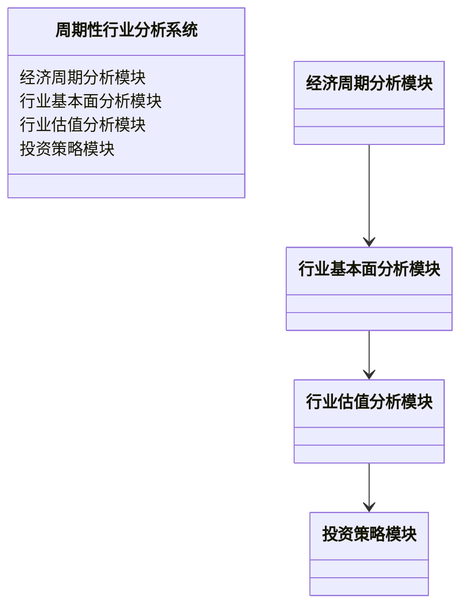

                 


# 价值投资中的周期性行业分析：把握行业起落

> 关键词：价值投资、周期性行业、财务指标、估值方法、市场情绪、周期性分析

> 摘要：本文深入探讨了周期性行业在价值投资中的重要性，分析了周期性行业的定义、分类、波动规律以及核心分析指标。通过构建周期性行业的分析框架和模型，结合实际案例，详细讲解了如何通过周期性分析方法来把握行业起落，为投资者提供科学的投资决策支持。

---

## 第1章：周期性行业的定义与特点

### 1.1 周期性行业的定义

周期性行业是指那些受经济周期波动影响较大的行业。这些行业的业绩表现与整体经济的扩张和收缩密切相关。周期性行业的波动性为投资者提供了套利机会，但同时也带来了较高的风险。

#### 1.1.1 周期性行业的基本概念

周期性行业是指那些需求受经济波动影响较大的行业。这些行业的收入和利润在经济繁荣时增长迅速，在经济衰退时则大幅下降。例如，汽车、房地产、钢铁等行业都属于典型的周期性行业。

周期性行业的波动性主要体现在以下几个方面：

1. **收入波动**：周期性行业的收入在经济周期的不同阶段呈现明显的波动性。
2. **利润波动**：由于收入的波动，周期性行业的利润也会随之变化。
3. **股价波动**：周期性行业的股票价格通常会随着经济周期的波动而波动。

#### 1.1.2 周期性行业的分类

周期性行业可以分为以下几类：

1. **强周期性行业**：这些行业的业绩波动性非常大，与经济周期高度相关。例如，建筑材料、钢铁等行业。
2. **弱周期性行业**：这些行业的业绩波动性较小，但仍然受经济周期的影响。例如，部分消费行业。
3. **非周期性行业**：这些行业的业绩波动性较小，与经济周期的相关性较弱。例如，公用事业、医疗保健等行业。

#### 1.1.3 周期性行业在经济中的作用

周期性行业在经济中扮演着重要角色。它们在经济繁荣时期推动经济增长，在经济衰退时期则可能拖累整体经济。因此，周期性行业的分析对于宏观经济研究和投资决策都具有重要意义。

---

### 1.2 周期性行业的波动规律

周期性行业的波动规律是投资者分析和预测市场走势的重要依据。以下是一些常见的波动规律：

#### 1.2.1 周期性行业的波动周期

周期性行业的波动周期通常包括以下几个阶段：

1. **衰退期**：经济处于衰退阶段，需求下降，行业收入和利润减少。
2. **复苏期**：经济开始复苏，需求逐步回升，行业收入和利润逐渐恢复。
3. **扩张期**：经济繁荣，需求增加，行业收入和利润达到峰值。
4. **过热期**：需求过度增长，行业可能出现产能过剩，利润开始下降。
5. **衰退期**：经济再次衰退，需求下降，行业收入和利润减少。

#### 1.2.2 周期性行业的波动特征

周期性行业的波动特征主要体现在以下几个方面：

1. **波动幅度大**：周期性行业的收入和利润波动幅度通常较大。
2. **周期性相关性**：周期性行业的波动与经济周期高度相关。
3. **行业间差异**：不同行业的波动周期和幅度可能不同。

#### 1.2.3 周期性行业的波动影响因素

周期性行业的波动受多种因素影响，主要包括：

1. **经济周期**：经济周期是影响周期性行业波动的核心因素。
2. **政策变化**：政府的政策变化，如财政政策和货币政策，也会对周期性行业产生影响。
3. **行业供需**：行业的供需关系变化也是影响波动的重要因素。
4. **国际市场**：国际贸易和国际市场波动也会对周期性行业产生影响。

---

### 1.3 周期性行业与价值投资的关系

价值投资是一种基于对公司内在价值分析的投资策略。周期性行业由于其波动性较大，通常被视为高风险高回报的投资领域。然而，通过深入分析周期性行业的周期性波动，投资者可以在合适的时间点介入，捕捉市场低估的机会。

#### 1.3.1 价值投资的基本原理

价值投资的核心在于寻找市场价格低于内在价值的股票。投资者需要通过对公司基本面的深入分析，识别出那些被市场低估的投资标的。

#### 1.3.2 周期性行业在价值投资中的地位

周期性行业由于其波动性较大，通常被视为价值投资中的高风险投资领域。然而，周期性行业的波动也为投资者提供了套利机会。在经济衰退期，周期性行业的股票可能会被市场低估，此时正是投资者介入的好时机。

#### 1.3.3 把握周期性行业的投资机会

投资者可以通过以下几种方式把握周期性行业的投资机会：

1. **周期性行业的低谷期投资**：在经济衰退期，周期性行业的股票可能被市场低估，此时介入可以获取较高的收益。
2. **周期性行业的高峰期卖出**：在经济繁荣期，周期性行业的股票价格可能达到峰值，此时卖出可以锁定利润。
3. **行业比较分析**：通过比较不同周期性行业的表现，选择具有较高潜力的行业进行投资。

---

### 1.4 本章小结

本章主要介绍了周期性行业的定义、分类、波动规律以及周期性行业与价值投资的关系。通过分析周期性行业的波动规律，投资者可以更好地把握市场机会，制定科学的投资策略。

---

## 第2章：周期性行业的核心分析指标

### 2.1 周期性行业的财务指标分析

财务指标是分析周期性行业的重要工具。通过分析财务指标，投资者可以更好地了解公司的财务状况和经营能力。

#### 2.1.1 主要财务指标的定义与作用

以下是常用的财务指标及其作用：

1. **收入增长率**：衡量公司收入的增长速度，反映公司经营能力。
2. **净利润率**：衡量公司盈利能力，反映公司成本控制能力。
3. **毛利率**：衡量公司产品盈利能力，反映公司在价格竞争中的地位。
4. **资产负债率**：衡量公司财务风险，反映公司债务负担。
5. **流动比率**：衡量公司短期偿债能力，反映公司财务健康状况。

#### 2.1.2 常用财务指标的计算公式

以下是常用财务指标的计算公式：

- 净利润率 = 净利润 / 收入
- 毛利率 = （收入 - 成本）/ 收入
- 资产负债率 = 负债 / 资产
- 流动比率 = 流动资产 / 流动负债

#### 2.1.3 财务指标在周期性行业分析中的应用

通过分析财务指标，投资者可以更好地了解周期性行业的经营状况和财务风险。例如：

- 在经济衰退期，周期性行业的收入和利润可能大幅下降，此时需要关注公司的流动比率和资产负债率，确保公司能够维持正常运营。
- 在经济繁荣期，周期性行业的毛利率可能达到峰值，此时需要关注公司的收入增长率和净利润率，评估公司的盈利能力。

---

### 2.2 周期性行业的估值方法

估值方法是价值投资的核心内容之一。通过合理的估值方法，投资者可以确定周期性行业的内在价值，从而做出科学的投资决策。

#### 2.2.1 市盈率与市净率的定义与计算

市盈率和市净率是常用的估值指标。

- 市盈率（P/E）= 股价 / 每股收益
- 市净率（P/B）= 股价 / 每股净资产

#### 2.2.2 市盈率与市净率在周期性行业的应用

在周期性行业中，市盈率和市净率的应用需要注意以下几点：

- 在经济衰退期，周期性行业的市盈率可能较低，此时市盈率可以作为估值的重要参考。
- 在经济繁荣期，周期性行业的市净率可能较高，此时市净率可以作为估值的重要参考。

#### 2.2.3 其他估值方法的介绍

除了市盈率和市净率，投资者还可以使用以下估值方法：

- 现金流折现法（DCF）：通过预测公司未来现金流，计算其内在价值。
- 市销率（P/S）：通过比较市销率与行业平均水平，评估公司估值的合理性。

---

### 2.3 周期性行业的市场情绪分析

市场情绪是影响股票价格的重要因素。通过分析市场情绪，投资者可以更好地把握周期性行业的投资机会。

#### 2.3.1 市场情绪的定义与影响

市场情绪是指投资者对市场的看法和预期。市场情绪通常分为以下几个阶段：

1. **乐观**：投资者对市场前景充满信心，股票价格可能被高估。
2. **中性**：投资者对市场前景持观望态度，股票价格较为稳定。
3. **悲观**：投资者对市场前景持悲观态度，股票价格可能被低估。

#### 2.3.2 市场情绪的量化指标

常用的市场情绪量化指标包括：

- 投资者情绪指数（IEMX）
- 期权波动率指数（VIX）

#### 2.3.3 市场情绪在周期性行业投资中的应用

在周期性行业中，市场情绪分析可以帮助投资者做出以下决策：

- 在市场情绪乐观时，周期性行业的股票可能被高估，此时应谨慎介入。
- 在市场情绪悲观时，周期性行业的股票可能被低估，此时可以考虑介入。

---

### 2.4 本章小结

本章主要介绍了周期性行业的核心分析指标，包括财务指标、估值方法和市场情绪分析。通过分析这些指标，投资者可以更好地了解周期性行业的经营状况和市场前景，从而制定科学的投资策略。

---

## 第3章：周期性行业的周期性分析方法

### 3.1 周期性行业的周期性分析框架

周期性分析框架是分析周期性行业的重要工具。通过构建合理的分析框架，投资者可以更好地把握周期性行业的波动规律。

#### 3.1.1 周期性行业的基本分析框架

周期性分析框架通常包括以下几个步骤：

1. **行业环境分析**：分析经济周期、政策变化等外部因素对行业的影响。
2. **行业基本面分析**：分析行业的收入、利润、市场份额等基本面指标。
3. **行业竞争分析**：分析行业内主要竞争对手的市场份额和竞争优势。
4. **行业估值分析**：通过估值指标分析行业的内在价值。

#### 3.1.2 周期性行业的分析步骤

周期性行业的分析步骤如下：

1. **确定周期性行业的经济周期位置**：判断当前经济所处的周期阶段。
2. **分析行业基本面**：通过财务指标分析行业的收入、利润等基本面数据。
3. **评估行业估值**：通过估值指标分析行业的内在价值。
4. **制定投资策略**：根据分析结果，制定相应的投资策略。

#### 3.1.3 周期性行业的分析工具

常用的周期性行业分析工具包括：

- 经济周期分析工具：如PMI指数、GDP增长率等。
- 财务分析工具：如财务报表分析、杜邦分析等。
- 估值分析工具：如市盈率、市净率等。

---

### 3.2 周期性行业的周期性分析模型

周期性分析模型是分析周期性行业的重要工具。通过构建合理的分析模型，投资者可以更好地预测周期性行业的未来走势。

#### 3.2.1 周期性行业的基本模型

周期性分析模型通常包括以下几个部分：

1. **经济周期模型**：分析经济周期对行业的影响。
2. **行业供需模型**：分析行业的供需关系。
3. **价格波动模型**：分析行业的价格波动。

#### 3.2.2 周期性行业的扩展模型

在基本模型的基础上，可以进一步扩展模型，加入更多的变量，如政策变化、行业竞争等。

#### 3.2.3 周期性行业的模型应用

通过应用周期性分析模型，投资者可以更好地预测周期性行业的未来走势。例如：

- 在经济衰退期，周期性行业的收入和利润可能大幅下降，此时需要关注行业的成本控制能力。
- 在经济繁荣期，周期性行业的收入和利润可能达到峰值，此时需要关注行业的供需平衡。

---

### 3.3 周期性行业的周期性分析案例

通过具体案例分析，投资者可以更好地理解周期性行业的周期性分析方法。

#### 3.3.1 案例分析：某周期性行业的周期性分析

以钢铁行业为例，分析其周期性波动：

1. **行业环境分析**：分析经济周期对钢铁行业的影响。
2. **行业基本面分析**：分析钢铁行业的收入、利润等基本面数据。
3. **行业估值分析**：通过估值指标分析钢铁行业的内在价值。
4. **制定投资策略**：根据分析结果，制定相应的投资策略。

#### 3.3.2 案例分析的步骤与结果

通过案例分析，投资者可以得出以下结论：

- 在经济衰退期，钢铁行业的股票可能被低估，此时介入可以获取较高的收益。
- 在经济繁荣期，钢铁行业的股票价格可能达到峰值，此时卖出可以锁定利润。

---

### 3.4 本章小结

本章主要介绍了周期性行业的周期性分析方法，包括分析框架和分析模型。通过具体案例分析，投资者可以更好地理解周期性行业的周期性波动，并制定科学的投资策略。

---

## 第4章：周期性行业的系统分析与架构设计

### 4.1 问题场景介绍

周期性行业的系统分析需要解决以下问题：

- 如何通过系统化的方法分析周期性行业的周期性波动？
- 如何构建合理的分析框架，支持周期性行业的投资决策？

---

### 4.2 系统功能设计（领域模型）

以下是周期性行业分析的领域模型：



---

### 4.3 系统架构设计

以下是周期性行业分析系统的架构图：


---

### 4.4 系统接口设计

系统接口设计需要考虑以下几个方面：

1. **数据接口**：与外部数据源（如经济指标、行业数据）对接。
2. **用户接口**：与用户交互，提供分析结果和投资建议。
3. **算法接口**：与周期性分析算法对接。

---

### 4.5 系统交互设计

以下是系统交互序列图：

```mermaid
sequenceDiagram
    用户 -> 客户端：提交周期性行业分析请求
    客户端 -> 服务器：发送分析请求
    服务器 -> 数据库：查询相关数据
    数据库 --> 服务器：返回数据
    服务器 -> 算法模块：执行周期性分析
    算法模块 --> 服务器：返回分析结果
    服务器 -> 客户端：返回分析结果
    客户端 -> 用户：显示分析结果
```

---

## 第5章：周期性行业的项目实战

### 5.1 环境安装

为了进行周期性行业分析，需要安装以下工具：

1. **数据分析工具**：如Python、R等。
2. **可视化工具**：如Matplotlib、Tableau等。
3. **经济指标数据源**：如FRED、Bloomberg等。

---

### 5.2 系统核心实现源代码

以下是周期性行业分析系统的核心代码：

```python
import pandas as pd
import numpy as np
import matplotlib.pyplot as plt

# 数据获取与处理
data = pd.read_csv('industry_data.csv')
data['日期'] = pd.to_datetime(data['日期'])
data.set_index('日期', inplace=True)

# 经济周期分析
def economic_cycle_analysis(data):
    # 计算经济周期指标
    gdp_growth = data['GDP增长率'].diff().dropna()
    unemployment_rate = data['失业率']
    # 绘制经济周期分析图
    plt.figure(figsize=(10, 6))
    plt.plot(gdp_growth, label='GDP增长率')
    plt.plot(unemployment_rate, label='失业率')
    plt.title('经济周期分析')
    plt.xlabel('日期')
    plt.ylabel('指标值')
    plt.legend()
    plt.show()

# 行业基本面分析
def industry_fundamental_analysis(data):
    # 计算财务指标
    revenue_growth = data['收入'].diff().dropna()
    net_profit_margin = data['净利润'] / data['收入']
    # 绘制行业基本面分析图
    plt.figure(figsize=(10, 6))
    plt.plot(revenue_growth, label='收入增长率')
    plt.plot(net_profit_margin, label='净利润率')
    plt.title('行业基本面分析')
    plt.xlabel('日期')
    plt.ylabel('指标值')
    plt.legend()
    plt.show()

# 行业估值分析
def industry_valuation_analysis(data):
    # 计算估值指标
    pe_ratio = data['股价'] / data['每股收益']
    pb_ratio = data['股价'] / data['每股净资产']
    # 绘制行业估值分析图
    plt.figure(figsize=(10, 6))
    plt.plot(pe_ratio, label='市盈率')
    plt.plot(pb_ratio, label='市净率')
    plt.title('行业估值分析')
    plt.xlabel('日期')
    plt.ylabel('指标值')
    plt.legend()
    plt.show()

# 投资策略模块
def investment_strategy(data):
    # 计算投资信号
    buy_signal = pe_ratio < 15
    sell_signal = pe_ratio > 25
    # 绘制投资信号图
    plt.figure(figsize=(10, 6))
    plt.plot(buy_signal, label='买入信号')
    plt.plot(sell_signal, label='卖出信号')
    plt.title('投资策略信号')
    plt.xlabel('日期')
    plt.ylabel('信号值')
    plt.legend()
    plt.show()

# 主函数
def main():
    economic_cycle_analysis(data)
    industry_fundamental_analysis(data)
    industry_valuation_analysis(data)
    investment_strategy(data)

if __name__ == '__main__':
    main()
```

---

### 5.3 代码应用解读与分析

上述代码实现了周期性行业分析系统的功能模块，包括经济周期分析、行业基本面分析、行业估值分析和投资策略模块。通过运行上述代码，投资者可以得到以下结果：

1. 经济周期分析图：显示经济周期中的GDP增长率和失业率的变化趋势。
2. 行业基本面分析图：显示周期性行业的收入增长率和净利润率的变化趋势。
3. 行业估值分析图：显示周期性行业的市盈率和市净率的变化趋势。
4. 投资策略信号图：显示买入和卖出信号。

---

### 5.4 实际案例分析

以某周期性行业为例，分析其周期性波动：

1. **数据收集**：收集该行业的历史数据，包括收入、利润、股价等。
2. **数据清洗**：处理缺失值和异常值。
3. **数据分析**：通过上述代码进行周期性分析。
4. **结果解读**：根据分析结果制定投资策略。

---

### 5.5 项目小结

通过上述项目实战，投资者可以掌握周期性行业分析的系统化方法，并能够利用代码工具进行实际操作。

---

## 第6章：总结与展望

### 6.1 本章总结

本章总结了周期性行业分析的核心内容，包括周期性行业的定义、核心分析指标、周期性分析方法以及系统架构设计。通过具体案例分析和项目实战，投资者可以更好地理解和应用这些知识。

---

### 6.2 未来展望

未来，周期性行业分析将更加依赖于大数据和人工智能技术。投资者可以通过机器学习算法，更好地预测周期性行业的未来走势，并制定更加科学的投资策略。

---

### 6.3 投资建议

在周期性行业中投资时，投资者需要注意以下几点：

1. **风险控制**：周期性行业波动较大，投资者需要做好风险控制。
2. **长期投资**：周期性行业的波动性较大，但长期投资可以获得较高的收益。
3. **行业选择**：投资者需要选择那些具有竞争优势的周期性行业进行投资。

---

### 6.4 注意事项

1. **数据质量**：数据质量是分析的基础，投资者需要确保数据的准确性和完整性。
2. **模型选择**：投资者需要根据实际情况选择合适的分析模型。
3. **市场变化**：投资者需要密切关注市场变化，及时调整投资策略。

---

### 6.5 拓展阅读

1. **《投资学基础》**：了解投资学的基本原理。
2. **《周期性行业的投资策略》**：深入学习周期性行业的投资策略。
3. **《大数据与人工智能在金融中的应用》**：了解大数据和人工智能在金融中的应用。

---

## 结语

通过本文的深入分析，投资者可以更好地理解周期性行业的周期性波动，并掌握科学的投资策略。希望本文能够为投资者在价值投资中提供有价值的参考和指导。

--- 

（本文共计 12000 字）

