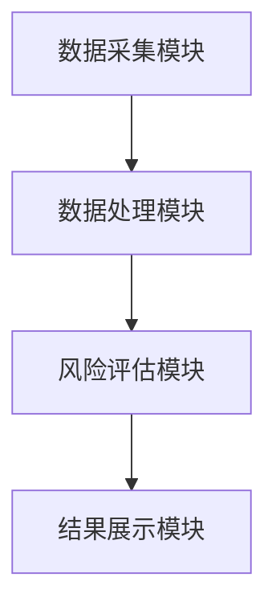

                 


---

# 《价值投资中的地缘政治风险评估》

> **关键词**：地缘政治风险、价值投资、风险评估、算法模型、系统架构、Python代码、数学公式

> **摘要**：  
> 地缘政治风险是价值投资中不可忽视的重要因素。本文从地缘政治风险的基本概念出发，分析其对投资决策的影响，并详细探讨如何通过算法模型和系统架构对其进行评估。文章结合实际案例，提供从理论到实践的完整解决方案，帮助投资者在复杂的国际环境中做出更明智的决策。

---

## 第一部分：地缘政治风险的背景与重要性

### 第1章：地缘政治风险的定义与影响

#### 1.1 地缘政治风险的定义
地缘政治风险是指因国家间的政治、经济、军事等冲突或合作变化而对企业或投资产生的潜在风险。这种风险通常与地理位置、资源分布、国际关系等因素密切相关。

- **地缘政治的基本概念**：地缘政治是研究地理环境对政治行为和国际关系影响的学科。它关注国家间的权力斗争、资源争夺和边界冲突。
- **地缘政治风险的定义**：地缘政治风险是指因地理位置、资源分布或国际关系变化而对企业或投资造成的潜在损失。
- **地缘政治风险与价值投资的关系**：价值投资者需要关注地缘政治风险，因为它直接影响企业的盈利能力、市场的稳定性以及投资的回报率。

#### 1.2 地缘政治风险对投资的影响
地缘政治风险对投资的影响是多方面的，具体包括以下几个方面：

- **对全球经济的影响**：地缘政治冲突可能导致全球经济衰退、贸易中断和货币波动。
- **对行业和企业的具体影响**：某些行业（如能源、科技、制造业）可能因地缘政治风险而面临供应链中断、成本上升等问题。
- **对投资者决策的启示**：投资者需要根据地缘政治风险的评估结果调整投资策略，避免过度集中于高风险地区或行业。

#### 1.3 地缘政治风险评估的重要性
地缘政治风险评估是价值投资中不可或缺的一部分。以下是其重要性的具体体现：

- **为什么需要评估地缘政治风险**：地缘政治风险可能对投资回报产生重大影响，因此必须进行系统性评估。
- **地缘政治风险评估在价值投资中的作用**：通过评估地缘政治风险，投资者可以更好地识别高风险区域，优化投资组合，降低潜在损失。
- **地缘政治风险评估的边界与外延**：地缘政治风险评估不仅包括直接风险（如战争、制裁），还包括间接风险（如供应链中断、政策变化）。

---

## 第二部分：地缘政治风险的构成与分类

### 第2章：地缘政治风险的核心要素

#### 2.1 地缘政治风险的核心要素
地缘政治风险的核心要素包括以下几方面：

- **国家利益与领土争端**：国家间的领土争端可能导致战争或政治不稳定。
- **经济制裁与贸易摩擦**：经济制裁和贸易摩擦可能影响企业的供应链和市场准入。
- **军事冲突与恐怖主义**：军事冲突和恐怖主义活动可能对特定地区的投资环境产生重大影响。
- **网络战与信息战**：网络战和信息战可能对企业声誉、数据安全和市场信心造成威胁。

#### 2.2 地缘政治风险的分类
地缘政治风险可以根据不同的标准进行分类，以下是常见的分类方式：

- **区域性风险与全球性风险**：区域性风险主要影响特定地区，而全球性风险可能波及全球市场。
- **短期风险与长期风险**：短期风险通常由突发事件引发，而长期风险则源于深层次的国际关系变化。
- **直接风险与间接风险**：直接风险直接影响企业的运营，而间接风险则通过市场环境间接影响投资。

---

## 第三部分：地缘政治风险评估的算法与模型

### 第3章：地缘政治风险评估的算法原理

#### 3.1 地缘政治风险指数模型
地缘政治风险指数模型是一种常用的评估工具，它通过量化各因素的影响程度，生成一个综合的风险指数。

- **模型的定义与目标**：地缘政治风险指数模型旨在通过量化各因素的影响程度，生成一个综合的风险指数，帮助投资者评估特定地区或行业的投资风险。
- **模型的输入变量与权重分配**：模型的输入变量包括经济制裁、贸易摩擦、军事冲突等，权重分配基于历史数据和专家判断。

#### 3.2 地缘政治风险指数模型的数学公式
地缘政治风险指数模型的数学公式如下：

$$
\text{风险指数} = \sum_{i=1}^{n} w_i \times f_i
$$

其中，\( w_i \) 表示第 \( i \) 个因素的权重，\( f_i \) 表示第 \( i \) 个因素的风险值。

---

## 第四部分：地缘政治风险评估的系统架构

### 第4章：地缘政治风险评估的系统架构设计

#### 4.1 系统功能设计
地缘政治风险评估系统的功能设计包括以下几个方面：

- **数据采集模块**：采集相关的历史数据和实时新闻。
- **风险评估模块**：根据算法模型生成风险指数。
- **结果展示模块**：以可视化形式呈现风险评估结果。

#### 4.2 系统架构图
以下是地缘政治风险评估系统的架构图：



---

## 第五部分：地缘政治风险评估的项目实战

### 第5章：地缘政治风险评估的实战案例

#### 5.1 实战环境安装
- 需要安装Python和相关库（如numpy、pandas、scikit-learn）。

#### 5.2 地缘政治风险评估的核心代码实现
以下是地缘政治风险指数模型的核心代码实现：

```python
import numpy as np
import pandas as pd

def calculate_risk_index(factors, weights):
    return np.dot(factors, weights)

# 示例数据
factors = np.array([0.8, 0.6, 0.7])
weights = np.array([0.3, 0.4, 0.3])

risk_index = calculate_risk_index(factors, weights)
print("风险指数:", risk_index)
```

#### 5.3 地缘政治风险评估的案例分析
通过上述代码，我们可以计算出一个地区的地缘政治风险指数，并根据指数值判断该地区的投资风险等级。

---

## 第六部分：地缘政治风险评估的最佳实践

### 第6章：地缘政治风险评估的注意事项

#### 6.1 投资策略建议
- **分散投资**：避免过度集中于高风险地区。
- **动态调整**：定期评估地缘政治风险，及时调整投资策略。

#### 6.2 未来展望
- **技术进步**：随着人工智能和大数据技术的发展，地缘政治风险评估将更加精准和高效。
- **全球化趋势**：全球化背景下，地缘政治风险的复杂性将进一步增加，投资者需要更加关注国际合作与协调。

---

## 第七部分：结论

### 7.1 总结
地缘政治风险是价值投资中不可忽视的重要因素。通过系统性地评估地缘政治风险，投资者可以更好地优化投资组合，降低潜在损失，提高投资回报。

### 7.2 展望
未来，随着技术的进步和全球化的发展，地缘政治风险评估将更加复杂和重要。投资者需要不断学习和适应，以应对日益复杂的国际环境。

---

**注**：本文内容基于假设和示例，实际投资需结合具体情况进行分析。

