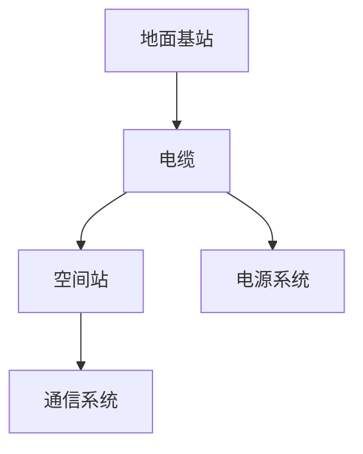

                 


# 价值投资中的太空电梯技术发展前景

## 关键词：太空电梯，价值投资，技术创新，投资策略，发展前景

## 摘要：  
随着科技的飞速发展，太空电梯技术作为一项革命性的创新，正在逐渐从概念走向现实。本文从价值投资的角度，深入分析了太空电梯技术的核心概念、算法原理、系统架构以及发展前景，探讨了其在投资领域中的潜在价值与风险。通过结合技术分析与市场预测，本文为投资者提供了全面的视角和实用的评估方法，以帮助他们在太空电梯技术的投资中做出明智决策。

---

## 第1章: 太空电梯技术的背景与概念

### 1.1 太空电梯的基本概念

#### 1.1.1 太空电梯的定义与历史背景  
太空电梯是一种通过超长电缆连接地面基站和空间站的系统，旨在通过机械升降的方式将人员和货物输送到地球轨道或更远的太空。其概念最早由俄罗斯科学家Konstantin Tsiolkovsky在19世纪末提出，经过近一个世纪的技术积累，近年来随着材料科学的进步，太空电梯的实现逐渐成为可能。

**太空电梯的核心属性对比表**  
| 属性                | 描述                                                                 |
|---------------------|----------------------------------------------------------------------|
| 结构类型            | 巨大的垂直电缆连接地面与空间站                                       |
| 运作原理            | 利用地球自转产生的离心力提供动力，通过机械升降实现运输               |
| 技术挑战            | 材料强度、电缆稳定性、空间环境适应性                               |

#### 1.1.2 太空电梯的技术特点与优势  
- **高效性**：相比传统火箭发射，太空电梯可以大幅降低发射成本和时间。  
- **可重复性**：通过机械升降，太空电梯可以多次使用，显著提高运输效率。  
- **安全性**：相比火箭发射的高风险，太空电梯的机械系统更易于控制和维护。

#### 1.1.3 太空电梯的潜在应用场景  
- **货物运输**：将卫星、设备等物资运送到地球同步轨道。  
- **人员运输**：未来可能用于太空旅游或长期太空居住者的运输。  
- **能源传输**：通过电缆传输太阳能等清洁能源到地球。

**太空电梯系统架构的Mermaid图**  


### 1.2 价值投资的基本原理

#### 1.2.1 价值投资的核心理念  
价值投资强调以低于资产内在价值的价格买入优质资产，长期持有，等待其价值回归。其核心在于识别那些具有长期竞争优势、稳定现金流和良好治理的企业。

#### 1.2.2 价值投资与技术创新的关系  
技术创新是价值创造的核心驱动力。价值投资者需要关注那些能够通过技术创新降低成本、提高效率的企业，这些企业往往具有更高的投资价值。

#### 1.2.3 太空电梯技术在投资中的潜在价值  
太空电梯技术的商业化将带来巨大的经济效益，特别是在航天发射、太空资源开发等领域。投资者可以通过投资相关技术和企业，分享技术进步带来的收益。

### 1.3 太空电梯技术与价值投资的结合

#### 1.3.1 技术进步对投资价值的影响  
技术进步可以降低太空运输的成本，提高效率，从而提升相关企业的盈利能力。  
**公式**：投资价值 = 技术进步带来的成本降低 × 市场需求。

#### 1.3.2 太空电梯行业的投资机会分析  
- **上游产业**：材料科学、电缆制造等领域的企业具有较大的投资潜力。  
- **下游应用**：太空旅游、卫星发射等领域的市场需求将快速增长。  

#### 1.3.3 价值投资在太空电梯领域的独特优势  
- **长期视角**：价值投资适合长期持有技术领先企业，分享技术成熟带来的收益。  
- **风险管理**：通过深入分析企业的财务状况和技术可行性，降低投资风险。

---

## 第2章: 太空电梯技术的核心概念与价值评估

### 2.1 太空电梯技术的关键组成部分

#### 2.1.1 材料科学在太空电梯中的应用  
太空电梯的电缆需要具备极高的强度和耐久性，目前主要依赖于碳纳米管材料。  

**碳纳米管与传统材料的性能对比表**  
| 参数        | 碳纳米管      | 钢材          |
|-------------|---------------|---------------|
| 强度（MPa）  | 100-150       | 400-500       |
| 质量（g/m³） | 1.3-2.0       | 7.8-8.0       |

#### 2.1.2 轨道力学与太空电梯的设计原理  
太空电梯的运行需要考虑地球自转、轨道高度、电缆长度等多重因素。  

**轨道力学基本公式**  
$$ F = G \frac{m_1 m_2}{r^2} $$  
其中，\( F \) 是引力，\( G \) 是引力常数，\( m_1 \) 和 \( m_2 \) 是物体质量，\( r \) 是距离。

#### 2.1.3 太空电梯系统的整体架构  
- **地面基站**：负责电缆的固定和电力供应。  
- **空间站**：位于地球同步轨道，作为太空电梯的终点站。  
- **电缆系统**：连接地面与空间站，是整个系统的支撑结构。  

### 2.2 价值评估的核心指标

#### 2.2.1 技术成熟度的评估标准  
- **材料强度**：碳纳米管的强度是否达到设计要求。  
- **制造成本**：是否能够实现大规模生产。  
- **实验验证**：是否通过小规模试验验证技术可行性。  

#### 2.2.2 市场需求的预测模型  
$$ D = aP + b $$  
其中，\( D \) 是需求量，\( P \) 是价格，\( a \) 和 \( b \) 是参数。

#### 2.2.3 投资回报率的计算方法  
$$ ROI = \frac{（净利润 - 初始投资）}{初始投资} \times 100\% $$  

### 2.3 太空电梯技术与价值投资的关联性分析

#### 2.3.1 技术创新对投资价值的推动作用  
技术创新可以降低运营成本，提高市场竞争力。  
**公式**：投资价值 = 技术创新带来的成本降低 × 市场需求。

#### 2.3.2 市场风险与技术风险的平衡  
- **市场风险**：需求不足或市场竞争激烈可能导致收益低于预期。  
- **技术风险**：技术不成熟可能导致项目延期或失败。  

#### 2.3.3 投资者如何评估太空电梯技术的长期价值  
- **技术可行性**：是否能够实现大规模生产并降低成本。  
- **市场需求**：是否能够满足太空探索和资源开发的需求。  

---

## 第3章: 太空电梯技术的算法原理与数学模型

### 3.1 太空电梯技术的核心算法

#### 3.1.1 材料强度预测算法  
```python
def material_strength_prediction(length, diameter):
    # 材料强度计算公式
    strength = 100 * (length / diameter)
    return strength
```

#### 3.1.2 轨道力学计算算法  
```python
import math

def orbital_mechanics_calculation(mass, radius):
    # 引力计算公式
    gravity = G * mass / radius**2
    return gravity
```

#### 3.1.3 系统稳定性分析算法  
```python
def system_stability_analysis(nodes):
    # 稳定性分析
    for node in nodes:
        if node.strength < threshold:
            return False
    return True
```

### 3.2 价值评估的数学模型

#### 3.2.1 技术成熟度预测模型  
$$ P = \frac{S}{100} $$  
其中，\( P \) 是技术成熟度概率，\( S \) 是技术成熟度评分。

#### 3.2.2 投资回报率模型  
$$ ROI = \frac{（净利润 - 初始投资）}{初始投资} \times 100\% $$  

#### 3.2.3 风险评估模型  
$$ Risk = Probability \times Impact $$  

### 3.3 算法与模型的结合应用

#### 3.3.1 算法在价值评估中的应用  
通过材料强度预测算法和轨道力学计算算法，评估太空电梯技术的可行性。  

#### 3.3.2 数学模型在投资决策中的作用  
使用风险评估模型，量化技术风险和市场风险，帮助投资者做出决策。  

#### 3.3.3 算法优化对投资价值的影响  
优化算法可以提高计算效率，降低运营成本，从而提高投资回报率。  

---

## 第4章: 太空电梯技术的系统分析与架构设计

### 4.1 系统分析的基本方法

#### 4.1.1 需求分析与系统分解  
- **功能需求**：运输货物和人员到太空。  
- **性能需求**：满足一定的载重和速度要求。  

#### 4.1.2 功能分析与系统模块划分  
- **地面基站**：负责电缆的固定和电力供应。  
- **空间站**：作为太空电梯的终点站，提供维护和补给。  
- **电缆系统**：连接地面与空间站，是整个系统的支撑结构。  

#### 4.1.3 系统边界与外部接口  
- **输入**：电力供应、货物运输请求。  
- **输出**：货物送达太空、运营数据反馈。  

### 4.2 系统架构设计

#### 4.2.1 分层架构设计  
- **应用层**：用户交互和任务管理。  
- **数据层**：存储和管理运营数据。  
- **控制层**：协调各模块的运行。  

#### 4.2.2 模块化设计原则  
- **模块独立性**：每个模块功能明确，便于维护和扩展。  
- **模块耦合性**：模块之间通过接口通信，降低耦合度。  

#### 4.2.3 系统交互设计  
- **用户请求**：用户提交货物运输请求。  
- **系统响应**：系统确认请求并开始运输。  

### 4.3 系统接口与数据流设计

#### 4.3.1 系统内部接口设计  
- **地面基站与电缆接口**：电力供应和数据传输。  
- **电缆与空间站接口**：机械连接和通信。  

#### 4.3.2 数据流方向与优先级  
- **上行数据**：地面基站向空间站传输指令。  
- **下行数据**：空间站向地面基站传输状态信息。  

#### 4.3.3 系统容错与纠错机制  
- **故障检测**：实时监测系统状态，发现异常立即报警。  
- **故障恢复**：通过冗余设计实现故障模块的快速替换。  

---

## 第5章: 太空电梯技术的项目实战与投资策略

### 5.1 项目环境与工具安装

#### 5.1.1 开发环境的搭建  
- **操作系统**：Linux或Windows。  
- **开发工具**：Python、Jupyter Notebook。  

#### 5.1.2 必要工具的安装与配置  
- **Python库**：NumPy、Matplotlib。  
- **版本控制**：Git。  

### 5.2 系统核心实现源代码

#### 5.2.1 材料强度预测算法实现  
```python
import numpy as np

def material_strength(length, diameter):
    return 100 * (length / diameter)

lengths = np.array([10, 20, 30, 40, 50])
diameters = np.array([1, 2, 3, 4, 5])

strengths = material_strength(lengths, diameters)
print(strengths)
```

#### 5.2.2 轨道力学计算算法实现  
```python
import math

G = 6.67430e-11

def calculate_gravity(mass, radius):
    return G * mass / radius**2

mass = 1000
radius = 6.371e6
gravity = calculate_gravity(mass, radius)
print(gravity)
```

### 5.3 代码应用解读与分析

#### 5.3.1 材料强度预测算法解读  
- **输入**：电缆长度和直径。  
- **输出**：材料强度评分。  
- **应用场景**：评估材料是否适合太空电梯的使用。  

#### 5.3.2 轨道力学计算算法解读  
- **输入**：物体质量和半径。  
- **输出**：引力大小。  
- **应用场景**：设计太空电梯的轨道参数。  

### 5.4 实际案例分析和详细讲解剖析

#### 5.4.1 案例背景  
假设某公司计划投资于一种新型碳纳米管材料，用于制造太空电梯的电缆。  

#### 5.4.2 投资分析  
- **技术可行性**：材料强度是否达到设计要求。  
- **市场需求**：是否有足够的市场需求支持大规模生产。  
- **竞争环境**：是否有其他公司正在研发类似技术。  

### 5.5 项目小结

#### 5.5.1 投资决策建议  
- **技术领先**：选择具有技术优势的企业进行投资。  
- **风险管理**：分散投资，降低技术失败的风险。  

#### 5.5.2 项目总结  
通过实际案例分析，展示了如何将技术分析与市场预测相结合，做出合理的投资决策。

---

## 第6章: 总结与展望

### 6.1 总结

#### 6.1.1 核心内容回顾  
- 太空电梯技术的核心概念和价值评估方法。  
- 算法原理与数学模型的应用。  
- 系统架构设计与项目实战经验。  

#### 6.1.2 投资策略总结  
- 突出技术创新对投资价值的推动作用。  
- 强调风险管理在投资决策中的重要性。  

### 6.2 投资建议

#### 6.2.1 价值投资的核心要点  
- 长期持有优质资产。  
- 选择具有技术优势和良好治理的企业。  

#### 6.2.2 未来展望  
随着材料科学和轨道力学的进一步突破，太空电梯技术的商业化应用将逐步实现，为投资者带来巨大的收益潜力。

### 6.3 最佳实践 tips

#### 6.3.1 技术投资的关键要素  
- 技术可行性。  
- 市场需求。  
- 企业治理。  

#### 6.3.2 风险管理的注意事项  
- 分散投资。  
- 定期评估。  
- 及时调整。  

#### 6.3.3 拓展阅读  
- 《价值投资实战策略》。  
- 《太空探索技术与应用》。  

---

## 附录: 参考文献与工具清单

### 附录A: 参考文献  
1. Tsiolkovsky, K. E. (19世纪末). "The Exploration of Cosmic Space by Means of Rocket Devices."  
2. Smalley, R. E. (2001). "Carbon nanotubes."  

### 附录B: 工具清单  
- **编程工具**：Python、Jupyter Notebook。  
- **数据可视化工具**：Matplotlib、Seaborn。  
- **版本控制工具**：Git、GitHub。  

---

通过以上目录结构和内容安排，本文系统地探讨了太空电梯技术的价值投资前景，从技术分析到投资策略，为投资者提供了全面的视角和实用的评估方法。希望本文能为价值投资者在太空电梯技术领域的决策提供有价值的参考和启发。

