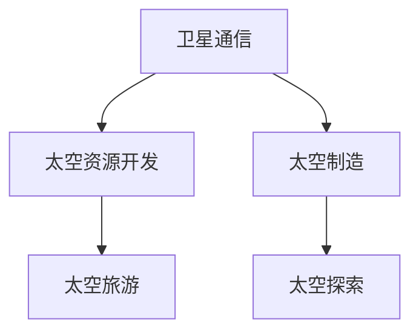

                 


---

# 价值投资中的太空经济机会

> **关键词**：价值投资、太空经济、卫星互联网、太空资源开发、太空旅游、投资策略

> **摘要**：随着太空经济的快速发展，价值投资在这一领域展现出巨大的潜力。本文将从太空经济的定义与发展现状出发，深入分析其核心概念与投资机会，探讨价值投资的基本原则、策略以及风险管理，结合实际案例提供系统化的投资框架。通过本文，读者将能够理解如何在太空经济中识别和把握投资机会，制定有效的投资策略。

---

# 第1章: 太空经济的定义与现状

## 1.1 太空经济的定义与范围

### 1.1.1 太空经济的定义

太空经济（Space Economy）是指围绕地球大气层以外的宇宙空间所进行的所有经济活动的总和，涵盖卫星通信、太空资源开发、太空旅游等多个领域。太空经济的核心在于将太空资源和技术应用于商业目的，从而创造经济价值。

**太空经济的领域分布图**（Mermaid图）：



### 1.1.2 太空经济的核心领域

太空经济的核心领域包括：

1. **卫星通信**：利用卫星提供全球通信服务，覆盖偏远地区。
2. **太空资源开发**：包括小行星采矿、月球和火星资源开发等。
3. **太空旅游**：商业化的太空旅行服务。
4. **太空制造**：在太空中制造材料或产品。
5. **太空探索**：政府和私营企业的联合探索任务。

### 1.1.3 太空经济的全球发展趋势

近年来，太空经济呈现快速增长态势。2022年，全球太空经济规模达到约4600亿美元，预计到2030年将超过1万亿美元。美国、中国、欧洲等地的企业和政府机构在太空经济中扮演重要角色。

---

## 1.2 价值投资的基本概念

### 1.2.1 价值投资的定义

价值投资是一种投资策略，强调以低于资产内在价值的价格购买优质资产。其核心在于寻找市场低估的公司，长期持有，等待其价值回归。

### 1.2.2 价值投资的核心原则

1. **安全边际**：买入价格低于内在价值。
2. **长期视角**：关注企业的长期盈利能力。
3. **基本面分析**：重视企业的财务状况、行业地位和竞争优势。

### 1.2.3 价值投资在现代金融中的地位

价值投资在金融市场上占据重要地位，尤其在长期投资中表现突出。它强调理性分析和风险控制，适合对市场波动不敏感的投资者。

---

## 1.3 太空经济与价值投资的结合

### 1.3.1 太空经济的商业化趋势

太空经济的商业化推动了私营企业的快速发展，如SpaceX、Blue Origin等企业的崛起。

### 1.3.2 价值投资在太空经济中的应用

价值投资者可以通过分析太空企业的财务状况、行业地位和竞争优势，寻找被市场低估的投资机会。

### 1.3.3 太空经济中的投资机会

1. **卫星互联网**：随着全球互联网需求增长，卫星互联网企业具有巨大潜力。
2. **太空资源开发**：小行星采矿和月球基地建设等领域可能带来丰厚回报。
3. **太空旅游**：随着技术进步，太空旅游市场将快速增长。

---

## 1.4 本章小结

本章介绍了太空经济的定义、核心领域及其发展趋势，同时阐述了价值投资的基本概念和原则。通过分析太空经济的商业化趋势，探讨了价值投资在这一领域的应用潜力。

---

# 第2章: 太空经济的核心概念与投资机会

## 2.1 太空经济的主要参与者

### 2.1.1 政府机构

政府机构是太空经济的主要参与者之一，主要通过政策支持和资金投入推动行业发展。

### 2.1.2 私营企业

私营企业如SpaceX、Blue Origin等在卫星通信、太空旅游等领域发挥重要作用。

### 2.1.3 国际合作组织

国际合作组织通过跨国合作推动太空经济的发展，如国际空间站项目。

---

## 2.2 太空经济的主要领域

### 2.2.1 卫星通信

卫星通信是太空经济的核心领域之一，主要用于全球通信服务。

### 2.2.2 太空资源开发

太空资源开发包括小行星采矿、月球和火星资源开发等。

### 2.2.3 太空旅游

太空旅游是新兴领域，随着技术进步逐渐成熟。

---

## 2.3 太空经济的投资机会

### 2.3.1 卫星互联网的投资潜力

卫星互联网企业如SpaceX的Starlink项目具有巨大市场潜力。

### 2.3.2 太空资源开发的商业价值

小行星采矿和月球基地建设等领域可能带来丰厚回报。

### 2.3.3 太空旅游的市场前景

随着技术进步，太空旅游市场将快速增长。

---

## 2.4 本章小结

本章分析了太空经济的主要参与者和核心领域，探讨了各领域的投资机会，为后续的价值投资策略提供基础。

---

# 第3章: 太空经济中的价值投资策略

## 3.1 价值投资的基本原则

### 3.1.1 价值投资的核心理念

价值投资强调寻找市场低估的资产，长期持有，关注企业的内在价值。

### 3.1.2 价值投资的选股标准

1. **低市盈率**：市盈率低于行业平均水平。
2. **高利润率**：企业具有较高的盈利能力。
3. **强大竞争优势**：企业在行业中具有显著优势。

---

## 3.2 太空经济中的价值投资策略

### 3.2.1 选择具有竞争优势的企业

在太空经济中，选择具有技术优势和市场领先地位的企业。

### 3.2.2 评估企业的财务健康状况

关注企业的财务状况，确保其具备长期盈利能力。

### 3.2.3 分析企业的成长潜力

评估企业在太空经济中的成长空间和市场前景。

---

## 3.3 价值投资在太空经济中的应用案例

### 3.3.1 美国太空探索技术公司（SpaceX）的投资价值

SpaceX的卫星互联网项目（Starlink）具有巨大的市场潜力，符合价值投资的基本原则。

---

## 3.4 本章小结

本章探讨了太空经济中的价值投资策略，强调选择具有竞争优势的企业，评估财务状况和成长潜力，为投资者提供了具体的指导。

---

# 第4章: 太空经济中的风险与风险管理

## 4.1 太空经济的主要风险

### 4.1.1 技术风险

太空技术的复杂性可能导致项目失败。

### 4.1.2 市场风险

市场需求不足或竞争加剧可能导致投资失败。

### 4.1.3 政策风险

政策变化可能影响太空经济的发展。

---

## 4.2 价值投资中的风险管理策略

### 4.2.1 风险评估与量化

通过定量分析和定性评估，全面评估投资风险。

### 4.2.2 风险分散策略

将投资分散到不同的领域和企业，降低风险。

### 4.2.3 风险监控与调整

定期监控投资组合，及时调整策略。

---

## 4.3 太空经济中的风险管理案例

### 4.3.1 技术失败的风险管理

通过分散投资和技术评估降低技术失败风险。

### 4.3.2 市场波动的应对策略

保持长期视角，避免短期市场波动的影响。

### 4.3.3 政策变化的适应措施

密切关注政策变化，及时调整投资策略。

---

## 4.4 本章小结

本章分析了太空经济中的主要风险，并提出了有效的风险管理策略，为投资者提供了重要的参考。

---

# 第5章: 太空经济中的长期投资机会

## 5.1 太空经济的长期发展趋势

### 5.1.1 卫星互联网的全球覆盖

随着技术进步，卫星互联网将实现全球覆盖。

### 5.1.2 太空资源开发的商业化

小行星采矿和月球基地建设将逐步商业化。

### 5.1.3 太空旅游的市场扩展

随着技术进步，太空旅游市场将快速增长。

---

## 5.2 价值投资在长期机会中的应用

### 5.2.1 长期价值投资框架

构建长期投资框架，关注企业的长期盈利能力。

### 5.2.2 太空经济的投资策略

选择具有长期增长潜力的企业，长期持有，等待价值实现。

---

## 5.3 本章小结

本章分析了太空经济的长期发展趋势，并提出了价值投资的应用策略，为投资者提供了长期视角。

---

# 第6章: 项目实战

## 6.1 环境配置

### 6.1.1 安装必要的开发工具

安装Python、Jupyter Notebook等工具。

### 6.1.2 安装必要的Python库

安装Pandas、NumPy、Matplotlib等库。

---

## 6.2 系统核心实现

### 6.2.1 价值投资框架实现

```python
import pandas as pd
import numpy as np

def calculate_intrinsic_value(fundamentals):
    # 简单的内在价值计算模型
    return fundamentals['Revenue'] * 0.5 + fundamentals['Net Profit'] * 0.3

def value_investment_strategy(stocks):
    selected_stocks = []
    for stock in stocks:
        iv = calculate_intrinsic_value(stock.fundamentals)
        if iv > stock.current_price:
            selected_stocks.append(stock)
    return selected_stocks
```

### 6.2.2 太空经济分析工具实现

```python
import matplotlib.pyplot as plt

def plot_market_trend(data):
    plt.plot(data['Year'], data['Market Size'], label='Market Size')
    plt.xlabel('Year')
    plt.ylabel('Market Size (Billion $)')
    plt.title('Space Economy Market Size Trend')
    plt.legend()
    plt.show()
```

---

## 6.3 代码应用解读与分析

### 6.3.1 价值投资框架实现

上述代码实现了简单的价值投资框架，通过计算企业的内在价值，筛选出具有投资潜力的股票。

### 6.3.2 太空经济分析工具实现

上述代码用于绘制太空经济市场规模的趋势图，帮助投资者了解市场动态。

---

## 6.4 实际案例分析

### 6.4.1 案例分析：SpaceX的投资价值

通过对SpaceX的财务状况和技术优势的分析，评估其投资价值。

---

## 6.5 项目小结

本章通过项目实战，展示了如何将价值投资框架应用于太空经济领域，提供了具体的代码实现和案例分析。

---

# 结语

价值投资在太空经济中具有巨大的潜力，通过科学的投资策略和风险管理，投资者可以在这一领域实现长期稳定的收益。随着太空经济的快速发展，价值投资的应用将更加广泛，为投资者带来新的机会。

---

