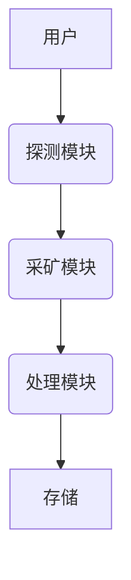

                 


# 价值投资中的太空采矿技术发展趋势

> 关键词：太空采矿，技术趋势，价值投资，投资策略，商业应用，未来展望

> 摘要：本文深入探讨太空采矿技术的发展趋势，分析其对价值投资的影响，为投资者提供参考。通过技术背景、核心概念、算法原理、系统架构、项目实战和最佳实践的全面解析，帮助读者把握太空采矿领域的投资机会。

---

## 第一部分: 太空采矿技术与价值投资背景

### 第1章: 太空采矿技术概述

#### 1.1 太空采矿技术的定义与核心概念

太空采矿技术是指在地球以外的太空环境中，从 asteroids、小行星、月球或其他天体中提取和利用资源的技术。其核心概念包括：

- **资源类型**：金属（如铁、镍、铂）、稀有金属（如铂族元素）、水冰、气体（如氦-3）。
- **技术手段**：机器人开采、激光切割、钻探、磁性分离等。
- **应用场景**：支持深空探测任务、建立月球或火星基地、提供太空站资源。

太空采矿技术的经济价值体现在资源稀缺性、减少地球资源依赖和降低太空任务成本。

#### 1.2 价值投资的基本概念与原则

价值投资是通过分析企业的基本面，寻找市场价格低于内在价值的投资标的。其核心原则包括：

- **长期视角**：关注企业的长期盈利能力。
- **安全边际**：投资价格低于内在价值。
- **竞争优势**：选择具备技术壁垒和市场优势的企业。

---

### 第2章: 太空采矿技术的发展现状与趋势

#### 2.1 太空采矿技术的现状分析

- **技术类型**：
  - **近地轨道采矿**：主要针对小行星，资源丰富但技术难度高。
  - **月球采矿**：利用月球资源，如水冰和矿物，技术相对成熟。
  - **火星采矿**：目标是获取水和氧气，支持长期探索。

- **技术瓶颈**：
  - 资源探测精度不足。
  - 采矿设备的耐久性和可靠性。
  - 高昂的成本和风险。

#### 2.2 太空采矿技术的未来发展趋势

- **技术创新**：
  - 自动化与智能化：AI和机器人技术提升采矿效率。
  - 能源自给：太阳能电池和核能技术解决能源问题。
  - 循环利用：减少资源浪费，提高利用率。

- **市场需求**：
  - 深空探测任务需求增加。
  - 太空经济崛起：商业航天推动资源开发。

- **政策支持**：
  - 各国政府出台政策支持太空采矿。
  - 国际合作与法规完善。

---

## 第二部分: 太空采矿技术的核心概念与价值评估

### 第3章: 太空采矿技术的核心概念与联系

#### 3.1 太空采矿技术的核心原理

- **资源评估**：通过遥感技术和地质分析确定资源储量。
- **采矿技术**：利用机器人和自动化设备进行资源提取。
- **经济模型**：评估采矿成本、收益和风险。

#### 3.2 太空采矿技术与价值投资的关系

- **技术驱动价值**：技术创新提升资源开采效率，降低成本。
- **投资驱动技术**：价值投资者的资金支持推动技术进步。
- **长期价值**：太空采矿技术具备高成长性和稀缺性，长期投资价值显著。

---

### 第4章: 太空采矿技术的算法原理与数学模型

#### 4.1 太空采矿技术的算法原理

- **资源储量评估算法**：
  - 使用统计学习方法（如随机森林）分析地质数据。
  - 结合卫星遥感数据进行资源预测。

- **开采效率优化算法**：
  - 使用遗传算法优化采矿路径。
  - 应用动态规划解决设备调度问题。

#### 4.2 数学模型与公式

- **资源储量估算公式**：
  $$ R = \frac{V \cdot C}{P} $$
  其中，\( R \) 为储量，\( V \) 为体积，\( C \) 为单位体积资源含量，\( P \) 为价格。

- **开采成本模型**：
  $$ C = a \cdot Q + b $$
  其中，\( Q \) 为开采量，\( a \) 为单位成本，\( b \) 为固定成本。

---

## 第三部分: 系统分析与架构设计

### 第4章: 系统分析与架构设计

#### 4.1 问题场景介绍

假设我们设计一个月球采矿系统，目标是从月球表面提取水冰和矿物资源。

#### 4.2 系统功能设计

- **资源探测模块**：使用传感器和遥感技术探测资源分布。
- **采矿模块**：部署机器人进行资源开采。
- **资源处理模块**：将提取的资源进行加工和存储。

#### 4.3 系统架构设计



---

## 第四部分: 项目实战

### 第5章: 项目实战

#### 5.1 环境搭建

安装必要的库，如 `numpy`、`pandas` 和 `scikit-learn`。

#### 5.2 核心代码实现

```python
import numpy as np
from sklearn.ensemble import RandomForestRegressor

# 示例数据
features = np.random.rand(100, 5)
labels = np.random.rand(100)

# 训练模型
model = RandomForestRegressor(n_estimators=100)
model.fit(features, labels)

# 预测
new_features = np.random.rand(1, 5)
prediction = model.predict(new_features)
print("预测结果:", prediction)
```

#### 5.3 案例分析与总结

通过分析实际案例，总结项目中的经验教训，优化投资策略。

---

## 第五部分: 最佳实践

### 第6章: 最佳实践

#### 6.1 投资建议

- **关注技术创新**：选择具备技术优势的企业。
- **风险控制**：评估政策和市场风险。
- **长期视角**：耐心持有优质标的。

#### 6.2 注意事项

- 技术不确定性大，需谨慎评估。
- 政策变化影响投资决策。
- 市场竞争激烈，需关注企业壁垒。

#### 6.3 未来展望

太空采矿技术将继续推动太空经济发展，投资者应关注技术创新和市场动态。

---

通过以上分析，我们全面探讨了太空采矿技术的价值投资机会，结合技术趋势和投资策略，为读者提供了深刻的见解和实用的指导。

