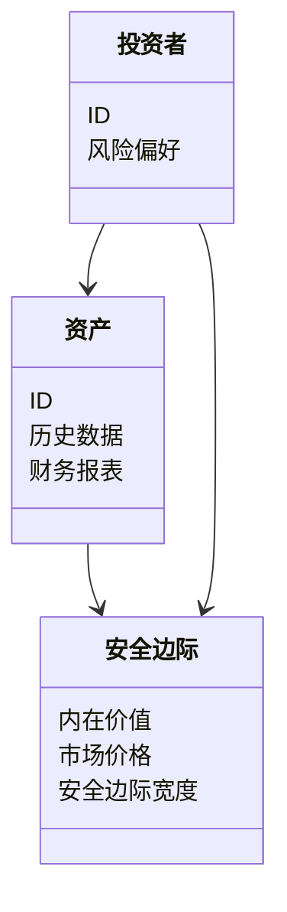
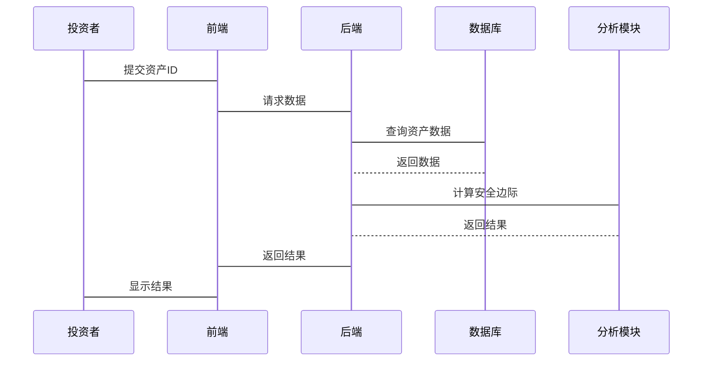

                 


# 价值投资中的安全边际如何确定

## 关键词：价值投资，安全边际，投资决策，内在价值，DCF模型，投资策略

## 摘要：  
在价值投资中，安全边际是确保投资决策稳健性的关键因素。本文通过详细分析安全边际的定义、计算方法、应用场景及系统架构，帮助投资者理解如何在实际投资中确定和应用安全边际，以降低风险并实现长期稳健的投资回报。

---

## 第一部分：价值投资与安全边际的背景介绍

### 第1章：价值投资与安全边际的定义与背景

#### 1.1 价值投资的核心概念

**1.1.1 价值投资的起源与发展**  
价值投资是一种以基本面分析为基础的投资策略，起源于20世纪初，由本杰明·格雷厄姆和戴维·多德等投资大师提出。其核心思想是通过分析企业的内在价值，寻找市场价格低于内在价值的资产进行投资，以获得长期稳定的收益。

**1.1.2 安全边际的定义与内涵**  
安全边际是指资产的市场价格与其内在价值之间的差额。简单来说，当市场价格低于内在价值时，两者之间的差额即为安全边际。安全边际的存在为投资者提供了缓冲空间，降低了投资的风险。

**1.1.3 安全边际在价值投资中的重要性**  
安全边际是价值投资的核心理念之一。通过合理评估安全边际，投资者可以在市场波动中保持稳健，避免因市场过度波动而造成损失。

#### 1.2 安全边际的背景与问题背景

**1.2.1 投资者面临的不确定性与风险**  
市场波动、经济周期、公司基本面变化等多重因素都会影响资产价格，给投资者带来不确定性。安全边际的存在帮助投资者在不确定中找到确定性。

**1.2.2 安全边际如何解决投资中的问题**  
通过计算安全边际，投资者可以量化风险，避免在高估市场中投入，从而降低投资损失的可能性。

**1.2.3 安全边际的边界与外延**  
安全边际不仅适用于股票投资，还可扩展应用于房地产、债券等多种资产类别。其外延广泛，是投资决策中的通用工具。

#### 1.3 安全边际的核心要素与概念结构

**1.3.1 核心要素：内在价值、市场价格、安全边际宽度**  
- **内在价值**：资产在合理估值下的真实价值。
- **市场价格**：资产在市场上的交易价格。
- **安全边际宽度**：内在价值与市场价格之间的差额。

**1.3.2 概念结构图：安全边际在投资决策中的位置**  
以下是安全边际的概念结构图：

```mermaid
graph TD
    A[投资者] -> B[资产]
    B -> C[内在价值]
    B -> D[市场价格]
    D -> E[安全边际]
    C -->> E
```

---

## 第二部分：安全边际的核心概念与联系

### 第2章：安全边际的核心原理与特征

#### 2.1 安全边际的原理与计算方法

**2.1.1 内在价值的计算方法**  
内在价值的计算是安全边际的核心。以下是常用的计算方法：

1. **现金流折现法（DCF模型）**：通过预测未来现金流并按适当折现率计算现值。
2. **市盈率法**：通过合理的市盈率乘以净利润得到估值。
3. **市净率法**：通过合理的市净率乘以净资产值得到估值。

**2.1.2 市场价格与安全边际的比较**  
安全边际 = 内在价值 - 市场价格。

**2.1.3 安全边际宽度的确定**  
安全边际宽度应根据市场环境和投资者风险承受能力来确定，通常建议至少为20%~30%。

#### 2.2 安全边际与投资策略的对比

**2.2.1 安全边际与成长股投资的对比**  
- 成长股投资更关注未来增长潜力，而安全边际更关注当前价格与内在价值的差距。
- 成长股投资风险较高，而安全边际提供了风险缓冲。

**2.2.2 安全边际与趋势投资的对比**  
- 趋势投资依赖于价格走势，而安全边际依赖于价值评估。
- 趋势投资注重短期波动，而安全边际注重长期稳健。

**2.2.3 安全边际与技术分析的对比**  
- 技术分析依赖于价格形态，而安全边际依赖于价值评估。
- 技术分析注重市场信号，而安全边际注重价格与价值的偏离。

#### 2.3 安全边际的ER实体关系图

以下是安全边际的ER实体关系图：

```mermaid
erd
    投资者 (Investor) o-1 [投资决策] -> 资产 (Asset)
    资产 <-[拥有] 投资者
    投资决策 -> 安全边际 (Margin of Safety)
    资产 -> 内在价值 (Intrinsic Value)
    资产 -> 市场价格 (Market Price)
```

---

## 第三部分：安全边际的算法原理与数学模型

### 第3章：安全边际的计算方法与数学模型

#### 3.1 安全边际的计算算法

**3.1.1 算法流程图：安全边际计算的步骤**

```mermaid
graph TD
    A[开始] -> B[输入资产数据]
    B -> C[计算内在价值]
    C -> D[计算市场价格]
    D -> E[计算安全边际]
    E -> F[结束]
```

**3.1.2 算法原理：基于DCF模型的安全边际计算**  
以下是基于DCF模型的安全边际计算步骤：

1. **预测未来现金流**：根据企业盈利能力和增长潜力预测未来现金流。
2. **选择合适的折现率**：通常使用企业的加权平均资本成本（WACC）作为折现率。
3. **计算内在价值**：将未来现金流按折现率折现，得到内在价值。
4. **计算市场价格**：获取资产当前市场价格。
5. **计算安全边际**：内在价值 - 市场价格。

**3.1.3 算法实现：Python代码示例**

```python
def calculate_margin_of_safety(intrinsic_value, market_price):
    return intrinsic_value - market_price

# 示例数据
intrinsic_value = 100  # 内在价值
market_price = 80       # 市场价格
margin_of_safety = calculate_margin_of_safety(intrinsic_value, market_price)
print(f"安全边际为：{margin_of_safety}")
```

#### 3.2 安全边际的数学模型与公式

**3.2.1 内在价值公式**  
$$\text{内在价值} = \frac{\text{现金流}}{\text{折现率} - \text{增长率}}$$

**3.2.2 安全边际公式**  
$$\text{安全边际} = \text{内在价值} - \text{市场价格}$$

**3.2.3 市盈率与市净率公式**  
$$\text{市盈率} = \frac{\text{市场价格}}{\text{每股收益}}$$  
$$\text{市净率} = \frac{\text{市场价格}}{\text{每股净资产}}$$

#### 3.3 算法原理的详细讲解与举例

**3.3.1 内在价值的计算步骤**  
1. 预测未来现金流：假设某企业未来5年的现金流分别为50、60、70、80、90万元。
2. 选择折现率：假设WACC为8%。
3. 计算内在价值：将未来现金流折现，得到现值总和为约220万元。

**3.3.2 安全边际的计算步骤**  
1. 市场价格：假设当前市场价格为180万元。
2. 计算安全边际：220 - 180 = 40万元。

**3.3.3 实际案例分析**  
以某上市公司为例，计算其安全边际：

1. 内在价值计算：使用DCF模型，得到内在价值为100元。
2. 市场价格：当前股价为80元。
3. 安全边际：100 - 80 = 20元。

---

## 第四部分：安全边际的系统分析与架构设计

### 第4章：安全边际的系统分析与架构设计

#### 4.1 投资决策系统的场景介绍

**4.1.1 投资决策系统的功能目标**  
通过系统化的方法，帮助投资者快速计算资产的安全边际，辅助投资决策。

**4.1.2 系统的输入与输出**  
- 输入：资产的历史数据、财务报表、市场数据。
- 输出：安全边际计算结果、投资建议。

**4.1.3 系统的使用场景**  
适用于个人投资者、机构投资者以及投资顾问。

#### 4.2 投资决策系统的功能设计

**4.2.1 系统功能模块**  
1. 数据采集模块：获取资产的历史数据和实时数据。
2. 数据分析模块：计算内在价值、市场价格，确定安全边际。
3. 决策模块：根据安全边际宽度提供投资建议。

**4.2.2 领域模型（mermaid类图）**



#### 4.3 系统架构设计

**4.3.1 系统架构（mermaid架构图）**

```mermaid
archi
    前端 -> 后端: 请求数据
    后端 -> 数据库: 查询数据
    后端 -> 分析模块: 计算安全边际
    分析模块 -> 前端: 返回结果
```

**4.3.2 系统交互（mermaid序列图）**



---

## 第五部分：项目实战

### 第5章：基于安全边际的项目实战

#### 5.1 环境安装与配置

**5.1.1 Python环境安装**  
安装Python 3.x及以上版本。

**5.1.2 安装必要的库**  
安装pandas、numpy、scipy等数据分析库。

```bash
pip install pandas numpy scipy
```

#### 5.2 系统核心实现

**5.2.1 数据采集模块**  
从数据库或API获取资产数据。

**5.2.2 数据分析模块**  
计算内在价值、市场价格，确定安全边际。

**5.2.3 决策模块**  
根据安全边际宽度提供投资建议。

#### 5.3 代码实现与解读

**5.3.1 Python代码示例**

```python
import pandas as pd
import numpy as np

def calculate_intrinsic_value(cash_flows, discount_rate, growth_rate):
    return sum(cash_flows / (discount_rate - growth_rate))

def calculate_margin_of_safety(intrinsic_value, market_price):
    return intrinsic_value - market_price

# 示例数据
cash_flows = [50, 60, 70, 80, 90]  # 单位：万元
discount_rate = 0.08
growth_rate = 0.05
market_price = 80

intrinsic_value = calculate_intrinsic_value(cash_flows, discount_rate, growth_rate)
margin_of_safety = calculate_margin_of_safety(intrinsic_value, market_price)

print(f"内在价值：{intrinsic_value}")
print(f"市场价格：{market_price}")
print(f"安全边际：{margin_of_safety}")
```

**5.3.2 代码解读**  
1. `calculate_intrinsic_value`函数：计算内在价值，使用现金流折现法。
2. `calculate_margin_of_safety`函数：计算安全边际，基于内在价值和市场价格的差值。
3. 示例数据：假设未来现金流、折现率和增长率，计算内在价值和安全边际。

#### 5.4 实际案例分析

**5.4.1 案例分析：某上市公司**

1. **数据收集**：获取公司过去5年的现金流、净利润等数据。
2. **计算内在价值**：使用DCF模型，计算出内在价值为100元。
3. **计算市场价格**：当前股价为80元。
4. **计算安全边际**：100 - 80 = 20元。
5. **投资建议**：由于安全边际为20元，建议买入该股票。

#### 5.5 项目小结

**5.5.1 项目总结**  
通过系统化的方法，投资者可以快速计算安全边际，辅助投资决策。

**5.5.2 经验与教训**  
- 数据质量影响计算结果。
- 安全边际的计算需要结合市场环境。

---

## 第六部分：总结与展望

### 第6章：总结与展望

#### 6.1 安全边际的重要性

**6.1.1 安全边际是投资决策的关键因素**  
通过计算安全边际，投资者可以避免高估市场，降低投资风险。

**6.1.2 安全边际的动态调整**  
根据市场变化和公司基本面，定期调整安全边际宽度。

#### 6.2 安全边际的注意事项

**6.2.1 数据质量的重要性**  
确保数据来源可靠，避免因数据错误导致计算偏差。

**6.2.2 市场环境的影响**  
安全边际的计算需要结合市场环境，避免单一模型的应用。

**6.2.3 风险管理的重要性**  
即使计算出较大的安全边际，仍需注意风险管理。

#### 6.3 安全边际的未来展望

**6.3.1 数字化投资工具的应用**  
随着技术进步，更多投资者将使用数字化工具计算安全边际。

**6.3.2 人工智能在安全边际中的应用**  
AI技术可以提高安全边际计算的准确性和效率。

---

## 第七部分：最佳实践与小结

### 第7章：最佳实践与小结

#### 7.1 最佳实践

**7.1.1 定期评估安全边际**  
市场波动频繁，需定期重新评估安全边际。

**7.1.2 结合多种估值方法**  
使用多种方法验证内在价值，提高计算准确性。

**7.1.3 注重长期投资**  
安全边际提供了长期投资的缓冲，避免短期波动影响。

#### 7.2 项目总结

**7.2.1 项目成果**  
通过系统化的方法，投资者可以更好地理解和应用安全边际。

**7.2.2 项目经验**  
数据质量和模型选择对结果影响重大。

#### 7.3 项目小结

**7.3.1 项目收获**  
掌握了安全边际的计算方法和应用场景。

**7.3.2 项目感悟**  
安全边际是价值投资的核心，需要结合市场环境和个人经验灵活运用。

---

## 第八部分：注意事项与未来计划

### 第8章：注意事项与未来计划

#### 8.1 安全边际的注意事项

**8.1.1 数据的准确性和完整性**  
确保数据来源可靠，避免因数据错误导致计算偏差。

**8.1.2 模型的局限性**  
安全边际的计算依赖于假设和模型，需结合实际情况进行调整。

**8.1.3 市场环境的变化**  
安全边际的计算需根据市场环境动态调整。

#### 8.2 未来计划

**8.2.1 持续优化模型**  
结合新的市场数据和研究成果，优化安全边际计算模型。

**8.2.2 推广应用**  
将安全边际的应用扩展至更多资产类别，帮助更多投资者实现稳健收益。

---

## 第九部分：拓展阅读与参考资料

### 第9章：拓展阅读与参考资料

#### 9.1 相关书籍

1. 《投资最重要的事》——本杰明·格雷厄姆
2. 《股票投资实战模拟》——彼得·林奇

#### 9.2 网站与工具

1. 财务数据网站：Yahoo Finance、Google Finance
2. 数据分析工具：Excel、Python（pandas、numpy）

#### 9.3 专业论坛与社群

1. 投资者论坛：雪球、东方财富网
2. 专业社群：CFA协会、特许金融分析师社群

---

## 第十部分：附录与参考文献

### 第10章：附录与参考文献

#### 10.1 附录

1. 安全边际计算的详细步骤
2. 常用的估值模型与公式
3. 代码示例与数据表格

#### 10.2 参考文献

1. 格雷厄姆，B. (1974). 《The Intelligent Investor》.
2. 多德，D. (1962). 《Security Analysis》.
3. 芒格，C. (2006). 《Poor Charlie's Almanack》.

---

## 总结

通过本文的详细分析，读者可以全面理解安全边际的定义、计算方法、应用场景及系统架构。从理论到实践，从概念到代码，帮助投资者在实际操作中合理运用安全边际，实现稳健投资收益。

