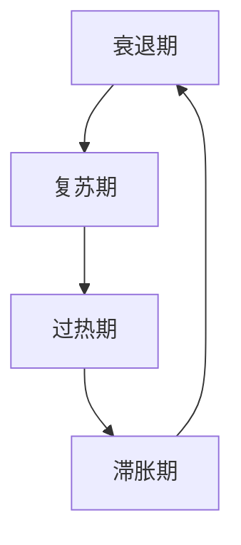

                 

## 《价值投资中的宏观经济周期判断》

### 关键词：价值投资、宏观经济周期、经济指标、投资策略、经济阶段

### 摘要：  
价值投资是一种注重长期回报的投资策略，其核心在于识别市场中被低估的投资标的。然而，宏观经济周期的变化对价值投资的决策和结果有着重要影响。本文将深入探讨宏观经济周期对价值投资的影响，分析不同经济周期阶段下的投资策略，并通过实例和数学模型帮助投资者更好地理解和应用这些概念。

---

# 第一章：宏观经济周期的基本概念

## 1.1 宏观经济周期的定义与特征

### 1.1.1 宏观经济周期的定义  
宏观经济周期是指经济活动在长期内围绕潜在产出水平波动的过程，通常包括四个阶段：衰退、复苏、过热和滞胀。这些阶段的变化受到多种因素的影响，如经济政策、市场供需和全球事件等。

**图表：经济周期的阶段划分**  

### 1.1.2 宏观经济周期的主要阶段  
1. **衰退期**：经济活动萎缩，企业利润下降，失业率上升。  
2. **复苏期**：经济开始恢复，企业利润逐步回升。  
3. **过热期**：经济增长过快，可能出现通货膨胀。  
4. **滞胀期**：经济增长停滞，通胀率高企，企业盈利能力下降。

### 1.1.3 宏观经济周期对投资的影响  
经济周期的变化直接影响市场的供需关系、企业盈利能力和资产价格。投资者需要根据经济周期的阶段调整投资策略，以最大化收益并降低风险。

---

## 1.2 宏观经济指标与分析工具

### 1.2.1 主要宏观经济指标  
1. **GDP（国内生产总值）**：衡量一个国家或地区的经济总量。  
2. **CPI（消费者价格指数）**：衡量通货膨胀水平。  
3. **失业率**：反映劳动力市场的健康状况。  
4. **利率**：影响企业融资成本和消费者借贷行为。  

### 1.2.2 财政政策与货币政策的分析工具  
1. **财政政策**：政府通过调整税收和支出影响经济活动。  
2. **货币政策**：中央银行通过调整利率和货币供应量影响经济。  

### 1.2.3 宏观经济周期的预测方法  
1. **领先指标**：如工业生产指数、股票价格指数等，能够提前预示经济周期的变化。  
2. **滞后指标**：如失业率、企业利润等，通常在经济周期变化后才显现。  

---

## 1.3 宏观经济周期与价值投资的关系

### 1.3.1 价值投资的核心理念  
价值投资强调以低于内在价值的价格购买优质资产，注重长期回报而非短期市场波动。

### 1.3.2 宏观经济周期对价值投资的影响  
1. 在衰退期，市场恐慌可能导致资产价格低估，为价值投资者提供买入机会。  
2. 在过热期，市场可能过度投机，价值投资者应警惕高估的资产。  

### 1.3.3 价值投资在不同经济周期中的表现  
1. **衰退期**：价值投资者应寻找基本面强劲但被市场低估的企业。  
2. **复苏期**：逐步增加对周期性行业的配置。  
3. **过热期**：减少对高估值资产的配置，注重防御性投资。  
4. **滞胀期**：寻找具有抗通胀能力的资产，如黄金和必需品行业。  

---

## 1.4 本章小结  
本章介绍了宏观经济周期的基本概念、主要阶段及其对价值投资的影响。通过分析不同经济周期阶段的特征，投资者可以更好地理解如何在不同环境下调整投资策略。

---

# 第二章：宏观经济周期的分析框架

## 2.1 宏观经济周期的阶段划分

### 2.1.1 经济衰退期的特征  
1. GDP负增长。  
2. 失业率上升。  
3. 企业利润下降。  

### 2.1.2 经济复苏期的特征  
1. GDP逐步恢复增长。  
2. 失业率下降。  
3. 企业利润逐步回升。  

### 2.1.3 经济过热期的特征  
1. GDP增长过快。  
2. 通胀率上升。  
3. 利率可能上升。  

### 2.1.4 经济滞胀期的特征  
1. GDP增长停滞。  
2. 通胀率高企。  
3. 失业率居高不下。  

---

## 2.2 宏观经济周期的驱动因素

### 2.2.1 经济基本面因素  
1. 生产力水平。  
2. 技术进步。  
3. 资源禀赋。  

### 2.2.2 政策因素  
1. 财政政策：政府支出和税收的变化。  
2. 货币政策：中央银行的利率和货币供应量调整。  

### 2.2.3 市场情绪与预期  
1. 投资者情绪波动。  
2. 市场预期的变化。  

---

## 2.3 宏观经济周期的预测方法

### 2.3.1 经济指标的领先与滞后指标  
1. 领先指标：工业生产指数、新订单指数。  
2. 滞后指标：失业率、企业利润。  

### 2.3.2 经济模型的构建与应用  
通过建立宏观经济模型，投资者可以预测经济周期的变化趋势。常用的模型包括：  
1. **ARIMA模型**：用于时间序列分析。  
2. **向量自回归模型（VAR）**：用于多变量时间序列分析。  

### 2.3.3 历史经验与周期规律总结  
通过回顾历史经济周期，投资者可以总结经验，为未来的投资决策提供参考。

---

## 2.4 本章小结  
本章详细分析了宏观经济周期的阶段划分、驱动因素和预测方法，帮助投资者更好地理解和预测经济周期的变化。

---

# 第三章：价值投资的基本原理

## 3.1 价值投资的核心理念

### 3.1.1 价值投资的定义与特点  
价值投资强调以低于内在价值的价格购买资产，注重长期回报，而非短期市场波动。

### 3.1.2 价值投资与宏观经济周期的关系  
宏观经济周期的变化直接影响市场的供需关系和资产价格，因此价值投资者需要结合经济周期的阶段调整投资策略。

---

## 3.2 价值投资的主要策略

### 3.2.1 股票估值方法  
1. **市盈率（P/E）**：股价与每股收益的比率。  
   $$ P/E = \frac{\text{股价}}{\text{每股收益}} $$
2. **市净率（P/B）**：股价与每股净资产的比率。  
   $$ P/B = \frac{\text{股价}}{\text{每股净资产}} $$
3. **现金流折现法（DCF）**：通过现金流的现值评估企业价值。  

### 3.2.2 安全边际的概念  
安全边际是指资产的市场价格低于其内在价值的部分，是价值投资中重要的风险管理工具。

### 3.2.3 优质企业的识别标准  
1. 高ROE（净资产收益率）。  
2. 稳定的盈利能力。  
3. 良好的管理团队。  

---

## 3.3 价值投资的哲学与心理学基础

### 3.3.1 投资中的心理学误区  
1. 过度自信。  
2. 情绪化决策。  
3. 追涨杀跌。  

### 3.3.2 理性与非理性的投资决策  
价值投资强调理性决策，避免被市场情绪左右。

### 3.3.3 长期投资与耐心资本  
价值投资需要长期持有优质资产，耐心等待市场回归其内在价值。

---

## 3.4 本章小结  
本章详细介绍了价值投资的核心理念、主要策略和哲学基础，为后续分析宏观经济周期与价值投资的关系奠定基础。

---

# 第四章：宏观经济周期与价值投资策略

## 4.1 不同经济周期下的投资策略

### 4.1.1 经济衰退期的投资策略  
1. 寻找基本面强劲但被市场低估的企业。  
2. 增加防御性资产的配置，如公用事业和医疗行业。  

### 4.1.2 经济复苏期的投资策略  
1. 逐步增加对周期性行业的配置，如制造业和建筑业。  
2. 关注受益于经济复苏的企业，如银行和汽车制造商。  

### 4.1.3 经济过热期的投资策略  
1. 减少对高估值资产的配置。  
2. 增加对防御性资产的配置，避免过度投机。  

### 4.1.4 经济滞胀期的投资策略  
1. 寻找具有抗通胀能力的资产，如黄金和必需品行业。  
2. 增加对债券等固定收益资产的配置。  

---

## 4.2 宏观经济周期对行业选择的影响

### 4.2.1 不同经济周期下的行业表现  
1. **衰退期**：公用事业和医疗行业表现较好。  
2. **复苏期**：制造业和建筑业表现较好。  
3. **过热期**：科技和金融行业表现较好。  
4. **滞胀期**：必需品和防御性行业表现较好。  

### 4.2.2 行业选择的数学模型  
通过建立行业表现与经济周期的相关性模型，投资者可以更好地选择在不同经济周期中表现优异的行业。

---

## 4.3 本章小结  
本章分析了不同经济周期阶段下的投资策略和行业选择，帮助投资者更好地在宏观经济周期中进行价值投资。

---

# 总结与展望

## 5.1 总结  
本文系统地探讨了宏观经济周期对价值投资的影响，分析了不同经济周期阶段下的投资策略和行业选择。通过结合宏观经济指标和价值投资的基本原理，投资者可以更好地在复杂多变的市场环境中做出明智的投资决策。

## 5.2 展望  
未来的研究可以进一步结合大数据和人工智能技术，探索更精准的宏观经济周期预测方法和投资策略优化模型。

---

# 参考文献  
（此处列出相关的书籍、论文和数据来源）

---

# 致谢  
感谢读者的关注和支持，希望本文能为价值投资者提供有益的参考。

