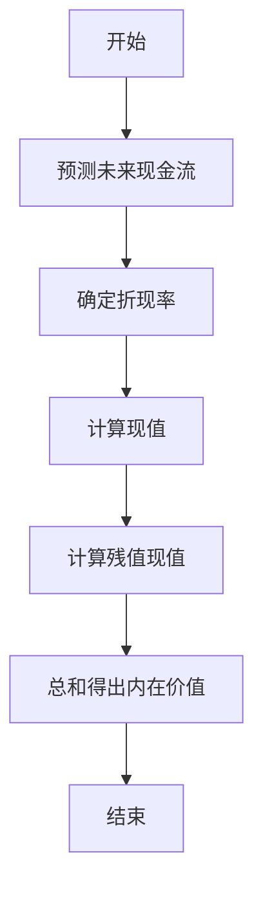
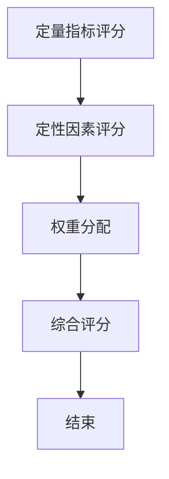
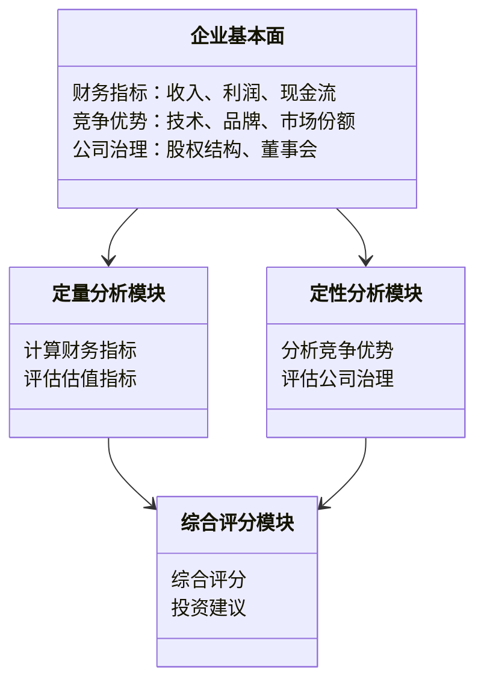
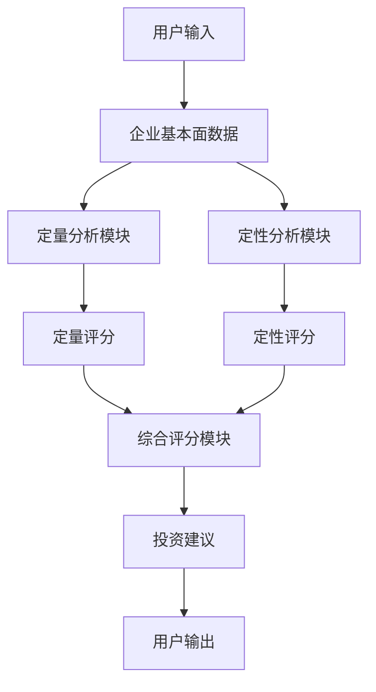

                 


# 价值投资中的定量与定性分析：数字之外的考量

> 关键词：价值投资、定量分析、定性分析、投资决策、风险管理、财务指标、竞争优势

> 摘要：本文探讨了价值投资中定量分析与定性分析的结合，从基础概念到实际应用，结合数学模型、系统架构和案例分析，深入讲解了如何在数字之外进行更全面的投资决策。

---

# 第一部分: 价值投资中的定量与定性分析基础

## 第1章: 价值投资的核心概念与背景

### 1.1 价值投资的定义与历史发展

价值投资是一种投资策略，强调从基本面分析入手，寻找被市场低估的优质资产。其核心理念可以追溯到本杰明·格雷厄姆和戴维·多德的理论，他们提出的“安全边际”概念奠定了价值投资的基础。随着时间的推移，价值投资不断发展，逐步融入现代金融分析工具。

**核心概念：**

- **价值投资**：通过分析企业的内在价值，寻找市场价格低于内在价值的股票。
- **安全边际**：买入价格低于内在价值，以降低风险。

**概念结构与核心要素：**

- **内在价值**：企业未来现金流的现值。
- **市场价格**：市场参与者情绪和资金流动决定的价格。
- **安全边际**：内在价值与市场价格之间的差额。

### 1.2 定量分析与定性分析的定义

#### 定量分析的定义与特点

- **定义**：通过数学模型和数据统计方法，分析企业的财务指标、市场趋势等可量化的因素。
- **特点**：客观、可量化、依赖历史数据。

#### 定性分析的定义与特点

- **定义**：通过非财务信息（如公司治理、行业地位）进行分析，评估企业的核心竞争力和潜在风险。
- **特点**：主观性较强，依赖分析师的经验和判断。

#### 定量与定性分析的联系与区别

| 特性       | 定量分析             | 定性分析             |
|------------|----------------------|----------------------|
| 数据类型     | 数值型数据           | 文本型数据，主观判断   |
| 方法论     | 统计分析、数学模型   | 行业分析、案例分析   |
| 优缺点     | 客观、可量化，但忽视非财务因素 | 主观性强，但能发现非财务风险 |

### 1.3 价值投资中的定量与定性分析的重要性

#### 数字之外的考量

- 定量分析提供了企业的财务健康状况，但无法揭示企业的战略优势或管理问题。
- 定性分析弥补了定量分析的不足，帮助投资者更全面地评估企业价值。

#### 定量分析的局限性

- 依赖历史数据，忽视未来变化。
- 忽略企业的竞争优势和管理能力。

#### 定性分析的补充作用

- 揭示企业的核心竞争力。
- 评估管理层的素质和公司治理结构。

---

## 第2章: 定量分析在价值投资中的应用

### 2.1 定量分析的基本原理

#### 财务指标的计算与分析

- **市盈率（P/E）**：股价与每股收益的比值，用于评估股票的估值。
  $$ P/E = \frac{\text{股价}}{\text{每股收益}} $$
- **市净率（P/B）**：股价与每股净资产的比值，用于评估股票的估值。
  $$ P/B = \frac{\text{股价}}{\text{每股净资产}} $$
- **股息率**：股息与股价的比值，用于评估投资回报。
  $$ \text{股息率} = \frac{\text{股息}}{\text{股价}} $$

#### 常用的定量分析模型

- **折扣现金流模型（DCF）**：
  通过预测企业未来现金流，折现计算其现值。
  $$ \text{内在价值} = \sum_{t=1}^{n} \frac{\text{现金流}_t}{(1+r)^t} + \frac{\text{残值}}{(1+r)^n} $$
- **相对估值法**：通过比较同类企业的估值指标，判断目标企业的合理价格。

#### 定量分析的工具与技术

- 数据可视化工具：如Tableau、Power BI，用于直观展示财务数据。
- 金融建模工具：如Excel、Python，用于构建复杂的财务模型。

### 2.2 定量分析的算法原理

#### DCF模型的步骤



#### 示例代码

```python
import numpy as np

def dcf_model(cash_flows, discount_rate, residual_value):
    present_value = sum(cash_flow / (1 + discount_rate) ** t for t, cash_flow in enumerate(cash_flows))
    total_value = present_value + residual_value / (1 + discount_rate) ** len(cash_flows)
    return total_value

cash_flows = [100, 150, 200]
discount_rate = 0.1
residual_value = 500

intrinsic_value = dcf_model(cash_flows, discount_rate, residual_value)
print(f"内在价值：{intrinsic_value}")
```

---

## 第3章: 定性分析在价值投资中的应用

### 3.1 定性分析的基本原理

#### 公司治理结构的分析

- 股权结构：控股股东比例是否合理，是否分散。
- 董事会结构：独立董事比例是否足够，是否具备专业性。

#### 管理层素质的评估

- 管理层的稳定性：是否有频繁的变动。
- 管理层的动机：是否追求短期利益还是长期价值。

#### 行业地位与竞争优势的判断

- 市场份额：企业在行业中的地位。
- 核心竞争力：企业的技术优势、品牌影响力等。

### 3.2 定性分析的关键要素

#### 企业战略分析

- 发展战略：企业的长期目标是否清晰。
- 战略执行：管理层是否有效执行战略。

#### 市场地位与品牌价值

- 市场份额：企业在市场中的占比。
- 品牌影响力：品牌是否具有溢价能力。

#### 风险因素的定性评估

- 行业风险：行业的周期性、政策风险。
- 企业特有风险：管理风险、财务风险。

### 3.3 定性分析的实践方法

#### 案例分析法

- 通过分析竞争对手或同类企业，寻找企业的竞争优势。
- 例如，分析苹果公司的产品创新能力和品牌忠诚度。

#### 竞争对手分析法

- 比较企业的财务指标和市场表现，寻找差异点。
- 例如，分析科技企业的研发投入占比和新产品推出频率。

#### 行业趋势分析法

- 研究行业的发展趋势，判断企业的成长潜力。
- 例如，分析人工智能行业的技术进步和市场需求。

---

## 第4章: 定量与定性分析的结合

### 4.1 结合的必要性与优势

#### 单一分析方法的局限性

- 定量分析无法评估企业的管理能力和战略。
- 定性分析缺乏数据支持，难以量化。

#### 结合分析的互补性

- 定量分析提供数据支持，定性分析提供深度见解。
- 综合分析能提高投资决策的准确性。

### 4.2 结合的具体方法

#### 定量指标与定性因素的权重分配

- 根据企业的特点，为不同指标分配权重。
- 例如，对于科技企业，研发支出占比可能比传统企业更重要。

#### 综合评分模型的构建



#### 多维度分析框架的建立

- 结合财务指标、竞争优势、行业地位等多维度，构建综合评估框架。

### 4.3 实际案例分析

#### 某行业龙头企业的综合分析

- **定量分析**：计算市盈率、市净率等指标。
- **定性分析**：评估公司的治理结构、竞争优势。
- **结合分析**：根据综合评分模型，判断企业的投资价值。

#### 中小企业的定性与定量结合分析

- **定量分析**：分析企业的财务健康状况。
- **定性分析**：评估企业的管理团队和市场定位。
- **结合分析**：根据综合评分模型，判断企业的成长潜力。

---

## 第5章: 价值投资中的系统性分析与架构设计

### 5.1 问题场景介绍

#### 投资决策中的信息处理问题

- 数据繁杂：需要处理大量财务数据和非财务信息。
- 信息不全：难以全面评估企业的价值。
- 决策风险：需要降低因单一分析方法导致的误判风险。

#### 系统化分析的必要性

- 统一框架：构建综合分析框架，确保分析的全面性。
- 可重复性：通过系统化方法，提高分析效率。

### 5.2 系统功能设计

#### 领域模型设计



#### 系统架构设计



### 5.3 系统接口设计与交互

#### 系统接口设计

- 输入接口：企业基本面数据（财务数据、行业信息）。
- 输出接口：综合评分、投资建议。

#### 系统交互设计

```mermaid
sequenceDiagram
    用户 -> 系统：输入企业数据
    系统 -> 定量分析模块：计算财务指标
    系统 -> 定性分析模块：分析竞争优势
    定量分析模块 -> 系统：返回定量评分
    定性分析模块 -> 系统：返回定性评分
    系统 -> 综合评分模块：计算综合评分
    系统 -> 用户：输出投资建议
```

---

## 第6章: 价值投资中的项目实战

### 6.1 环境安装与工具准备

#### 环境安装

- Python：用于数据分析和建模。
- Jupyter Notebook：用于编写和运行代码。
- Pandas、NumPy：用于数据处理。
- Matplotlib/Seaborn：用于数据可视化。

#### 工具准备

- 财务报表数据：收入、利润、现金流等。
- 公司治理数据：股权结构、董事会信息。
- 行业数据：市场趋势、竞争对手信息。

### 6.2 系统核心实现源代码

#### 定量分析代码

```python
import pandas as pd
import numpy as np

# 示例数据：企业财务数据
data = {
    '收入': [1000, 1200, 1500],
    '利润': [100, 120, 150],
    '现金流': [200, 250, 300]
}
df = pd.DataFrame(data)

# 计算市盈率
def calculate_pe_ratio(df):
    pe_ratio = df['收入'] / df['利润']
    return pe_ratio

pe = calculate_pe_ratio(df)
print("市盈率：", pe)

# 计算市净率
def calculate_pb_ratio(df):
    pb_ratio = df['收入'] / df['现金流']
    return pb_ratio

pb = calculate_pb_ratio(df)
print("市净率：", pb)
```

#### 定性分析代码

```python
# 示例数据：公司治理结构
company = {
    '股权结构': ['控股股东', '机构投资者', '个人投资者'],
    '董事会': ['董事长', '独立董事1', '独立董事2'],
    '管理层': ['CEO', 'CFO', 'CTO']
}

# 分析公司治理结构
def analyze_governance(company):
   控股股东比例 = company['股权结构'][0]
   独立董事比例 = len(company['董事会']) - 1
    return 控股股东比例, 独立董事比例

控股股东, 独立董事 = analyze_governance(company)
print(f"控股股东：{控股股东}, 独立董事比例：{独立董事}")
```

### 6.3 实际案例分析与解读

#### 案例分析

- **企业A**：市盈率合理，市净率偏高，但具有强大的竞争优势和稳定的管理层。
- **企业B**：市盈率和市净率都较低，但公司治理结构存在问题，管理层频繁变动。

#### 详细解读

- 企业A适合长期投资，因为其财务指标合理，竞争优势明显。
- 企业B的风险较高，需要谨慎评估。

### 6.4 项目小结

- 通过系统化分析，能够更全面地评估企业的投资价值。
- 综合考虑定量与定性因素，能够降低投资决策的风险。

---

## 第7章: 最佳实践与注意事项

### 7.1 小结

- 定量分析提供了企业的财务健康状况，定性分析揭示了企业的核心竞争力。
- 综合分析能够提高投资决策的准确性和全面性。

### 7.2 注意事项

- **数据质量**：确保数据的准确性和完整性。
- **模型适用性**：根据企业特点调整分析模型。
- **持续监控**：定期更新分析结果，应对市场变化。

### 7.3 拓展阅读

- 《The Intelligent Investor》——本杰明·格雷厄姆
- 《Value Investing: From Theory to Practice》——巴菲特、芒格等

---

通过定量与定性分析的结合，投资者能够更全面地评估企业的价值，降低投资风险，提高决策的准确性。希望本文能够为价值投资者提供实用的指导和启示。

