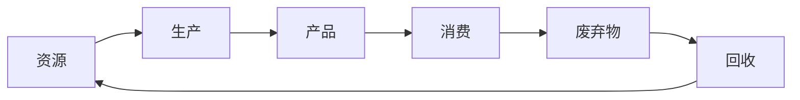
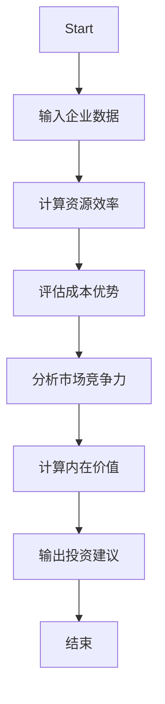
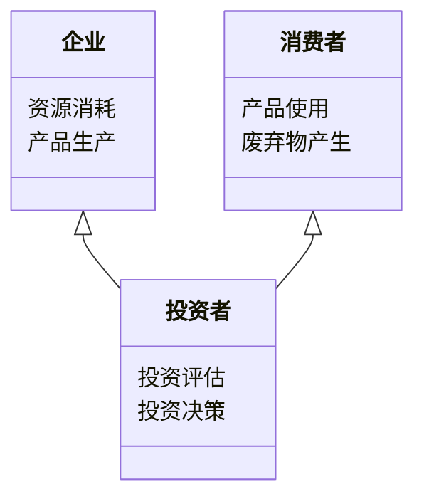
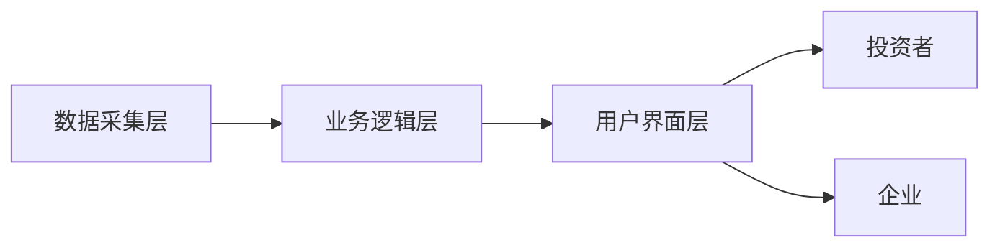

                 


# 价值投资中的循环经济模式分析

## 关键词：价值投资，循环经济，可持续发展，投资评估，系统架构

## 摘要：  
本文分析了价值投资在循环经济模式中的应用，探讨了循环经济模式的核心要素及其对投资价值的影响。通过构建投资评估模型和算法，结合系统架构设计，展示了如何在循环经济中实现价值投资。文章还提供了实际案例和代码实现，帮助读者理解并应用这些概念。

---

## 第1章：背景介绍

### 1.1 循环经济的基本概念

循环经济发展模式是一种以资源高效利用和循环再生为核心，强调减少资源消耗和环境污染的经济模式。其核心在于将废弃物视为资源，通过技术手段实现资源的再利用和循环生产。循环经济强调生产、消费和回收的闭环系统，与传统线性经济模式形成对比。

### 1.2 价值投资的基本原理

价值投资是一种投资策略，强调以低于内在价值的价格购买优质资产。其核心理念是寻找市场低估的企业，通过长期持有实现收益。价值投资注重企业的基本面分析，包括财务状况、盈利能力、竞争优势和管理团队等因素。

### 1.3 循环经济与价值投资的结合

循环经济模式在投资中的应用，强调企业的可持续发展能力和资源效率。在价值投资框架下，企业循环经济模式不仅影响其成本结构，还可能提升其市场竞争力和长期盈利能力。因此，将循环经济与价值投资结合，可以帮助投资者识别那些在可持续发展方面具有优势的企业。

---

## 第2章：核心概念与联系

### 2.1 循环经济模式的实体关系

循环经济模式涉及多个实体，包括企业、消费者、政府和非政府组织。这些实体之间通过资源流和产品流相互作用，形成闭环系统。

#### 实体关系图（ER图）

```mermaid
erDiagram
    actor 企业 {
        string 资源消耗
        string 产品生产
    }
    actor 消费者 {
        string 产品使用
        string 废弃物产生
    }
    actor 政府 {
        string 制定政策
        string 提供支持
    }
    actor 非政府组织 {
        string 监督与认证
    }
    企业 --> 消费者 : 提供产品
    消费者 --> 企业 : 提供废弃物
    政府 --> 企业 : 提供政策支持
    非政府组织 --> 企业 : 提供认证
```

### 2.2 循环经济模式的流程分析

循环经济的基本流程包括资源获取、生产、消费和废弃物回收。资源通过生产转化为产品，消费者使用后产生的废弃物被回收再利用，形成闭环。

#### 循环经济流程图



---

## 第3章：算法原理讲解

### 3.1 投资评估模型的构建

投资评估模型用于评估企业在循环经济模式下的投资价值。模型考虑企业的资源效率、成本结构、市场竞争力和可持续发展能力。

#### 投资评估算法流程图



#### 投资评估模型的数学公式

企业内在价值 \( V \) 的计算公式如下：

$$ V = \frac{CF}{r - g} $$

其中：
- \( CF \) 是企业未来现金流的现值
- \( r \) 是折现率
- \( g \) 是现金流增长率

#### 投资评估算法的Python实现

```python
def calculate_intrinsic_value(cash_flow, discount_rate, growth_rate):
    return cash_flow / (discount_rate - growth_rate)

# 示例
cash_flow = 1000000
discount_rate = 0.08
growth_rate = 0.05
intrinsic_value = calculate_intrinsic_value(cash_flow, discount_rate, growth_rate)
print(f"内在价值: {intrinsic_value}")
```

---

## 第4章：系统分析与架构设计

### 4.1 问题场景介绍

企业希望通过循环经济模式优化资源利用，降低成本，提升市场竞争力。投资者需要评估企业在循环经济模式下的投资价值。

### 4.2 系统功能设计

系统功能包括数据采集、评估模型、风险分析和结果展示。

#### 领域模型类图



### 4.3 系统架构设计

系统架构包括数据采集层、业务逻辑层和用户界面层。

#### 系统架构图



---

## 第5章：项目实战

### 5.1 环境安装

安装Python和必要的库：

```bash
pip install numpy pandas matplotlib
```

### 5.2 核心代码实现

实现投资评估模型的代码：

```python
import numpy as np
import pandas as pd

def calculate_intrinsic_value(cash_flows, discount_rate, growth_rate):
    return cash_flows / (discount_rate - growth_rate)

# 示例数据
cash_flows = np.array([1000000] * 5)
discount_rate = 0.08
growth_rate = 0.05

# 计算内在价值
intrinsic_value = calculate_intrinsic_value(cash_flows, discount_rate, growth_rate)
print(f"内在价值: {intrinsic_value}")
```

### 5.3 案例分析

以某环保企业为例，分析其循环经济模式和投资价值。

---

## 第6章：总结

### 6.1 最佳实践 tips

- 关注企业的资源效率和成本结构
- 考虑企业的可持续发展能力和市场竞争力
- 使用投资评估模型进行定量分析

### 6.2 小结

本文分析了循环经济模式在价值投资中的应用，构建了投资评估模型，并提供了系统架构设计和实际案例。通过本文的分析，投资者可以更好地识别在循环经济模式下具有投资价值的企业。

### 6.3 注意事项

- 数据的准确性和完整性是模型的关键
- 模型假设可能与实际情况存在偏差
- 需要定期更新模型以反映市场变化

### 6.4 拓展阅读

- 参考文献：[循环经济与价值投资的相关研究]
- 推荐书籍：《价值投资实战策略》、《循环经济理论与实践》
- 在线资源：相关投资平台和学术论文

---

通过以上分析，我们可以看到循环经济模式与价值投资的结合为企业和投资者提供了新的机会。未来，随着可持续发展理念的深入，循环经济在投资中的应用将更加广泛和重要。

