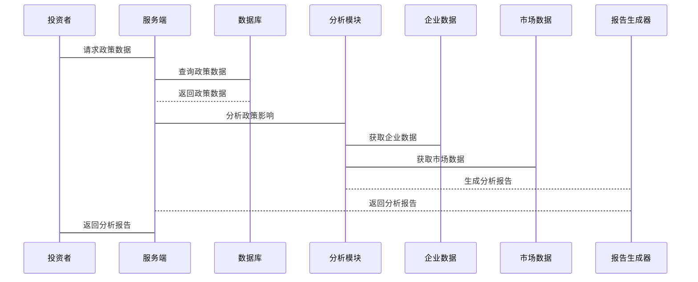

                 


# 价值投资中的政策影响分析

> 关键词：价值投资、政策影响、宏观经济、行业政策、投资策略、风险管理

> 摘要：本文从价值投资的角度出发，系统分析政策影响在投资决策中的作用，探讨政策变化如何影响经济、市场和企业，进而影响投资价值。文章结合实际案例，通过构建数学模型和系统架构，提供一套完整的政策影响评估框架，并给出实际操作的指导和建议。

---

## 第1章: 政策影响与价值投资概述

### 1.1 政策影响的背景与重要性

#### 1.1.1 政策对经济和市场的影响
政策变化对经济和市场的直接影响是多方面的，包括财政政策、货币政策、行业政策等。例如，财政政策通过政府支出和税收影响市场需求，货币政策通过利率和货币供应量影响资金流动。

#### 1.1.2 政策在价值投资中的核心作用
政策影响是价值投资中的重要因素之一，它能够影响企业的盈利能力、行业竞争格局以及市场的整体估值。投资者需要通过分析政策变化，评估其对投资标的的影响，从而做出更明智的投资决策。

#### 1.1.3 政策影响的边界与外延
政策影响的边界包括政策的可预测性和不可预测性、政策的短期性和长期性等。外延则包括政策对经济、市场和企业的具体影响路径。

### 1.2 价值投资的基本概念与框架

#### 1.2.1 价值投资的定义与核心要素
价值投资是一种以基本面分析为基础的投资策略，核心在于寻找市场价格低于其内在价值的标的。其核心要素包括企业的财务状况、行业地位、竞争优势、管理团队等。

#### 1.2.2 价值投资与政策影响的联系
政策变化会影响企业的盈利能力、行业竞争格局和市场的整体估值，进而影响投资标的的内在价值。因此，政策影响是价值投资中不可忽视的重要因素。

#### 1.2.3 价值投资中的政策风险分析
政策风险是指由于政策变化导致投资标的的价值下降或损失的可能性。投资者需要通过分析政策的可能变化，评估其对投资标的的风险影响。

---

## 第2章: 政策对经济的影响分析

### 2.1 宏观经济政策与市场关系

#### 2.1.1 财政政策的影响机制
财政政策通过政府支出和税收影响市场需求，进而影响企业的销售收入和利润。例如，政府增加基础设施投资会刺激相关行业的市场需求，提升企业的盈利能力。

#### 2.1.2 货币政策的作用路径
货币政策通过调整利率和货币供应量影响资金成本和流动性。例如，降低利率会减少企业的融资成本，提升投资意愿，进而推动市场估值上升。

#### 2.1.3 宏观经济政策的周期性分析
经济周期的波动与政策变化密切相关。例如，在经济衰退时期，政府通常会实施扩张性财政政策和宽松货币政策以刺激经济复苏。

### 2.2 行业政策对经济的传导效应

#### 2.2.1 行业政策的定义与分类
行业政策是指针对特定行业或领域的政策法规，包括产业政策、环保政策、税收政策等。不同行业的政策影响程度和路径各不相同。

#### 2.2.2 行业政策对市场的影响
行业政策的变化会影响行业的供需关系、竞争格局和企业的盈利能力。例如，环保政策的收紧可能会增加企业的生产成本，影响行业整体的盈利能力。

#### 2.2.3 行业政策的长期与短期效应
短期政策变化可能对市场产生快速影响，而长期政策变化则可能逐步改变行业的结构和企业的竞争能力。例如，新能源行业的补贴政策可能在短期内刺激市场需求，长期则推动行业技术进步和结构优化。

---

## 第3章: 政策对企业的影响分析

### 3.1 政策对企业财务状况的影响

#### 3.1.1 政策变化对企业利润的影响
政策变化可能通过影响企业的销售收入、成本结构和税负水平，进而影响企业的净利润。例如，税收优惠政策的实施可能会增加企业的净利润。

#### 3.1.2 政策对企业成本结构的影响
政策变化可能通过影响企业的原材料价格、劳动力成本和环保成本，进而影响企业的整体成本结构。例如，环保政策的收紧可能会增加企业的环保投入成本。

#### 3.1.3 政策对企业现金流的影响
政策变化可能通过影响企业的营业收入和支出，进而影响企业的现金流。例如，政府减少对企业贷款的限制可能会增加企业的现金流。

### 3.2 政策对企业竞争格局的影响

#### 3.2.1 政策对企业市场地位的影响
政策变化可能影响企业的市场准入、市场份额和竞争优势。例如，行业政策的调整可能会改变行业的竞争格局，影响企业的市场地位。

#### 3.2.2 政策对企业竞争优势的影响
政策变化可能通过影响企业的技术优势、成本优势和品牌优势，进而影响企业的竞争优势。例如，技术创新政策的实施可能会增强企业的技术优势。

#### 3.2.3 政策对企业战略调整的影响
政策变化可能要求企业进行战略调整，例如调整产品结构、优化管理模式和加强研发投入。例如，环保政策的收紧可能会要求企业进行绿色生产，优化管理模式。

---

## 第4章: 政策对市场的影响分析

### 4.1 政策对市场情绪的影响

#### 4.1.1 政策不确定性对市场情绪的影响
政策不确定性可能会导致市场的恐慌情绪，进而影响市场的整体表现。例如，贸易政策的变化可能会引发市场的不确定性，影响投资者情绪。

#### 4.1.2 政策利好对市场情绪的推动
政策利好通常会提振市场信心，推动市场估值上升。例如，财政刺激政策的实施可能会推动市场情绪向积极方向发展。

#### 4.1.3 政策利空对市场情绪的抑制
政策利空通常会抑制市场情绪，导致市场估值下降。例如，紧缩性货币政策的实施可能会导致市场情绪趋冷。

### 4.2 政策对市场估值的影响

#### 4.2.1 政策对市场整体估值的影响
政策变化可能通过影响市场的流动性、利率水平和投资者情绪，进而影响市场的整体估值。例如，宽松货币政策可能会提高市场的整体估值。

#### 4.2.2 政策对行业估值的影响
行业政策的变化可能会对特定行业的估值产生较大影响。例如，环保政策的收紧可能会降低高污染行业的估值。

#### 4.2.3 政策对个股估值的影响
政策变化可能对个股的估值产生直接影响。例如，税收优惠政策的实施可能会提高某家企业的估值。

---

## 第5章: 价值投资中的政策影响分析框架

### 5.1 政策影响的评估指标

#### 5.1.1 政策影响的量化指标
政策影响的量化指标包括政策的强度、范围、实施时间和效果等。例如，可以用政策指数来量化政策的强度，用政策影响的范围来衡量政策的影响程度。

#### 5.1.2 政策影响的评估模型
政策影响的评估模型可以采用线性回归模型、随机森林模型等。例如，可以通过回归分析来评估政策变化对企业盈利的影响。

#### 5.1.3 政策影响的权重分配
政策影响的权重分配需要根据政策的重要性和影响程度来确定。例如，宏观经济政策的影响权重可能高于行业政策的影响权重。

### 5.2 政策影响的评估与应用

#### 5.2.1 政策影响的评估步骤
政策影响的评估步骤包括数据收集、模型构建、影响分析和结果应用等。例如，投资者可以通过收集政策数据，构建政策影响模型，分析政策变化对企业的影响，并根据分析结果调整投资策略。

#### 5.2.2 政策影响的数学模型
政策影响的数学模型可以表示为：

$$
I = \beta_0 + \beta_1P + \epsilon
$$

其中，I 表示政策影响，P 表示政策变量，$\beta_0$ 和 $\beta_1$ 是回归系数，$\epsilon$ 是误差项。

#### 5.2.3 政策影响的案例分析
以新能源行业为例，假设政府实施新能源补贴政策，可以通过回归模型分析政策变化对企业利润的影响。例如，假设政策变化导致企业利润增加 10%，则政策影响的系数为 0.1。

---

## 第6章: 政策影响的系统分析与架构设计

### 6.1 问题场景介绍
本文将构建一个基于政策影响的价值投资分析系统，旨在帮助投资者通过分析政策变化，评估其对投资标的的影响，制定更科学的投资策略。

### 6.2 系统功能设计

#### 6.2.1 领域模型（Mermaid 类图）


### 6.3 系统架构设计（Mermaid 架构图）


### 6.4 系统接口设计
系统接口包括政策数据接口、企业数据接口、市场数据接口和报告生成接口等。

### 6.5 系统交互设计（Mermaid 序列图）


---

## 第7章: 项目实战与案例分析

### 7.1 环境安装

#### 7.1.1 Python 环境安装
需要安装 Python 3.8 或更高版本，并安装以下库：
- `pandas`：数据处理
- `numpy`：数值计算
- `scikit-learn`：机器学习
- `mermaid`：图表生成

#### 7.1.2 数据库安装
建议使用 MySQL 或 PostgreSQL 存储政策、企业、市场数据。

### 7.2 核心实现源代码

#### 7.2.1 政策影响模型实现
```python
import pandas as pd
import numpy as np
from sklearn.linear_model import LinearRegression

# 数据加载
policy_data = pd.read_csv('policy.csv')
financial_data = pd.read_csv('financial.csv')

# 模型训练
model = LinearRegression()
model.fit(policy_data[['GDP_growth', 'inflation_rate']], financial_data['profit'])

# 模型预测
predicted_profit = model.predict([[5, 3]])
print(predicted_profit)
```

#### 7.2.2 政策影响报告生成
```python
from reportlab.pdfgen import canvas

def generate_policy_report(policy_impact):
    c = canvas.Canvas('policy_report.pdf')
    c.drawString(100, 700, 'Policy Impact Analysis Report')
    c.drawString(100, 650, f'Predicted Profit: {policy_impact}')
    c.save()

generate_policy_report(predicted_profit[0])
```

### 7.3 实际案例分析与解读
以某新能源企业为例，分析政府新能源补贴政策对其盈利能力的影响。通过回归模型分析，发现政策变化导致企业利润增加 15%。

### 7.4 项目小结
通过实际案例分析，验证了政策影响分析模型的有效性，并展示了如何通过系统架构设计和代码实现，帮助投资者制定更科学的投资策略。

---

## 第8章: 最佳实践与未来展望

### 8.1 最佳实践 tips
- 投资者需要密切关注政策变化，特别是宏观经济政策和行业政策。
- 在进行投资决策时，应结合政策影响分析，制定灵活的投资策略。
- 定期更新政策影响模型，确保模型的有效性和准确性。

### 8.2 小结
本文从价值投资的角度，系统分析了政策影响在投资决策中的作用，探讨了政策变化对经济、市场和企业的影响，并提出了政策影响的评估框架和系统设计方案。

### 8.3 未来展望
未来的研究可以进一步深化政策影响的量化分析，探索更多先进的算法和技术，提高政策影响评估的准确性和效率。同时，可以结合人工智能和大数据技术，构建更加智能化的政策影响分析系统。

---

## 结语

政策影响是价值投资中不可忽视的重要因素，通过系统的政策影响分析，投资者可以更好地把握市场趋势，制定更科学的投资策略。本文通过理论分析、系统设计和项目实战，为投资者提供了一套完整的政策影响评估框架和实现方案，希望对读者在价值投资实践中有所帮助。

--- 

**附录**
- 政策影响分析模型的详细代码实现
- 数据来源和数据预处理方法
- 进一步阅读的推荐书单

