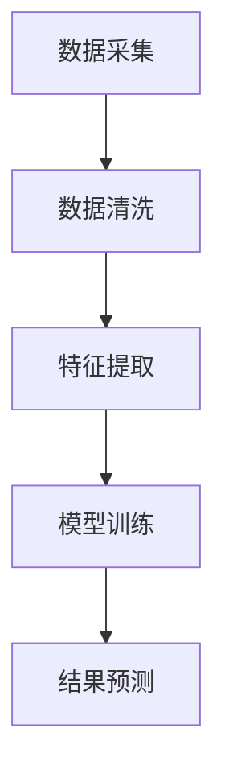
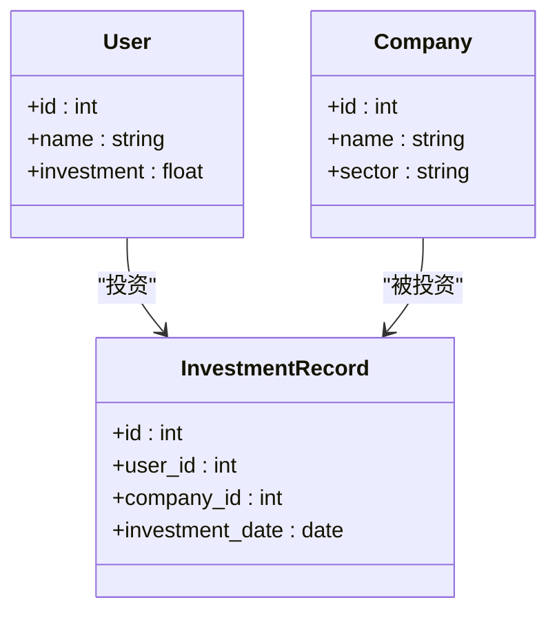
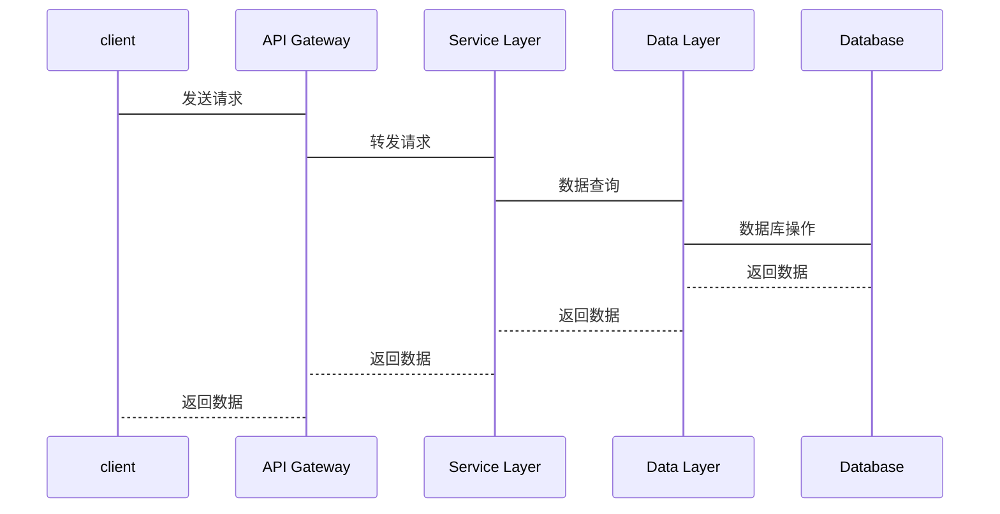

                 


# 价值投资中的教育科技趋势分析

> 关键词：价值投资、教育科技、趋势分析、教育科技公司、投资策略、技术驱动

> 摘要：本文从价值投资的角度，详细分析了教育科技领域的趋势，探讨了如何通过技术驱动和数据挖掘的方法，识别具有长期投资价值的教育科技企业。文章结合实际案例，详细讲解了教育科技趋势分析的核心概念、算法原理、系统架构设计以及项目实战等内容，为投资者提供了科学的投资决策支持。

---

# 第1章: 教育科技与价值投资概述

## 1.1 教育科技的定义与发展

### 1.1.1 教育科技的核心概念

教育科技（EdTech）是指利用技术手段优化教育过程、提升教育效率的行业。其核心在于通过技术创新解决传统教育中的痛点，例如教育资源分配不均、学习效果难以量化等问题。

### 1.1.2 教育科技的历史演变

教育科技的发展经历了多个阶段：

1. **传统教育**：以线下教学为主，缺乏数据和技术支持。
2. **互联网教育**：互联网技术的应用使得在线教育成为可能。
3. **移动教育**：移动互联网的发展推动了移动端学习工具的普及。
4. **人工智能驱动的教育**：AI技术的应用使得个性化学习成为现实。

### 1.1.3 教育科技的现状与未来趋势

当前，教育科技行业呈现出以下特点：
- **技术驱动**：AI、大数据、区块链等技术广泛应用。
- **个性化学习**：通过技术手段实现精准教学。
- **全球化趋势**：在线教育打破了地域限制。

未来，教育科技将更加注重用户体验和技术创新，例如虚拟现实（VR）和增强现实（AR）技术的应用将进一步提升学习体验。

## 1.2 价值投资的基本原理

### 1.2.1 价值投资的定义

价值投资是一种投资策略，强调以低于内在价值的价格买入优质资产，长期持有，等待价值回归。

### 1.2.2 价值投资的核心理念

价值投资的核心理念包括：
1. **长期视角**：关注企业的长期价值，而非短期波动。
2. **基本面分析**：通过分析企业的财务状况、行业地位等因素，评估其内在价值。
3. **安全边际**：买入价格低于内在价值，以降低投资风险。

### 1.2.3 价值投资在教育科技领域的应用

教育科技领域的价值投资需要结合行业特点，重点关注企业的技术优势、市场前景和盈利能力。

## 1.3 教育科技与价值投资的结合

### 1.3.1 教育科技行业的投资价值

教育科技行业的投资价值体现在以下几个方面：
- **市场需求大**：随着教育行业的不断扩张，技术驱动的教育企业具有广阔的发展空间。
- **技术壁垒高**：AI、大数据等技术的应用使得教育科技企业的竞争壁垒较高。
- **长期收益稳定**：教育行业的刚需属性使得优质教育科技企业具有稳定的收益。

### 1.3.2 价值投资在教育科技中的优势

价值投资在教育科技中的优势包括：
- **精准识别优质企业**：通过基本面分析，识别具有长期增长潜力的企业。
- **降低投资风险**：通过安全边际的设置，降低投资风险。

### 1.3.3 教育科技趋势分析的必要性

通过对教育科技行业趋势的分析，投资者可以更好地把握行业发展方向，找到具有长期投资价值的企业。

## 1.4 本章小结

本章从教育科技和价值投资的基本概念出发，分析了两者结合的必要性和优势，为后续的深入分析奠定了基础。

---

# 第2章: 教育科技趋势分析的核心概念

## 2.1 教育科技趋势分析的背景

### 2.1.1 问题背景

随着技术的快速发展，教育科技行业呈现出快速变化的特征。投资者需要通过趋势分析，找到行业发展的方向和优质企业。

### 2.1.2 问题描述

如何通过趋势分析，识别教育科技行业中的投资机会？

### 2.1.3 问题解决的思路

通过分析教育科技行业的技术趋势、市场需求、政策环境等因素，识别具有长期投资价值的企业。

## 2.2 核心概念与联系

### 2.2.1 核心概念原理

教育科技趋势分析的核心在于识别行业发展的关键驱动因素，例如技术创新、市场需求变化等。

### 2.2.2 核心概念属性特征对比表

下表对比了教育科技和传统教育的核心属性特征：

```markdown
| 属性 | 教育科技 | 传统教育 |
|------|----------|----------|
| 技术依赖 | 高 | 低 |
| 学习方式 | 个性化 | 通用化 |
| 资源分配 | 均衡 | 不均衡 |
```

### 2.2.3 ER实体关系图

以下是教育科技趋势分析的ER实体关系图：

```mermaid
erDiagram
    user {
        +id : int
        +name : string
        +investment : float
    }
    company {
        +id : int
        +name : string
        +sector : string
    }
    investment_record {
        +id : int
        +user_id : int
        +company_id : int
        +investment_date : date
    }
    user --> investment_record : "投资"
    company --> investment_record : "被投资"
```

## 2.3 本章小结

本章通过分析教育科技趋势分析的背景和核心概念，为后续的深入分析提供了理论基础。

---

# 第3章: 教育科技趋势分析的算法原理

## 3.1 数据挖掘与预测模型

### 3.1.1 数据挖掘的基本原理

数据挖掘是从大量数据中提取有价值信息的过程，常用于预测趋势和发现模式。

### 3.1.2 预测模型的构建

预测模型的构建包括数据清洗、特征提取、模型训练和结果预测四个步骤。

### 3.1.3 算法流程图

以下是预测模型的算法流程图：



### 3.1.4 代码实现示例

以下是数据挖掘的Python代码示例：

```python
import pandas as pd
from sklearn.model import LinearRegression

# 数据加载
data = pd.read_csv('education_tech.csv')

# 特征与目标变量分离
X = data[['revenue', 'growth_rate']]
y = data['investment_value']

# 模型训练
model = LinearRegression()
model.fit(X, y)

# 预测结果
predictions = model.predict(X)
print('预测值:', predictions)
```

## 3.2 机器学习在趋势分析中的应用

### 3.2.1 机器学习算法的选择

常用机器学习算法包括线性回归、随机森林、支持向量机等。

### 3.2.2 算法实现

以下是机器学习算法的实现示例：

```python
from sklearn.ensemble import RandomForestRegressor

# 数据加载
data = pd.read_csv('education_tech.csv')

# 特征与目标变量分离
X = data[['revenue', 'profit_margin', 'growth_rate']]
y = data['investment_value']

# 模型训练
model = RandomForestRegressor(n_estimators=100)
model.fit(X, y)

# 预测结果
predictions = model.predict(X)
print('预测值:', predictions)
```

### 3.2.3 代码实现示例

以下是机器学习算法的代码实现：

```python
import pandas as pd
from sklearn.ensemble import RandomForestRegressor

# 数据加载
data = pd.read_csv('education_tech.csv')

# 特征与目标变量分离
X = data[['revenue', 'profit_margin', 'growth_rate']]
y = data['investment_value']

# 模型训练
model = RandomForestRegressor(n_estimators=100)
model.fit(X, y)

# 预测结果
predictions = model.predict(X)
print('预测值:', predictions)
```

## 3.3 本章小结

本章通过分析数据挖掘和机器学习算法，为教育科技趋势分析提供了技术支持。

---

# 第4章: 教育科技趋势分析的系统架构设计

## 4.1 问题场景介绍

教育科技趋势分析需要构建一个完整的系统架构，包括数据采集、分析、预测和可视化。

## 4.2 系统功能设计

### 4.2.1 领域模型设计

以下是领域模型设计的类图：



### 4.2.2 系统架构设计

以下是系统架构设计的架构图：

```mermaid
client --> API Gateway
API Gateway --> Service Layer
Service Layer --> Data Layer
Data Layer --> Database
```

### 4.2.3 系统接口设计

以下是系统接口设计的序列图：



## 4.3 本章小结

本章通过系统架构设计，为教育科技趋势分析提供了技术实现的基础。

---

# 第5章: 教育科技趋势分析的项目实战

## 5.1 环境安装

需要安装以下工具和库：
- Python
- Pandas
- Scikit-learn
- Mermaid

## 5.2 核心实现

### 5.2.1 数据采集

```python
import pandas as pd

data = pd.read_csv('education_tech.csv')
print(data.head())
```

### 5.2.2 数据分析

```python
import pandas as pd
import matplotlib.pyplot as plt

data = pd.read_csv('education_tech.csv')
data.plot(x='year', y='investment_value', kind='line')
plt.show()
```

### 5.2.3 数据预测

```python
from sklearn.ensemble import RandomForestRegressor

data = pd.read_csv('education_tech.csv')

X = data[['revenue', 'profit_margin', 'growth_rate']]
y = data['investment_value']

model = RandomForestRegressor(n_estimators=100)
model.fit(X, y)

predictions = model.predict(X)
print('预测值:', predictions)
```

## 5.3 本章小结

本章通过项目实战，展示了教育科技趋势分析的具体实现过程。

---

# 第6章: 教育科技趋势分析的最佳实践

## 6.1 项目总结

通过本项目，我们掌握了教育科技趋势分析的核心方法和技术。

## 6.2 最佳实践 Tips

1. **数据质量**：确保数据的准确性和完整性。
2. **模型选择**：根据具体问题选择合适的算法。
3. **可视化**：通过可视化工具更好地理解数据和结果。

## 6.3 注意事项

1. **数据隐私**：注意保护数据隐私和用户信息。
2. **模型解释性**：确保模型的解释性，便于分析和优化。

## 6.4 拓展阅读

推荐阅读以下书籍和文章：
- 《Python机器学习实战》
- 《教育科技：技术驱动的未来教育》
- 《价值投资实战案例分析》

---

# 附录

## 附录A: 数据集描述

教育科技相关数据集，包括公司名称、营收、利润率、增长率等。

## 附录B: 代码实现

详细代码实现示例，包括数据采集、分析和预测的完整代码。

---

# 结语

通过本文的分析和实践，我们掌握了教育科技趋势分析的核心方法和技术。希望本文能为投资者提供有价值的参考，帮助他们更好地把握教育科技行业的投资机会。

---

# END

