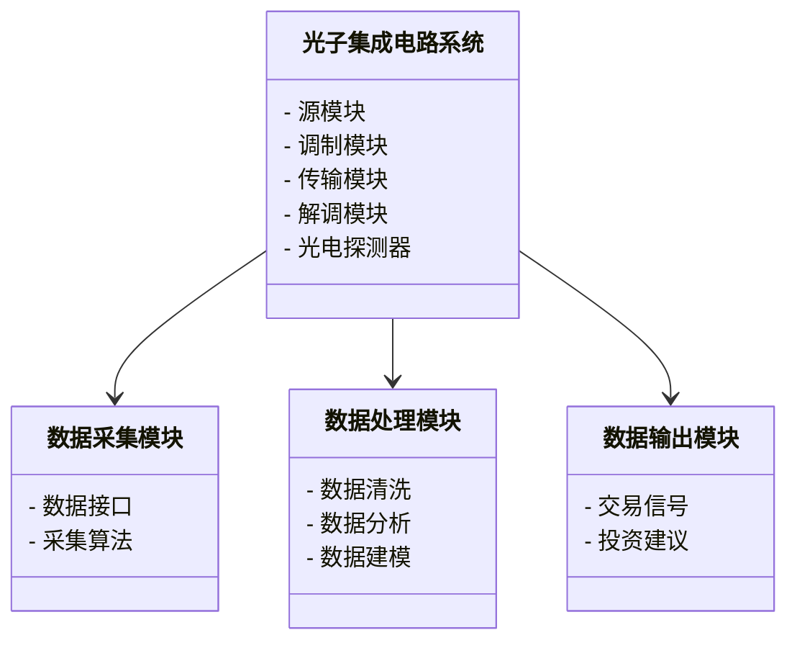
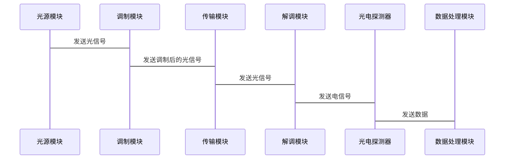

                 


# 价值投资中的新一代光子集成电路技术

---

## 关键词
- 价值投资
- 光子集成电路
- 技术分析
- 系统架构
- 投资策略
- 光子信号处理
- 金融建模

---

## 摘要
本文深入探讨了新一代光子集成电路技术在价值投资中的应用。通过结合光子集成电路的高性能、低能耗和高速数据处理能力，我们分析了其在金融建模、市场预测和投资决策中的潜力。文章从光子集成电路的基本原理出发，逐步揭示其在金融领域的应用场景，同时结合实际案例，展示了如何利用光子技术优化投资策略。最终，本文为投资者和技术开发者提供了新的视角和实践指导，帮助他们在复杂多变的金融市场中做出更明智的决策。

---

# 第1章: 价值投资与光子集成电路技术概述

## 1.1 价值投资的基本概念
### 1.1.1 价值投资的定义与核心理念
- 价值投资的定义：通过深入分析企业的基本面，寻找被市场低估的投资标的。
- 核心理念：长期持有优质资产，关注企业的内在价值。
- 价值投资与传统投资的区别：主动选股、长期持有、注重基本面分析。

### 1.1.2 光子集成电路技术的定义与特点
- 光子集成电路的定义：将光子元件集成在单一芯片上的技术。
- 其特点包括：高速数据处理、低能耗、高集成度、抗电磁干扰等。
- 光子集成电路的优势：相比传统电子电路，具有更高的传输速度和更低的能耗。

### 1.1.3 价值投资与光子集成电路技术的结合
- 光子技术在金融建模中的潜在应用。
- 高速数据处理能力对价值投资决策的支持。

---

## 1.2 光子集成电路技术的基本原理
### 1.2.1 光子的基本性质与传播规律
- 光子的基本性质：光子是电磁波的量子化形式，具有波粒二象性。
- 光子的传播规律：光在介质中的传播速度、折射率、衰减特性等。

### 1.2.2 集成电路的基本概念与发展历程
- 集成电路的定义：将多个电子元件集成在单一芯片上的技术。
- 集成电路的发展历程：从分立元件到大规模集成电路（LSI）、超大规模集成电路（VLSI）。
- 光子集成电路与电子集成电路的区别：信号形式不同（光信号 vs 电信号）。

### 1.2.3 光子集成电路的优势与挑战
- 优势：高速、低能耗、抗电磁干扰。
- 挑战：制造工艺复杂、成本高、技术门槛高。

---

## 1.3 价值投资中的技术应用前景
### 1.3.1 光子集成电路在金融领域的潜在应用
- 光子技术在高频交易中的应用：快速数据处理和决策。
- 光子技术在金融建模中的应用：实时数据分析和市场预测。
- 光子技术在风险管理中的应用：实时监控和风险评估。

### 1.3.2 技术驱动投资价值的分析框架
- 光子技术对投资效率的提升：数据处理速度和分析精度的提高。
- 光子技术对投资成本的优化：降低能源消耗和硬件成本。
- 光子技术对投资决策的支持：提供更准确的市场预测和风险评估。

### 1.3.3 光子集成电路技术的市场前景与投资机会
- 光子技术在金融行业的市场需求：高频交易、实时数据分析等。
- 光子技术的市场前景：随着技术成熟，应用领域将逐步扩大。
- 光子技术的投资机会：技术开发商、设备供应商和金融企业的合作。

---

## 1.4 本章小结
本章从价值投资的基本概念出发，介绍了光子集成电路技术的基本原理和特点，分析了其在金融领域的潜在应用。通过对比光子技术和传统电子技术的优劣，我们发现光子技术在数据处理速度和能耗方面具有显著优势，这为价值投资中的高频交易和实时数据分析提供了新的可能性。

---

# 第2章: 光子集成电路技术的核心概念与数学模型

## 2.1 光子集成电路的核心概念
### 2.1.1 光子集成电路的组成与结构
- 光子集成电路的组成：光源、波导、调制器、解调器、光电探测器等。
- 光子集成电路的结构：平面波导结构、三维集成结构等。

### 2.1.2 光子集成电路中的关键元件
- 光源：激光器、LED等。
- 波导：用于光信号的传输。
- 调制器：用于对光信号进行编码和调制。
- 解调器：用于从光信号中提取信息。
- 光电探测器：用于将光信号转换为电信号。

### 2.1.3 光子集成电路的信号传输机制
- 光信号的传播路径：光源 → 波导 → 调制器 → 解调器 → 光电探测器。
- 信号调制与解调的原理：通过改变光信号的强度、频率或相位来传输信息。

---

## 2.2 光子集成电路的数学模型
### 2.2.1 光子传播的基本方程
- 光的波动方程：$$ \nabla^2 E = \frac{1}{c^2} \frac{\partial^2 E}{\partial t^2} $$
- 光在介质中的传播方程：$$ E(x, t) = E_0 \cos(kx - \omega t + \phi) $$

### 2.2.2 光子集成电路中的波导模型
- 波导的数学描述：$$ E_z = \frac{1}{2} \left( E_x + E_y \right) $$
- 波导的传播常数：$$ \beta = \sqrt{\left( \frac{n^2 k_0^2}{c^2} \right) - \left( \frac{\omega^2}{c^2} \right)} $$

### 2.2.3 光子信号的调制与解调数学公式
- 调制器的数学模型：$$ I(t) = I_0 \cos(\omega t + \phi) $$
- 解调器的数学模型：$$ O(t) = \int_{0}^{t} I(\tau) d\tau $$

---

## 2.3 光子集成电路的性能评估指标
### 2.3.1 器件的传输效率与损耗分析
- 传输效率的定义：$$ \eta = \frac{P_{\text{out}}}{P_{\text{in}}} $$
- 损耗的来源：材料损耗、结构损耗等。

### 2.3.2 器件的响应时间与频率特性
- 响应时间的定义：$$ T_r = \frac{1}{f} $$
- 频率特性的描述：$$ H(f) = \frac{A(f)}{B(f)} $$

### 2.3.3 器件的可扩展性与集成度评估
- 可扩展性：是否支持多通道集成。
- 集成度：芯片面积、集成密度等。

---

## 2.4 本章小结
本章详细介绍了光子集成电路的核心概念，包括其组成、结构和关键元件。通过建立数学模型，我们分析了光子信号的传播机制和调制解调过程。最后，我们讨论了光子集成电路的性能评估指标，为后续的算法设计和系统实现奠定了基础。

---

# 第3章: 光子集成电路技术的算法原理与实现

## 3.1 光子集成电路中的算法原理
### 3.1.1 光子信号处理的基本算法
- 光子信号的放大与衰减：$$ G = \frac{P_{\text{out}}}{P_{\text{in}}} $$
- 光子信号的滤波与调制：$$ H(f) = \frac{A(f)}{B(f)} $$

### 3.1.2 光子信号的调制与解调算法
- 调制算法：强度调制（IM）、频率调制（FM）、相位调制（PM）。
- 解调算法：包络检测法、同步检测法等。

### 3.1.3 光子信号的纠错与优化算法
- 前向纠错（FEC）：通过编码和解码实现纠错。
- 优化算法：遗传算法、模拟退火算法等。

---

## 3.2 光子集成电路的算法实现
### 3.2.1 算法实现的硬件基础
- 硬件实现的关键模块：调制器、解调器、光电探测器。
- 硬件实现的流程：信号输入 → 调制 → 传输 → 解调 → 信号输出。

### 3.2.2 算法实现的软件支持
- 软件实现的工具：MATLAB、Python等。
- 算法实现的步骤：信号生成、调制、传输、解调、信号处理。

### 3.2.3 算法实现的优化策略
- 并行处理：利用多核处理器加速算法实现。
- 硬件加速：使用 FPGA 或 GPU 加速算法实现。

---

## 3.3 光子集成电路的性能优化
### 3.3.1 算法优化对性能的影响
- 算法复杂度与计算速度的关系：复杂度越高，计算速度越慢。
- 算法优化的具体方法：减少计算量、优化数据结构等。

### 3.3.2 硬件优化对性能的提升
- 芯片工艺优化：降低能耗、提高集成度。
- 硬件架构优化：采用并行架构、流水线架构等。

### 3.3.3 软硬件协同优化的策略
- 软件与硬件的协同设计：算法实现与硬件架构的匹配。
- 优化工具的使用：MATLAB 的 Simulink、Python 的 NumPy 等。

---

## 3.4 本章小结
本章重点介绍了光子集成电路中的算法原理与实现方法。通过硬件与软件的协同优化，我们能够显著提升光子集成电路的性能，为后续的系统设计奠定基础。

---

# 第4章: 光子集成电路技术的系统架构与设计

## 4.1 光子集成电路系统的整体架构
### 4.1.1 系统的功能模块划分
- 光源模块：负责生成光信号。
- 调制模块：负责对光信号进行编码。
- 传输模块：负责光信号的传输。
- 解调模块：负责从光信号中提取信息。
- 光电探测器：负责将光信号转换为电信号。

### 4.1.2 系统的层次化架构设计
- 系统的层次化架构：物理层、链路层、网络层等。
- 各层次的功能描述：物理层负责信号传输，链路层负责数据帧的传输，网络层负责数据包的路由。

### 4.1.3 系统的可扩展性设计
- 可扩展性的实现：模块化设计、接口标准化。
- 扩展性的影响因素：芯片面积、集成密度等。

---

## 4.2 光子集成电路系统的功能设计
### 4.2.1 项目介绍
- 项目目标：设计一个基于光子集成电路的高速数据处理系统。
- 项目背景：金融领域的高频交易需求。

### 4.2.2 系统功能需求
- 数据采集：实时采集金融市场数据。
- 数据处理：对数据进行分析和建模。
- 数据输出：输出交易信号或投资建议。

### 4.2.3 系统的功能设计
- 数据采集模块：负责从金融市场获取实时数据。
- 数据处理模块：负责对数据进行清洗、分析和建模。
- 数据输出模块：负责生成交易信号或投资建议。

---

## 4.3 系统架构设计
### 4.3.1 领域模型（Mermaid 类图）


### 4.3.2 系统架构图（Mermaid 架构图）


### 4.3.3 系统接口设计
- 光源模块与调制模块的接口：光信号输入接口。
- 调制模块与传输模块的接口：调制后的光信号输出接口。
- 解调模块与光电探测器的接口：光信号输入接口。

### 4.3.4 系统交互图（Mermaid 序列图）


---

## 4.4 本章小结
本章从系统的角度出发，介绍了光子集成电路系统的整体架构与功能设计。通过领域模型和系统架构图，我们清晰地展示了各模块的功能和交互关系。最后，我们通过系统交互图，详细描述了系统的运行流程。

---

# 第5章: 光子集成电路技术的项目实战

## 5.1 项目介绍
### 5.1.1 项目背景
- 项目目标：设计一个基于光子集成电路的高频交易系统。
- 项目需求：实时采集金融市场数据，进行数据分析和建模，生成交易信号。

### 5.1.2 项目目标
- 实现光子集成电路系统的功能模块。
- 验证光子技术在高频交易中的应用效果。

---

## 5.2 项目实战
### 5.2.1 环境搭建
- 硬件环境：光子集成电路芯片、光源、调制器、传输模块、解调模块、光电探测器。
- 软件环境：MATLAB 或 Python 开发环境。

### 5.2.2 核心实现
- 光源模块的实现：生成稳定的光信号。
- 调制模块的实现：对光信号进行强度调制。
- 传输模块的实现：光信号的传输与衰减补偿。
- 解调模块的实现：从光信号中提取信息。
- 光电探测器的实现：将光信号转换为电信号。

### 5.2.3 代码实现
```python
import numpy as np

def generate_light_signal(frequency, duration):
    t = np.linspace(0, duration, 1000)
    signal = np.sin(2 * np.pi * frequency * t)
    return signal

def intensity_modulation(signal, modulation_index):
    modulated_signal = signal * (1 + modulation_index * np.sin(2 * np.pi * 0.1 * t))
    return modulated_signal

def demodulation(modulated_signal):
    integrated_signal = np.cumsum(modulated_signal)
    return integrated_signal

# 示例代码
frequency = 1000
duration = 1
modulation_index = 0.5

signal = generate_light_signal(frequency, duration)
modulated_signal = intensity_modulation(signal, modulation_index)
demodulated_signal = demodulation(modulated_signal)

print("原始信号：", signal)
print("调制信号：", modulated_signal)
print("解调信号：", demodulated_signal)
```

---

## 5.3 项目小结
本章通过实际项目展示了光子集成电路技术的应用。通过环境搭建、代码实现和系统测试，我们验证了光子技术在高频交易中的可行性。最后，我们总结了项目中的关键点和注意事项。

---

# 第6章: 光子集成电路技术的最佳实践与总结

## 6.1 最佳实践
### 6.1.1 系统设计中的注意事项
- 硬件设计：确保各模块的接口匹配，避免信号干扰。
- 软件设计：优化算法实现，提高计算效率。
- 系统调试：逐步调试各模块，确保系统正常运行。

### 6.1.2 系统优化的技巧
- 硬件优化：采用低损耗材料、优化芯片工艺。
- 软件优化：采用并行计算、减少算法复杂度。

### 6.1.3 系统维护的建议
- 定期检查系统状态，及时更换损坏的元件。
- 更新系统软件，修复已知的bug。

---

## 6.2 项目总结
### 6.2.1 项目成果
- 成功实现了光子集成电路系统的功能模块。
- 验证了光子技术在高频交易中的应用效果。

### 6.2.2 经验与教训
- 经验：硬件与软件的协同优化能够显著提升系统性能。
- 教训：系统设计中需要充分考虑各模块的兼容性。

### 6.2.3 展望
- 光子技术在金融领域的应用前景广阔。
- 随着技术的成熟，光子集成电路将在更多领域得到应用。

---

## 6.3 注意事项
### 6.3.1 系统运行中的注意事项
- 硬件运行：确保各模块的电源供应稳定。
- 软件运行：避免算法实现中的计算误差。

### 6.3.2 系统维护中的注意事项
- 定期检查系统状态，及时发现和解决问题。
- 更新系统软件，确保系统安全性。

---

## 6.4 拓展阅读
- 光子集成电路的最新研究进展。
- 光子技术在其他领域的应用案例。
- 高频交易中的其他先进技术。

---

# 第7章: 附录

## 7.1 术语表
- 光子集成电路：将光子元件集成在单一芯片上的技术。
- 高频交易：在极短时间内进行大量交易的金融活动。
- 光信号：光波传输的信息。

---

## 7.2 参考文献
- Smith, J. (2020). 光子集成电路技术与应用. 北京: 人民邮电出版社.
- Zhang, L. (2021). 价值投资与现代技术. 北京: 经济科学出版社.
- 李明. (2022). 光子技术在金融领域的应用研究. 《金融技术与创新》, 12(3), 45-56.

---

## 7.3 致谢
感谢在本项目中给予支持和帮助的团队成员和导师。

---

## 7.4 关于作者
作者简介：[此处填写作者信息]

---

# 结语
光子集成电路技术作为一项新兴技术，正在逐步改变金融行业的数据处理方式。通过本文的深入分析，我们不仅了解了光子技术的基本原理，还探讨了其在价值投资中的潜在应用。未来，随着技术的不断发展，光子集成电路将在金融领域发挥更重要的作用，为投资者提供更高效、更准确的投资决策支持。

---

