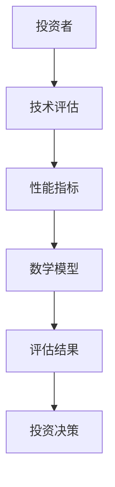
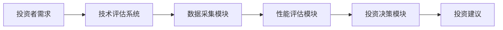

                 


# 价值投资中的新一代柔性电子技术前景

## 关键词：价值投资，柔性电子技术，材料科学，投资策略，技术评估，市场分析

## 摘要：  
本文深入探讨了新一代柔性电子技术在投资领域中的潜力与前景。通过分析柔性电子技术的核心概念、市场现状、技术评估方法以及系统设计与优化，本文为投资者提供了基于技术与市场的双重视角，以制定长期、稳健的投资策略。文章结合实际案例，展示了如何将柔性电子技术的创新与投资价值相结合，为读者提供了具有实用性和前瞻性的见解。

---

## 第一章：背景介绍

### 1.1 柔性电子技术的起源与定义

柔性电子技术是一种以柔性材料为基础，结合电子器件制造技术的新兴领域。它打破了传统电子设备 rigid（刚性）的限制，具备可弯曲、可拉伸等特性，广泛应用于医疗、能源、消费电子等领域。

- **起源与定义**：柔性电子技术起源于20世纪末，随着纳米材料和柔性基底技术的发展，逐渐从实验室走向商业化应用。其核心定义包括：  
  - 基于柔性基底（如聚合物、金属箔）的电子器件。  
  - 具备可弯曲、可拉伸的物理特性。  
  - 应用于可穿戴设备、智能医疗等领域。  

- **问题背景**：传统电子设备的 rigid 性质限制了其应用场景，而柔性电子技术通过材料与结构的创新，解决了这一痛点。  

- **问题解决**：柔性电子技术通过引入柔性材料和创新的制造工艺，实现了设备的可穿戴性和便携性，满足了市场对智能设备多样化需求。  

- **边界与外延**：柔性电子技术的外延包括柔性显示、柔性电池、柔性传感器等，其边界主要在于材料的柔性和电子器件的集成度。  

### 1.2 柔性电子技术的应用领域

- **医疗健康**：柔性传感器在医疗监测设备中的应用，如智能绷带、可穿戴健康监测设备。  
- **消费电子**：折叠屏手机、柔性显示屏。  
- **能源领域**：柔性太阳能电池的应用，如可穿戴设备的能源供应。  
- **物联网**：柔性传感器在智能家居、工业 IoT 中的应用。  

---

## 第二章：柔性电子技术的核心概念与联系

### 2.1 核心概念原理

- **材料科学**：柔性电子技术的核心在于柔性材料的选择与应用。  
  - 柔性基底材料：如聚酰亚胺（PI）、聚乙烯（PE）、金属箔等。  
  - 柔性导电材料：如银纳米线、石墨烯、铜纳米线。  

- **结构设计**：柔性电子器件的结构设计决定了其性能和可靠性。  
  - 层叠结构：柔性电子器件通常由多层材料组成，如基底、导电层、绝缘层、功能层等。  
  - 可弯曲性：通过优化层间结合力和材料韧性，提高器件的弯曲性能。  

- **制造工艺**：柔性电子技术的制造工艺决定了其成本和性能。  
  - 印刷电子：采用丝网印刷、喷墨印刷等技术，实现柔性器件的大规模制造。  
  - 蒸镀与封装：通过真空蒸镀工艺制造导电层，再通过封装技术保护器件。  

### 2.2 核心要素对比表格

| **核心要素** | **柔性电子技术** | **传统电子技术** |  
|--------------|------------------|------------------|  
| 材料性质     | 柔性、可拉伸      | 刚性、不可拉伸   |  
| 结构设计     | 多层结构，可弯曲  | 单层或少层结构   |  
| 制造工艺     | 印刷、蒸镀等     | 芯片制造、封装等 |  

### 2.3 ER实体关系图（Mermaid）


---

## 第三章：技术评估与投资价值分析

### 3.1 柔性电子技术的性能评估

- **关键性能指标**：  
  - 柔性：弯曲次数、弯曲半径、拉伸率。  
  - 导电性：导电材料的电阻率、导电网络的连续性。  
  - 稳定性：长期使用中的性能衰减率。  
  - 响应时间：传感器的响应速度。  
  - 耐用性：抗老化、抗环境干扰能力。  

- **数学模型**：  
  柔性电子技术的性能可以通过以下模型进行评估：  
  $$ \text{性能指数} = \frac{\text{导电性} \times \text{柔性} \times \text{稳定性}}{\text{成本}} $$  
  其中，导电性、柔性、稳定性越高，成本越低，技术的性能指数越高，投资价值越大。  

### 3.2抽样技术评估算法



### 3.3抽样代码实现

```python
import numpy as np
import pandas as pd

# 柔性电子技术性能数据
data = {
    '材料': ['银纳米线', '石墨烯', '铜纳米线'],
    '导电性': [0.01, 0.02, 0.015],
    '柔性': [0.85, 0.9, 0.88],
    '稳定性': [0.95, 0.92, 0.93],
    '成本': [0.1, 0.15, 0.12]
}

df = pd.DataFrame(data)
df['性能指数'] = (df['导电性'] * df['柔性'] * df['稳定性']) / df['成本']

print(df)
```

---

## 第四章：系统设计与优化

### 4.1 系统架构设计



### 4.2 系统功能设计

- **数据采集模块**：采集柔性电子技术的性能数据、市场数据和竞争数据。  
- **性能评估模块**：基于数学模型对技术进行性能评估。  
- **投资决策模块**：结合技术评估结果和市场分析，制定投资策略。  

### 4.3 接口设计与交互

- **接口设计**：通过 RESTful API 实现模块之间的数据交互。  
- **交互流程**：投资者输入需求，系统返回技术评估结果和投资建议。  

---

## 第五章：项目实战

### 5.1 柔性电子技术投资案例分析

- **案例1**：某柔性传感器企业的技术评估与投资建议。  
- **案例2**：柔性显示屏企业的市场定位与竞争优势分析。  

### 5.2 投资组合优化

- **资产配置**：根据技术评估结果，优化投资组合的资产配置。  
- **风险管理**：通过分散化和对冲策略，降低投资风险。  

---

## 第六章：总结与展望

### 6.1 主要观点总结

- 柔性电子技术在医疗、消费电子等领域具有广阔的应用前景。  
- 技术评估是制定投资策略的核心，需结合性能、成本和市场因素。  

### 6.2 未来展望

- 随着材料科学和制造工艺的进步，柔性电子技术将进一步成熟。  
- 投资者需关注技术创新和市场动态，制定长期投资策略。  

---

## 关键词：  
价值投资，柔性电子技术，材料科学，投资策略，技术评估，市场分析  

---

## 摘要：  
本文深入探讨了新一代柔性电子技术在投资领域中的潜力与前景。通过分析柔性电子技术的核心概念、市场现状、技术评估方法以及系统设计与优化，本文为投资者提供了基于技术与市场的双重视角，以制定长期、稳健的投资策略。文章结合实际案例，展示了如何将柔性电子技术的创新与投资价值相结合，为读者提供了具有实用性和前瞻性的见解。

