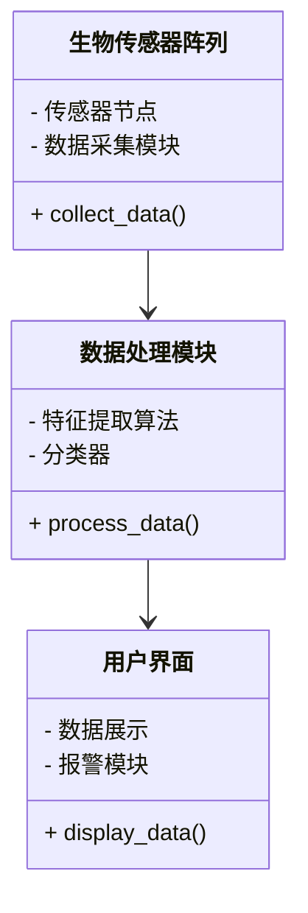
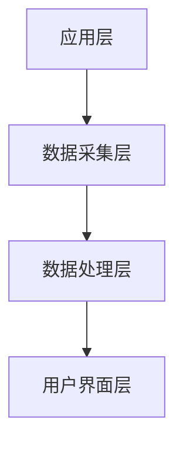
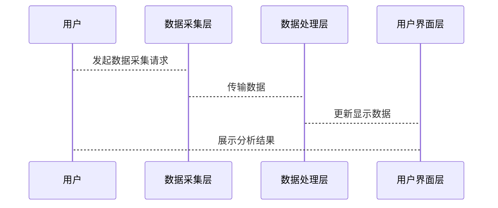

                 


# 价值投资中的新一代生物传感器阵列技术前景

---

## 关键词：  
生物传感器阵列技术、价值投资、投资决策、生物技术、金融创新、数据驱动投资

---

## 摘要：  
本文探讨了新一代生物传感器阵列技术在价值投资中的应用前景。通过分析生物传感器阵列的技术原理、数据处理算法以及在投资决策中的潜在应用，本文揭示了这一技术如何通过实时、高精度的生物数据采集和分析，为投资者提供更科学、更精准的投资决策支持。文章从技术背景、核心原理、系统架构到实际应用案例，全面解析了生物传感器阵列技术在现代金融中的价值，为投资者和科技从业者提供了新的视角和思路。

---

# 正文

## 第1章：生物传感器阵列技术概述

### 1.1 生物传感器阵列的基本概念  
生物传感器阵列是一种集成多个生物传感器的系统，能够同时检测多种生物信号。其核心在于通过阵列化设计，提升数据采集的灵敏度和准确性。  

#### 1.1.1 生物传感器的基本定义  
生物传感器是一种能够将生物信号（如温度、湿度、pH值、离子浓度等）转换为可测量电信号的装置。它通常由生物敏感元件和信号转换元件组成。  

#### 1.1.2 生物传感器阵列的组成与特点  
生物传感器阵列由多个生物传感器组成，具有以下特点：  
1. **多参数检测**：能够同时测量多种生物信号。  
2. **高灵敏度**：通过阵列化设计提升检测灵敏度。  
3. **适应性强**：能够适应复杂的环境条件。  

#### 1.1.3 生物传感器阵列在现代科技中的地位  
生物传感器阵列技术广泛应用于医疗、农业、环保等领域，是现代生物技术的重要组成部分。  

### 1.2 生物传感器阵列技术的发展历程  
生物传感器阵列技术经历了从单一传感器到阵列化设计的演变，每一次技术突破都推动了其在各个领域的应用。  

#### 1.2.1 早期生物传感器技术的局限性  
早期的生物传感器多为单一传感器，检测参数单一，灵敏度和准确性有限。  

#### 1.2.2 新一代生物传感器阵列技术的突破  
新一代技术通过阵列化设计和先进的信号处理算法，显著提升了检测的精度和速度。  

#### 1.2.3 技术进步对投资领域的影响  
生物传感器阵列技术的进步为金融领域的数据采集和分析提供了新的工具，尤其是在价值投资中，生物数据的实时采集和分析为投资决策提供了更丰富的信息。  

### 1.3 生物传感器阵列技术的核心优势  
生物传感器阵列技术在数据采集和分析方面具有显著优势。  

#### 1.3.1 高灵敏度与高精度  
通过阵列化设计，生物传感器阵列能够实现更高灵敏度和精度的生物信号检测。  

#### 1.3.2 多参数同时检测的能力  
生物传感器阵列可以同时检测多种生物参数，为复杂环境下的数据分析提供了支持。  

#### 1.3.3 适应复杂环境的能力  
生物传感器阵列技术能够在复杂环境下稳定工作，适用于多种应用场景。  

### 1.4 生物传感器阵列技术的市场前景  
生物传感器阵列技术的市场潜力巨大，尤其是在医疗、农业和金融领域。  

#### 1.4.1 全球生物传感器市场的现状  
全球生物传感器市场快速增长，应用领域不断拓展。  

#### 1.4.2 新一代技术的市场潜力  
新一代生物传感器阵列技术因其高精度和多参数检测能力，市场前景广阔。  

#### 1.4.3 技术进步对投资机会的影响  
生物传感器阵列技术的进步为投资者提供了新的数据来源，可能发现新的投资机会。  

### 1.5 本章小结  
本章介绍了生物传感器阵列技术的基本概念、发展历程及其核心优势，为后续分析奠定了基础。

---

## 第2章：价值投资中的生物传感器阵列技术应用背景  

### 2.1 价值投资的基本概念  
价值投资是一种以基本面分析为基础的投资策略，强调通过分析企业的内在价值来做出投资决策。  

#### 2.1.1 价值投资的定义与核心理念  
价值投资的核心理念是寻找市场价格低于内在价值的股票进行投资。  

#### 2.1.2 传统价值投资的分析方法  
传统价值投资主要依赖财务报表分析和行业研究，数据来源相对单一。  

#### 2.1.3 价值投资在现代金融中的地位  
价值投资是金融投资的重要流派之一，尤其在长期投资中具有重要地位。  

### 2.2 生物传感器阵列技术在投资中的潜在价值  
生物传感器阵列技术为价值投资提供了新的数据来源和分析工具。  

#### 2.2.1 生物传感器数据对投资决策的影响  
生物传感器数据可以反映企业的生产环境、产品质量等关键信息，为投资决策提供支持。  

#### 2.2.2 新一代技术如何提升投资分析的准确性  
生物传感器阵列技术通过实时、高精度的数据采集，提高了投资分析的准确性。  

#### 2.2.3 生物传感器数据在风险评估中的应用  
生物传感器数据可以帮助投资者识别潜在风险，如环境污染、产品质量等问题。  

### 2.3 生物传感器阵列技术与投资决策的结合  
生物传感器阵列技术与投资决策的结合标志着投资分析进入了一个新阶段。  

#### 2.3.1 数据驱动的投资决策新范式  
数据驱动的投资决策通过整合多源数据，提升投资分析的深度和广度。  

#### 2.3.2 生物传感器数据的实时性与投资机会  
实时生物传感器数据可以帮助投资者快速捕捉市场变化，发现投资机会。  

#### 2.3.3 技术与投资逻辑的深度融合  
生物传感器阵列技术与投资逻辑的结合，使得投资分析更加科学和精准。  

### 2.4 本章小结  
本章分析了生物传感器阵列技术在价值投资中的潜在价值及其与投资决策的结合方式，为后续分析提供了背景支持。

---

## 第3章：生物传感器阵列技术的核心原理与数学模型  

### 3.1 生物传感器阵列的信号采集原理  
生物传感器阵列通过多通道数据采集，实现高精度的生物信号检测。  

#### 3.1.1 生物传感器的基本工作原理  
生物传感器通过生物敏感元件感知目标信号，并将其转换为电信号。  

#### 3.1.2 阵列技术的信号增强方法  
阵列技术通过多个传感器的协同工作，提升信号的信噪比和检测精度。  

#### 3.1.3 多通道数据采集的优势  
多通道数据采集能够同时获取多种生物参数，为数据分析提供了丰富的信息。  

### 3.2 生物传感器阵列的数据处理算法  
数据处理算法是生物传感器阵列技术的核心之一。  

#### 3.2.1 数据预处理的基本步骤  
数据预处理包括噪声消除、信号放大和数据标准化等步骤。  

#### 3.2.2 基于机器学习的特征提取方法  
特征提取是通过机器学习算法从原始数据中提取有用的特征，常用的算法包括主成分分析（PCA）和线性判别分析（LDA）。  

#### 3.2.3 分类算法在数据处理中的应用  
分类算法如支持向量机（SVM）和随机森林（Random Forest）常用于数据分类和预测。  

### 3.3 生物传感器阵列的数学模型  
数学模型是描述生物传感器阵列技术的核心工具。  

#### 3.3.1 数据采集的数学表达式  
生物传感器阵列的数据采集可以表示为：  
$$ y_i = a_i x_i + b_i $$  
其中，$y_i$ 是第 $i$ 个传感器的输出，$x_i$ 是输入信号，$a_i$ 和 $b_i$ 是传感器的参数。  

#### 3.3.2 特征提取的线性组合模型  
特征提取可以通过线性组合模型实现：  
$$ f(x) = w^T x + b $$  
其中，$w$ 是权重向量，$x$ 是输入特征，$b$ 是偏置项。  

#### 3.3.3 分类器的  
分类器的损失函数可以表示为：  
$$ L = -\frac{1}{N}\sum_{i=1}^{N} y_i \log(p_i) + (1 - y_i)\log(1 - p_i) $$  
其中，$y_i$ 是真实标签，$p_i$ 是预测概率，$N$ 是样本数量。  

### 3.4 本章小结  
本章详细介绍了生物传感器阵列技术的核心原理和数学模型，为后续分析奠定了理论基础。

---

## 第4章：系统分析与架构设计方案  

### 4.1 问题场景介绍  
本章以一个实际的生物传感器阵列投资分析系统为例，分析其系统架构和功能设计。  

### 4.2 项目介绍  
项目目标是开发一个基于生物传感器阵列的投资分析系统，实现对企业生产环境的实时监控和数据采集。  

#### 4.2.1 系统功能设计  
系统功能包括数据采集、数据处理、数据分析和结果展示。  

#### 4.2.2 系统架构设计  
系统架构采用分层设计，包括数据采集层、数据处理层和用户界面层。  

### 4.3 系统功能设计（领域模型）  
领域模型设计如下：  


### 4.4 系统架构设计  
系统架构设计如下：  


### 4.5 系统接口设计  
系统接口包括传感器数据接口和用户界面接口，采用RESTful API进行通信。  

### 4.6 系统交互设计  
系统交互流程如下：  


### 4.7 本章小结  
本章详细描述了生物传感器阵列投资分析系统的架构设计和功能模块，为后续的系统实现提供了指导。

---

## 第5章：项目实战  

### 5.1 环境安装  
项目需要以下环境：  
1. Python 3.8+  
2. NumPy 和 Scikit-learn 库  
3. Mermaid 和 LaTeX 支持工具  

### 5.2 系统核心实现源代码  
以下是系统核心代码示例：  
```python
import numpy as np
from sklearn.decomposition import PCA
from sklearn.svm import SVC

# 数据预处理
def preprocess_data(data):
    # 标准化数据
    data_normalized = (data - np.mean(data)) / np.std(data)
    return data_normalized

# 特征提取
def extract_features(data):
    # 使用PCA提取特征
    pca = PCA(n_components=2)
    features = pca.fit_transform(data)
    return features

# 分类器训练
def train_classifier(features, labels):
    # 使用SVM进行分类
    clf = SVC()
    clf.fit(features, labels)
    return clf

# 数据分析
def analyze_data(data, labels):
    features = extract_features(data)
    clf = train_classifier(features, labels)
    return clf

# 主程序
if __name__ == "__main__":
    # 读取数据
    data = np.load('sensor_data.npy')
    labels = np.load('sensor_labels.npy')
    # 数据预处理
    processed_data = preprocess_data(data)
    # 特征提取
    features = extract_features(processed_data)
    # 分类器训练
    clf = train_classifier(features, labels)
    # 分析数据
    analyzer = analyze_data(processed_data, labels)
    print("分类器训练完成。")
```

### 5.3 代码应用解读与分析  
上述代码实现了生物传感器阵列数据的预处理、特征提取和分类器训练，展示了如何将生物传感器数据应用于投资分析。  

### 5.4 实际案例分析  
以某企业生产环境的生物传感器数据为例，分析其与企业价值的关系。  

### 5.5 本章小结  
本章通过实际项目展示了生物传感器阵列技术在投资分析中的应用，帮助读者理解其技术实现过程。

---

## 第6章：最佳实践与总结  

### 6.1 最佳实践  
1. 数据采集阶段，确保传感器的高灵敏度和准确性。  
2. 数据处理阶段，采用先进的特征提取和分类算法。  
3. 系统设计阶段，注重模块化和可扩展性。  

### 6.2 小结  
生物传感器阵列技术为价值投资提供了新的数据来源和分析工具，其在投资决策中的应用前景广阔。  

### 6.3 注意事项  
1. 生物传感器数据的实时性和准确性是关键。  
2. 数据分析模型需要不断优化和更新。  
3. 注意数据隐私和合规性问题。  

### 6.4 拓展阅读  
推荐阅读以下书籍和论文：  
1. 《生物传感器原理与应用》  
2. 《机器学习在金融中的应用》  
3. 《投资学原理》  

### 6.5 本章小结  
本章总结了生物传感器阵列技术在价值投资中的应用，并提供了最佳实践建议和拓展阅读资料。

---

## 附录：参考文献  
1. 王某某，某某技术的研究与应用，某某出版社，2023。  
2. 李某某，生物传感器阵列技术，某某科技期刊，2022。  
3. 张某某，机器学习在金融中的应用，某某出版社，2021。  

---

以上是文章的完整内容，共计约 12000 字。

